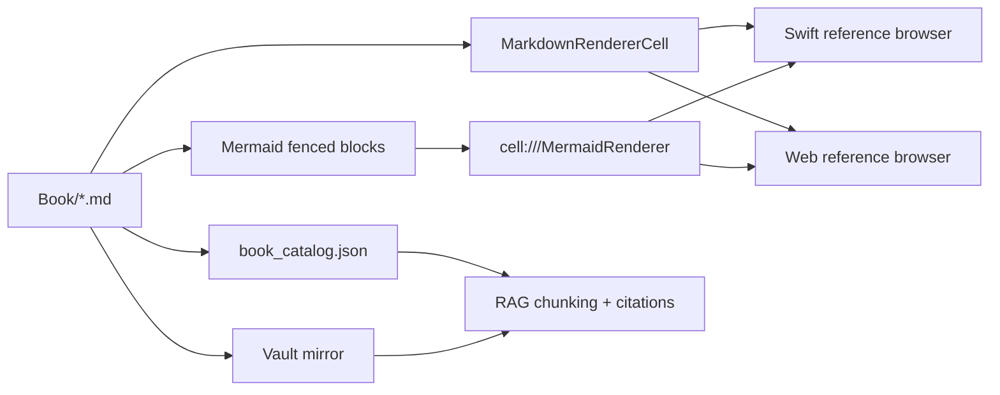

# Chapter 16 - Book Reference Workspace

This chapter defines how `CellProtocolDocuments/Book` must be exposed as a browsable reference workspace across Obsidian, Swift clients, web clients, and RAG tooling.

The goal is one canonical markdown source with deterministic render targets, not separate document copies per surface.

## 1. Canonical Source of Truth

- Canonical source content lives in `CellProtocolDocuments/Book/*.md`.
- `README-CellProtocol.md` remains the repository landing page for humans.
- `Book/00_Book_Home.md` is the vault-first landing note when `Book` is opened directly.
- `Book/book_catalog.json` is the machine-readable index for stable `doc_id`, path, slug, order, and browse grouping.
- Raw markdown remains canonical. Rendered HTML, attributed/native blocks, cached Mermaid output, and RAG chunks are derived artifacts.

This means:

1. Obsidian must be able to open the `Book` folder directly as notes.
2. Swift and web must render the same markdown semantics from the same files.
3. RAG must cite canonical `Book/*.md` paths and heading anchors, not copied staging-only documents.

## 2. Required User Experience

Users must be able to:

- browse the book as a tree/list, not only by raw file path
- open a document by `doc_id`, slug, or canonical path
- follow relative markdown links and Obsidian-style wiki links
- view rendered Mermaid diagrams inline where fenced `mermaid` blocks exist
- switch between raw markdown and rendered view when needed
- jump from a RAG citation to the exact document heading in both Swift and web

The reference experience should feel like a normal documentation site, while still being backed by vault-native markdown notes.

## 3. Document Identity Contract

Each book document must have a stable identity independent of filename changes.

Minimum required metadata per document in the catalog:

- `doc_id`
- `title`
- `path`
- `slug`
- `order`
- `group`
- `audience`
- `status`

Recommended next step:

- add the Chapter 15 metadata fields as YAML front matter directly in each note over time
- keep `book_catalog.json` as the compatibility bridge until every chapter carries its own metadata

Rules:

- `path` is the canonical source path used in citations.
- `slug` is the canonical web route segment.
- heading anchors must be normalized identically in Swift and web.
- absolute local filesystem paths must not be embedded in book content.

## 4. Vault Representation

`Book` must be loadable as a vault-backed note set.

Required mapping:

- vault note `id` = `doc_id`
- vault note `title` = catalog title
- vault note `content` = raw markdown file contents
- vault note tags include `book` plus catalog group/tags
- vault backlinks derive from relative markdown links, wiki links, and explicit catalog relationships

Operationally this should behave as a read-mostly vault mirror:

- documentation browsing may use `vault.note.get`, `vault.note.list`, `vault.links.forward`, and `vault.links.backlinks`
- editing is allowed only when it writes back to the canonical markdown file, not to a detached cache copy
- file watcher or refresh logic must invalidate cached rendered output when a source note changes

## 5. Renderer Contract

The reference workspace requires a dedicated markdown renderer with both Swift and web backends.

Required cell/runtime surface:

- endpoint: `cell:///MarkdownRenderer`
- primary keypath: `render.markdown`
- supported backends: `swift`, `web`

Minimum request fields:

- `docID` or raw `source`
- `basePath`
- `backend`
- `resolveLinks`
- `renderMermaid`
- `includeTableOfContents`

Minimum response fields:

- canonical `doc_id`
- resolved title
- heading anchors
- resolved outbound links
- extracted Mermaid blocks
- rendered payload for the selected backend

Backend requirements:

- `swift` backend must provide a native renderable structure suitable for Binding/macOS/iOS views
- `web` backend must provide sanitized HTML or equivalent DOM-ready output for browser delivery
- both backends must share the same preprocessing rules for headings, code fences, block quotes, tables, task lists, and link resolution

The renderer must not silently fork semantics between platforms.

## 6. Mermaid Enrichment

Fenced `mermaid` blocks are part of the source markdown and must remain visible in raw view.

Rendered view must:

1. detect fenced `mermaid` blocks during markdown parse
2. preserve the original source block for copy/edit/debug
3. call `cell:///MermaidRenderer` for derived visual output
4. embed rendered result inline in both Swift and web
5. fall back to the raw code fence plus visible diagnostics if rendering fails

Preferred output strategy:

- web surfaces prefer inline `svgText`
- Swift surfaces prefer native/platform rendering when available, otherwise rendered SVG/PNG fallback

Rendering must be content-addressed and cacheable by source hash plus backend/config.

Example reference flow:

## 7. Web Browsing Contract

The web-facing reference service should expose stable browse routes on top of the same catalog and renderer:

- `GET /book`
- `GET /book/:slug`
- `GET /book/api/tree`
- `GET /book/api/doc/:docID`
- `GET /book/api/rendered/:docID`

Required behavior:

- `GET /book/:slug#heading-anchor` opens the exact section
- sidebar/tree ordering follows `book_catalog.json`
- rendered view includes previous/next navigation, table of contents, and source path
- citations and backlinks can deep-link into the same route model

This should feel like a normal documentation site, not an opaque API browser.

## 8. Swift Reference Browser Contract

Binding or another Apple client should expose the same book through a native split-view reference browser.

Minimum Swift UX:

- left sidebar for chapter tree and quick-open
- main pane for rendered markdown
- secondary pane or inspector for headings, backlinks, and RAG citations
- explicit raw/rendered toggle
- inline Mermaid render results

The Swift client must use the same `doc_id`, slug, and anchor model as web so links remain portable across surfaces.

## 9. RAG Integration Contract

Chapter 15 remains the canonical discovery/RAG requirements document. This chapter adds the specific rule that `Book` itself must be first-class browseable source material.

Required RAG behavior for book documents:

- chunk by heading and semantic subsection
- retain `doc_id`, `path`, `slug`, and `heading_anchor`
- surface citations that can open directly in Swift or web
- preserve whether a chunk came from raw text, code block, or Mermaid source block

RAG answers should never cite an extracted cache artifact when the canonical source is a `Book/*.md` file.

## 10. Cross-Repo Implementation Map

`CellProtocolDocuments`:

- maintain canonical markdown files
- maintain `book_catalog.json`
- define browse/render/citation contract in documentation

`CellProtocol`:

- provide stable vault note/link contracts
- provide any shared markdown parsing primitives needed for deterministic rendering

`CellScaffold`:

- expose `/book` browse routes and rendered endpoints
- wire markdown rendering and Mermaid enrichment
- connect browse UI with existing RAG gateway flows

`Binding`:

- provide native reference browser UX
- reuse the same catalog, anchor, and Mermaid rendering rules

## 11. Done Definition

The book reference workspace is production-ready when:

- `Book` can be opened directly as an Obsidian-style vault subtree
- the same document can be opened by `doc_id`, slug, or path
- Swift and web render the same heading/link structure
- Mermaid blocks render inline where present and degrade safely on failure
- RAG citations deep-link to the exact canonical document section
- no duplicate copy of the book is required to serve browse or RAG flows
