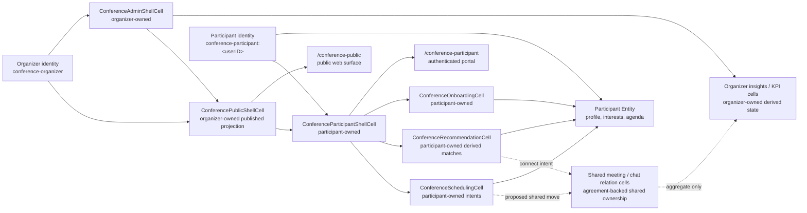

# Chapter 17 - Conference Ownership and Dataflow

This note documents the current conference surface split in `CellScaffold` and the intended ownership boundary for shared relations.

The purpose is practical:

- make it obvious which identity owns which surface
- show which cells are participant-owned versus organizer-owned
- show where published public content comes from
- make the next gap explicit: meetings/chat should move into shared relation cells instead of living only in participant-owned state

## 1. Ownership Rules

- `ConferencePublicShellCell` is organizer-owned and publishes a read-only conference projection.
- `ConferenceParticipantShellCell` is participant-owned and should only hold the participant's own preferences, agenda choices, meeting intents, and personal context.
- `ConferenceAdminShellCell` is organizer-owned and requires explicit organizer/admin access.
- Organizer insights and KPI views are organizer-owned derived state, not participant-owned truth.
- Shared relationships such as meetings, chat, and contact exchange should end up in explicit shared/agreement-backed relation cells.

## 2. Dataflow and Ownership Diagram

## 3. What This Means in Practice

### Public Website

The public website should read from organizer-owned published content only. It must not depend on a participant identity or participant-private state.

### Participant Portal

The participant portal should combine:

- published conference content from organizer-owned cells
- participant-owned context from the participant's own Entity or equivalent owner-scoped cells
- derived recommendations built from that participant context and public conference data

This keeps personalization private by default.

### Admin / Control Tower

The admin/control tower should own:

- conference metadata
- program and content updates
- publication state
- organizer-visible metrics and interventions

It should not silently become the source of truth for participant-private intent.

## 4. Current Gap

The remaining architectural gap is shared interaction state.

Meetings, chat threads, and bilateral contact exchange should not stay as organizer-owned records and should not exist only as private participant drafts. They should be modeled as explicit shared relation cells with:

- explicit initiator and recipient identities
- agreement/capability boundaries
- auditable state transitions
- participant-visible and organizer-aggregate views

That is the next step if the conference solution is going to become contract-correct instead of remaining a useful MVP skeleton.
