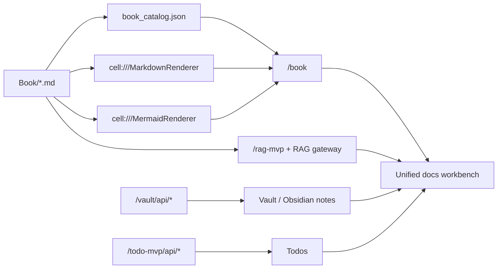

# Chapter 17 - Documentation Workbench Landing and Development Plan

This chapter captures the current ground truth for the documentation workspace and proposes the next development steps toward a real documentation workbench.

The focus is not only browsing markdown, but also moving between:

- canonical Book docs
- RAG-assisted lookup
- Mermaid-rich rendering
- Vault/Obsidian note capture
- Todo capture and follow-up

## 1. Current Ground Truth

### 1.1 What already exists and works

#### Book browsing

- `CellScaffold` already exposes `/book`, `/book/:slug`, `/book/api/tree`, `/book/api/doc/:docID`, and `/book/api/rendered/:docID`.
- The `/book` experience is already backed by `Book/book_catalog.json`.
- The web Book browser already renders markdown, table of contents, previous/next navigation, backlinks, outbound links, and source metadata.

#### Markdown and Mermaid rendering

- `cell:///MarkdownRenderer` exists and renders Book documents to both `web` and `swift` payloads.
- `cell:///MermaidRenderer` exists and is called from the markdown renderer when `renderMermaid` is enabled.
- Mermaid blocks stay in canonical markdown source and are enriched at render time, not duplicated into separate source files.

#### RAG

- `CellScaffold` already exposes `/rag-mvp` plus authenticated RAG proxy APIs.
- The RAG MVP already supports case listing, query, corpus inspection, links, and member operations.
- Chapter 15 already defines the required discovery and RAG contract for documentation.

#### Vault / Obsidian-style note operations

- `CellScaffold` already exposes `/vault/api/*` for note create, update, get, list, and link operations.
- `CellProtocol` already has a `VaultCell` / `GraphIndexCell` direction for note and graph semantics.
- `ConfigurationCatalogCell` already includes Vault/Obsidian-style workspace and Mermaid staging examples.

#### Todo

- `CellScaffold` already exposes `/todo-mvp/api/state` and `/todo-mvp/api/action`.
- A Todo cell contract exists, but the user-facing work surface is still API-first rather than fully integrated into the documentation experience.

## 2. What is missing

The missing piece is not the renderer itself. The missing piece is orchestration.

We do not yet have one obvious landing surface where a user can:

1. see the documentation structure
2. jump into a chapter
3. ask RAG questions in context
4. capture ideas into Vault/Obsidian-style notes
5. turn ideas into Todo follow-up

Today those capabilities live in parallel rather than in one workbench.

## 3. Current Architecture At A Glance

## 4. Important Implementation Reality

### 4.1 The shared markdown source is the right center

This part is already correct:

- canonical docs live in markdown
- Book browsing derives from canonical markdown
- RAG should cite canonical markdown
- Mermaid should render from canonical markdown fences

This means the landing page should also remain markdown-first wherever possible.

### 4.2 Web and Swift are not fully identical yet

There is an important parity gap:

- the Book markdown renderer is deliberately shared in concept
- but the web skeleton runtime currently supports some layout behavior that is not yet part of the stricter shared Swift contract

Implication:

- the documentation workbench should treat Book markdown rendering as the stable cross-surface base
- richer workbench components must be careful not to silently become web-only contract drift

### 4.3 RAG is available but not embedded

The RAG MVP is currently a separate authenticated page.

That is enough for capability proof, but not enough for smooth doc work:

- the user must leave the reading context
- RAG answers are not yet visually colocated with the chapter being read
- there is no direct “save this answer as note” flow from the docs surface

### 4.4 Vault and Todo exist, but are not yet part of one thought-flow

The ingredients for an Obsidian-style work mode are already present:

- note create/update/list/get/link
- knowledge graph direction
- Todo state and action contract

What is missing is a workbench sequence like:

1. read chapter
2. ask RAG
3. capture note
4. promote note to Todo

## 5. Proposed Landing Surface

The landing surface should become a documentation workbench home, not just a chapter list.

Recommended information architecture:

### 5.1 Primary zones

#### A. Read

- chapter index
- highlighted “start here” chapters
- recent / important workbench documents

#### B. Ask

- compact RAG query component
- case selector
- answer preview with citations
- “open cited chapter” action

#### C. Capture

- quick note composer
- save to Vault / Obsidian-style note
- tags such as `idea`, `question`, `follow-up`, `todo-candidate`

#### D. Act

- convert note or RAG result into Todo
- quick-open active follow-up items

### 5.2 Surface strategy

Short term:

- keep the canonical landing content in markdown
- let `/book` open that landing note as the entry page
- from there, link out to the RAG surface and other endpoints

Next phase:

- add a dedicated `CellScaffold` route for a unified workbench page
- embed a compact RAG component directly in the page
- add note capture and Todo capture components beside the reading surface

## 6. Development Plan

### Phase 0 - Improve canonical landing content

Goal:

- turn the Book entry page into a real landing page with structure, pointers, and workbench context

Scope:

- enrich `Book/00_Book_Home.md`
- add this chapter as the analysis/plan page
- keep `/book` as the existing browse surface

Done when:

- users arriving at `/book` immediately understand what exists now
- users can navigate from the landing page to the right docs and tools

### Phase 1 - Docs workbench route in `CellScaffold`

Goal:

- expose a dedicated landing route such as `/docs`, `/docs-hub`, or `/workbench`

Recommended contents:

- left: doc index / entry links
- center: highlighted docs entry card and links into `/book`
- right: compact RAG ask panel

Recommended behavior:

- unauthenticated users can still browse Book docs
- authenticated users can also use embedded RAG

Done when:

- the route exists
- it links cleanly into `/book`
- it includes a small in-page RAG query component

### Phase 2 - Embedded RAG component

Goal:

- make RAG feel like part of documentation reading rather than a separate app

Recommended first version:

- case selector
- single question input
- answer panel
- citations list
- “open cited chapter” links into `/book/:slug#anchor`

Recommended implementation constraint:

- reuse the existing `/rag-mvp/api/*` endpoints
- do not fork a second RAG backend contract just for the landing page

Done when:

- a user can ask a docs question without leaving the landing page
- answers clearly cite canonical documents

### Phase 3 - Vault / Obsidian note capture

Goal:

- allow idea capture directly from the documentation surface

Recommended first version:

- quick note title
- markdown body
- tags
- save button to `/vault/api/note`

Recommended follow-up:

- “save citation to note”
- “save RAG answer summary to note”
- “link note to current chapter”

Done when:

- a user can capture a thought while reading docs without context switching away from the workbench

### Phase 4 - Todo capture and promotion flow

Goal:

- let users turn notes or insights into action

Recommended first version:

- lightweight “send to Todo” control from note or RAG answer
- open Todo count / recent list on the workbench

Recommended mapping:

- note title becomes Todo title
- tags or current chapter become labels/context
- citation/source link becomes Todo metadata

Done when:

- a user can turn reading and thinking into trackable follow-up inside the same flow

### Phase 5 - Native Swift workbench parity

Goal:

- make the same docs workbench available natively in Binding or another Apple client

Recommended principle:

- keep doc identity and citation identity based on `doc_id`, slug, and heading anchor
- reuse the same Book index and markdown renderer contract

Done when:

- web and Swift can open the same doc and citation targets consistently

## 7. Risks And Design Constraints

### Risk 1 - contract drift between web and Swift

If the workbench starts depending on web-only skeleton/runtime features, cross-surface parity will drift.

Mitigation:

- keep the landing content markdown-first
- keep RAG, note capture, and Todo capture as workbench chrome/components around the canonical docs

### Risk 2 - RAG without citation discipline

If embedded RAG feels convenient but does not deep-link back to canonical Book sections, it will weaken documentation authority.

Mitigation:

- make citation linking a hard requirement from day one

### Risk 3 - note capture without identity model clarity

Vault note writing and Todo actions likely need authenticated or admin-scoped behavior.

Mitigation:

- keep public browsing separate from authenticated capture surfaces
- make login state visible in the workbench

## 8. Recommended Immediate Next Build

If only one implementation step should happen next in `CellScaffold`, it should be:

1. add a dedicated docs workbench route
2. make it open with the same information architecture as this landing page
3. embed a minimal RAG ask panel
4. leave Vault and Todo capture as clearly signposted next-step components

That gives the most visible progress with the least new backend risk.

## 9. Done Definition For The Workbench Initiative

The documentation workbench is meaningfully real when:

- `/book` still works as the canonical markdown browser
- a landing surface exists that explains and links the whole docs workflow
- RAG can be used in-page with citations
- note capture can write to Vault
- follow-up can be promoted into Todo
- all citations still point back to canonical markdown documents, not duplicated content
