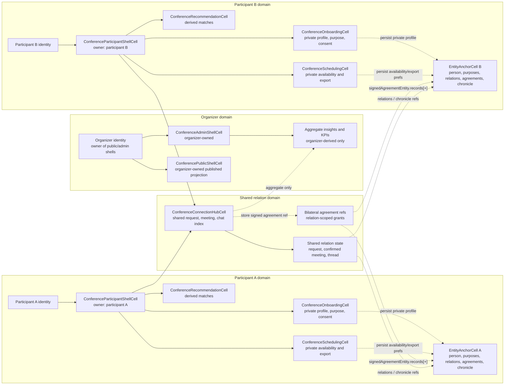
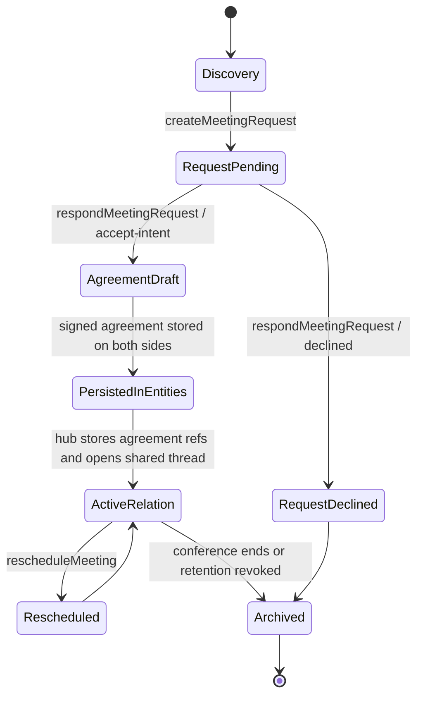

# Chapter 18 - ConferenceConnectionHubCell, Agreements, and Entity Lifecycle

This note describes `ConferenceConnectionHubCell` from the perspective that matters next:

- how shared meeting/chat should be tied to real `Agreement` records
- how the durable record should be stored in participant-owned `EntityAnchorCell`
- which actors own which cells
- which state is primary truth versus derived projection

This is not a greenfield proposal. It is grounded in what already exists in repo:

- `ConferenceConnectionHubCell` already owns shared request / meeting / message state.
- `ConferenceParticipantShellCell` already projects shared connections into the participant portal.
- `ParticipationHubCell`, `AgreementWorkbenchCell`, and `EntityStudioCell` already show the canonical signed-agreement pattern:
  `signedAgreementEntity.records` is the durable source, while `entityRepresentation.agreementRefs` is derived.
- `EntityAnchorCell` already exists as the identity-unique durable entity store for `person`, `purposes`, `relations`, `agreements`, and `chronicle`.

## 1. What Is Confirmed In Repo Today

Confirmed from code:

- `ConferenceConnectionHubCell` persists these structures inside the cell:
  - `participantProfilesByRequesterUUID`
  - `connectionsByID`
  - `requestsByID`
  - `meetingsByID`
  - `messagesByConnectionID`
- The hub exposes four mutating actions:
  - `createMeetingRequest`
  - `respondMeetingRequest`
  - `rescheduleMeeting`
  - `postSharedMessage`
- `ConferenceParticipantShellCell` routes participant-facing shared coordination into that hub.
- `ConferenceSchedulingCell` still owns participant-local availability and export concerns.
- Access is filtered by involved participant identity or organizer identity, but this is still a cell-level projection rule, not a real bilateral agreement record.
- Accepted relations now emit one typed `entity.batchPersist` envelope per participant with schema `conference.relation.accepted.v1`.
- `EntityAnchorCell` applies that batch and persists the canonical relation bundle:
  - `signedAgreementEntity.records[+]`
  - `entityRepresentation.agreementRefs[+]`
  - `relations.connections.<relationID>`
  - `chronicle[+]`
- Participant-local `identity.person.conferenceConnections.<relationID>` remains a best-effort projection outside the canonical bundle.

## 2. Core Design Decision

`ConferenceConnectionHubCell` should not become the canonical long-term store for full bilateral truth.

Recommended split:

- Participant-private truth stays in each participant's own `EntityAnchorCell`.
- Bilateral permission truth is stored as signed agreement records in both participants' entities.
- `ConferenceConnectionHubCell` becomes the shared coordination and indexing layer:
  - current relation status
  - which participants are involved
  - which agreement records authorize the relation
  - which meeting is currently active
  - which shared thread is open
  - which aggregate organizer metrics may be emitted
- Organizer/admin gets derived aggregate insight only, not raw participant-private transcript by default.

That preserves the privacy-first and auditable model:

- each participant retains their own canonical agreement record
- the shared hub can be replayed from durable refs
- organizer dashboards stay derived and explicit

## 3. Actors and Owners

| Actor / cell | Role | Current owner | Recommended durable owner | Notes |
| --- | --- | --- | --- | --- |
| Participant A identity | Initiator or recipient | Participant A | Participant A | Owns private profile, purpose, consent, visibility, availability |
| Participant B identity | Counterparty | Participant B | Participant B | Same boundary as participant A |
| Organizer identity | Conference operator | Organizer | Organizer | Owns public/admin shells and aggregate conference state |
| `ConferenceParticipantShellCell` | Participant portal orchestrator | Participant resolving `cell:///ConferenceParticipantShell` | Participant | Thin shell; should orchestrate, not be canonical storage |
| `ConferenceOnboardingCell` | Private onboarding/profile/purpose/consent | Owner-by-resolution through participant shell | Participant `EntityAnchorCell` | Canonical values should move into entity storage |
| `ConferenceRecommendationCell` | Derived matchmaking projection | Owner-by-resolution through participant shell | Rebuildable derived state | Should be recomputed from participant entity + public directory + consent |
| `ConferenceSchedulingCell` | Private availability and export | Owner-by-resolution through participant shell | Participant `EntityAnchorCell` | Should keep local availability and export state, not bilateral meeting truth |
| `ConferenceConnectionHubCell` | Shared request / meeting / chat coordinator | Shared scaffold cell | Shared relation index with refs to both participant entities | Should not be sole durable source for agreement truth |
| `AgreementWorkbenchCell` | Existing repo pattern for signed agreements | Local draft cell | Pattern, not current conference source | Reuse its record model and storage shape |
| `ParticipationHubCell` | Existing repo precedent for accepted agreements | Invitation/participation flow cell | Pattern, not current conference source | Shows how accepted agreements become entity-visible refs |
| `EntityAnchorCell` | Durable per-identity entity store | Identity-unique | Identity-unique | Already supports `person`, `purposes`, `relations`, `agreements`, `chronicle`, and now acts as batch persistence boundary for conference relation envelopes |
| `ConferenceAdminShellCell` | Organizer control tower | Organizer | Organizer | Should consume only aggregate shared relation views unless policy says otherwise |

## 4. Recommended Canonical Storage Split

### Participant-owned entity data

Each participant should keep canonical private and contractual records in their own `EntityAnchorCell`.

Recommended buckets:

- `person`
  - display identity
  - signature
  - contact profile
- `purposes`
  - conference purpose profile
  - interest profile
  - learning goals
- `relations`
  - shared conference relation refs
  - counterparty entity refs
  - relation status
  - meeting refs
  - retention preference
- `agreements`
  - derived agreement index if we keep the same pattern as `EntityStudioCell`
- `chronicle`
  - auditable milestones such as request sent, agreement accepted, meeting completed, follow-up retained
- `signedAgreementEntity.records`
  - canonical signed bilateral agreement records
- `entityRepresentation.agreementRefs`
  - lightweight refs derived from `signedAgreementEntity.records`

### Shared relation layer

`ConferenceConnectionHubCell` should keep only the shared coordination index:

- relation id
- participant ids and participant entity refs
- active request id
- active meeting id
- visible thread id
- referenced agreement record ids
- current relation status
- timestamps for audit and recompute

The hub may still persist this index, but it should be reconstructible from participant entity refs plus flow history.

### Organizer layer

Organizer/admin should only keep:

- aggregate counts
- operational warnings
- anonymized or policy-approved match / meeting metrics
- interventions and control-tower actions

Organizer state should not become the hidden canonical source for participant chat or bilateral intent.

## 5. Recommended Agreement Model For Shared Meeting and Chat

The first real bilateral contract should be small and explicit.

Recommended agreement scope:

- permission to view the counterpart's shared conference signature and stated intent
- permission to exchange meeting coordination messages in the shared thread
- permission to create, accept, and reschedule a bilateral conference meeting
- explicit retention rule for whether the thread may continue after the conference
- explicit note on whether organizer/admin may only see aggregate metrics, or also specific relation metadata under a stronger condition

Recommended agreement record contents:

- `agreement.name`
  - "Conference connection agreement"
- `agreement.signatories`
  - both participant identities
- `agreement.grants`
  - narrow grants for relation-scoped meeting and chat operations
- `agreement.conditions`
  - optional consent / proof conditions if visibility or retention requires extra confirmation
- `summary`
  - human-readable reason for the connection
- `dataPointer`
  - relation-scoped pointer, not a broad entity-wide wildcard
- `savedAt`, `savedAtText`, `recordState`
  - same pattern already used by `AgreementWorkbenchCell` and `ParticipationHubCell`

Important rule:

- No permanent shared thread should survive acceptance without a persisted bilateral agreement ref on both sides.

## 6. Lifecycle By Phase

### Phase 1 - Discovery

Owner:

- Participant A and participant B separately

Cells involved:

- `ConferenceOnboardingCell`
- `ConferenceRecommendationCell`
- `ConferenceParticipantShellCell`

Canonical truth:

- participant-owned entity data only

Shared truth:

- none yet

### Phase 2 - Meeting request created

Owner:

- shared coordination starts

Cells involved:

- `ConferenceParticipantShellCell`
- `ConferenceConnectionHubCell`

Canonical truth:

- participant intent still private
- hub stores a provisional shared request

Recommended write:

- append provisional relation stub in each participant `relations`
- append chronicle entry in each participant entity

### Phase 3 - Counterparty reviews request

Owner:

- both participants, but still no full bilateral grant

Cells involved:

- `ConferenceParticipantShellCell`
- `ConferenceConnectionHubCell`

Canonical truth:

- request exists in hub
- participant entities may reference the pending relation

Rule:

- minimal request note is allowed
- broader follow-up chat should still wait for accepted bilateral agreement

### Phase 4 - Agreement creation and acceptance

Owner:

- both participants

Cells involved:

- `ConferenceConnectionHubCell`
- agreement-creation flow reusing `AgreementWorkbenchCell` / `ParticipationHubCell` patterns
- `EntityAnchorCell`

Canonical truth:

- one `entity.batchPersist` envelope is emitted for participant A entity
- one `entity.batchPersist` envelope is emitted for participant B entity
- each envelope uses schema `conference.relation.accepted.v1`
- each entity gets signed agreement record, derived agreement ref, relation object, and chronicle entry in one persisted batch

Current canonical storage shape for accepted relation envelopes:

- `signedAgreementEntity.records[+]`
- `entityRepresentation.agreementRefs[+]`
- `relations.connections.<relationID>` or `relations[+]`
- `chronicle[+]`

### Phase 5 - Relation activation

Owner:

- shared relation

Cells involved:

- `ConferenceConnectionHubCell`
- `ConferenceSchedulingCell`

Canonical truth:

- hub flips relation to active
- hub stores agreement record refs and active meeting ref
- participant scheduling remains local for availability/export only

### Phase 6 - Ongoing meeting and chat

Owner:

- shared relation for bilateral state
- participant entity for local notes/export

Cells involved:

- `ConferenceConnectionHubCell`
- `ConferenceSchedulingCell`
- participant entity

Canonical truth:

- reschedules and shared thread live in relation layer
- iCal export, private preparation notes, and availability preferences remain participant-local

### Phase 7 - Post-conference retention or archive

Owner:

- both participants

Cells involved:

- `ConferenceConnectionHubCell`
- `EntityAnchorCell`
- organizer insight projection

Canonical truth:

- if follow-up retention is accepted, keep relation active with the same agreement or a new post-event agreement
- if not, archive the relation and keep only auditable history + aggregate organizer metrics

## 7. Recommended Cell Lifecycle

### `ConferenceParticipantShellCell`

- Birth: resolved per authenticated participant identity
- Active role: orchestrates participant-private cells and shared relation projection
- End state: disposable shell; should be rebuildable from entity + shared relation hub

### `ConferenceOnboardingCell`

- Birth: participant enters onboarding
- Active role: edits profile, purpose, interests, consent
- End state: should flush canonical snapshot into participant entity; local cell state can stay cache-like

### `ConferenceRecommendationCell`

- Birth: participant asks for match refresh or search
- Active role: derived matchmaking and explanation
- End state: recomputable; should not be primary storage

### `ConferenceSchedulingCell`

- Birth: participant manages availability or export
- Active role: local availability, venue preference, iCal export
- End state: participant-owned local helper; shared meeting truth should not terminate here

### `ConferenceConnectionHubCell`

- Birth: first shared request or seeded shared relation is created
- Active role: relation index, state machine, flow-event producer, bilateral coordination gate
- End state: durable shared index with refs to bilateral agreements and participant entities

### `EntityAnchorCell`

- Birth: resolved once per identity domain / participant identity
- Active role: canonical durable storage for person, purposes, relations, agreements, chronicle
- End state: long-lived identity store that survives shell replacement

## 8. Dataflow and Ownership Diagram

Solid arrows describe what already exists in repo. Dashed arrows describe the recommended agreement/entity binding that should be added next.

## 9. Lifecycle Diagram

## 10. Concrete Next Implementation Step

The smallest contract-correct next step is:

1. Keep `ConferenceConnectionHubCell` as shared coordination hub.
2. Add agreement issuance around accept-flow:
   - on accepted request, generate bilateral agreement payload
   - persist signed record in both participant entities
   - write lightweight relation refs into both participant entities
3. Change hub persistence from "full truth in one cell" to "shared index with entity/agreement refs".
4. Keep organizer/admin access aggregate-only unless a stronger explicit agreement says otherwise.

That gives us a conference relation model that is:

- privacy-first
- deterministic
- replayable
- auditable
- compatible with both web and Binding
- aligned with existing repo patterns instead of inventing a second agreement system
