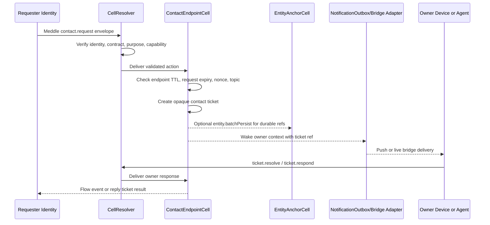

# Chapter 21 - Contact Endpoint Cell

Date: 2026-05-11

Status: CellScaffold MVP implemented; hardening and integration specification.

Last verified against code: 2026-07-12. The `ContactEndpointCell` MVP remains
the protocol-facing contact endpoint workstream, and `CellScaffold` now also has
a first `Co-Pilot Chat` entity-extension probe for testing owner-scoped access
discovery from the personal chat surface.

This chapter defines a CellProtocol-native contact endpoint pattern: an entity
or user can leave behind a small cell instance in a CellScaffold that remains
contactable for a bounded time, can wake or route to the rest of the owner
context, and does not expose the owner's devices, push tokens, private entity
representation data, or cross-domain identity links.

The working name is `ContactEndpointCell`.

## 1. Problem Statement

Some CellProtocol experiences need a stable way to contact an entity or user
later, even when the full local runtime, app, device, or agent is no longer
actively connected.

Examples:

- a conference participant leaves a contact point after a meeting request
- a personal assistant asks the owner for input while the owner is offline
- a shared workspace needs to request consent or clarification later
- a temporary public presence should be reachable until a TTL expires

The endpoint must be inside CellProtocol, not a product-specific HTTP callback.
Transport can be HTTP, WebSocket, push, local IPC, QUIC, WebRTC, or an offline
bundle, but the meaning of the contact request must be a CellProtocol action
validated by Resolver, Identity, Agreement, Contract, and Flow rules.

## 2. Design Decision

`ContactEndpointCell` is a protocol-level cell that represents a contactable
identity-scoped endpoint, not a raw person, organisation, account, or global
user id.

The cell:

- has a stable `cell://` address
- stores one or more endpoint records by `endpointId`
- accepts signed contact requests
- applies purpose, contract, capability, expiry, replay, and policy checks
- creates opaque contact tickets for the owner context
- wakes the owner context through internal route adapters when necessary
- emits auditable CellProtocol flow events
- persists durable references to `EntityAnchorCell` when the owner wants the
  contact endpoint or resulting relation to survive
- can remain persisted after being unloaded from memory
- can expire and delete its persisted state through lifecycle policy

The public endpoint must never expose private route material. Push tokens,
device IDs, active bridge session IDs, private profile fields, and cross-domain
entity links stay behind the cell boundary.

### 2.1 Multiple Endpoints Per Scaffold

A scaffold may host as many contact endpoints as the owner wants.

This is intentional. A user or group can create different endpoint descriptors
for different contexts:

- one temporary conference follow-up endpoint
- one friends-only hobby endpoint
- one public professional-introduction endpoint
- one one-year merchant-support endpoint
- one opaque endpoint that routes to a private contact set

The endpoint ID must not become a global identifier. It is scoped to the
endpoint cell, purpose, context, and descriptor lifetime.

### 2.2 Direct Endpoint vs Opaque Set Router

Two routing shapes are supported:

1. `direct`: the endpoint represents one owner identity context.
2. `opaqueSetRouter`: the endpoint hides the actual reachable owner or group
   members behind an internal contact set.

`opaqueSetRouter` is useful when the public endpoint should reveal only that a
request can be submitted, not which person, device, subgroup, or agent will
handle it.

Rules:

- public descriptor may include `routingMode`
- public descriptor may include an endpoint-scoped hash of `contactSetId`
- private contact set membership is never exposed in the descriptor
- route selection happens inside the cell or a delegated route adapter
- requesters receive only tickets/results, never private route details

### 2.3 Discoverability Is an Explicit Act

An endpoint is not discoverable merely because it exists.

It becomes discoverable only when the user or an authorized delegate actively
places it in a discoverable context, such as:

- sending the endpoint descriptor to another entity/identity
- publishing it into a registry the user has chosen
- making it visible inside a group, event, conference, or purpose community
- placing it into a DiMy/HAVEN matching register for purpose/interest matching

The discovery context must be recorded as proof material. This avoids accidental
global address books and supports later audit of why a requester could see an
endpoint.

### 2.4 Registries

HAVEN should provide a simple self-hostable `ContactRegistryCell` for users,
groups, conferences, and communities.

The registry stores discoverable endpoint descriptors plus purpose/interest
metadata for matching. It must not store private route material, full entity
records, or hidden cross-domain linkages.

DiMy can use the same pattern for richer registers where entities advertise:

- purposes they seek to fulfill
- interests they want matched
- kinds of contact they are open to
- policy requirements for starting a narrow agreement

For scale, entries carry:

- `registryId`
- `shardKey`
- `loadBalancerGroup`
- `contextRefs`
- paged search fields

The MVP may use one local registry cell. Production can partition registries by
shard key or front them with load-balanced scaffold groups without changing the
descriptor contract.

### 2.5 Responsibility Proof Chain

Every actor that claims responsibility for a step in the chain should sign or
otherwise prove that claim.

Examples:

- conference scaffold proves it issued or hosted the context
- registry proves the endpoint was actively published there
- endpoint owner proves ownership or delegated custody
- contact requester proves the request payload
- responder proves the ticket response

The Swift MVP stores `proofChain` objects as explicit material and verifies the
currently enforced roles locally with `ContactProofChainVerifier`.

MVP proof object shape:

- `schema`: `cellprotocol.contact.proof.v1`
- `role`: `contextIssuer`, `registryPublisher`, `endpointOwner`,
  `custodian`, `requester`, or `responder`
- `claim`: short human/protocol-readable responsibility claim
- `subjectHash`: hash of the descriptor, registry entry, request, or response
  being claimed
- `issuedAt` and optional `expiresAt`
- `signerIdentity`
- `signature`: signature over the canonical proof object without the signature
  fields

Current code enforces `endpointOwner` proof at endpoint publish and
`registryPublisher` proof at registry publish. Temporary custody also requires a
`custodian` proof. Hardening should move the verifier down into `CellProtocol`
and extend the same role model to conference/context issuer, requester, and
responder proofs.

### 2.6 Custody Models

The default model is user-controlled key custody: the user has the private key
on a device they control, and private keys never leave the vault.

Sometimes that is operationally impractical. Then HAVEN can support temporary
custodian identities, but only by creating new key pairs for that custodian
context. Do not move existing private keys out of the user's vault.

Possible custody modes:

- `userControlledVault`
- `sameScaffoldTemporaryCustodian`
- `remoteScaffoldTemporaryCustodian`
- `secureEnclaveCustodian`
- `groupThresholdCustodian`

Custodian keys must be:

- purpose-bound
- time-bound
- revocable
- visible to the user
- recorded in the proof chain
- unable to claim they are the user's original key

Apple's Secure Enclave model is relevant for Apple devices because private keys
can be generated and used there without exposing raw private key material to the
application process. Apple also states that existing keys cannot be imported
into the Secure Enclave; they must be generated there. Sources:
<https://developer.apple.com/documentation/security/protecting-keys-with-the-secure-enclave>
and <https://developer.apple.com/documentation/security/ksecattrtokenidsecureenclave>.

### 2.7 Narrow Agreements First

Contact should start with the narrowest viable agreement.

The default first-contact agreement should authorize only:

- submitting the request
- resolving the ticket by the owner/delegate
- sending one response or asking for a broader agreement

Broader contact, messaging, commerce, support, or data-sharing agreements should
be extensions, ideally proposed automatically by policy but still represented as
new explicit agreement scope.

### 2.8 Retention Follows Purpose

Retention defaults should follow why the endpoint exists.

Examples:

- event hallway/contact exchange: hours to days
- conference follow-up: days to weeks
- friends or interest group: user-controlled, often long-lived but private
- merchant/customer support: as long as the signed agreement requires, for
  example one year
- legal/regulated context: agreement-defined, with explicit user-visible reason

Long-lived endpoints do not need to remain in RAM. They should persist current
state, unload from memory, and wake when a valid request arrives.

## 3. Existing Building Blocks

This is not a greenfield feature. The current workspace already has most of the
runtime pieces.

### 3.1 Resolver and Remote Routing

`CellResolver` already owns remote cell resolution, validation, transport
bridging, replay supervision, and lifecycle tracking.

The documented stable pattern is:

```text
cell://example.org/ContactEndpoint
```

mapped by the resolver host registry to a WebSocket bridge route such as:

```text
wss://example.org/bridgehead/ContactEndpoint
```

For the first implementation, do not require `cell://host/ContactEndpoint/<id>`
unless the resolver path semantics are made explicit and tested. Use one
`ContactEndpoint` cell per scaffold/host and carry `endpointId` inside the
request payload.

Relevant local docs:

- `Book/06_CellResolver.md`
- `Book/08_Bridging_Transport.md`

Relevant local code:

- `../CellProtocol/Sources/CellApple/CellResolver.swift`
- `../CellProtocol/Sources/CellApple/CellResolve.swift`

### 3.2 Identity and Authorization

The identity model says entities are never transmitted or stored directly in
Cells. Identities are domain-scoped operational handles.

Therefore a contact endpoint must not claim to expose "the user" or "the
entity". It exposes a contactable identity-context under explicit purpose and
capability rules.

Relevant local docs:

- `Book/03_Identity_Model.md`
- `Book/04_Agreements_Contracts.md`
- `Book/09_Purpose_Interests.md`

### 3.3 Persistence and Entity Anchoring

`EntityAnchorCell` already persists identity-owned representation records such
as `person`, `purposes`, `relations`, `agreements`, `signedAgreementEntity`,
`entityRepresentation`, and `chronicle`.

`ContactEndpointCell` should not duplicate that canonical store. It should keep
operational endpoint state locally, then persist durable representation facts to
`EntityAnchorCell` through `entity.batchPersist` when they become part of the
owner identity's durable record.

Examples of durable facts:

- an endpoint was published
- an endpoint was retired
- a request was accepted as a relation
- a contact agreement was signed
- a contact thread or meeting relation became durable

Relevant local docs:

- `Book/18_Conference_ConnectionHub_Agreement_Entity_Lifecycle.md`

Relevant local code:

- `../CellProtocol/Sources/CellApple/Cells/EntityAnchorCell.swift`
- `../CellProtocol/Sources/CellApple/EntityBatchPersistEnvelope.swift`
- `../CellProtocol/Sources/CellApple/IdentityEntityPersistenceSupport.swift`

### 3.4 Notifications and Device Callback

CellScaffold already has a working notification shape:

- `DeviceRegistrationCell` stores registered device endpoints and active bridge
  metadata.
- `NotificationOutboxCell` creates notification tickets, clamps TTL, routes to
  active bridge when possible, and otherwise uses push.
- `DeviceCallbackBridgeCell` lets a registered device resolve and submit ticket
  results.
- `NotificationPolicyCell` maps events into notification decisions.
- `BridgePresenceRegistry` tracks active bridge sessions.
- `AgentConversationInboxCell` shows the request/prompt/response pattern with
  tickets and flow events.

These should become adapters and precedents, not the normative contact endpoint
contract. The normative action surface should live in CellProtocol terms.

Relevant adjacent code:

- `../CellScaffold/Sources/App/Cells/ConferenceMVP/Notifications/DeviceRegistrationCell.swift`
- `../CellScaffold/Sources/App/Cells/ConferenceMVP/Notifications/NotificationOutboxCell.swift`
- `../CellScaffold/Sources/App/Cells/ConferenceMVP/Notifications/DeviceCallbackBridgeCell.swift`
- `../CellScaffold/Sources/App/Cells/ConferenceMVP/Notifications/ScaffoldNotificationContracts.swift`
- `../CellScaffold/Sources/App/Cells/Agent/AgentConversationInboxCell.swift`

### 3.5 Signed Remote Intents

Binding/HavenAgentD already has a useful pattern for signed remote intents:

- trusted issuers
- allowed topics and actions
- required expiry
- nonce replay protection
- Ed25519 verification
- queued intent records
- explicit review before side effects

`ContactEndpointCell` should reuse this shape for remote contact requests.

Relevant adjacent code:

- `../Binding/HavenAgentD/Sources/HavenAgentCells/RemoteIntentInboxCell.swift`
- `../Binding/HavenAgentD/Sources/HavenAgentCore/RemoteIntentVerifier.swift`
- `../Binding/HavenAgentD/Sources/HavenAgentCore/RemoteIntentStateStore.swift`

## 4. External Design References

These references are not dependencies. They are useful checks against existing
internet-scale endpoint and notification patterns.

- W3C ActivityPub defines actor inbox/outbox endpoints for decentralized message
  delivery. The relevant lesson for CellProtocol is that a stable endpoint can
  receive messages on behalf of an actor while authorization and delivery rules
  remain protocol-owned. Source: <https://www.w3.org/TR/activitypub/>.
- W3C Push API defines a push subscription with an endpoint and optional
  expiration time, and explicitly warns that push endpoints must not leak user,
  device, identity, or location information. Source:
  <https://www.w3.org/TR/push-api/>.
- RFC 8030 Web Push requires a `TTL` header for push delivery requests and uses
  TTL to prevent stale notifications from being delivered after they are no
  longer useful. Source: <https://www.rfc-editor.org/rfc/rfc8030.html>.

The CellProtocol design should follow the same broad lessons:

- stable contact endpoint, private route details
- explicit expiry
- short-lived tickets
- no transport-level endpoint as identity
- protocol-owned authorization and replay protection

## 5. Non-Goals

`ContactEndpointCell` must not become:

- a global user account
- a public entity database
- a push-token registry exposed to requesters
- a generic unauthenticated mailbox
- a product-specific conference or agent callback
- a way to bypass Agreements, Contracts, Purpose, Resolver, or Identity checks
- a permanent cross-domain tracking identifier

## 6. Endpoint Model

### 6.1 Public Descriptor

Each published endpoint has a descriptor. The descriptor can be shared, indexed,
or embedded in another agreement, but it must contain only minimal public
contact metadata.

Recommended shape:

```json
{
  "schema": "cellprotocol.contactEndpoint.descriptor.v1",
  "endpointId": "contact_01J...",
  "cell": "cell://example.org/ContactEndpoint",
  "ownerContextHash": "sha256:endpoint-scoped-owner-context",
  "purposes": ["purpose://contact.introduction"],
  "acceptedTopics": [
    "contact.request",
    "contact.message",
    "contact.consent"
  ],
  "capabilityRequirements": [
    "contact.request.submit"
  ],
  "createdAt": "2026-05-10T10:00:00Z",
  "expiresAt": "2026-05-17T10:00:00Z",
  "routingMode": "direct",
  "custodyMode": "userControlledVault",
  "proofChainCount": 2,
  "descriptorHash": "sha256:...",
  "signature": "base64url..."
}
```

Rules:

- `endpointId` is scoped to the endpoint cell and owner identity context.
- `cell` is the routable CellProtocol address.
- `ownerContextHash` is endpoint/context scoped. It must not be a reusable hash
  of the owner's durable identity.
- `purposes` state why this endpoint exists.
- `acceptedTopics` state what request categories can be submitted.
- `capabilityRequirements` state the contract capabilities required to use it.
- `expiresAt` is required for temporary endpoints.
- The descriptor is signed by an endpoint-scoped owner key, custodian key, or
  authorized scaffold identity acting under a grant.
- The public descriptor can say that proof material exists, but full proof
  chains stay behind owner/delegate access unless the user explicitly publishes
  them.

### 6.2 Private Endpoint Record

The cell keeps a private record for each `endpointId`.

Recommended internal fields:

```json
{
  "endpointId": "contact_01J...",
  "descriptor": {},
  "ownerIdentity": {
    "uuid": "...",
    "domain": "...",
    "publicKey": "..."
  },
  "status": "active",
  "createdAt": "2026-05-10T10:00:00Z",
  "updatedAt": "2026-05-10T10:00:00Z",
  "expiresAt": "2026-05-17T10:00:00Z",
  "routeRefs": [
    {
      "kind": "notificationOutbox",
      "cell": "cell:///NotificationOutbox",
      "topic": "contact.request"
    },
    {
      "kind": "deviceRegistration",
      "cell": "cell:///DeviceRegistration",
      "topic": "contact.request"
    },
    {
      "kind": "activeBridge",
      "topic": "contact.request",
      "lastSeenAt": "2026-05-10T10:01:00Z"
    }
  ],
  "entityAnchorRefs": {
    "endpointRefPath": "relations.contactEndpoints.contact_01J...",
    "chroniclePath": "chronicle"
  },
  "ticketTTLSeconds": 900,
  "requestPolicy": {
    "requireSignature": true,
    "requireExpiry": true,
    "nonceReplayWindowSeconds": 86400,
    "allowedTopics": ["contact.request", "contact.message"],
    "allowedActions": ["contact.request.submit"]
  }
}
```

Rules:

- `routeRefs` are internal and must not be returned to requesters.
- Direct push tokens and device IDs should be reachable only by internal adapter
  cells that already have owner/device grants.
- Entity facts are references into `EntityAnchorCell`, not duplicated entity
  blobs.
- Endpoint records can outlive in-memory cell instances if resolver lifecycle
  policy persists them.

## 7. Request Model

### 7.1 Contact Request Envelope

Remote contact requests should use a signed, replay-protected envelope.

Recommended shape:

```json
{
  "schema": "cellprotocol.contact.request.v1",
  "endpointId": "contact_01J...",
  "nonce": "base64url-random",
  "issuedAt": "2026-05-10T10:02:00Z",
  "expiresAt": "2026-05-10T10:17:00Z",
  "requesterIdentity": {
    "uuid": "...",
    "publicKey": "base64url..."
  },
  "requesterDomain": "domain:conference:example",
  "requesterDomainBinding": {
    "schema": "cellprotocol.identity.domain-binding.v1",
    "bindingKind": "vault_context",
    "domain": "domain:conference:example",
    "identityUUID": "...",
    "signingKeyFingerprint": "sha256:...",
    "grantsAuthority": false
  },
  "topic": "contact.message",
  "purpose": "purpose://contact.introduction",
  "requestedAction": "contact.request.submit",
  "payload": {
    "title": "Contact request",
    "message": "Can we continue the conversation after the session?"
  },
  "replyMode": "ticket",
  "correlationId": "corr_01J...",
  "signature": "base64url..."
}
```

Validation:

- schema is known
- endpoint exists and is active
- endpoint has not expired
- request `expiresAt` is present and has not expired
- `issuedAt` is inside allowed clock skew
- nonce has not been seen for this requester/topic
- signature verifies against `requesterIdentity.publicKey`
- when `allowedDomains` or `blockedDomains` is active, a vault-context binding
  is present inside the signed request and matches the requester UUID, signing
  key fingerprint, and top-level `requesterDomain`
- requester domain is accepted by endpoint policy
- topic and action are allowed
- purpose is accepted by endpoint policy
- requester is not blocked by endpoint-context hash and requester domain is not
  blocked
- payload body is within size limits, or when `allowPayloadBody` is false the
  request is restricted to agreement/introduction metadata
- Agreement/Contract grants allow `contact.request.submit`, or the endpoint
  returns a contract requirement instead of delivering the payload

`IdentityDomainBinding` is requester-signed context evidence only. It has
`grantsAuthority = false` and must never replace a Resolver grant, Agreement,
Contract, capability, membership credential, or trusted proof-chain role.
Endpoints without domain allow/block policy may continue to accept legacy
signed requests that omit the binding.

### 7.2 Contact Ticket

After validation, the endpoint creates an opaque ticket for the owner context.

Recommended shape:

```json
{
  "schema": "cellprotocol.contact.ticket.v1",
  "ticketId": "ticket_01J...",
  "endpointId": "contact_01J...",
  "status": "pending",
  "createdAt": "2026-05-10T10:02:03Z",
  "expiresAt": "2026-05-10T10:17:03Z",
  "requestTopic": "contact.message",
  "requesterIdentityRef": {
    "domain": "domain:conference:example",
    "publicKeyHash": "sha256:..."
  },
  "correlationId": "corr_01J..."
}
```

Rules:

- tickets are opaque to the requester
- tickets do not contain push tokens, device IDs, active bridge IDs, or private
  route material
- ticket TTL should be shorter than or equal to endpoint TTL
- ticket expiry must be enforced by the endpoint cell even if a transport
  adapter attempts late delivery
- a resolved ticket can expose the original request only to an authorized owner
  device, owner identity, or delegated agent

## 8. Cell Actions

The first implementation should keep the public surface small.

### 8.1 Read Actions

`state`

Returns a filtered state view:

- public descriptor summary for requesters
- full private route/ref state only for owner/delegated identities

`descriptor`

Returns the signed public descriptor for one `endpointId`.

### 8.2 Mutating Actions

`publishEndpoint`

Creates or updates an endpoint descriptor. Owner-only or scaffold-admin under
explicit contract.

`retireEndpoint`

Marks the endpoint retired and optionally persists a chronicle event.

`contact.request`

Accepts a signed contact request envelope, validates it, creates a ticket, and
routes/wakes the owner context.

`ticket.resolve`

Lets an authorized owner device, owner identity, or delegated agent resolve a
pending ticket.

`ticket.respond`

Submits owner response:

- `accepted`
- `declined`
- `needsContract`
- `blocked`
- `expired`
- `deferred`

`route.heartbeat`

Updates live route freshness for active bridge/device contexts. This must be
owner/delegated only.

`route.revoke`

Revokes a route ref without deleting the endpoint itself.

### 8.3 Request Flow



Rules:

- requester never sees route details
- owner device or delegated agent never bypasses Resolver
- adapters only carry ticket refs and wake signals
- durable records go through `EntityAnchorCell`
- all canonical transitions emit FlowElements

## 9. Flow Events

Recommended flow topic:

```text
cellprotocol.contact.endpoint
```

Recommended event types:

- `contact.endpoint.published`
- `contact.endpoint.retired`
- `contact.endpoint.expired`
- `contact.request.received`
- `contact.request.accepted`
- `contact.request.declined`
- `contact.request.blocked`
- `contact.request.expired`
- `contact.ticket.created`
- `contact.ticket.resolved`
- `contact.ticket.responded`
- `contact.route.heartbeat`
- `contact.route.revoked`

Events must be transport-neutral FlowElements. Notification pushes, WebSocket
messages, HTTP callbacks, and local app events are adapter-level consequences,
not the canonical event.

## 10. Lifecycle Policy

`ContactEndpointCell` should use resolver lifecycle policy instead of bespoke
timers when possible.

Recommended default for temporary contact endpoints:

- `memoryTTL`: short, for example 15 minutes to 1 hour after last activity
- `warningLeadTime`: optional, for owner-visible warning or refresh
- `memoryExpiryAction`: `persistAndUnload`
- `persistedDataTTL`: endpoint-specific, for example 7 days for a temporary
  event endpoint, 30 to 90 days for an explicitly retained contact endpoint

Important distinction:

- endpoint TTL controls whether new contact requests are accepted
- ticket TTL controls whether one request can still be acted on
- route freshness controls whether the owner is currently reachable by live
  bridge before falling back to notification
- persisted data TTL controls deletion of endpoint state from scaffold storage

If a ticket is still pending when the endpoint expires, the ticket should expire
with it unless a signed agreement or owner action explicitly extends it.

## 11. Agreement and Contract Rules

Contact requests are not automatically allowed just because an endpoint is
visible.

Policy modes:

1. `openButFiltered`: anyone can submit a signed request; endpoint policy decides
   whether to deliver, require contract, or block.
2. `contractRequired`: requester must already have a grant for
   `contact.request.submit`.
3. `introductionOnly`: request can only ask for a new agreement, not deliver a
   message body.
4. `knownRelationsOnly`: only existing relation/agreement refs can submit.
5. `ownerApprovalRequired`: every first contact becomes a ticket for explicit
   owner approval.

Recommended capability names:

- `contact.endpoint.publish`
- `contact.endpoint.retire`
- `contact.request.submit`
- `contact.ticket.resolve`
- `contact.ticket.respond`
- `contact.route.heartbeat`
- `contact.route.revoke`

Recommended conditions:

- `purposeAllowed`
- `topicAllowed`
- `domainAllowed`
- `requestNotExpired`
- `endpointNotExpired`
- `nonceUnused`
- `signatureValid`
- `rateLimitWithinBounds`
- `notBlocked`

## 12. Persistence to EntityAnchor

Operational endpoint state lives in `ContactEndpointCell`. Durable
representation facts belong in `EntityAnchorCell`.

Recommended `entity.batchPersist` mutations when publishing:

```json
{
  "operation": "entity.batchPersist",
  "schema": "contact.endpoint.published.v1",
  "mutations": [
    {
      "keypath": "relations.contactEndpoints.contact_01J...",
      "value": {
        "endpointId": "contact_01J...",
        "cell": "cell://example.org/ContactEndpoint",
        "purposes": ["purpose://contact.introduction"],
        "status": "active",
        "createdAt": "2026-05-10T10:00:00Z",
        "expiresAt": "2026-05-17T10:00:00Z",
        "descriptorHash": "sha256:..."
      }
    },
    {
      "keypath": "chronicle[+]",
      "value": {
        "type": "contact.endpoint.published",
        "endpointId": "contact_01J...",
        "at": "2026-05-10T10:00:00Z"
      }
    }
  ],
  "metadata": {
    "correlationId": "corr_01J...",
    "sourceCell": "cell:///ContactEndpoint"
  }
}
```

When a contact request becomes a durable relation, persist a signed agreement
record using the same canonical pattern described in the conference lifecycle
chapter:

- `signedAgreementEntity.records[+]`
- `entityRepresentation.agreementRefs[+]`
- `relations.<domain-specific bucket>.<relationID>`
- `chronicle[+]`

Do not persist raw message body, private route material, or requester-provided
claims into the entity anchor without an explicit agreement/purpose.

## 13. Privacy and Abuse Controls

Required controls:

- signed requests
- nonce replay protection
- expiry on requests and tickets
- endpoint TTL
- per-endpoint rate limits
- domain allow/deny policy
- topic allow list
- endpoint-context requester block list
- no push token exposure
- no device ID exposure to requester
- no global entity identifier
- no automatic cross-domain identity merge
- audit flow for request receipt and owner response

Recommended controls:

- request payload size limit
- attachment prohibition in MVP
- optional proof requirement for sensitive endpoints
- first-contact approval gate
- spam throttling by endpoint-context requester hash and domain
- delayed rejection to avoid oracle behavior where appropriate

## 14. CellProtocol-Closed Boundary

The endpoint is considered CellProtocol-closed only if these rules hold:

- external callers invoke a CellProtocol action, not a product callback as the
  source of authority
- Resolver performs identity, contract, domain, capability, and lifecycle checks
- transport adapters never define semantic success by themselves
- push/WebSocket/HTTP only wake or carry protocol envelopes
- all durable events are emitted as FlowElements
- private route material is stored behind owner/delegated grants
- durable representation facts are persisted to `EntityAnchorCell`, not
  scattered across product cells

HTTP routes may exist for mobile or web convenience, but they must be adapters
over `ContactEndpointCell` actions.

## 15. MVP Implementation Status

### 15.1 Documentation

Implemented in `CellProtocolDocuments`:

- this chapter
- Book catalog entry
- Book Home link
- README link

### 15.2 Current Swift MVP

Implemented in `CellScaffold` as a first MVP:

- `Sources/App/Cells/ContactEndpoint/ContactEndpointContracts.swift`
- `Sources/App/Cells/ContactEndpoint/ContactEndpointCell.swift`
- `Sources/App/Cells/ContactEndpoint/ContactRegistryCell.swift`
- resolver registration in `Sources/App/configure.swift`
- tests in `Tests/AppTests/ContactEndpointCellTests.swift`
- tests in `Tests/AppTests/ContactRegistryCellTests.swift`

Current `ContactEndpointCell` supports:

- multiple endpoint records by `endpointId` inside one scaffold cell
- `direct` and `opaqueSetRouter` routing modes
- public descriptors that omit route/device/push material and stable owner
  identity hashes
- endpoint-scoped `ownerContextHash` for public correlation only inside the
  specific endpoint context
- private route refs for owner/delegated use
- signed request verification when requester identity and signature are supplied
- pending ticket records by `ticketId`
- seen nonce records by requester/topic/nonce
- endpoint expiry and request expiry checks
- topic/purpose/action policy checks
- optional `allowPayloadBody=false` mode for metadata-only first contact
- endpoint-context requester block lists and domain block lists
- owner-only route heartbeat/revoke
- ticket resolve/respond
- event emission on `cellprotocol.contact.endpoint`
- optional `entity.batchPersist` publication/retirement writes
- local proof-chain verification for endpoint owner and custodian roles at
  publish time
- active bridge preference before push when a private route matches
  `BridgePresenceRegistry`
- best-effort `NotificationOutbox` adapter delivery when a private route has
  `participantId`
- owner/device callback actions on `device.resolveTicket` and
  `device.submitTicketResult` when the private active bridge route matches

Current `ContactRegistryCell` supports:

- explicitly published registry entries
- required `discoverabilityContext`
- purpose/interest/context matching
- pagination through `limit`/`offset`
- `shardKey` and `loadBalancerGroup` fields for future partitioning
- private entries excluded from search
- public entries that omit proof-chain details, route material, and stable owner
  identity hashes
- per-entry `publisherContextHash` instead of a reusable owner hash
- local proof-chain verification for registry publisher role at publish time

### 15.3 Registration

Current scaffold registration uses:

```swift
try await addCellResolveIfNeeded(
    name: ContactEndpointContracts.cellName,
    cellScope: .scaffoldUnique,
    persistency: .persistant,
    identityDomain: ownerContext,
    lifecyclePolicy: CellLifecyclePolicy(
        memoryTTL: 15 * 60,
        warningLeadTime: 60,
        persistedDataTTL: 7 * 24 * 60 * 60,
        memoryExpiryAction: .persistAndUnload
    ),
    type: ContactEndpointCell.self
)
```

`ContactRegistryCell` is also registered as `scaffoldUnique`, persistent, with
memory unload and persisted TTL.

### 15.4 Adapter Integration Status

Implemented:

- `NotificationOutboxCell` can be used when a private route ref supplies a
  `participantId`.
- `BridgePresenceRegistry` is checked before push so an active owner bridge can
  receive the ticket path without exposing route details to the requester.
- `ContactEndpointCell` exposes owner/device callback actions for resolving and
  responding to tickets once the private route binding is known.

Not yet implemented:

- `DeviceCallbackBridgeCell` forwarding from bridge transport into the new
  `device.resolveTicket` and `device.submitTicketResult` actions
- `AgentConversationInboxCell` integration for delegated owner decisions
- HTTP/Vapor adapter routes over `ContactEndpointCell`
- moving shared protocol models down from `CellScaffold` into `CellProtocol`

### 15.5 Tests

Implemented tests cover:

- descriptor omits push token/device/private route data
- descriptor omits stable owner identity hash
- same private contact set produces different public hashes across endpoint
  contexts
- expired endpoint rejects new request
- expired request envelope is rejected
- repeated nonce is rejected
- unsigned request is rejected by default policy
- disallowed topic and action are rejected
- contract-required endpoint returns a narrow contract requirement
- first-contact payload body can be disabled by policy
- valid request creates pending ticket
- ticket resolve/respond works
- late ticket response is rejected after ticket expiry
- active bridge route is preferred over push
- invalid endpoint proof is rejected
- private custodian key material is rejected
- legacy persisted policy decodes with defaults for new hardening fields
- registry requires active discoverability context
- registry search matches purpose/interest/context
- private registry entries are not searchable
- public registry entry omits stable owner identity hash
- registry rejects endpoint descriptors that contain private route or stable
  owner material
- registry rejects invalid publisher proof

Remaining integration/hardening tests:

- lifecycle sweep persists and unloads memory state
- persisted data TTL deletes endpoint state
- entity batch persist writes endpoint ref and chronicle entry
- remote `cell://host/ContactEndpoint` mapping requires registered host route
  and production `wss://` policy
- requester/responder/context-issuer proof tests once those roles are wired into
  their adapters
- `DeviceCallbackBridgeCell` forwarding into `ContactEndpointCell`

### 15.6 Co-Pilot Chat Entity-Extension Probe

Implemented on 2026-05-13 in `CellScaffold` as a fast test surface for the
larger goal: the user's entity should feel fluidly extended across devices,
cloud services, local tools, agent actions, accessible resources, and AI
providers, while still staying inside CellProtocol grants and avoiding
cross-domain tracking.

This is not yet the full ContactEndpoint transport implementation. It is a
deliberately narrow, owner-scoped capability map exposed through `Co-Pilot
Chat` so the experience can be tested quickly before deeper resolver, vault,
custodian, wakeup, and registry hardening.

Implemented code paths:

- `Sources/App/Cells/PersonalCopilot/PersonalCopilotCells.swift`
  - read grant for `entityExtension`
  - write grant for `entityExtension.scan`
  - `get entityExtension`
  - `set entityExtension.scan`
- `Sources/App/Cells/PersonalCopilot/PersonalCopilotCloudStore.swift`
  - builds a `haven.personal.entity-extension.v1` snapshot
  - merges visible CellConfigurations, accessible RAG resources, agent actions,
    and chat-scoped AI provider matches into one capability list
  - stores the snapshot under `chatHub.state.entityExtension`
  - records a `chat.entity-extension.scanned` audit event
- `Sources/App/Cells/PersonalCopilot/PersonalCopilotConfigurationFactory.swift`
  - adds `entity-extension`, `capability-map`, `owned-device`, and
    `owned-service` discovery interests to `Co-Pilot Chat`
  - exposes the `chatHub.entityExtension.scan` action
  - adds a `Tilgang` tab/panel that renders
    `chatHub.state.entityExtension.extensions`
- `Sources/App/Support/ChatPurposeResourceRouter.swift`
  - routes generic access/device/cloud/capability/entity-extension prompts to
    visible configurations and agent actions
- `Sources/App/Controllers/VaporPersonalCopilot.swift`
  - exposes HTTP adapters for quick local testing:
    - `GET /personal-copilot-v1/chat/api/entity-extension`
    - `POST /personal-copilot-v1/chat/api/entity-extension/scan`

The snapshot intentionally describes boundaries, not only capabilities:

- `privacyBoundary = no_global_identifier_no_cross_domain_merge`
- `scope = owner_visible_cellprotocol_scope`
- `sideEffectsRequireClick = true`
- `retentionDefault = purpose_policy_or_agreement_ttl_then_persist_unload`
- `wakeup = live_bridge_then_notification_or_persisted_resume`
- `discoverability = explicit_share_or_registry_publication_only`
- `loadBalancing = route_by_source_cell_endpoint_or_provider_group`

This matches the design decisions above:

- a scaffold may expose many context-specific endpoints or capability views
- a general endpoint may hide private membership behind an opaque set
- discoverability is an active act by the user or authorized delegate
- retention follows purpose and agreement rather than one global default
- side effects remain user-clicked and grant-checked
- the map itself must not become a global identifier

Quick local test shape:

```bash
curl -sS http://127.0.0.1:9089/personal-copilot-v1/chat/api/entity-extension
```

```bash
curl -sS \
  -H 'content-type: application/json' \
  -d '{"query":"hva har jeg tilgang til paa enhetene mine og i skyen?"}' \
  http://127.0.0.1:9089/personal-copilot-v1/chat/api/entity-extension/scan
```

Verified tests:

- `swift test --filter ChatPurposeResourceRouterTests`
- `swift test --filter PersonalCopilotV1Tests/testChatEntityExtensionScansOwnerScopedCapabilities`
- `swift test --filter PersonalCopilotV1Tests/testPersonalSkeletonsDoNotExposeSampleActions`
- `swift test --filter PersonalCopilotV1Tests/testPersonalCopilotHTTPFixturesReturnPersonalCatalogAndConfigurationOnly`

Manual smoke, 2026-05-13:

- `.build/debug/Run serve`
- `GET /personal-copilot-v1/chat/api/entity-extension` returned
  `200 102759`
- `POST /personal-copilot-v1/chat/api/entity-extension/scan` returned
  `200 159026`
- response contract check confirmed `haven.personal.entity-extension.v1`,
  `owner_visible_cellprotocol_scope`,
  `no_global_identifier_no_cross_domain_merge`, `sideEffectsRequireClick`,
  `extensions`, `resourceMatches`, `assistantProviders`, and `agent_action`
- unauthenticated `/porthole?configurationName=Co-Pilot%20Chat` returned
  `303` to `/login`
- unauthenticated `/browserhead/webo?configurationName=Co-Pilot%20Chat`
  returned `303` to `/`
- in-app browser automation was blocked by the browser client before a reliable
  visual confirmation could be captured; manual user testing should open
  `/porthole?configurationName=Co-Pilot%20Chat`, sign in, then use
  `Mer -> Tilgang -> Skann tilgang`

Known limits of this probe:

- It does not yet enumerate real remote devices or cloud providers. It maps
  capabilities already visible in the current CellScaffold personal runtime.
- It does not yet wake persisted contact endpoint cells through
  `DeviceCallbackBridgeCell` or notification callbacks.
- It does not yet create or verify full ContactEndpoint proof chains for every
  listed capability. It reports ownership and execution scope metadata that the
  hardening work can attach proofs to.
- It does not yet implement a scalable registry index for many users. The data
  shape already separates `sourceCellEndpoint`, `purposeRefs`,
  `providerGroup`, and future route/load-balancer fields so this can be added
  without turning the endpoint into a global identifier.

## 16. Closed Decisions For Hardening

Resolved:

1. A scaffold can have many logical contact endpoints. MVP uses one
   `ContactEndpointCell` with many `endpointId` records.
2. Discovery is explicit. Endpoints are discoverable only after active user or
   delegated publication into a context or registry.
3. A general endpoint can hide actual reachable parties through
   `opaqueSetRouter` and a private contact set.
4. Retention follows purpose and agreement, not a fixed global default.
5. Resolver remains cell-addressed for this step:
   `cell:///ContactEndpoint` or `cell://host/ContactEndpoint` is routable, while
   path-addressed endpoint instances such as
   `cell://host/ContactEndpoint/<endpointId>` are rejected until resolver
   semantics are deliberately upgraded. `endpointId` stays payload-scoped, which
   keeps load balancing and sharding possible.
6. Proof schema is `cellprotocol.contact.proof.v1`, with the role set described
   in section 2.5. Endpoint publish requires `endpointOwner`; temporary custody
   also requires `custodian`; registry publish requires `registryPublisher`.
7. First-contact payload text is allowed by default for introduction/follow-up,
   but `allowPayloadBody=false` narrows requests to agreement/introduction
   metadata.
8. Block lists are private endpoint policy, not public discovery data. Requester
   blocks use endpoint-context hashes, and domain blocks are endpoint policy.
9. The `RemoteIntentVerifier` pattern should become a shared CellProtocol
   verifier. The MVP has a local `ContactProofChainVerifier` so the schema and
   canonical-signature rules can harden before extraction.
10. Temporary custodian mode never accepts private key material. It requires a
    new custodian identity/public-key reference, an expiry, and custodian proof.
    Key creation, renewal, revocation UX, and Secure Enclave variants remain
    integration work.

Hardening/integration backlog:

- move `ContactEndpointContracts` and `ContactProofChainVerifier` into
  `CellProtocol`
- update the CellProtocol dependency used by `CellScaffold` so first-contact
  external callers can be authorized by cell-specific access hooks instead of a
  local transport/scaffold adapter carrying the signed requester envelope
- wire `DeviceCallbackBridgeCell`, `AgentConversationInboxCell`, and HTTP/Vapor
  adapters to the ContactEndpoint actions
- add lifecycle and persistence tests for memory unload, persisted TTL, and
  `EntityAnchorCell` mutations

## 17. Summary

`ContactEndpointCell` gives CellProtocol a closed, privacy-preserving way for a
user or entity context to leave behind a reachable cell instance.

The endpoint is stable enough to receive requests, but narrow enough to avoid
becoming a public user account. It can be persisted and later expired. It can
wake the owner through notifications or live bridges without leaking transport
details. It can persist durable representation facts to `EntityAnchorCell` only
when those facts become part of the owner identity's durable record.

The current code step has implemented a first `CellScaffold` MVP for
`ContactEndpointCell` and `ContactRegistryCell`. The next hardening step is to
move shared models/verification into `CellProtocol`, connect the real transport
and owner-decision adapters, and add lifecycle/persistence coverage around
memory unload, persisted TTL, and durable `EntityAnchorCell` mutations.
