# Chapter 23 - HAVEN Purpose Knowledge Base

Purpose: define the first durable, machine-readable purpose knowledge base for HAVEN development choices.

Scope: this chapter describes the current v0 knowledge-base artifact, how it relates to the runtime taxonomy in CellScaffold, and how matching can be made faster than running sparse cosine over every purpose node.

Audience: HAVEN implementers, Cell authors, product/design reviewers, and AI agents decomposing prompts into purposes and Goals.

Status: draft canonical source. Last verified against code: 2026-06-14.

Machine-readable artifact: [`haven_purpose_knowledge_base_v0.json`](haven_purpose_knowledge_base_v0.json).

Derived matching index: [`haven_purpose_knowledge_base_index_v0.json`](haven_purpose_knowledge_base_index_v0.json).

Index generator: `Tools/PurposeKnowledge/derive_purpose_index.mjs`.

Deterministic evaluator: `Tools/PurposeKnowledge/evaluate_purpose_cases.mjs`.

Model comparison method: `Tools/PurposeKnowledge/model_comparison_methodology.md`.

Runtime bridge: `ExecutablePurposeGroundingCell` exposes `purpose.knowledge.resolve`
as a side-effect-free resolver backed by a compact Swift snapshot of this v0
tree. The JSON artifact remains the broader source for expansion, evaluation,
and future review workflows.

Agent context bridge: `ExecutablePurposeGroundingCell` also exposes
`purpose.context.pack`, which turns a resolver result into a compact,
side-effect-free context pack for AI agents.

## 1. Root Principle

The root purpose for HAVEN is:

> Alle mennesker er like mye verdt.

The current runtime taxonomy already uses `purpose://root`. This knowledge base keeps that wire reference, but gives it the explicit semantic meaning above.

This is intentionally compatible with the implemented CellScaffold taxonomy in `CellScaffold/Sources/App/Support/PurposeDecomposition.swift`, where `PurposeTaxonomy.rootRef == "purpose://root"`.

The root Goal is `goal.root.equal-human-worth`:

- HAVEN choices preserve equal worth, human agency, and explicit accountable purpose.
- New purposes can be traced to a child of `purpose://root`.
- No accepted purpose should require hidden profiling, irreversible lock-in, or unexplained ranking of people.
- User-facing capabilities should expose clear purpose, owner control, and reviewable consequences.

## 2. Structural Model

The v0 model stays with the structure we already have:

- a single-parent tree for inherited meaning and nearest-common-ancestor lookup
- cross-cutting `facetRefs` for concerns such as GUI quality, privacy/audit, source freshness, and validation
- explicit Goals on every durable purpose node
- candidate status for branches that are useful but not yet runtime-canonical

This avoids a structural fork. New branches such as `purpose://human-agency`, `purpose://personal-context.semantic-state`, and `purpose://purpose-taxonomy.capture-and-place` are documented as draft/candidate until they are reviewed and ported into the runtime taxonomy.

## 3. Current Tree

```mermaid
flowchart TD
    Root["purpose://root<br/>Alle mennesker er like mye verdt"]

    Root --> HumanAgency["purpose://human-agency<br/>Human agency and understanding"]
    Root --> DigitalWork["purpose://digital-work<br/>Digital work"]
    Root --> Quality["purpose://quality<br/>Quality"]
    Root --> Governance["purpose://governance<br/>Governance"]
    Root --> Validation["purpose://validation<br/>Validation"]
    Root --> Knowledge["purpose://knowledge<br/>Knowledge and methodology"]
    Root --> Grounding["purpose://grounding<br/>Grounding"]
    Root --> ScaffoldOps["purpose://scaffold.operations<br/>Scaffold operations (candidate)"]
    Root --> ValueCommons["purpose://value-and-commons<br/>Value and commons (candidate)"]
    Root --> Unknown["purpose://prompt.unknown<br/>Unknown prompt purpose"]

    HumanAgency --> PersonalContext["purpose://personal-context.semantic-state<br/>Personal semantic context state (candidate)"]
    HumanAgency --> Contact["purpose://contact.communication<br/>Contact and communication (draft)"]
    HumanAgency --> Event["purpose://event.participation<br/>Event participation (draft)"]

    Contact --> ContactIntro["purpose://contact.introduction<br/>Contact introduction (draft)"]
    Contact --> ContactFollowup["purpose://contact.followup<br/>Contact follow-up (draft)"]

    Event --> Agenda["purpose://event.agenda.recommendation<br/>Event agenda recommendation (draft)"]
    Event --> Meeting["purpose://event.meeting.draft-request<br/>Event meeting draft request (draft)"]
    Event --> Schedule["purpose://event.schedule.change-request<br/>Event schedule change request (draft)"]
    Event --> EventPrivacy["purpose://event.privacy-preserving-networking<br/>Privacy-preserving networking (draft)"]

    DigitalWork --> Coordinate["purpose://digital-work.coordinate<br/>Coordinate work"]
    DigitalWork --> StructuredInput["purpose://digital-work.collect-structured-input<br/>Collect structured input"]
    DigitalWork --> ContentReview["purpose://content.review-before-publish<br/>Review content before publish (draft)"]

    Coordinate --> ProjectWork["purpose://project-work.overview-and-sharing<br/>Project work overview and sharing"]
    ProjectWork --> Portfolio["purpose://project-work.project-portfolio<br/>Project portfolio"]
    ProjectWork --> WorkItems["purpose://project-work.work-items<br/>Work items"]
    ProjectWork --> ShareIntent["purpose://project-work.share-selected-intent<br/>Share selected project intent"]
    ProjectWork --> CurrentOverview["purpose://project-work.current-status-and-outstanding<br/>Current status and outstanding work"]

    StructuredInput --> Questionnaire["purpose://questionnaire.campaign.complete<br/>Complete questionnaire campaign"]
    Questionnaire --> Respondent["purpose://questionnaire.respondent.form<br/>Respondent form"]
    Questionnaire --> QAdmin["purpose://questionnaire.admin.authoring<br/>Admin authoring"]
    Questionnaire --> Delivery["purpose://questionnaire.delivery.consent<br/>Delivery and consent"]
    Questionnaire --> Collect["purpose://questionnaire.responses.collect<br/>Collect responses"]
    Questionnaire --> Analyze["purpose://questionnaire.responses.analyze<br/>Analyze responses"]

    Quality --> GUI["purpose://gui.quality.functional-accessible<br/>Functional accessible GUI"]
    Governance --> AccessAudit["purpose://access.audit.privacy<br/>Access, audit and privacy"]
    AccessAudit --> QAudit["purpose://questionnaire.access.audit<br/>Questionnaire access audit"]
    Governance --> Preferences["purpose://preference.owner-controlled<br/>Owner-controlled preferences"]
    Validation --> Acceptance["purpose://test.acceptance<br/>Acceptance tests"]
    Acceptance --> PurposeTests["purpose://test.acceptance.purpose-decomposition<br/>Purpose decomposition acceptance"]
    Acceptance --> HallucinationTests["purpose://test.acceptance.hallucination-evaluation<br/>Hallucination evaluation gate (draft)"]
    Acceptance --> QTests["purpose://test.acceptance.questionnaire<br/>Questionnaire acceptance tests"]
    Acceptance --> ProjectTests["purpose://test.acceptance.project-work<br/>Project work acceptance tests"]
    Knowledge --> Sources["purpose://source.methodology.current<br/>Current methodology sources"]
    Knowledge --> ExplainPolicy["purpose://knowledge.explain-policy<br/>Explain policy or rules (draft)"]
    Grounding --> LocalModel["purpose://grounding.local-model-assisted-decomposition<br/>Local model assisted decomposition"]
    Grounding --> CapturePlace["purpose://purpose-taxonomy.capture-and-place<br/>Capture and place new purposes (candidate)"]
```

## 4. Goals Must Be Achievable

Every purpose node needs a Goal that can be tested as achieved, at risk, blocked, missed, or unknown.

Examples:

- `purpose://project-work.project-portfolio` has `goal.project-work.project-portfolio`: `ProjectPortfolio.state` must expose readable status, health, priority, milestone, and count state.
- `purpose://project-work.work-items` has `goal.project-work.work-items`: `WorkItem.state` must expose open, blocked, in-progress, done, board, relation, and evidence state.
- `purpose://project-work.share-selected-intent` has `goal.project-work.sharing`: a selected snapshot must be prepared, delivered, and opened by an admitted recipient.
- `purpose://gui.quality.functional-accessible` has `goal.gui.quality`: controls must work, fields must accept input, labels/focus must be present, and screenshots/smoke checks must show no overlapping UI.
- `purpose://test.acceptance.hallucination-evaluation` has `goal.test.acceptance.hallucination-evaluation`: periodic eval runs must reject invented purposeRefs, capabilities, keypaths, citations, and unsupported certainty.
- `purpose://personal-context.semantic-state` is still candidate: a semantic label such as Home, Work, or lunch time should be evaluated from owner-approved private observations rather than raw public GPS/time leakage.

The practical rule is simple: a purpose that cannot name an observable Goal is not ready to become canonical.

### Hallucination Evaluation Gate

The hallucination evaluation gate is a draft validation purpose used for
occasional and scheduled regression checks. It covers more than ordinary
purpose-decomposition acceptance: it should catch false source claims,
invented `purpose://` refs, fabricated capabilities/keypaths, stale-source
certainty, and failure to answer unknown when the system lacks evidence.

Its Goal should be evaluated as a quality band rather than a single pass/fail
number:

- `improving`: the eval is below target and should trend upward.
- `stable`: the target band has been met and later runs must not regress.
- `at_risk`: one or more guardrails, such as hallucinated refs or unsupported
  claims, has crossed the allowed threshold.
- `blocked`: the test set, source audit, or human-reviewed labels are not
  sufficient to judge the result.

Recommended v0 guardrails:

- hallucinated refs: at most 1 percent
- unsupported factual claims: at most 3 percent
- unknown-when-unsupported behavior: at least 90 percent
- citation/source integrity: at least 95 percent
- side-effect violations: zero

The gate is intentionally side-effect-free. It can create failure reports and
candidate review records, but it must not promote model suggestions into the
canonical taxonomy by itself.

## 5. Decision Use

The purpose knowledge base should help HAVEN make development choices:

1. Decompose user prompts into known purpose nodes.
2. Attach the smallest sufficient set of cross-cutting facets.
3. Find existing Cells and keypaths that can satisfy the Goals.
4. Report missing capabilities instead of inventing them.
5. Queue uncertain, consent-sensitive, or high-impact placements for review.
6. Preserve the root principle when tradeoffs appear.

For example, a prompt about project and task management should route to:

- `purpose://project-work.overview-and-sharing`
- `purpose://project-work.project-portfolio`
- `purpose://project-work.work-items`
- `purpose://project-work.share-selected-intent`
- `purpose://project-work.current-status-and-outstanding`
- `purpose://gui.quality.functional-accessible`
- `purpose://access.audit.privacy`
- `purpose://test.acceptance.project-work`

## 6. Matching Faster Than Sparse Cosine

Sparse cosine over all purpose nodes is useful as a fallback, but it should not be the first pass for a structured HAVEN taxonomy.

Recommended v0 matching pipeline:

1. Normalize text and visible capability names.
2. Check exact `purposeRef` and alias hash maps.
3. Use a token inverted index to shortlist nodes from aliases, titles, Goals, interests, and capability hints.
4. Boost candidates with visible Cell/keypath matches.
5. Prefer deeper nodes when evidence is specific.
6. Attach cross-cutting facets separately.
7. Use sparse cosine or embeddings only as a top-K reranker when deterministic lookup is not enough.

This should be faster than full sparse cosine because most prompts will be resolved by hash maps, postings lists, and small top-K reranking.

## 7. Shared Heritage And LCA

For the tree itself:

- assign a stable integer ordinal to each node
- store `parentOrdinal`
- store `depth`
- store DFS `entry` and `exit` numbers for constant-time ancestor checks
- store either binary-lifting parents or an ancestor bitset for lowest-common-ancestor lookup

For small and medium taxonomies, an ancestor bitset is especially attractive:

- `isAncestor(a, b)` is a bit test
- shared heritage is `ancestorBits(a) & ancestorBits(b)`
- nearest shared purpose is the deepest set bit from that intersection

For larger taxonomies, keep Euler tour intervals for `isAncestor` and binary lifting for `LCA(a, b)`.

Cross-cutting facets should not distort the primary ancestor. The runtime already follows this idea by excluding quality/governance/validation/knowledge/grounding branches from the primary LCA and reporting an all-purpose LCA separately.

## 8. New Purpose Capture

The candidate purpose `purpose://purpose-taxonomy.capture-and-place` describes the next layer:

- capture purpose candidates from prompts, failed matches, missing capabilities, reviews, and repeated user corrections
- deduplicate by canonical alias, token signature, capability overlap, and nearest ancestor
- stage high-confidence safe placements without mutating canonical runtime taxonomy
- queue low-confidence, consent-sensitive, or high-impact candidates for a human review accumulator
- summarize trends so humans decide categories and policy, not millions of individual notices

The accumulator should report:

- most requested new purposes
- strongest nearest-parent proposals
- unresolved capability clusters
- candidate Goals that lack verifiers
- consent or privacy-sensitive branches needing explicit approval

## 9. Current Runtime Bridge

`CellScaffold/Sources/App/Support/PurposeKnowledgeBase.swift` contains the first
runtime snapshot of this knowledge base. It intentionally mirrors the same
single-parent tree and cross-cutting facets, but keeps the implementation small:

- `purpose.knowledge.resolve` accepts either prompt text or explicit
  `purposeRefs`.
- matching uses normalized aliases, token postings, visible capability hints,
  deterministic facet expansion, and nearest-shared-purpose lookup
- the resolver returns `haven.purpose-knowledge-resolution.v0`
- output is side-effect-free and does not mutate Perspective or Entity state
- unknown prompts fall back to `purpose://prompt.unknown` instead of inventing a
  purpose

`purpose.context.pack` builds on that resolver and returns
`haven.purpose-context-pack.v0`:

- compact prompt text for an AI agent (`compactText`)
- selected purpose nodes with Goals and ancestor context
- root principle and nearest shared purpose
- response guidance for how to express purposes in user-facing language
- progressive hydration instructions for loading a local subtree only when
  needed
- candidate-intake metadata when the prompt resolves to unknown

The bridge is deliberately conservative. It does not yet mutate canonical
runtime taxonomy, write new purpose candidates, or load the JSON artifact at
runtime.

## 10. Current Limits

This chapter, JSON file, and runtime snapshot do not yet constitute a complete
automatic purpose-governance system.

Known limits:

- Candidate nodes are not canonical runtime taxonomy until reviewed and promoted.
- The derived JSON index is generated from the JSON artifact; runtime currently
  uses a compact Swift snapshot rather than loading the JSON index directly.
- `purpose.context.pack` is a deterministic context pack, not an autonomous
  prompt authoring engine or model policy.
- External source records are limited to local checked sources in this first pass.
- Personal semantic context cells for Home/Work/lunch-time are not implemented here.
- The human review accumulator is described as a purpose and Goal, not built as a Cell in this change.

## 11. Implementation Next Steps

Recommended next steps:

1. Add a JSON loader/validator path for `haven_purpose_knowledge_base_v0.json`
   once the compact snapshot contract has stabilized.
2. Wire the derived `nodeOrdinal`, `parentOrdinal`, `depth`, DFS intervals, and
   ancestor bitsets into a resolver test.
3. Extend `grounding.decompose` so it can consult `purpose.knowledge.resolve`
   for candidate expansion while keeping deterministic templates authoritative.
4. Let AI/provider prompts request `purpose.context.pack` before model calls, and
   hydrate a subtree only when compact context is insufficient.
5. Add a candidate-intake record type with nearest-parent, evidence, confidence, and review-state fields.
6. Keep runtime canonicalization conservative: automatic staging is allowed, automatic canonical mutation is not.
