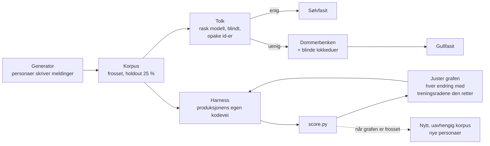

# Chapter 38 — Måle og forbedre formålsforståelse uten språkmodell

Status: draft · Opprettet 2026-09-24 · Kilde: `Deliverables/PDD_butler-onboarding-og-formaalsforstaaelse_2026-09-23/` (METODE.md, TESTRESULT.md, maaling/)

Dette kapittelet beskriver et løp for å finne ut om en AI-løs matcher forstår det folk skriver,
og for å gjøre den bedre uten å lure seg selv. Første bruk var Butler (HAVENs chat-assistent når
ingen språkmodell er koblet til). Samme løp ble kjørt mot Kallimachos' `matchPurposes` ved å bytte én
adapter. Kapittelet er skrevet for neste matcher: formålsregisteret, Palazzo, eller noe vi ikke har laget ennå.

Kjetils bestilling (2026-09-23): «Vi må sette opp et løp hvor vi genererer opp naturlige meldinger til
butleren – vi teste tolkningen med en kapabel men helst rask språkmodell og så tester vi matchingen med
bare formål og justerer formålsgrafen så det blir riktigere treff. Det behøver ikke være perfekt men vi kan
nå få det svært mye bedre enn det er i dag. Dokumenter metodikk som funker så vi kan gjenbruke det.»

## 1. Spørsmålet løpet svarer på

**Når en bruker skriver noe naturlig, foreslår matcheren det brukeren mente?** Og: **er en endring en
forbedring, eller føles den bare slik?** Det andre spørsmålet er det vanskelige. Uten et frosset
testsett og et holdout-sett vil hver frase man legger til, se ut som en seier.

## 2. Løpet

| Rolle | Hvem | Hvorfor egen rolle |
|---|---|---|
| Generator | Fire underagenter, hver med sin persona | Én stemme gir ett språk. Personaene skal spre ordvalg, lengde, dialekt og feil. |
| Tolk | Rask modell (haiku), blindt, stokket | Sjekker at meldingen uttrykker formålet. Ser aldri generatorens etikett. |
| Dommer | Et menneske (Kjetil) i Dommerbenken | Avgjør bare der generator og tolk er uenige, med blinde lokkeduer. Fem oppgaver per økt. |
| Måler | Swift-test over produksjonens egen kodevei | Måler det brukeren får, ikke en kopi av algoritmen. |
| Poengsetter | `score.py` | All vurdering av riktig og galt står ett sted, utenfor harnessen. |

## 3. Reglene

Hver regel kom av en feil noen har gjort.

1. **Lokkeduer i hver dom.** En dom uten noe å si nei til er ikke en fasit (formålsregister-tråden: 197 ja, 0 nei).
2. **Holdout røres ikke.** 25 % av korpuset (hash av id) måles hver gang, men ingen endring får begrunnes med en holdout-rad.
3. **Tomt er ikke grønt.** Harnessen feiler hvis ingenting ble målt.
4. **Tilregnelighetssjekk.** Fasiten CI allerede tester (PromptPurposeLab) måles i samme kjøring. Scorer den lavt, er harnessen feil.
5. **Negativer og hull er egne kategorier.** Småprat, «ikke gjør noe», spørsmål om assistenten selv og ønsker utenfor systemet er riktige når ingenting foreslås. Et formål uten flate i katalogen er et hull, ikke en bom.
6. **«Spurte med riktig valg» er ikke top-1.** Nyttig, men egen kolonne.
7. **Mål produksjonsveien.** Ingen reimplementasjon av matcheren. Fersk identitet og nullstilt tilstand per melding.
8. **Tolken får opake id-er.** Id-er i generatorrekkefølge avslører etiketten for en som ser mønsteret.
9. **Et nytt korpus etter at grafen er frosset.** Holdout fra de samme personaene deler stil med treningen. Den ærlige testen er nye skribenter som aldri har sett grafen.
10. **Dump katalogen før første poengsetting.** Etikett-kartet må bygges fra det matcheren faktisk kan treffe i testkjøringen, ikke fra det man tror står der.

## 4. Resultater så langt

### Butler, korpus v1 (396 meldinger, fire personaer)

| | før | graf v3 |
|---|---|---|
| Holdout, riktig forslag | 20 % | **40 %** |
| Holdout, riktig blant tre | 23 % | 57 % |
| Negativer uten handling | 94 % | 94 % |
| Holdout vunnet / tapt | | 16 / 0 |

Holdout-tallet over kom fra de samme fire personaene som treningsradene. Derfor ble et nytt korpus
laget etter at graf v3 var frosset: 264 meldinger fra fire nye personaer (student, saksbehandler på
nynorsk, idrettslagsleder som dikterer, utvikler med norsk som andrespråk).

### Butler, korpus v2 (uavhengig, 264 meldinger)

| | før | graf v3 |
|---|---|---|
| Riktig forslag | 20 % | **28 %** |
| Riktig blant tre | 25 % | 36 % |
| Negativer uten handling | 92 % | 88 % |
| Vunnet / tapt | | 18 / 1 |

**Gevinsten holdt, men den var mindre enn holdout lovet: +8 prosentpoeng, ikke +20.** Frasene
generaliserte for hjelpere med tydelige verb (video, gjøremål, onboarding), ikke for flater og ikke for
indirekte meldinger. Den ene tapte meldingen var en regresjon ingen annen test så: «ikke gjør noe med
det ennå: … flytte styremøtene til tirsdager» ble et møteforslag. Uten det uavhengige korpuset hadde
vi rapportert en dobling og ikke visst om regresjonen. Det er grunnen til regel 9.

### Kallimachos, samme løp, bare adapteren byttet

96 meldinger mot 17 formål. Riktig formål øverst 32 % (holdout 17 %), blant tre øverste 44 %.
Ingen endringer ennå; tallene er utgangspunktet. De svakeste formålene er prosjektportefølje (0/5),
samtykke i spørreskjema (0/4) og hvor lenge data lagres (0/4).

## 5. Gjenbruk: tre ting byttes

1. **Etikettrommet** — formålene til matcheren som skal måles.
2. **Adapteren i harnessen** — ett kall inn i matcheren, som skriver samme resultatlinje (`topK` med `purposeRef` og score).
3. **Etikett-kartet** — hva et riktig svar er for hver etikett.

Generator, tolk, Dommerbenken, `score.py` og reglene over gjenbrukes uendret. Kallimachos-kjøringen
krevde én ny testmetode og ett formålskart.

## 6. Hva som ikke virket

- **Første etikett-kart var feil.** Flatene ble bedømt på `purposeRef`, men testkjøringens konfigurasjoner bar andre referanser. Rettet ved å bedømme på katalogens endepunkt (regel 10).
- **Arendalsuka-flatene fantes ikke i testkjøringens katalog** (handel, møtested, avstemning). De telles som hull til de måles mot en publisert katalog.
- **Nye brukere uten historikk** får hjelper-scorene vektet ned. Prisen er mange «spurte» der svaret var klart.
- **Indirekte og lange meldinger** er fortsatt svake. Fraser hjelper lite der; det er der en språkmodell eller en graf med relasjoner gjør mest.
- **To regresjoner ble innført og fanget** av regresjonstestene i samme jobb (et AIGateway-statusspørsmål og «hjelp meg i gang med Arendalsuka» ble onboarding). Regresjonstestene hører hjemme i måle-jobben, ikke bare i CI.

## 7. Filer og kommandoer

| Hva | Hvor |
|---|---|
| Metode med alle detaljer | `Deliverables/PDD_butler-onboarding-og-formaalsforstaaelse_2026-09-23/METODE.md` |
| Tall med filsti | samme mappe, `TESTRESULT.md` |
| Korpus, fasit, tolk, generator | `…/maaling/korpus/`, `fasit/`, `tolk/`, `generator/` |
| Poengsetter | `…/maaling/score.py <korpus-mappe> <rapport-mappe>` |
| Én måling | `HAVEN-Deploy/_handoff/WP-R/wp-butler-maaling-v2.sh <variant>` (variant = navnet på en patch i `BUTLER-MAALING/graf/`, eller `foer`) |
| Grafendringene | `…/maaling/grafendringer/GRAFENDRINGER-v3.md` |

## 8. Formålspakken og lærdommene

Metoden er også en standard formålspakke, `pkg.std.maal-formaalsforstaaelse` i
`Book/haven_purpose_packages_v0.json`. Den festes automatisk til en PDD med tagger som
`formaalsmatching`, `evaluering`, `holdout` eller `korpus`, og gjør reglene over til avledede tester.
Lærdommene fra første runde står i `Book/haven_lessons_register_v0.json`
(`lesson.same-writers-holdout-overstates`, `lesson.sequential-ids-can-leak-labels`,
`lesson.helper-bypassed-shared-negation-check`).

## 9. Under bruk (planlagt, ikke bygget)

Kjetil 2026-09-24: forbedringer skal også kunne testes under bruk, og tilgang til andre entiteters data
må godkjennes av den enkelte entiteten. Planen (PDD-tillegget E1–E6) er:

- Grafen (leksikon og vekter) flyttes fra kode til en versjonert celle, så en variant kan lastes og
  rulles tilbake uten utrulling.
- En kandidatversjon regner i skyggen på brukerens egne meldinger. Brukeren ser ingen forskjell, og
  resultatet blir i brukerens egen celle. På som standard, kan slås av.
- Det brukeren gjør med et forslag (godtatt, avvist, annet valg, skrev om) blir et utfall, med
  grafversjonen som ga forslaget, uten meldingstekst.
- En entitet velger selv nivå: ingenting (standard), tellinger, eller i tillegg vaskede meldinger den
  har sett og godkjent. Avtalen kan trekkes.
- En versjon tas i bruk bare når den er minst like god offline (korpus og CI-fasit, ingen tap på
  negativer) og i skygge (ikke lavere godtatt-andel, ikke flere forslag ingen ba om).

Ingenting i dette avsnittet er implementert per 2026-09-24. Status står i PDD-mappas STATUS.md.
