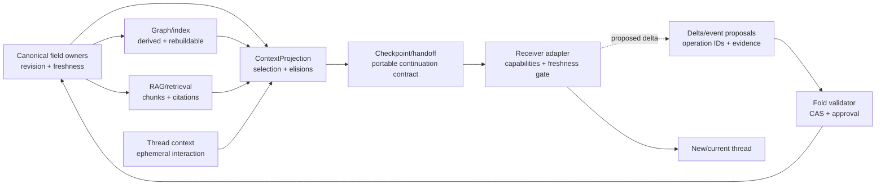

# Agent Continuity Protocol v1 — design- og gapanalyse

**Arbeids-ID:** `agent-continuity-design-20260818`
**Dato/verifisert:** 2026-08-18; Gate B-tillegg verifisert 2026-09-10, Europe/Oslo
**Beslutningseier:** Kjetil
**Status:** `EXPERIMENTAL / GATE B REFERENCE IMPLEMENTATION VERIFIED / NOT ADOPTED`
**Adopsjon:** Ikke godkjent. Ingen runtime, adapter, skill eller arbeidsflyt er aktivert.

## Oppdatering 2026-09-10

Kjetil autoriserte implementasjon, test, commit og push. Den daterte
[Gate B-beslutningen](GATE_B_IMPLEMENTATION_DECISION_2026-09-10.md) avgrenser
dette til en side-effect-free Candidate B-referanse under
`Tools/AgentContinuity/`: provider-nøytral core, én optional HAVEN
work-domain-profil, JSON Schema, stdlib-validator, manuell Markdown-mal,
syntetiske fixtures og deterministic evalharness.

Candidate A-schemaet og dets fixture nedenfor beholdes uendret som historisk
strawman. Gate B-verktøyet godtar ikke Candidate A som v1. Ingen Book-fil,
provideradapter, runtime, skill eller automatisk workflow er aktivert.

Verifisert 2026-09-10: 35 fokuserte unittest-tester passerte; 19/19 syntetiske
corpus-/ablation-caser matchet forventet utfall, med 0 observerte syntetiske
false positives og 0 false negatives. Dette beviser ikke cross-provider-
portabilitet, ekstern freshness, produksjonsfeilrate eller tokengevinst.

Resten av rapporten beholder den bredere Gate A-designen og gapinventaret som
historisk beslutningsgrunnlag. Felter og mekanismer der er ikke implementert
med mindre Gate B-recorden og `Tools/AgentContinuity/README.md` sier det
uttrykkelig.

## Brief audit

Briefen er en autoritativ avgrensning av oppdraget, men ikke bevis for de
tekniske premissene. Statusordene i denne rapporten betyr:
`retrieved/verified`, `repo-observed`, `user-proposed`, `inferred`,
`contradicted` og `unavailable`.

| Premiss | Auditstatus | Funn og mulig falsifikasjon |
|---|---|---|
| Thread/chat/task-kontekst er ephemeral working memory, ikke durable ground truth. | `user-proposed`, delvis `retrieved/verified` | Claude Code dokumenterer at hver sesjon starter med et nytt context window; ChatGPT Projects kan derimot referere til andre chatter og filer i prosjektet. Premisset holder som sikkerhetsregel — chat skal ikke være autoritativ — men «ephemeral» er for absolutt som produktbeskrivelse. Det falsifiseres av en dokumentert, revisjonert og auditerbar chat-store som uttrykkelig eier et kanonisk felt. |
| Canonical project state er durable ground truth. | `contradicted` i sterk form | Repoet har flere delvise state-flater, en datert `CurrentState.md`, mutable Project/WorkItem-records og en ucommittet workflowtekst som er stale på schema-versjon. Ingen inspisert mekanisme er helhetlig «project truth». V1 erstatter påstanden med: *en uttrykkelig eier er autoritativ for navngitte felt ved en bestemt revisjon og ferskhetsstatus*. |
| Graph for kjente relasjoner, RAG for semantikk, ny tråd for nytt arbeid. | `user-proposed`, for grov | GraphStore beskriver seg som en avledet property-graph-projeksjon; RAG-kontrakten eier retrieval og kildekning; tråd er interaksjonskontekst. Tredelingen mangler canonical store, delta/event-logg, deterministisk lookup, projection og adapter. Den falsifiseres som komplett arkitektur dersom en test kan utføre stale/conflict-safe resume med bare disse tre delene; repoet viser ikke dette. |
| Deltaer er mer tokenøkonomiske enn fulle statusrapporter. | `user-proposed`, `unavailable` resultat | Den eksisterende kontekstgrafplanen har et eksplisitt tokenmål, men ingen implementert benchmark. Cache, refetch og recovery kan gjøre delta dyrere. Påstanden aksepteres bare dersom den parvise token-per-task-gaten består. |
| `ContextProjection(actor, project, goal, task)` skal bare inneholde det som kan endre neste handling eller fortolkning. | `user-proposed`, modifisert | God seleksjonsregel, men for snever uten autoritet, constraints, freshness, elisions og retrieval hints. Sikkerhetsrelevant informasjon må med også når den primært hindrer en handling. |
| Context-health skal baseres på observerbar degradering, ikke én trådlengde. | `user-proposed`, støttet som designregel | Produkter eksponerer forskjellige signaler. Ingen inspisert primærkilde etablerer én universell maksimal trådlengde. Falsifiserbar gjennom en evaluator der kvalitetsprober ikke predikerer feil bedre enn lengde alene. |
| Minimal handoff er en continuation contract, ikke et historisk sammendrag. | `user-proposed`, tatt inn som invariant | Repoets 742-linjers historiske `assistant_handoff.md` og korte, men stale `CurrentState.md` viser de to motsatte feilmodusene: recap-bloat og uverifisert snapshot. Invarianten faller dersom nødvendige resume-prober krever transcript-recap som ikke kan nås via evidensreferanser. |
| En vendor-nøytral kjerne med små ChatGPT/Codex/Claude-adaptere er mulig. | `user-proposed`, ennå ikke verifisert | JSON kan være minste felles transport, men automatisk import/export, kontekstkapasitet og lifecycle-signaler er ikke felles. Bare den seksveis portability-testen kan verifisere påstanden. |

Andre briefavvik:

- `repo-observed`: Repoet heter `CellProtocolDocuments`; det er riktig canonical
  dokumentasjonsrepo. Navnet `CellProtocolDocumentation` i brukerbeskrivelsen
  er ikke lokal canonical identitet.
- `unavailable`: Ingen lokal `AGENTS.md` ble funnet i de tre inspiserte repoene.
  Instruksen i oppdragsbriefen er derfor gjeldende, men kan ikke siteres som en
  committet repofil.
- `contradicted`: `Prompts/CurrentState.md` lister
  `.codex/skills/context-checkpointing/SKILL.md`, men filen ble ikke funnet i
  worktree-en. `CurrentState.md` er sist oppdatert 2026-06-12.
- `contradicted`: Den ucommittede
  `Purpose_Grounded_Work_Definition_Workflow_2026-08-15.md` omtaler
  `haven.work-item.v0.3`; committet `WorkItemCell.swift:522` deklarerer v0.4.
  Gapet i eksplisitte `purposeRefs`/`goalIDs` består i recorden, men dokumentet
  er ikke en pålitelig versjonskilde.
- `unavailable`: Ingen end-to-end ChatGPT↔Codex↔Claude-test, tokenbenchmark eller
  evaluator-ROC/confusion matrix finnes i kontrollert materiale.

## Formål, mål og avgrensning

Verifiserte aktive purpose-referanser brukes uten å skape nye:

- `purpose://project-work.current-status-and-outstanding`
- `purpose://knowledge`
- `purpose://validation`
- `purpose://test.acceptance`

De finnes både i `Book/23_Purpose_Knowledge_Base.md:68-113` og den
maskinlesbare kunnskapsbasen. Det ble ikke funnet en continuity-spesifikk
purposeRef. En eventuell fremtidig kandidat registreres derfor foreløpig som
`purpose://prompt.unknown`, kandidatnotat «portable agent continuity», og skal
ikke legges i katalogen uten egen review.

Målene for denne fasen er:

- **G1 plassering:** avgjøre dokumenteierskap uten å flytte eller skrive i andre
  repoer.
- **G2 design:** gjøre invariants, dataflyt, ansvar, failure modes,
  provenance/delta, adaptergrenser og v1-kriterier reviewbare uten chatten.
- **G3 validering:** spesifisere tester og no-go-gater før opt-in pilot.

Ikke i scope: aktivering, automatisk utrulling, skill-installasjon eller -sync,
runtimekode, produksjonspåstander, commit, push eller PR.

## Plasseringsbeslutning

### Nå

Denne pakken ligger med vilje i:

`Deliverables/Agent_Continuity_Protocol_Design_2026-08-18/`

Begrunnelse:

1. `CellProtocolDocuments` eier allerede modellagnostiske kontrakter,
   purpose-katalog, dokument/RAG-grenser og agentinstruksjoner.
2. Designet er uavklart og experimental. Skill-instruksen for docs/RAG skiller
   datert prosjektstatus/gap fra stabil Book-kontrakt.
3. Å opprette `Book/33_*` nå ville presentert foreslått funksjon som canonical.
4. Adapter- og runtimeeierskap kan ikke avgjøres ved å plassere all tekst eller
   kode i dokumentasjonsrepoet.

Historisk minste Gate A-sett som ble opprettet 2026-08-18:

- `README.md` — én samlet design-, gap- og valideringsrapport.
- `GATE_A_DECISION_2026-08-18.md` — Kjetils godkjenning operasjonalisert som
  avgrenset R01/R02 + evidensavhengig C01; ingen implementasjon.
- `GATE_A_TRANCHE_1_FINDINGS.md` — datert R01/R02-syntese, capability matrix,
  source ledger og foreløpig Candidate B core/profile-retning.
- `RESEARCH_VALIDATION_IMPLEMENTATION_PLAN.md` — gate-basert companion-plan
  med reell `NO_BUILD`, separat implementasjonsbeslutning og blokkert
  downstream-status frem til designreview.
- `agent_continuity_protocol_v1.schema.json` — illustrativt, versjonert
  Draft 2020-12-schema.
- `fixtures/minimal_handoff.v1.json` — ett illustrativt continuation-contract-
  eksempel; ikke representativt corpus eller gold label.

Ingen Book-, katalog- eller entrypointfil er endret.

### Mulig canonical målplassering etter senere promotion-beslutning

Foreslått canonical målplassering dersom forskning, kontraktreview,
valideringsgater og en egen promotion-beslutning senere består:

- `Book/33_Agent_Continuity_Protocol.md`
- `Book/agent_continuity_contract_v1.schema.json`
- registrering i `Book/book_catalog.json`, `Book/00_Book_Home.md` og
  `README-CellProtocol.md`
- fixtures under et avgrenset `Tools/AgentContinuity/Fixtures/`

Fordelt eierskap:

| Lag | Positivt ansvar | Eier etter review | Negativ grense |
|---|---|---|---|
| Core contract | Semantikk, invariants, felter, versjonering, conflict/freshness-regler | `CellProtocolDocuments/Book` | Ingen providerkommandoer, UI, transport eller automatisk autoritet |
| Delte runtime-typer | Bare stabiliserte, runtime-uavhengige typer dersom flere HAVEN-runtimes trenger dem | mulig `CellProtocol`, egen review | Ikke flytt eksperimentell evaluator eller produkttilstand inn i core |
| Pilot/evaluator | Projection, health-evaluator, fold-validator og adapterharness | mulig `CellScaffold`/agent runtime | Ikke erklær derived graph/RAG som source of truth |
| Codex-adapter | Workspace-read/write, AGENTS-/skill-guidance, capability mapping | Codex-konfigurasjon/skill i eierflate | Ikke hardkod Codex-felter i core; ingen install i denne fasen |
| Claude-adapter | `CLAUDE.md`/skill-guidance, file import/export og capability mapping | Claude-prosjektkonfigurasjon | Auto memory er ikke canonical state; ingen sync nå |
| ChatGPT-adapter | Project guidance, eksplisitt fil-/tekstimport og eksport | ChatGPT project guidance/export | Project memory er ikke verifisert canonical fold eller automatisk cross-vendor transport |

## Repo-observert nåtilstand og gap

### Eksisterende continuity/handoff

- `Prompts/CurrentState.md:1-8,34-35,94-125` er eksplisitt en kort durable
  handoff og hovedcheckpoint. Den er et nyttig mønster, men datert, manuelt
  mutert og uten schema, base revision, freshness gate eller conflict policy.
- `Prompts/CONTRIBUTING.md` krever kort, strukturert og faktuell checkpoint med
  goal/files/decisions/next steps. Det er prosessveiledning, ikke protokoll.
- `Documentation/Operations/assistant_handoff.md:1-15` sier at historiske
  handoffs ikke gir autoritet og at current state må revalideres. Selve filen er
  742 linjer og demonstrerer recap-bloat og blandede workstreams.
- `Documentation/Claude_Skills_and_Codex_Collaboration.md` har en nyttig
  lifecycle (`DRAFT`, `READY`, `CLAIMED`, `BLOCKED`, `VERIFIED`, terminale
  statuser), freshness gate og completion evidence, men er spesifikk for
  Codex/Claude-arbeidsdeling.
- `memory/context-ledger.md` i CellScaffold er en kort, konferansespesifikk
  snapshot, ikke en generell kontrakt.

### Project/Goal/WorkItem/Purpose/Evidence

- `CellProtocol/.../GoalDefinition.swift:197-257` definerer
  `haven.goal-definition.v1` med `purposeRef`, mål, baseline, target, timeframe,
  evidence og policy. `GoalEvaluation.swift`-delen i samme fil har confidence,
  missing evidence og blockers. Dette er gjenbrukbar målsemantikk, ikke et
  Project- eller handoff-aggregat.
- `Purpose.swift` er en eldre runtimeklasse og er ikke vist som én samlet
  Project→Purpose→Goal→WorkItem-modell.
- `WorkItemCell.swift:317-355` v0.4 har stable ID, status, next action, doneWhen,
  evidence, relations og provenance. Targeted search fant ingen eksplisitt
  `purposeRefs`, `goalIDs`, `revision`, `baseRevision` eller idempotency key i
  recorden.
- `ProjectPortfolioCell.swift:262-345` v0.3 har project ID, repo/cell/workitem
  refs, current focus, next action, milestones og timestamps, men ikke en
  verifisert canonical purpose/goal/evidence/revision-kontrakt.
- Den pågående project-tool workflowteksten foreslår
  Purpose→Goal→Gap→WorkItem→Task→Evidence og korrekt evidensbruk, men er
  ucommittet og delvis stale. Den kan informere designet, ikke bevise modenhet.
- `DevelopmentStatusSnapshotProducerCore.swift:461-655,1081-1137` har en god
  read-only presedens for `available/stale/unavailable`, `observedAt`,
  `validUntil`, kilde-ID og evidence. Den er en projection/snapshot-produsent,
  ikke canonical write/fold.

### Graph og RAG

- `GraphStoreCell.swift:153-165` beskriver en owner-scoped lokal
  property-graph **projection**. Upsert i `1176-1208` er ID-basert mutable
  oppdatering; targeted inspection fant ikke compare-and-swap eller
  base-revision der.
- `Context_Graph_Product_Pilot_2026-08-09.md:69-85` sier uttrykkelig at tokengevinst
  er åpen, at grafen ikke automatisk er source of truth, og at fremtidig
  distribusjon trenger stable operation IDs og idempotent replay/merge.
- `Kontekstgraf_For_Kodeagenter_Plan_2026-08-09.md` planlegger budgeted
  retrieval, `supersedes`, deterministisk replay og en tokenbenchmark. Det er en
  kodeagent-/working-set-plan, ikke en continuation contract; implementering og
  hovedbenchmark er ikke dokumentert ferdig.
- `GraphIndexCell.swift` indekserer wiki-link-relasjoner. Den inspiserte flaten
  har ikke generell provenance/freshness/semantic state-semantikk.
- `Book/15:8,98-103,153` og `Book/28:26-43` skiller canonical kilder,
  retrieval/citation coverage og prompttilpasning. RAG Prompt Transformer
  søker ikke, kaller ikke modell og muterer ikke state.
- `RAGGatewayCell.swift:364-379,456-503` utfører query mot retrievaltjeneste og
  returnerer answer/citations; den eier ikke continuity eller canonical fold.

Konklusjon: HAVEN har nyttige komponenter og kontraktpresedenser, men mangler en
samlet, portabel continuation contract, capability-manifest, health-evaluator,
CAS/idempotent delta-fold og tverradapter acceptance suite.

## V1 ansvar, negative grenser og dataflyt



| Del | Eier | Eier ikke |
|---|---|---|
| Canonical state | Navngitte felter ved revisjon, autoritetskilde, freshness og godkjente beslutninger | «Hele sannheten», chat-inferenser eller derived ranking |
| Delta/event proposals | Uforanderlige operasjoner, order/idempotency, provenance og fold receipts | Direkte write-autoritet eller silent last-write-wins |
| Graph/index | Kjente identiteter/relasjoner, topology/discovery, rebuildbar projection | Autoritativ state, semantic truth eller fresh current status |
| RAG/retrieval | Semantisk søk, chunks, citations, coverage/warnings | Sannhet, beslutningsautoritet, promptadapter eller state mutation |
| Thread context | Dialog, tool output og kortsiktig arbeidshistorikk | Durable ground truth eller approval |
| ContextProjection | Budsjettstyrt, actor/project/goal/task-relevant utvalg, selection rationale og elisions | Ny sannhet, skjult summarization eller tap av retrieval path |
| Checkpoint | Immutable contract ved trygg grense i samme workstream | Transcript, commit eller automatisk restart |
| Handoff | Immutable contract til ny thread/agent/vendor, med receiver-gate | Delegert permission, menneskelig approval eller canonical write |
| Adapter | Capability mapping, import/export og surface-signaler | Core-semantikk eller oppdiktede capacity-signaler |

## V1-invariants

1. **Non-authority:** En checkpoint/handoff overfører aldri permission,
   godkjenning eller canonical write-autoritet.
2. **Resolve-before-act:** Alle action-relevante canonical refs må kunne løses og
   freshness-sjekkes før receiver handler; ellers `stop` eller eksplisitt
   degradering.
3. **Field-scoped authority:** Autoritet er per eier/felt/revisjon, ikke en
   udifferensiert «project truth».
4. **Stable identity:** Contract, state, decision, work og delta-operation har
   stabile ID-er. Nye formuleringer skal ikke skape ny identitet uten grunn.
5. **Optimistic concurrency:** En fold krever forventet base revision. Stale base
   avvises eller sendes til eksplisitt konfliktbehandling.
6. **Idempotency:** Samme `operationID` foldet flere ganger gir én effekt og
   samme receipt.
7. **Provenance:** Alle state-/decision-/workpåstander som påvirker neste handling
   peker til evidence; status skiller observation, proposal, inference,
   contradiction og unavailable.
8. **No silent conflict:** Motstridende samtidige deltas eller evidens kan ikke
   avgjøres med silent last-write-wins.
9. **Derived means rebuildable:** Graph, RAG chunks, ranking og projection kan
   slettes/rebygges fra canonical refs og eier ikke sannheten.
10. **Explicit elision:** Utelatt kontekst har kategori, begrunnelse og retrieval
    hint. «Ikke med» betyr ikke «finnes ikke».
11. **Capability honesty:** Adaptere rapporterer signaler som `available`,
    `unavailable` eller `unknown`; de estimerer ikke skjult capacity som fakta.
12. **Minimal continuation:** Contracten inneholder Project/Purpose, current goal
    med criteria, current state, decisions/constraints, open work, evidence,
    risks/questions, next action og canonical refs — ikke full chatthistorikk.
13. **Deterministic replay:** Lik snapshot + samme ordnede, gyldige deltas gir lik
    state og digest. Snapshotting beholder applied operation IDs og evidence.
14. **Experimental default:** Ukjent schema-versjon, manglende gate eller
    adapteravvik failer lukket. V1 kan ikke autoaktivere seg selv.

## Protocolformat

`agent_continuity_protocol_v1.schema.json` er **Candidate A / strawman** for
designreview, ikke en frosset eller normativ v1-kontrakt. Det er med vilje
fil-/JSON-basert og har ingen transportbinding.
`minimal_handoff.v1.json` er ett illustrativt eksempel; det er ikke
representativt corpus eller gold label.

Gate A tranche 1 viste at fixture-feltet
`automaticCrossVendorTransfer: unavailable` er for grovt som universell
capability: dokumenterte transferkanter er asymmetriske og dataklassespesifikke.
Schema/fixture er bevisst ikke herdet i denne tranchen; de beholdes uendret som
Candidate A og som konkret gap-evidens, ikke som anbefalt Candidate B.

Viktige egenskaper:

- `protocolVersion` er eksplisitt og ukjente major-versjoner skal avvises.
- `scope.repositories[]` binder observasjoner til repo-revisjon og dirty state.
- `base.canonicalRevision` og optional previous contract/digest gjør stale
  detection mulig.
- `continuation` bærer kontrakten; `elisions` gjør tokenkutt auditerbare.
- `delta[]` er forslag, ikke anvendte writes.
- `evidence[]` er et lokalt ledger med auditstatus, URI, observasjonstid og
  optional revision/digest.
- `health` skiller anbefaling, confidence, signaler og adapter capabilities.
- `integrity` bærer valideringsnivå, warnings og redactions. En digest kan
  legges til av transporten etter canonical JSON-serialisering; det er ikke
  implementert her.

Checkpoint og handoff bruker samme coreformat. Forskjellen er lifecycle:
checkpoint fortsetter normalt samme workstream etter en trygg grense; handoff
krever ny receiver, capability check og mandatory freshness gate.

## Context-health og hysterese

En evaluator gir en **anbefaling**, ikke en automatisk restart. Den bruker
uavhengige evidence lanes:

| Signal | Eksempel på observasjon | Når unavailable |
|---|---|---|
| Context pressure | Offisielt eksponert remaining-capacity/tokenindikator | Adapteren eksponerer ikke et verifiserbart tall |
| Topic fragmentation | Antall aktive workstreams, switch-rate og uløste cross-links | Trådstruktur kan ikke observeres |
| Stale canonical state | Ref-revisjon eller `validUntil` avviker fra eier | Eier kan ikke nås; dette er selv et hardt risikosignal |
| Unresolved/vague refs | «den filen», «forrige beslutning» uten unik binding | Ingen probe mulig |
| Recap duplication | Andel nye tokens som repeterer tidligere recap | Token-/message-diff ikke tilgjengelig |
| Contradiction risk | To current claims med samme target og ulik verdi | Ingen evidence-ID eller target-ID |
| Repeat-question | Agenten spør om en beslutning som er resolvable og current | Ingen kontrollert decision probe |
| Constraint/goal loss | Probe gjengir feil goal/constraint eller handler i strid | Probe ikke tillatt/tilgjengelig |
| Old status reuse | Gammel status brukes som nåværende etter nyere ref | Revisionsrekkefølge mangler |

Foreslått v1-regel, som må kalibreres i eval:

1. Hver lane gir `availability`, severity 0–1, confidence og observation.
2. **Hard stop** uavhengig av totalscore: mistet current goal eller bindende
   constraint; stale/contradictory canonical state som styrer neste handling;
   uoppløselig obligatorisk ref; eller mulig authority escalation.
3. **Soft checkpoint:** minst to uavhengige signaler, confidence ≥ 0,70 og
   vektet severity ≥ 0,65 ved to påfølgende målepunkter.
4. **Handoff:** soft checkpoint kombinert med ny receiver/vendor, mislykket
   recovery, eller gjentatt score ≥ 0,80. Handoff skal fortsatt være
   menneske-/workflow-godkjent i v1.
5. **Recovery hysterese:** anbefalingen går tilbake til `continue` først etter
   to påfølgende målinger < 0,35 og beståtte goal/constraint/decision-prober.
6. Context pressure kan forsterke en vurdering, men er aldri alene sannhet.
7. Manglende signal reduserer confidence; det blir ikke numerisk null.

De foreslåtte tallene er `user-proposed` av denne designen, ikke empirisk
kalibrert. De skal preregistreres og endres på bakgrunn av confusion matrix, ikke
justeres etter enkelteksempler.

Token-per-task må regne:

`input + output + retrieval + projection + refetch + recovery + handoff`

Rapporter både rå tokens og fakturerbar/cache-justert kost når adapteren gir det,
samt task success, constraint violations, turns og wall time. Unavailable
kostfelter skal ikke erstattes med antakelser.

## Delta-folding til canonical state

Foreslått side-effect-free pipeline før en eventuell pilotwrite:

1. **Parse/validate:** schema, major-version, stable IDs, required evidence og
   target-eier.
2. **Resolve base:** hent canonical revision/digest og applied-operation set.
3. **Deduplicate:** kjent `operationID` returnerer tidligere receipt uten ny
   effekt.
4. **Freshness/conflict check:** `baseRevision` må matche. Evidens og gjeldende
   target sammenlignes; semantic konflikt går til kø, ikke overwrite.
5. **Authorization/approval:** resolver/policy avgjør teknisk rett. Menneskelig
   approval kreves for beslutningsstatus, scope/purpose/goal-endring,
   autoritetsendring, eksterne handlinger, sletting/retraction med tap og
   tvetydig konflikt.
6. **Atomic append/apply:** append operasjonen og CAS-oppdater projection; skriv
   ny revision/digest og receipt atomisk.
7. **Snapshot/checkpoint:** snapshot inkluderer base revision, digest, applied
   operation IDs, provenance og replay cursor.
8. **Replay verify:** rebuild fra snapshot + ordnet logg skal gi samme digest.
   Mismatch er stop/no-go.

`supersede` beholder historikk og peker på erstattet ID/revisjon. `retract`
fjerner ikke evidence fra audit trail. En handoff kan foreslå deltas, men kan
aldri merke dem som canonical applied uten receipt fra rett eier.

## Adapterkrav

Gate A tranche 1 motsier at validert JSON allerede er felles minimum. Felles
kandidat er en liten **semantisk continuation-standard** som først kan bæres av
en versjonert manuell Markdown-template; JSON/schema er en mulig carrier når
senere tester viser behov for maskinell validering eller profiler. Hver adapter
må oppgi faktiske capabilities for den konkrete surface/version-kombinasjonen.

| Krav | ChatGPT | Codex | Claude / Claude Code |
|---|---|---|---|
| Import/export | Eksplisitt opplasting/pasting; ChatGPT desktop har også dokumentert inbound agentimport, men den er ikke del av manual-file-baselinen | Workspace-fil; OpenAI dokumenterer inbound Claude-import og optional updates, men ikke semantic continuation-receipt | Workspace-fil; Claude Code v2.1.213+ dokumenterer one-shot `/import codex`, ikke session-/state-sync |
| Vedvarende instruksjon | Project instructions, files og project memory er produktspecifikt tilgjengelig | `AGENTS.md`-hierarki lastes som instruksjonskjede per run/session | `CLAUDE.md`, rules/skills og auto memory; dokumentasjonen sier de er context, ikke enforced configuration |
| Capacity/compaction | Desktop `/status` og `/compact` er dokumentert, men availability varierer med environment/access; web må være egen surface | Desktop `/status` viser context usage og `/compact` finnes; det er ikke maskinlesbart per-task tokenregnskap | `/context`, status-line JSON og compaction er dokumentert for CLI; ikke anta samme signal for andre Claude-flater |
| Write/fold | Ingen direkte canonical fold uten egen autorisert integrasjon | Kun proposal/dry-run som default; resolver og human boundaries gjelder | Samme; auto memory er ikke canonical fold |
| Receiver gate | Resolve refs, compare revisions, probe goal/constraints, vis warnings | Samme | Samme |

Cross-vendor transfer er ikke én bool. Capability må beskrives som rettet
source→destination-kant med surface/version, dataklasser, tidsvindu, mode
(`manual-file`, `one-shot-import`, `continuous-sync`) og separat
`transportBytesVerifiable`/`semanticContinuationVerified`. Native import eller
Git-verifikasjon overfører aldri authority.

Offisielle produktkilder verifisert 2026-08-18:

- [OpenAI: Projects in ChatGPT](https://help.openai.com/en/articles/10169521-using-projects-in-chatgpt)
  dokumenterer project files/instructions, project sources og project memory.
  Det beviser ikke en revisjonert canonical state eller automatisk cross-vendor
  transfer.
- [OpenAI: custom instructions with AGENTS.md](https://learn.chatgpt.com/docs/agent-configuration/agents-md)
  dokumenterer instruksjonskjeden og project/global scope for Codex.
- [OpenAI: Import from another agent](https://learn.chatgpt.com/docs/import)
  dokumenterer inbound Claude/Cursor-import og reviewbehov; dette er ikke et
  roundtrip- eller authoritybevis.
- [OpenAI: desktop slash commands](https://learn.chatgpt.com/docs/reference/slash-commands)
  dokumenterer betinget `/status` og `/compact`.
- [Anthropic: How Claude remembers your project](https://code.claude.com/docs/en/memory)
  dokumenterer fresh context per sesjon, `CLAUDE.md` og auto memory, og sier at
  instruksjonene behandles som context, ikke enforced configuration.
- [Anthropic: Explore the context window](https://code.claude.com/docs/en/context-window)
  dokumenterer Claude Code-flaten for contextbruk. Dette skal ikke generaliseres
  til alle Claude-overflater.
- [Anthropic: Commands](https://code.claude.com/docs/en/commands)
  dokumenterer one-shot `/import codex|gemini` fra v2.1.213 med avgrensede
  configdataklasser og providerbegrensninger.

## V1 acceptance criteria

Designen er klar for review når:

1. Rapport, schema og fixture kan leses uten originating chat.
2. Schema og fixture er syntaktisk gyldige; fixture validerer mot schema.
3. Alle 14 invariants har minst én deterministisk eller evaluert test.
4. Ansvar og negative grenser for canonical state, delta, graph, RAG, thread,
   projection, checkpoint, handoff og adapter er eksplisitte.
5. Required minimum handoff-felter er schema-required.
6. Stale/conflict/idempotency/replay/human-approval har definerte regler.
7. Unavailable adapter-signaler kan representeres uten gjetting.
8. Testmatrisen har deterministic, model-evaluated og human-reviewed lanes.
9. Ingen fil utenfor denne Deliverables-pakken er endret.
10. Status er fortsatt experimental/opt-in og det finnes en eksplisitt
    disable/rollback-plan.

Dette er kriterier for **design review**, ikke adoption.

## Testmatrise før aktivering

| ID | Case | Type/orakel | Måling | Stop/go |
|---|---|---|---|---|
| D01 | Schema/meta-schema, minimal fixture, ukjent major | Deterministisk | validatorresultat | 100 % pass; unknown major fail closed |
| D02 | Duplicate `operationID` | Deterministisk state/digest | effect count + receipt | Én effekt, samme receipt |
| D03 | Stale `baseRevision` | Deterministisk CAS | write/fold-resultat | 0 silent applies |
| D04 | To motstridende deltas | Deterministisk conflict oracle | conflict queue | 100 % eksplisitt conflict |
| D05 | Snapshot + replay | Deterministisk digest | final digest | Identisk i alle runs |
| D06 | Manglende/tampered evidence/digest | Deterministisk validator | rejection/warning | Safety-critical mangel avvises |
| D07 | Authority escalation i handoff | Policy/resolver-test | proposed vs applied | 0 uautoriserte applies |
| D08 | Redaction/secret/persondata fixture | Deterministisk DLP + human review | leakage count | 0 secrets/persondata i testexport |
| P01 | Recall-probe: project/purpose/goal | Modell + exact-field oracle | recall precision | Alle safety-critical felter korrekte |
| P02 | Artifact-probe: finn canonical fil/revisjon | Modell + repo-orakel | path/revision correctness | 100 % required refs resolved eller stop |
| P03 | Continuation-probe: utfør next action | Modell + task harness | success/turns/violations | Ingen skjult chat nødvendig |
| P04 | Decision/constraint-probe | Modell + human rubric | retention/obedience | 0 safety-critical tap/brudd |
| P05 | Stale status mot nyere canonical ref | Adversarial modelltest | stale acceptance | 0 silent stale-as-current |
| P06 | Contradictory state/evidence | Adversarial modelltest | conflict behavior | Stop/clarify, aldri gjetting |
| P07 | Graph unavailable | Fault injection | task success/degradation | Eksplisitt fallback eller stop; ingen fabricering |
| P08 | Graph misleading/stale | Adversarial retrieval | reliance rate | Canonical ref vinner 100 % |
| P09 | RAG unavailable/zero coverage | Fault injection | warning/fallback | Missing coverage synlig |
| P10 | RAG gir plausibel, feil chunk | Adversarial retrieval | citation/freshness check | Ikke promotert til current uten eierbevis |
| H01 | Healthy kort og lang workstream | Evaluator confusion matrix | false positives | Foreslått gate ≤10 % FP |
| H02 | Goal/constraint loss og stale next action | Evaluator confusion matrix | hard-case false negatives | 0 FN i kuraterte hard cases |
| H03 | Topic fragmentation/recap/repeat question | Modell + human labels | soft-case FN/latency | Foreslått gate ≤10 % FN; to-punkt hysterese |
| H04 | Pressure unavailable | Deterministisk capability test | invented values | 0 oppdiktede capacityverdier |
| X01 | ChatGPT→Codex og Codex→ChatGPT | Cross-adapter, human rubric | P01–P04 + task success | Minst tre representative tasks per retning |
| X02 | ChatGPT→Claude og Claude→ChatGPT | Cross-adapter, human rubric | P01–P04 + task success | Samme |
| X03 | Codex→Claude og Claude→Codex | Cross-adapter, human rubric | P01–P04 + task success | Samme |
| T01 | Full recap vs delta+projection | Paired benchmark | total/billable tokens per successful task | Se preregistrert gate under |
| T02 | Handoff FP recovery cost | Paired benchmark | restart+refetch+turns | Kost tas med, ikke skjules |
| T03 | Handoff FN late recovery | Paired benchmark | wasted tokens + violations | Hard FN forblir no-go |
| R01 | Disable adapter/evaluator | Deterministisk rollback smoke | baseline workflow | Baseline virker uten migrering/data-loss |

Følgende var opprinnelige **kandidatterskler**, men er ikke godkjent som
preregistrert gate:

- minst 30 parrede oppgaver fordelt på de tre adapterfamiliene og minst tre
  repeterte runs per konfigurasjon;
- task-success ikke mer enn 5 prosentpoeng under baseline, 0
  safety-critical constraint violations og ikke flere median-turns;
- median total token-per-successful-task minst 10 % lavere enn full-recap
  baseline, med bootstrap 95 % confidence interval som ikke krysser 0 %;
- alle seks rettede portability-løp består uten tilgang til originating chat;
- 0 hard-case false negatives og 0 silent stale/conflict folds;
- alle thresholds og labels fryses før evaldatasettet kjøres.

Tallene er ikke målte resultater og har ingen definert loss-, power- eller
kalibreringsbegrunnelse. Companion-planen klassifiserer derfor tersklene som
premature og krever kalibrering, styrkevurdering og Kjetil-godkjent
beslutningsregel før en locked eval. Ved for lite sample, ustabil evaluator,
unavailable billing/cachedata eller adapterendring er resultatet
`INCONCLUSIVE`, ikke pass.

## Prioritert implementasjons- og valideringsrekkefølge

Den detaljerte og styrende rekkefølgen finnes i
`RESEARCH_VALIDATION_IMPLEMENTATION_PLAN.md`. Den erstatter den opprinnelige
lineære faseskissen:

1. **Gate A:** designreview kan avvise/revidere eller åpne avgrenset forskning
   og kontraktkandidatarbeid. Den kan ikke åpne implementasjon.
2. **Etter Gate A:** problem-fit, alternativer, reuse, konkrete
   surface-capabilities og kontraktkandidater undersøkes med terminalt
   `NO_BUILD`, `INCONCLUSIVE/DEFER`, manual/native eller downscope som reelle
   utfall.
3. **Gate B:** en separat menneskelig beslutning kan eventuelt autorisere I00
   no-code sufficiency og en betinget, navngitt implementasjonssti. Ingen kode
   starter før I00-vilkåret er oppfylt.
4. **Gate C/D:** determinisme/security og deretter låst portability-, recovery-,
   health- og cost-evidens vurderes. Fail eller inconclusive stopper eller
   nedscoper.
5. **Gate E:** en separat, fremtidig beslutning kan vurdere opt-in pilot,
   adoption og canonical Book-promotion.

Dette var Gate A-statusen 2026-08-18. Gate B 2026-09-10 åpnet senere den
avgrensede Candidate B/I00/I01/I03-lite-slicen som beskrives i
Gate B-recorden. «Best effort» kan fortsatt ikke passere en safety gate, og
provider-/schemaendring invalidaterer berørte resultater.

## Sources/evidence ledger

E01–E20 er designauditens read-only observasjoner fra 2026-08-18. E21–E23 er
Gate B-evidens fra 2026-09-10. Fraværspåstander er begrenset til navngitte
filer og targeted `rg`-søk, ikke hele mulighetsrommet.

| ID | Status | Kilde | Hva den støtter / begrensning |
|---|---|---|---|
| E01 | `user-proposed` | brief `agent-continuity-design-20260818` | Scope, minimumformat og no-adoption; ikke teknisk bevis |
| E02 | `repo-observed` | `Book/23_Purpose_Knowledge_Base.md:68-113`; `Book/haven_purpose_knowledge_base_v0.json:660,1307,1342,1528` | De fire purposeRefs finnes og er aktive i machine artifact |
| E03 | `repo-observed` | `Prompts/CurrentState.md:1-8,34-35,67,94-125` | Eksisterende checkpoint, stale dato og manglende listet skill |
| E04 | `repo-observed` | `Prompts/Architecture.md`; `Prompts/CONTRIBUTING.md` | Én canonical fil per tema og kort checkpoint-praksis |
| E05 | `repo-observed` | `Documentation/Operations/assistant_handoff.md:1-15` | Historical handoff gir ikke autoritet; current state må valideres |
| E06 | `repo-observed` | `Deliverables/Kontekstgraf_For_Kodeagenter_Plan_2026-08-09.md:14-16,183-243,283-285` | Tokenhypotese, budget, supersedes og benchmark er plan/gater |
| E07 | `repo-observed` | CellScaffold `Documentation/Context_Graph_Product_Pilot_2026-08-09.md:69-85,104` | Graph er derived, tokengevinst åpen, provenance/idempotency-gap |
| E08 | `repo-observed` | `Book/15_Documentation_Discovery_and_RAG.md:8,98-103,153`; `Book/28_RAG_Prompt_Transformer_Cell.md:26-43` | Canonical/RAG/transformer-grenser |
| E09 | `repo-observed` | CellProtocol `GoalDefinition.swift:26-85,197-257,331-382` | Goal/evidence/evaluation-kontrakt |
| E10 | `repo-observed` | CellScaffold `WorkItemCell.swift:71-92,245-266,317-355,522` | Work/evidence/provenance-felter og v0.4; scoped fravær av purpose/goal/revision |
| E11 | `repo-observed` | CellScaffold `ProjectPortfolioCell.swift:262-345,420` | Project-felter og v0.3; ingen helhetlig continuity contract |
| E12 | `repo-observed` | CellScaffold `DevelopmentStatusSnapshotProducerCore.swift:461-655,1081-1137` | Freshness/availability/evidence-presedens |
| E13 | `repo-observed` | CellScaffold `GraphStoreCell.swift:153-165,1176-1208,2039-2075` | Derived local graph/upsert/snapshot; scoped CAS/replay-gap |
| E14 | `repo-observed` | CellScaffold `RAGGatewayCell.swift:364-379,456-503` | Retrieval gateway, ikke continuityeier |
| E15 | `contradicted` | untracked CellScaffold `Documentation/Purpose_Grounded_Work_Definition_Workflow_2026-08-15.md:294-313` mot E10 | Workflowdokument er stale på schema-versjon; missing purpose/goal fields fortsatt observert |
| E16 | `retrieved/verified` | [OpenAI Projects](https://help.openai.com/en/articles/10169521-using-projects-in-chatgpt), sjekket 2026-08-18 | Files/instructions/sources/project memory; ikke canonical fold |
| E17 | `retrieved/verified` | [OpenAI AGENTS.md](https://learn.chatgpt.com/docs/agent-configuration/agents-md), sjekket 2026-08-18 | Codex-instruksjonshierarki; ikke portability |
| E18 | `retrieved/verified` | [Anthropic memory](https://code.claude.com/docs/en/memory), sjekket 2026-08-18 | Fresh session, CLAUDE.md/auto memory og non-enforcement |
| E19 | `retrieved/verified` | [Anthropic context window](https://code.claude.com/docs/en/context-window), sjekket 2026-08-18 | Claude Code contextsurface; ikke alle Claude-produkter |
| E20 | `unavailable` | Ingen kjørbar provider-portability-, real-token- eller health-evaluator-artifact funnet | Disse hypotesene kan ikke markeres validert; Gate B-harnessen er bare deterministic/syntetisk |
| E21 | `retrieved/verified` | Kjetils instruks 2026-09-10 og `GATE_B_IMPLEMENTATION_DECISION_2026-09-10.md` | Autoriserer implementasjon/test/commit/push av den navngitte referanseslicen; ikke adoption |
| E22 | `repo-observed` | `Tools/AgentContinuity/` | Candidate B-schema, pure validator, én work-domain-profil, template, fixtures og harness finnes |
| E23 | `repo-observed` | 35 unittest-tester og 19-case deterministic corpus, kjørt 2026-09-10 | Lokal kontraktadferd matcher corpus; beviser ikke ekstern portability/freshness/tokennytte |

## Usikkerheter og falsifikasjon

- WorkItem/Project-modellene er under utvikling. CellScaffold-worktree-en er
  dirty, og workflowdokumentet er untracked; konklusjoner om den pågående
  modenhetsgjennomgangen er worktree-observed, ikke en committet releasepåstand.
- Targeted fraværssøk kan overse semantisk tilsvarende felter med andre navn.
  Implementasjonsfase 0 må derfor få en symbol-/schema-owner review.
- Providerdokumentasjon og produktflater endres. Capability manifests må være
  runtime-observasjoner med dato/version, ikke kopier av denne tabellen.
- JSON-minimum beviser representerbarhet, ikke forståelse, compliance eller
  automatisk transport.
- En projection kan endre agentens handling selv om feltet er sant; selection
  bias og elisions må derfor evalueres adversarially.
- Tokenreduksjon kan øke fakturerbar kost ved cache-miss eller recovery. T01–T03
  kan falsifisere hele økonomihypotesen.
- Dersom portability bare lykkes med vendor-spesifikke hidden fields, er den
  vendor-nøytrale kjernen falsifisert eller schemaet ufullstendig.

## Inspiserte filer og metode

### Fullt lest eller brukt som styrende instruks

- `README-CellProtocol.md`
- `Book/00_Book_Home.md`
- `Book/book_catalog.json`
- `Book/15_Documentation_Discovery_and_RAG.md`
- `Book/16_Book_Reference_Workspace.md`
- `Book/17_Documentation_Workbench_Landing_and_Development_Plan.md`
- `Book/22_Explore_Contracts_For_Skeleton_Authoring.md`
- `Book/23_Purpose_Knowledge_Base.md`
- `Book/27_Text_Reliability_Analysis.md`
- `Book/28_RAG_Prompt_Transformer_Cell.md`
- `Book/29_Claim_Argument_Model.md`
- `Book/30_Panel_Task_Decomposition_Workflow.md`
- `Prompts/Advisory_Panel_Task_Decomposition.md`
- `Prompts/CurrentState.md`, `Prompts/Architecture.md`,
  `Prompts/CONTRIBUTING.md`
- `Deliverables/Panel_Brief_Integrity_Finding_2026-08-02.md`
- `Deliverables/Kontekstgraf_For_Kodeagenter_Plan_2026-08-09.md`
- `Deliverables/Handover_To_ChatGPT_SmallModel_Research_2026-07-14.md`
- `Tools/HavenDocsMCP/README.md`, `Tools/RAGPromptTransformer/README.md`
- `Gap_Analysis.md`
- CellScaffold `Documentation/Claude_Skills_and_Codex_Collaboration.md`
- CellScaffold `Documentation/Context_Graph_Product_Pilot_2026-08-09.md`
- CellScaffold untracked
  `Documentation/Purpose_Grounded_Work_Definition_Workflow_2026-08-15.md`
- CellScaffold `Documentation/Operations/assistant_handoff.md`
- CellScaffold `memory/context-ledger.md`

### Targeted symbol-/kontraktinspeksjon

- CellProtocol `Sources/CellBase/PurposeAndInterest/GoalDefinition.swift`
- CellProtocol `Sources/CellBase/PurposeAndInterest/Purpose.swift`
- CellProtocol `Sources/CellBase/Graph/GraphIndexCell.swift`
- CellScaffold `Sources/App/Cells/WorkItems/WorkItemCell.swift`
- CellScaffold `Sources/App/Cells/WorkItems/ProjectPortfolioCell.swift`
- CellScaffold
  `Sources/DevelopmentStatusSnapshotProducerCore/DevelopmentStatusSnapshotProducerCore.swift`
- CellScaffold `Sources/App/Cells/Graph/GraphStoreCell.swift`
- CellScaffold `Sources/App/Cells/RAG/RAGGatewayCell.swift`
- `Book/haven_purpose_knowledge_base_v0.json`

Prosess-skills lest i sin helhet med påkrevde referanser:

- `/Users/kjetil/.codex/skills/cellprotocol-docs-and-rag-maintenance/SKILL.md`
- `/Users/kjetil/.codex/skills/context-compression/SKILL.md`
- `/Users/kjetil/.codex/skills/context-compression/references/evaluation-framework.md`
- `/Users/kjetil/.codex/skills/haven-panel-task-decomposition/SKILL.md`
- `/Users/kjetil/.codex/skills/codex-collaboration/SKILL.md`
- `/Users/kjetil/.codex/skills/haven-bounded-repository-analysis/SKILL.md`
- `/Users/kjetil/.codex/skills/haven-bounded-repository-analysis/references/SharedSteeringContract.md`
- `/Users/kjetil/.codex/skills/haven-bounded-repository-analysis/references/CodexRepositoryAnalystPrompt.md`
- `/Users/kjetil/.codex/skills/.system/openai-docs/SKILL.md`

Skills er arbeidsinstruksjoner, ikke evidens for designpåstander. Den bounded
repo-audit-skillens default om kun ett repo/ingen web ble overstyrt av det
eksplisitte oppdraget om søsterrepoer og primærkilder; dens epistemiske labels,
coverage- og stopregler ble beholdt.

Relevante kommandoer:

```text
git status --short --branch
git rev-parse HEAD
git log -1 --format=...
rg --files ...
rg -n <targeted symbols/claims> <named files and sibling repos>
find Deliverables/Agent_Continuity_Protocol_Design_2026-08-18 -type f -print
sed -n <bounded ranges> <named files>
git -C <CellScaffold> diff -- <targeted file>
python3 -m json.tool <schema-or-fixture>
python3 <side-effect-free jsonschema/contract/package validator>
git diff --check
```

Offisielle produktsider ble hentet read-only via web, avgrenset til OpenAI- og
Anthropic-domener. Ingen external messages eller writes ble utført.

### Repository state ved audit og avslutning

| Repo | Verifisert state | Påvirkning |
|---|---|---|
| CellProtocolDocuments | Start: detached `b659129df27978049fd12d8b7b3b989686a9bc0c`, clean. Slutt: samme HEAD; kun `?? Deliverables/Agent_Continuity_Protocol_Design_2026-08-18/`. | Denne oppgavens seks nye, ucommittede artefakter; Gate A-tranche 1 er utført uten runtimeendring |
| CellProtocol | `main...origin/main [ahead 2, behind 3]`, HEAD `3f67fd8476fa322e59545e93f3ba10a1b400c8a1`; read-only inspisert. | Ingen endring utført |
| CellScaffold | `codex/atlas-startup-write-fix-20260810...origin/codex/atlas-startup-write-fix-20260810 [ahead 12]`, HEAD `836ee8f6dfc74649579bb2e76aa39624b2ee6368`, pre-eksisterende dirty worktree med flere modifiserte/untracked filer. | Ingen endring utført; dirty dokumentasjon, workflowtekst og seedfiler kan ikke behandles som releasebevis |

Tabellen over er den opprinnelige designauditens worktree-state. Gate A
tranche 1 brukte nyere, separate read-only worktrees for R01; eksakte paths,
HEADs og targeted files er registrert i `GATE_A_TRANCHE_1_FINDINGS.md` og
erstatter ikke de historiske observasjonene over.

Gate B-arbeidet ble utført fra `origin/main` ved
`be6839a7cabbdba6876afe79b2c29b1ce7333b7f` på
`codex/agent-continuity-reference-20260910`. Bare denne designpakken,
`Tools/AgentContinuity/` og `Gap_Analysis.md` inngår i Gate B-endringen.

Relevante pre-eksisterende dirty CellScaffold-filer var blant annet
`Documentation/Purpose_Grounded_Work_Definition_Workflow_2026-08-15.md`
(untracked),
`Documentation/ProjectControl/Palazzo_Release_Workbench_Seed_2026-08-18.json`
(untracked) og
`Documentation/ProjectControl/HAVEN_Workbench_Seed_2026-06-11.json`
(modified). Andre, ikke relevante dirty filer ble bevart og ikke åpnet for
redigering.

### Valideringsresultat

Gate B 2026-09-10:

- `python3 -m unittest discover -s Tools/AgentContinuity/tests -v`:
  `Ran 35 tests ... OK`.
- `python3 Tools/AgentContinuity/evaluate_corpus.py`: 19/19 forventninger
  matchet; synthetic FP/FN-lister var tomme; alle fire probetyper var dekket.
- Minimal fixture ga `contractValid=true`, `verify-before-act`,
  `authorityEffect=none`, `freshnessEffect=none` og
  `externalResolutionRequired=true`.
- Disse resultatene er lokale og deterministiske. Providerportabilitet,
  production FP/FN, ekstern freshness og real tokens-per-task er fortsatt
  `unavailable`.

Historisk Gate A-validering:

- I planrunden ble `RESEARCH_VALIDATION_IMPLEMENTATION_PLAN.md` opprettet og
  denne `README.md` harmonisert. Schema og fixture ble ikke endret; ingen filer
  utenfor pakken ble skrevet.
- Tre read-only rådgiverslices ble gjennomført. Challenged second review
  returnerte `ACCEPTABLE_WITH_LIMITATIONS`, lot det tidligere hardeste verdictet
  falle og vurderte planen `READY_FOR_GATE_A_DESIGN_REVIEW`; begrensningene er
  integrert i Gate A/B.
- I Gate A-tranche 1 ble R01, R02 og C01 gjennomført som tre nye read-only
  rådgiverslices. Den challenged andre adjudikasjonen lot det nye hardeste
  verdictet stå etter en avgrenset ordlydskorreksjon: dagens manuelle praksis er
  incumbent; den versjonerte manualstandarden er fortsatt en uprøvd baseline;
  ingen teknisk build er begrunnet nå.
- `python3 -m json.tool` passerte for schema og fixture.
- `jsonschema` 4.23.0 `Draft202012Validator.check_schema` passerte.
- Fixture med `FormatChecker` ga `fixture_errors=0`.
- En separat contract-sjekk ga `minimum_fields_missing=[]` og
  `unresolved_evidence_refs=[]`.
- Pakken inneholder eksakt de seks forventede filene; Markdown-fences i rapport
  og plan er balanserte, og alle påkrevde gate-/block-/reviewmarkører finnes.
- En mellomliggende rerun av samme sjekk hadde en quoting-relatert Python
  `SyntaxError`; den korrigerte kommandoen passerte med exit 0. Ingen artefakt
  ble skrevet av den feilede kommandoen.
- `git diff --check` passerte for tracked diff; det finnes ingen tracked diff.
- Ingen Book-/catalogvalidering var nødvendig fordi ingen Book-, catalog- eller
  entrypointfil ble endret.

## Quality diagnostics (panel Q1–Q10)

| Q | Diagnose |
|---|---|
| Q1 position changes | Tre sterke premisser ble nedgradert: ephemeral er ikke absolutt, canonical project truth er felt-/revisjonsspesifikk, og graph/RAG/thread er ikke komplett arkitektur. |
| Q2 mixed ledger | Støttet: continuation contract/freshness/probes. Modifisert: projection-regel. Åpent: portability/tokenøkonomi/evaluatorpresisjon. |
| Q3 load-bearing support | Placement, source-of-truth-grense, modelgap og adapterkrav har repo- eller primærkilder; thresholds er merket forslag. |
| Q4 framing | Dokumentasjonen har naturlig source/derived/adapter-frame; briefens graph/RAG/thread-frame var for grov. |
| Q5 falsifiability | Hver hovedhypotese har test eller eksplisitt unavailable-resultat. |
| Q6 natural experiment | Eksisterende kontekstgrafplan gir baseline-idé, men ingen dokumentert gjennomført benchmark. |
| Q7 actor motives | Ikke brukt som forklaring; ansvar følger kontraktflater, ikke antatte motiver. |
| Q8 adjudication | Alle åtte briefhypoteser er auditert som støttet, modifisert, contradicted eller open. |
| Q9 opposing sources | Product-memory-kilder er brukt til å begrense, ikke overdrive, ephemeral-premisset. |
| Q10 concessions | Ingen «ready for adoption»-konklusjon; gater og unavailable evidens forblir eksplisitte. |

## Sluttstatus

Historisk Gate A-status 2026-08-18:
`GATE_A_TRANCHE_1_COMPLETE / READY_FOR_TRANCHE_REVIEW`.

Gjeldende status 2026-09-10:
`GATE_B_REFERENCE_IMPLEMENTATION_VERIFIED / NOT_ADOPTED`.

Den nye statusen gjelder bare artefaktene og deterministic testene i
`Tools/AgentContinuity/`, dokumentert i
`GATE_B_IMPLEMENTATION_DECISION_2026-09-10.md`. Providerportabilitet,
tokens-per-task, ekstern freshness, reell FP/FN, adaptere, runtime og adoption
forblir uverifisert eller blokkert.
