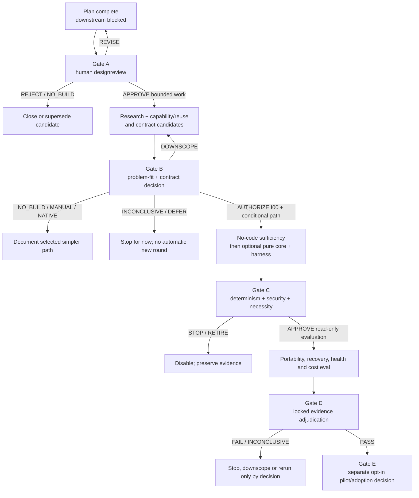

# Agent Continuity — forsknings-, validerings- og implementeringsplan

**Arbeids-ID:** `agent-continuity-program-plan-20260818`
**Opprettet:** 2026-08-18, Europe/Oslo
**Menneskelig beslutningseier:** Kjetil
**Status:** `GATE_B REFERENCE IMPLEMENTATION VERIFIED / LATER GATES BLOCKED`
**Kildepakke:** `Deliverables/Agent_Continuity_Protocol_Design_2026-08-18/`
**Adopsjon:** Ikke godkjent
**Aktivitet nå:** Kjetil åpnet 2026-09-10 en avgrenset Gate B med instruksen
«implementer, test, commit og push dette». Scope og resultat er registrert i
`GATE_B_IMPLEMENTATION_DECISION_2026-09-10.md`. Ingen pilot, runtime,
provideradapter eller aktivering er startet.

## Statusaddendum 2026-09-10

Gate B-beslutningen superseder sperrer og neste-handlingstekst i denne planen
der de eksplisitt gjelder `Tools/AgentContinuity`, I00, I01, en liten
deterministic I03-harness og den separate Candidate B-kjernen. Historiske Gate
A-funn og alle andre stopgrenser består. Implementasjonen er ikke Book-canonical
og gir ingen adoption eller automatisk arbeidsflyt.

## Brief audit

Brukerens scope og sperre er autoritative arbeidsregler: planen skal lages nå,
mens forskning og kontraktherding først kan starte etter designreview.
Tekniske premisser og foreslåtte løsninger er ikke autoritative fakta.

Statusord i planen: `retrieved/verified`, `repo-observed`, `user-proposed`,
`inferred`, `contradicted`, `unavailable` og `open`.

| Premiss | Auditstatus | Konsekvens for planen |
|---|---|---|
| En ny continuity-protokoll er nødvendig. | `open` | Designpakken viser reelle gap, men har ikke sammenlignet mot den enkleste manuelle eller provider-native løsningen. Planen får en tidlig problem-/alternativgate og terminalt `NO_BUILD`. |
| Ett gate-basert dokument bør styre forskning, kontrakt og eventuell implementasjon. | `user-proposed`, modifisert | Ett planartefakt er nyttig for traceability, men planen er forgrenet, ikke en lineær implementeringsstige. Hver hovedgate kan stoppe eller velge en enklere løsning. |
| Dagens schema er et vendor-nøytralt v1-minimum. | `contradicted` i sterk form | Schemaet er lukket, hardkoder adapterfamilier, krever HAVEN-/repo-felter og obligatorisk health, og bruker én aggregert canonical revision. Det behandles heretter som **Candidate A / strawman**, ikke frosset v1. |
| Dagens fixture er representativ og kan brukes som gold label. | `contradicted` | Den er ett Codex-/repo-eksempel uten delta eller konflikt. `handoff` og `confidence: 0.82` har ikke et dokumentert health-orakel. Den behandles som **single illustrative example**, ikke labeldata. |
| Kontraktherding kan fullføres før adapterarbeid. | `contradicted` som lineær sekvens | Read-only capability/enforceability og reuse-audit må komme først og deretter co-evolvere med kontraktkandidaten. Operative adaptere og runtime kommer fortsatt senere. |
| Foreslåtte health-, sample- og effektterskler er klare til preregistrering. | `contradicted` | Skala, prevalens, loss function, label agreement og varians er ukjent. Tallene i designrapporten er kandidater som skal kalibreres, ikke gates. |
| Tre providerfamilier er tilstrekkelig definerte eksperimentenheter. | `contradicted` | Testen må binde konkret surface, modell, adapterversjon, capability manifest, dato og transfermetode. |
| Schema-validitet etablerer semantisk fold/replay/authority. | `contradicted` | JSON Schema kan ikke alene bevise referanseintegritet, ownership, autorisasjon, replay eller receipts. Disse trenger egne orakler og kontrakter. |
| Designreview alene kan autorisere implementasjon. | `contradicted` av brukerens grense | Designreview kan bare åpne eksplisitt godkjent forskning og kontraktkandidatarbeid. Implementasjon krever en ny Gate B-beslutning etter evidens og kontraktreview. |

Kjente begrensninger i dette planarbeidet:

- Rådgiverne brukte designpakken read-only, uten web eller nye empiriske
  tester. De har kritisert planlogikken; de har ikke verifisert
  provider-capabilities eller nyttehypoteser.
- Providerkildene i designrapporten ble verifisert 2026-08-18, men må hentes på
  nytt når forskning eventuelt autoriseres.
- Planen angir arbeidsrekkefølge og beslutningslogikk, ikke kalenderløfter,
  kostnadsbudsjett eller implementasjonsautoritet.
- En ny teknisk artefakt er ikke «fremdrift» hvis den ikke kan endre en
  beslutning. Work packages prioriterer derfor falsifikasjon og reuse før ny
  kode.

## Korrigert hovedpåstand

> Neste steg etter designreview bør være et avgrenset beslutnings- og
> falsifikasjonsopplegg med en reell `NO_BUILD`-utgang. Problem-fit, enkleste
> baseline, surface-capabilities, enforceability, data-/autoritetseierskap og
> providerdrift må vurderes før normativ kontraktfrys. Schema-, capability- og
> scenariolæring kan co-evolvere. Implementasjon er én mulig konsekvens, ikke
> planens innebygde endepunkt.

Denne påstanden er `PROPOSED`. Kjetil avgjør den i designreview.

## Formål og målbare Goals

Ingen ny `purpose://`-referanse opprettes. En continuity-spesifikk kandidat
forblir `purpose://prompt.unknown` med kandidatnotat «portable agent
continuity».

| Goal ID | purposeRef | Metric / baseline | Target / timeframe | Evidence | Status nå |
|---|---|---|---|---|---|
| `goal.continuity.plan.reviewable` | `purpose://project-work.current-status-and-outstanding` | Baseline: ingen separat programplan. Metric: alle work packages har avhengighet, output, orakel, owner, stop og approval boundary. | Ett reviewbart planartefakt i denne oppgaven. | Denne filen, designrapporten, advisor ledger | `satisfied` for planlegging |
| `goal.continuity.research.falsifiable` | `purpose://knowledge` | Baseline: åpne hypoteser og prematurt presise terskler. Metric: hver bærende nytte-/capabilitypåstand har baseline, falsifikator og beslutningsgate. | 100 % av root claims mappet før designreview. | Claim ledger og RQ/WP-tabeller under | `satisfied` for planlegging; empirisk resultat `blocked` |
| `goal.continuity.validation.ready` | `purpose://validation` med facet `purpose://test.acceptance` | Baseline: testmatrise finnes, men sample-, label- og analysepolicy er ikke låst. Metric: testlanes, corpus, metrics, preregistrering og invalidasjon er spesifisert som beslutningsarbeid. | Reviewbar valideringsplan; ingen testpass kreves nå. | Valideringsseksjon og Gate C/D | `satisfied` for planlegging; utførelse `blocked` |

Planens Goals gjelder bare planartefaktet. De må ikke forveksles med at
protokollen, forskningen eller implementasjonen er ferdig.

## Autorisasjonsstatus

| Aktivitet | Status | Hva som kreves for å åpne den |
|---|---|---|
| Opprette denne planen | `COMPLETE` | Brukerens eksplisitte instruks |
| Read-only rådgiverreview av planen | `COMPLETE` | Brukerens «bruk rådgiverne der det har verdi» |
| Designreview | `COMPLETE_FOR_TRANCHE_1` | Kjetils daterte godkjenning er registrert i Gate A-beslutningen |
| R01/R02 read-only forskning | `COMPLETE_FOR_TRANCHE_1` | Funn og kildeledger i `GATE_A_TRANCHE_1_FINDINGS.md`; ingen runtime-/kontotest |
| C01 core/profile candidate | `COMPLETE_AS_DIRECTION` | Candidate B scope/profile-retning er reviewbar; ingen schema-/fixturefreeze |
| R03/R04 + C02–C04 deterministic minislice | `COMPLETE_BOUNDED` | Syntetisk corpus/ablation og én Candidate B core/work-domain-profil; ikke empirisk providerforskning |
| Øvrig R03–R09 og C05–C08 | `BLOCKED` | Ny navngitt tranche eller eksplisitt utvidelse |
| `Tools/AgentContinuity` I00/I01/I03-lite | `VERIFIED` | Gate B-beslutning 2026-09-10; side-effect-free reference tool |
| Operative adaptere, runtimeintegrasjon eller canonical writes | `BLOCKED` | Gate C og relevant resolver/security-review |
| Opt-in pilot | `BLOCKED` | Gate D, demonstrert rollback og Kjetils eksplisitte pilotgodkjenning |
| Adoption/Book-promotering/automatisk workflow | `BLOCKED` | Gate E; denne planen kan ikke godkjenne det |

Ingen rad åpnes implisitt fordi en tidligere rad er bestått.

## Claim ledger

| Claim ID | Type / styrke | Påstand | Støtte og counter | Adjudikasjon / eier |
|---|---|---|---|---|
| `C01.problem-material` | factual, moderated | Context loss/stale state er et tilstrekkelig stort problem til å forsvare et nytt system. | Repoet viser stale og bloaty handoffs; ingen prevalence-/harmmåling eller alternativsammenligning finnes. | `open`; R01, Kjetil ved Gate B |
| `C02.plan-before-action` | normative, assertive | Ingen forskning, kontraktherding eller kode bør starte før designreview. | Direkte brukerregel; motargumentet er at tidlige prober kan informere review, men brukeren har eksplisitt valgt sperren. | `supported` som arbeidsregel; Kjetil |
| `C03.vendor-neutral-core` | project_capability, speculative | En core kan brukes på ChatGPT, Codex og Claude uten hidden vendor-semantikk. | JSON gir felles syntaks; dagens schema hardkoder provider/HAVEN/repo-semantikk. | `open`; R02/R06/C01 |
| `C04.current-schema-minimal` | project_capability, assertive i designen | Candidate A er et minimalt vendor-nøytralt v1-format. | Rebutted av required health/repo/purpose/adapterenum og aggregert revision. | `contradicted` i sterk form; C01/R04 |
| `C05.delta-economy` | predictive, moderated | Delta+projection gir lavere total token-/kostbruk enn baselines uten kvalitetsfall. | Ingen benchmark; cache, refetch, recovery og failure-cost kan snu resultatet. | `open`; R08 |
| `C06.health-value` | predictive, speculative | Observerbare health-signaler slår enkle checkpoint-/length-baselines. | Ingen kalibrert confidence, label-rubric eller corpus. | `open`; R03/R05 |
| `C07.new-runtime-needed` | project_capability, speculative | Ny validator/evaluator-/adapterruntime er nødvendig. | Standard JSON-verktøy, manuell filhandoff eller provider-native state kan være tilstrekkelig. | `open`, default `NO_NEW_RUNTIME`; R01/R02/I00 |
| `C08.hardening-before-runtime` | normative, moderated | Semantisk kontraktherding må komme før runtime. | Steelman: hindrer at kode sementerer feil semantikk. Undercut: capability-feasibility må komme før og co-evolvere med kandidaten. | `modified`: capability/reuse først; normativ freeze før runtime; C01–C07 |
| `C09.safety-before-efficiency` | normative, assertive | Safety, correctness og portability må vurderes før tokengevinst kan åpne pilot. | Billigere failure er ikke nytte. Counter: portability kan nedscopes i stedet for å forkaste all nytte. | `supported` med eksplisitt downscope-gate; Kjetil |
| `C10.one-plan-implies-build` | causal, moderated | En integrert roadmap kan skape sunk-cost-ratchet mot implementasjon. | Eksisterende fasestruktur endte i pilot; rådgiverskepsis identifiserte manglende no-build-gate. | `supported` som risiko; avbøtes med terminale utfall og cost/iteration caps |

Root composition for «gå videre etter Gate A» er `countered`, ikke et rent
`allOf`: evidens for problem, enforceability og nytte utgjør basen; enklere
baselines, provider-native løsninger og `NO_BUILD` er reelle rebuttals. Et
kontradicted premise gjør ikke automatisk den motsatte løsningen sann; den
stopper eller nedscoper bare kandidaten.

## Programflyt og beslutningsgater



### Gate A — designreview og avgrenset arbeidsautorisasjon

Input: designrapport, Candidate A-schema, illustrative fixture og denne planen.

Kjetil må registrere:

1. `REJECT`, `REVISE`, `APPROVE_RESEARCH_ONLY` eller
   `APPROVE_RESEARCH_AND_CONTRACT_CANDIDATES`.
2. Om v1-kandidaten skal starte som bare continuation envelope/handoff, eller
   om delta og health kan være separate profiler/extensions.
3. Foreløpige hypoteser og beslutningseiere for felt-/autoritetseierskap,
   revision/freshness og verifier-/approval-/apply-receipts, samt sikkerhets-
   grenser som forskningen ikke kan overskride. Gate A fryser ikke den tekniske
   modellen; endelig semantisk beslutning hører til Gate B.
4. Konkrete surfaces som kan undersøkes; «ChatGPT», «Codex» og «Claude» alene
   er ikke tilstrekkelige identifikatorer.
5. Tillatte kilder, data classes, retention, persondata-/secretregler og om
   eksterne API-kall/model spend krever ny approval.
6. Research budget/cost cap og maksimal iterasjonsgrense før ny beslutning.
7. Om tokengevinst er nødvendig adoption-nytte eller bare sekundær metric.
8. At designreview **ikke** autoriserer implementasjon, pilot, Book-promotering
   eller workflowendring.

Manglende retning, owner eller sikkerhetsgrense på punkt 2–5 gir `REVISE`, ikke
stilltiende teknisk default.

### Gate B — problem-fit, alternativ og kontraktbeslutning

Krever R01–R04 og godkjente C01–C07-outputs. Mulige terminale utfall:

- `NO_BUILD`: problemet/nytten eller enforceability forsvarer ikke ny løsning.
- `INCONCLUSIVE/DEFER`: evidensen er utilstrekkelig innen godkjent budsjett;
  stopp uten automatisk ny forskningsrunde. Dette er ikke et negativt funn.
- `MANUAL_STANDARD`: behold filbasert mal og menneskelig freshness gate.
- `PROVIDER_NATIVE`: bruk en dokumentert native mekanisme der scope tillater.
- `NARROW_PROFILE`: støtt bare surfaces/profiler som kan håndheve invariants.
- `REFERENCE_IMPLEMENTATION`: autoriser I00 og en betinget, navngitt
  reference-path. Ingen kode starter før I00 har vist at no-code/reuse ikke er
  tilstrekkelig og de forhåndsdefinerte vilkårene for de navngitte I-pakkene er
  oppfylt.

Gate B må velge ett terminalt eller betinget utfall mot samme baseline og skrive
hvorfor alternativene ble valgt bort eller fortsatt er uavklarte. En kandidat
som trenger hidden vendor fields i core kan ikke få `REFERENCE_IMPLEMENTATION`
som vendor-nøytral v1.

### Gate C — determinisme, security og fortsatt nødvendighet

Krever side-effect-free testresultater, threat review og I00-resultat. Enhver
nondeterminisme, silent conflict, stale apply, authority escalation,
prompt-injection-as-instruction eller uverifiserbar receipt stopper kandidaten.

Selv ved teknisk pass må Kjetil bekrefte at den valgte løsningen fortsatt er
bedre enn no-code/manual/native baseline før read-only modell-/adaptereval.

### Gate D — låst empirisk evidens

Krever preregistrert confirmatory run. Safety-critical feil gir `FAIL`.
Providerdrift, for lav styrke, manglende data eller corpuslekkasje gir
`INCONCLUSIVE`, aldri pass. Feil på én portability-kant falsifiserer seksveis-
claimen, men kan føre til eksplisitt downscope i stedet for automatisk total
forkastelse.

### Gate E — opt-in pilot eller adoption

Er en separat fremtidig beslutning, ikke del av denne planleveransen. Krever
demonstrert per-fase disable/rollback, navngitt pilotgruppe/surface,
observability, incident owner og reverseringskriterier. Adoption og canonical
Book-promotering er to uttrykkelige beslutninger; ingen av dem følger
automatisk av en pilot.

## Workstream R — forskning og evidens

R01 og R02 er `COMPLETE_FOR_TRANCHE_1`. R03–R09 er
`NOT_AUTHORIZED_IN_TRANCHE_1`.

| WP | Forskningsspørsmål / metode | Output og orakel | Stop/no-go | Avhengighet / owner |
|---|---|---|---|---|
| R01 Problem-fit og alternativer | Hvor ofte og hvor skadelig er continuity failure, og slår kandidatklassen enklere manuell/provider-native praksis? Bounded repo-/worklog-caseaudit; definer incumbent baselines. | Failure taxonomy, prevalence-ukjent markering, alternativmatrise `reuse/adapt/new`, decision-relevant cases. | Ingen målbar/reproduserbar failure eller enkel løsning dekker need → `NO_BUILD`/manual. | Gate A; source auditor + Kjetil |
| R02 Surface capability, enforceability og reuse | For hver konkret surface: hva er representable, user-executable, machine-verifiable, enforceable eller unsupported? Finn eksisterende validator, canonical JSON/digest, CAS, resolver, receipt, replay og import/export før ny kode. | Versjonert capability-evidence med `observedAt`, expiry/TTL, source refs, drift trigger og owner. | Mandatory invariant unsupported → surface avvises/downscopes; ingen adapter skal simulere capability. | Gate A; Codex repo/source audit, surface owner |
| R03 Corpus og labels | Kan failure-/health-cases representeres uten evaluatorlekkasje? Bygg unit: `task family + canonical snapshot + constraints + next-action gold + producer + receiver + fault variant`. | Corpus manifest/hash, development/calibration/locked splits, label rubric, harm classes, inter-rater agreement. | Soft labels ikke reproduserbare → numerisk evaluator blir advisory/retired. | R01/R02; evaluation lead + uavhengige labelere |
| R04 Core-minimality og field ablation | Hvilke felter endrer faktisk receiverens handling/fortolkning eller hindrer unsafe handling? Prøv non-repo, multi-owner, capability-poor og manual cases. | Kontrasterende scenariofixtures; field necessity/ablation ledger; core/profile-forslag. | Required field uten use/evidence eller surface som ikke kan håndtere core → fjern/profile/downscope. | R01–R03; contract analyst |
| R05 Health construct | Slår signaler `always-continue`, fast intervall og length-only? Skill availability, severity, action recommendation og harm. | Loss matrix, calibration curve, per-workstream confusion matrix, detection latency og tail harm. | Ingen bedre prediksjon, ustabil label eller ukalibrerbar confidence → health ut av core/ingen auto-gate. | R02–R04 og ev. I03; evaluation lead |
| R06 Portability | For hver av seks rettede kanter: (1) gold deterministic roundtrip, (2) receiver fra gold contract, (3) model-produced contract→receiver. | Per-edge og worst-edge results med locked surface/model/adapter/version/date; producer- og receiverfeil separert. | Originating chat nødvendig, required field tapes eller invariant uhåndhevbar → edge fail/downscope. | R02–R04; I03/I04 hvis Gate B åpner dem |
| R07 Stale/contradictory og graph/RAG-failure | Hvordan oppfører løsning og baselines seg når graph/RAG er unavailable, misleading eller stale? Fault injection og canonical-owner-orakel. | Failure reports, fallback/stop behavior, ref-resolution receipts. | Derived source vinner over canonical eier, fabricering eller silent stale-as-current → fail. | R03/R04 og ev. I03 |
| R08 Token-/kostøkonomi | Reduseres total resource use uten kvalitets-/sikkerhetstap? Paired within-surface design; accounting inkluderer producer, serialization, import, resolution, retrieval, refetch, retries, recovery, evaluator og failures. | Rå tokens, billed/cache cost separat, tokens per attempt, total tokens/all attempts per success, turns, wall time, tail/worst-case. | Negativ/inconclusive utility → økonomihypotesen faller; runtime kan ikke begrunnes med tokengevinst. | Safety/correctness først; I03/I04 ved behov |
| R09 Evidenssyntese | Adjudiker root claims med Book 29-semantikk; weakest link og counterpolarity beholdes. | Dated evidence ledger, claim evaluations, decision packet til Gate B/D. | Silent open claim eller unaudited support → gate kan ikke passere. | Alle relevante R/C/V; two-adjudicator review |

### Baselinearmer

Minstekrav etter Gate A:

1. dagens korte, menneskeskrevne checkpoint/handoff-praksis;
2. standardisert full recap uten originating chat;
3. provider-native/project state der det faktisk finnes og er tillatt;
4. Candidate A eller senere core envelope;
5. delta+projection bare som egen profil dersom Gate B beholder den;
6. for health: `always-continue`, fast checkpoint-intervall og length-only.

Native same-thread continuation kan rapporteres som øvre referanse, men er ikke
en rettferdig cross-vendor baseline. Alle sammenlignbare armer skal få samme
canonical snapshot, constraints, verktøytilgang, kildeversjon og done-orakel.

### Corpus og analyse-enhet

Stratifiser minst på:

- healthy short og healthy long;
- topic fragmentation og recap duplication;
- stale status, contradictory evidence og missing ref;
- goal/constraint loss og authority escalation;
- graph/RAG unavailable og misleading;
- task family, kompleksitet, surface og producer→receiver-kant.

Hele task families holdes mellom development/calibration og locked confirmatory
split. Templaterte varianter er ikke uavhengige cases. Stokastiske repeats er
nested runs, ikke nye task units. Et balansert challenge-sett må suppleres med
et prevalence-nært sett for operativ false-alarm-rate.

### Labeling og orakler

- Exact fields, revisions, digests, resolverutfall og apply/receipt får
  deterministiske orakler.
- Soft health-labels bruker versjonert rubric, minst to uavhengige labelere og
  blindet adjudikering.
- Modellen som evalueres produserer ikke egne gold labels eller authority-
  bærende confidence.
- Lifecycle-kind (`checkpoint`/`handoff`) er ikke automatisk en health-label.
- Human review inngår eksplisitt der privacy/redaction eller semantisk
  ekvivalens ikke kan avgjøres deterministisk.

## Workstream C — kontraktkandidater og herding

Bare C01 er `COMPLETE_AS_DIRECTION_FOR_TRANCHE_1`. C02–C08 er
`NOT_AUTHORIZED_IN_TRANCHE_1`. Første runde er kandidatco-evolusjon, ikke
normativ v1-frys.

| WP | Arbeid | Required output | Stop/no-go | Avhengighet / foreslått eier |
|---|---|---|---|---|
| C01 Scope split | Skill core envelope fra optional HAVEN/repository, delta og health profiles. Gjør adapteridentitet extensible. | Candidate B-scope/ADR og compatibility policy. | Core krever hidden vendorfelt eller én HAVEN-ontologi for alle surfaces. | R01/R02; CellProtocolDocuments |
| C02 Identity/revision | Definer field owner, per-field/entity revision, snapshot identity, ordering og canonical JSON/digest. Harmoniser string/integer revision. | Normativ kandidatsemantikk og vectors. | Én aggregert revision skjuler samtidige eiere eller ordering er tvetydig. | C01/R04; CellProtocolDocuments, senere core-review |
| C03 Delta/fold/replay | Typ target/value, base, supersede/retract, idempotency, applied-operation set, replay cursor og receipts. Behold delta som optional profil til nytten er vist. | Positive/negative state-transition fixtures og pure-orakel. | Silent LWW, nondeterminisme eller replay mismatch. | C01/C02; design først |
| C04 Evidence/freshness | Definer source-ref-integritet, observed/valid/checked times, mandatory freshness result og elision retrieval. `requiredFreshnessCheck=false` kan ikke omgå action-critical gate. | Evidence/freshness profile og negative fixtures. | Uoppløselig mandatory ref eller selverklært verification brukes som bevis. | R02/C02 |
| C05 Authority/security | Handoff er untrusted data, aldri instruksjon. Skill reference, verifier receipt, policy decision, capability og human approval. `approvalRef` alene gir ingen rett. | Threat model, authority matrix, injection fixtures og receipt contract. | Importert tekst eskalerer authority, secret/persondata lekker eller apply skjer uten rett eier. | C01–C04; identity/resolver/security review |
| C06 Capability/drift | Capability manifest får surface/model/adapter/version, evidence, `observedAt`, expiry, revalidation trigger, unavailable/unknown og quarantine-policy. | Extensible capability schema/profile. | Capability gjettes, stale manifest brukes eller providerdrift tvinger core-semantikk. | R02/C01 |
| C07 Traceability/fixtures | Map alle invariants og test-ID-er til schema paths, orakler og scenariofixtures. Reclassify current fixture som illustrative. | Traceability matrix; non-repo, multi-owner, capability-poor, stale/conflict og negative fixtures. | Invariant uten test/orakel eller gold label uten provenance. | C01–C06/R03/R04 |
| C08 Contract review | To adjudikatorer: én vurderer hardest verdict, den andre utfordrer det. | Gate B-pakke: approve/revise/retire, unresolved claims med owner. | Unresolved safety-/authorityclaim eller Book 29-feil i adjudikasjon. | C01–C07 |

Book-promotering skjer ikke i C-workstreamen uten en egen Gate E-beslutning.
Arbeid kan fortsette som versjonert Deliverable-kandidat.

## Workstream I — mulig implementasjon

I00, I01 og en avgrenset deterministic I03-harness ble åpnet av Gate B
2026-09-10 og er `VERIFIED`. I02 og I04–I06 er fortsatt blokkert.

| WP | Conditional output | Negative grense / stop | Foreslått eier |
|---|---|---|---|
| I00 No-code sufficiency | Dokumentert test av standard JSON-validator, manuell filtransport og eksisterende CAS/resolver/receipt/replay. | Hvis eksisterende mekanismer dekker beslutningsbehovet, velg dem og stopp ny kode. | Integrator + relevante eierteam |
| I01 Pure validator | Side-effect-free parse/schema/cross-ref/freshness validation; ingen nettverk, filwrite, resolver eller apply. | Ingen selvrapportert `verified`; returner verifier identity/version/receipt. | Først lokalt reference tool; repo avgjøres i Gate B |
| I02 Pure fold/replay | Bare hvis delta-profil beholdes: pure `validate(snapshot,deltas)`, fold og replay. | Ingen I/O/canonical write; all nondeterminisme stopper. | Runtime-uavhengig reference package; CellProtocol bare ved minst to reelle konsumenter og core-review |
| I03 Eval harness | Reproduserbare task/corpus manifests, fault injection og full cost accounting. | Ingen model labels i locked gold; ingen external calls uten godkjent budget/data scope. | CellScaffold/agent tooling, ikke protocol semantics |
| I04 Read-only adapters | Import/export roundtrip og run-spesifikt capability manifest for godkjente surfaces. | Ingen capacity-gjetting, memory-authority, auto-apply eller simulering av unsupported capability. | Provider-/agentflater |
| I05 Offline health evaluator | Kun dersom R05 viser construct/label-agreement; advisory recommendation med calibrated evidence. | Ikke obligatorisk core; ingen automatisk restart/apply. | Agent tooling |
| I06 Runtime integration | Bare navngitt, reversibel pilotintegration etter Gate C/D. | Ingen canonical write uten resolver/security/field-owner review og receipts. | CellScaffold/HAVEN runtime etter separat beslutning |

## Valideringsprogram

Designrapportens D/P/H/X/T/R-matrise er scenarioinventar. Denne planen endrer
metoden, ikke testintensjonen.

### Tre testlanes

| Lane | Innhold | Orakel |
|---|---|---|
| Deterministisk | Schema, required fields, unknown major, canonicalization/digest, revision/CAS, idempotency, conflicts, replay, referanseintegritet og adapter-roundtrip | Exact state/digest/policy/receipt |
| Model-in-the-loop | Recall, artifact resolution, next action, stale/conflict behavior, elision/relevance og receiver portability | Exact oracle der mulig, ellers låst rubric |
| Human-reviewed | Semantisk ekvivalens, tvetydige constraints, soft health-labels, privacy/redaction completeness og task quality | Blindet rubric og adjudikering |

`D08` er ikke rent deterministisk når human review inngår. Modelloutput kan
scoreres deterministisk mot exact fields uten at modelltesten selv blir en
deterministisk systemtest.

### Preregistrering

Før locked run fryses:

- protocol/schema hash og profile-sett;
- corpus, split og task-family hashes;
- surface/model/adapter/version, capability manifest og sampling;
- primary/secondary endpoints og analysis/resampling unit;
- rubric/labelversjon og inter-rater policy;
- missing data, retries, exclusions og multiplicity-policy;
- non-inferiority/utilitybeslutning godkjent av Kjetil;
- hard fail, soft loss, no-go og `INCONCLUSIVE`-regler;
- drift-trigger som invalidaterer eller quarantiner berørte resultater.

Threshold tuning skjer bare på development/calibration. Confirmatory data
brukes ikke til å reparere evaluator eller schema og deretter late som samme run
var locked.

### Terskler som ikke er godkjent ennå

| Nåværende kandidat | Hvorfor den ikke kan være gate nå | Beslutningsarbeid |
|---|---|---|
| health confidence `0.70`, severity `0.65`, handoff `0.80`, recovery `<0.35`, to målinger | Confidence har ingen definert sannsynlighets-/kalibreringssemantikk; prevalence og loss er ukjent. | R03/R05 calibration og Kjetil-godkjent loss matrix |
| FP/FN `≤10 %` | Punktestimat uten CI, sekvensavhengighet og harm weighting. | Per-measurement og per-workstream curves med detection latency |
| 30 tasks × tre repeats | Repeats er nested, og fem task units per portability-kant gir svak inferens. | Calibration pilot og power-simulering med task-family clustering |
| Task success non-inferiority `−5 pp` | Normativ margin uten verdi-/risikobeslutning. | Gate A/B må fastsette margin og ensidig intervalregel |
| Median tokengevinst `≥10 %` med CI bare over `0 %` | CI-regelen etablerer positiv gevinst, ikke minst 10 %. | Velg enten `>0` eller en relevant CI-grense over `10 %` |
| `0 hard FN` / `100 %` model behavior | `0 observed` i N cases er ikke sann risiko null; omtrent øvre bound `3/N` må vises. | Hard stop kan beholdes som `0 observed`; rapporter N og bound |
| Ikke flere median-turns | En sikker avklaringsrunde kan være riktig. | Turns sekundær metric eller del av eksplisitt utility/loss |

Safety-critical invariantfeil kan fortsatt være hard stop uten statistisk
påstand om sann feilrate null. Tokenbesparelse kan aldri kompensere for
authority, stale/conflict eller constraint-feil.

### Token-/cost boundary

Primær analyse er paired within samme surface/tokenizer. Rå tokens summeres
ikke ukritisk mellom vendors. Rapporter både:

- total tokens og cost for alle attempts, også failures;
- tokens/cost per attempted task;
- total resourcebruk over alle attempts delt på antall successes;
- producer generation, serialization/validation, transfer/import,
  resolution/retrieval/refetch, retries/recovery og evaluator/prober;
- cache hit/miss og fakturerbar kost separat når tilgjengelig;
- turns, wall time, tail/worst-case og safety/task outcome.

Dette unngår survivorship bias i «per successful task».

## Provider-/adapterdrift

Hver capability-observasjon må binde:

- provider, konkret product surface og modell;
- adapter/tool-versjon og config;
- for transfer: rettet source→destination-kant, dataklasser, tidsvindu og mode
  (`manual-file`, `one-shot-import`, `continuous-sync`);
- separat status for transport-/byteverifikasjon og semantic continuation;
- observedAt, expiry/TTL og evidence source;
- availability/enforceability-status;
- revalidation trigger og owner;
- quarantine/fail-closed behavior.

Providerendring invalidaterer berørte resultater eller sender dem i quarantine;
den omskriver ikke automatisk core. En universal claim faller ved unsupported
edge. Downscope til færre surfaces krever ny menneskelig beslutning og ny
claim wording.

## Security, privacy og rollback

- Importert handoff er untrusted data. Den kan ikke overskrive system-/human
  instructions eller skape capability/approval.
- `approvalRef` er en referanse, ikke autorisasjon. En verifier-/policy-/apply-
  receipt må komme fra riktig eier og kontrolleres.
- Ingen secrets/persondata i fixtures, exports eller modelcorpus. Bruk
  syntetiske/minimerte cases til en separat datareview eventuelt tillater annet.
- Før canonical writes betyr rollback: disable adapter/evaluator og gå tilbake
  til baseline uten migrering.
- Etter en eventuelt senere write-pilot betyr rollback: stopp nye applies,
  bevar append-only audit/receipts og rebuild projection eller utfør godkjent
  forward correction. Historikk slettes ikke for å «rulle tilbake».
- Hver fase skal ha disable-test. Manglende reversering gir no-go til neste.

## Rådgiverbruk

Panelet er ikke en stemmemaskin. Kjetil eier beslutninger; én integrator eier
plan/diff. Rådgivere brukes der et motsvar kan endre en beslutning:

| Punkt | Roller | Forventet artefakt | Ikke bruk panelet til |
|---|---|---|---|
| Gate A designreview | Repo-/source auditor, arkitektur-steelman, skeptiker, human adjudicator | Brief audit, claim counters, approve/revise/reject-pakke | Rutinemessig omskriving eller avstemning |
| R01/R02 | Source auditor + relevant surface/domain expert | Reuse/capability evidence med honest auditstatus | Providerpåstander fra minne |
| R03/R05 | Eval/metodekritiker + uavhengige labelere | Rubric, loss matrix, leakage-/Goodhart-review | La evalmodellen lage gold labels |
| C05/C08 | Identity/security reviewer, contract reviewer, to adjudikatorer | Threat/authority review og utfordret hardest verdict | Gjøre imported handoff autoritativ |
| Gate B/D/E | Skeptiker + steelman + to adjudikatorer | Decision packet med `NO_BUILD` og hardest counter | Flertallsvedtak eller skjult anbefaling |
| Deterministisk implementasjon | Én eier/integrator, focused code review | Reproduserbar diff/testevidence | Parallel overlappende edits |

Ved briefkorreksjon kjøres correction round: funn som falt, stod eller snudde
navngis. Rådgiverens selvsikkerhet er ikke evidens.

## Advisor ledger for denne planen

Alle slices var read-only og endret ingen filer.

| Slice | Rolle/status | Hardeste bidrag | Disposition i planen |
|---|---|---|---|
| `continuity_architecture` | architecture steelman, `COMPLETE_READ_ONLY` | Fase-0-sperren måtte omfatte forskning/contract work; capability probes må komme før evaluator; schema mangler fold/replay/authority-semantikk; ny runtime er ikke etablert. | Integrert i autorisasjonsmatrise, R02, C02–C06, I00 og Gate A–C. |
| `continuity_research_eval` | research/eval reviewer, `VERIFIED` review only | Health confidence/fixture er ikke gold; full recap er utilstrekkelig baseline; sample-/thresholdregler er prematurt presise; six-way må splittes i producer/receiver levels. | Integrert i R03–R08, baselines, preregistrering og terskeltabell. |
| `continuity_skeptic` | skeptic + challenged second adjudicator, `ACCEPTABLE_WITH_LIMITATIONS` | Første verdict avviste lineær «hardening→implementation». Ved ny lesning falt verdict fordi ratchet-en var fjernet; gjenstående krav var `INCONCLUSIVE/DEFER`, foreløpig Gate A-semantikk og I00 før kode. | `FALLS`; integrert i Gate A/B og programflyten. Planen ble vurdert `READY_FOR_GATE_A_DESIGN_REVIEW`, ikke forhåndsgodkjent for positivt Gate A-utfall. |

Challenged second review var en ny, full read-only lesning etter korreksjonen.
Ingen web, forskning, tester, implementasjon eller filendringer ble utført av
rådgiveren. Den sterkeste gjenværende usikkerheten er om problem-fit og
capability-evidens noen gang kan begrunne mer enn en manuell eller
provider-native løsning.

## Leveranser og eierskap dersom gates åpnes

| Artefakt | Tidligste gate | Midlertidig/canonical eier |
|---|---|---|
| Research protocol, corpus manifest, preregistration og resultater | Gate A | Dated Deliverables; ikke Book |
| Candidate B schema/profiles, ADR og fixtures | Gate A | Dated Deliverables til Gate E |
| Canonical Book chapter/schema/catalog | Gate E | `CellProtocolDocuments/Book` etter eksplisitt promotion |
| Pure validator/fold/replay reference | Gate B | Repo velges etter reuse/no-code review; ikke automatisk `CellProtocol` |
| Eval harness/offline evaluator | Gate B/C | Agent tooling/CellScaffold etter eksplisitt scope |
| Provider adapters | Gate C | Hver provider-/agentflate; core forblir vendor-nøytral |
| Shared runtime types | Gate C/E | `CellProtocol` bare ved minst to reelle konsumenter og core review |

## Dependencies og kritisk sti

1. Denne planen → Gate A.
2. Etter godkjent scope kan R01 og R02 gå parallelt read-only.
3. R03/R04 og C01 starter fra R01/R02; kontrakt og capability co-evolverer.
4. C02–C07 kan ikke fryses før relevante scenario-/capabilityfunn er behandlet.
5. Gate B kan velge `NO_BUILD` eller `INCONCLUSIVE/DEFER` uten implementasjon
   eller automatisk ny forskningsrunde.
6. I00 kommer før ny kode. I01/I02/I03 åpnes bare navngitt og betinget.
7. R05–R08 confirmatory arbeid avhenger av låst corpus/contract og eventuelt
   bare den minste nødvendige harnessen.
8. Gate C/D må passere før en pilot kan vurderes; Gate E forblir menneskelig.

Ingen dato estimeres før Gate A har valgt scope, surfaces, data og cost cap.

## Harde stop/no-go

- Gate A-tranche 1 åpnet bare R01/R02/C01. Gate B 2026-09-10 åpnet senere den
  eksplisitt avgrensede Candidate B/I00/I01/I03-lite-slicen.
- Ingen implementasjon utover Gate B-recordens navngitte scope.
- I00-resultatet er dokumentert i Gate B-recorden; det begrunner en liten
  stdlib-validator, ikke en ny runtime.
- Ingen hardkodet vendorfelt i core eller adapter som simulerer unsupported
  capability.
- Ingen selvrapportert `verified`, `approvalRef` eller health confidence som
  authority.
- Ingen silent conflict/LWW, stale-base apply, replay mismatch eller imported
  prompt-instruction authority.
- Ingen locked eval med corpuslekkasje, ustabil label, providerdrift eller
  utilstrekkelig styrke; dette gir `INCONCLUSIVE`.
- Ingen tokenclaim som ekskluderer failures/recovery eller summerer vendors
  ukritisk.
- Ingen pilot uten demonstrated disable/rollback, incident owner og synthetic/
  approved data boundary.
- Ingen adopsjon eller Book-promotering fra agent-/panelavgjørelse.
- Cost/iteration cap utløpt uten beslutningsrelevant evidens → stopp og Kjetil-
  review, ikke automatisk ny runde.

## Tranche-review-pakke til Kjetil

Minimumsbeslutningen kan gjøres uten originating chat ved å lese:

1. `README.md` — design/gap og invariants.
2. `GATE_A_DECISION_2026-08-18.md` — autorisert scope og stopgrenser.
3. `GATE_A_TRANCHE_1_FINDINGS.md` — R01/R02/C01-resultat og advisors.
4. `agent_continuity_protocol_v1.schema.json` — Candidate A, ikke frosset v1.
5. `fixtures/minimal_handoff.v1.json` — single illustrative example.
6. denne planen — autorisasjon, claims, work packages og gates.

Anbefalt reviewresultat-format:

```text
decision_id: decision.agent-continuity.gate-a-tranche-1-review.<date>
decision_owner: Kjetil
outcome: CLOSE_NO_TECHNICAL_BUILD | REVISE |
         AUTHORIZE_NAMED_RESEARCH_TRANCHE
approved_work_packages: []
approved_surfaces: []
data_and_retention_boundary: ...
external_calls_and_cost_cap: ...
baseline_direction: CURRENT_MANUAL_PRACTICE | MANUAL_STANDARD |
                    PROVIDER_NATIVE | SMALL_CORE_COMPARATOR
implementation_authorized: false
open_questions_with_owner: []
evidence_refs: []
```

## Plan acceptance criteria

Planen er komplett når:

1. Brief audit skiller brukerregler fra tekniske premisser.
2. Formål/Goals er målbare uten nye purposeRefs.
3. Alle root claims er adjudikert eller `open` med owner og falsifikator.
4. Gate A kan åpne forskning/kontraktkandidatarbeid, men ikke implementasjon.
5. Gate B har terminalt no-build/manual/native/downscope.
6. Capability/reuse kommer før normativ schemafrys.
7. Current schema/fixture er korrekt merket candidate/illustrative.
8. Researchplanen har baselines, corpus/labels, portability decomposition,
   cost boundary og preregistration uten falsk presisjon.
9. Implementation er conditional, starter med no-code sufficiency og har
   fasevis rollback.
10. Advisor findings, hardest verdict og challenged second review er sporbare.
11. Ingen Book, runtime, skill eller eksternt system er endret.
12. Dirty state og lokale checks er dokumentert.

## Quality diagnostics Q1–Q10

Diagnostikk, ikke målscore:

| Q | Resultat og evidens |
|---|---|
| Q1 Position-change traceability | Materielle endringer er sporet til advisor ledger: no-build, candidate-label, capability før freeze, to autorisasjonsgater, terskeldepresisjon, `INCONCLUSIVE/DEFER` og foreløpig Gate A-semantikk. |
| Q2 Mixed ledger | C02/C09 støttet som regler; C04 contradicted; C08 modified; C01/C03/C05/C06/C07 open; C10 støttet som risiko. Ingen ønsket positiv ratio. |
| Q3 Audit-status honesty | Repo-/briefpåstander har navngitte kilder; empirical utility/capability claims er `open`, ikke tildelt støtte. |
| Q4 Narrative independence | Authority/freshness, evidence-before-code og no-auto-adoption gjelder både build- og no-build-framing. |
| Q5 Falsifiability | Alle predictive/project-capability root claims har WP, falsifikator og terminalt utfall. |
| Q6 Natural experiment | Dagens manuelle checkpoint/handoff og provider-native state er identifisert som naturlige baselines; kontrollert sammenligning er `unavailable`. |
| Q7 Revealed preference | Ingen motiv-/personpåstander brukes; `not applicable`. |
| Q8 Terminal adjudication | 10/10 claims er supported/modified/contradicted eller eksplisitt open med eier. |
| Q9 Steelman sourcing | Architecture-advisor steelmanner minimal/no-code vei; eksternt opposing-source-materiale er `unavailable` i denne read-only runden. |
| Q10 Concession asymmetry | 0 uforankrede innrømmelser; alle posisjonsendringer har advisor-/repoanker. |

## Planstatus og neste handling

`GATE_B_REFERENCE_IMPLEMENTATION_VERIFIED / NOT_ADOPTED`

Neste beslutning er om Kjetil vil åpne en senere låst provider-/modellevaluering
for portability, receiverprober og total tokens-per-task. I02, I04–I06,
providerkall, runtime, pilot, Book-promotering og adoption forblir blokkert.
