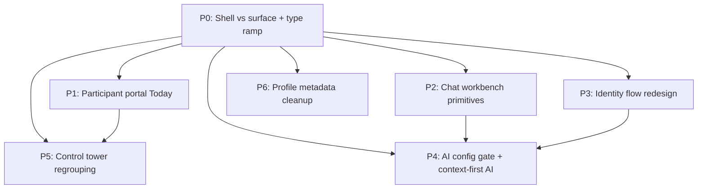

# Conference Design Response · Claude Sonnet 4.6 · 2026-04-30

## Source

Denne oppfoelgingsfilen dokumenterer den faktiske Claude-kjoeringen som ble
gjort etter at konferanseflatene i `Binding` og `CellScaffold` var capturet.

Kanoniske artefakter:

- handoff-pakke: `/tmp/conference-design-handoff-20260430`
- prompt: `/tmp/conference-design-handoff-20260430/CLAUDE_PROMPT.md`
- raa Claude-respons: `/tmp/conference-design-handoff-20260430/CLAUDE_RESPONSE.md`
- persistert Claude-respons:
  `/Users/kjetil/Build/Digipomps/HAVEN/CellProtocolDocuments/Deliverables/Conference_Claude_Redesign_Direction_2026-04-30.md`

Faktisk sendeform til Claude desktop:

- `claude-contact-sheets/binding-sheet.png`
- `claude-contact-sheets/cellscaffold-surface-sheet.png`
- `claude-contact-sheets/cellscaffold-route-sheet.png`

Viktig presisering sendt sammen med bildene:

- `cellscaffold/surface-viewports/` er kanonisk skeleton-GUI
- `cellscaffold/route-viewports/` er wrapper-/preview-kontekst

Merknad om verktoy:

- HAVENAgentD var ikke tilgjengelig i denne Codex-verktoeykassen.
- Fallbacken som faktisk ble brukt var Claude desktop + lokal GUI-automatisering
  + automatisk uthenting fra Claude sin lokale cache.

## Claude Main Direction

Claude sin hovedtese var at arkitekturen allerede vet hva produktet er, men at
UI-en enda ikke lar brukeren kjenne den samme strukturen tydelig. Forslagene
samler seg rundt disse punktene:

- posisjon foer handling: rolle, kontekst og "hva er live naa" maa vaere
  tydelig foer en ber brukeren handle
- delt virkelighet maa synes: organizer-/participant-kryssende traader,
  handoffs og tilganger maa markeres visuelt, ikke bare ligge i metadata
- infrastruktur maa forsvinne for deltakere: modellvalg, skeleton-oppsett,
  API-konfigurasjon og challenge-state skal vaere operator- eller admin-stoff

## Proposed Surface Model

Claude grupperer produktet i sju flater, tre personanivaaer og to
tverrgaende lag:

- public: public landing + profile viewer
- participant: portal dashboard, chat workbench, profile editor, AI workspace
- organizer: control tower
- identity layer: orthogonal bootstrap-flyt, ikke en langlivet hovedflate
- AI layer: kontekstuell modus, ikke primaert en separat deltakerflate

Dette matcher godt med observasjonen om at `CellScaffold`-wrapperne ikke er den
egentlige GUI-sannheten. Claude sin shell-vs-surface-tenkning passer godt med
at skeleton-flaten boer vaere sannheten, mens host-/preview-krom rundt den boer
trekke seg tilbake visuelt.

## Strong Fits For HAVEN

Disse forslagene ser ut til aa passe godt med baade handoff-bildene og
arkitekturen vi har naa:

- tydelig shell/surface-separasjon mellom host-krom og faktisk konferanseflate
- felles typografisk skala og tydeligere CTA-hierarki paa tvers av Binding og
  CellScaffold
- rollebadges i traader: `Participant`, `Organizer`, `System`
- boundary-rule i delte traader der delt synlighet faktisk begynner
- participant-portalens `Today`-fane som en reell "next step"-flate i stedet
  for et count-dump
- fullflate-tenkning for chat workbench naar en traad er aapen
- operator-gating av AI-konfigurasjon i stedet for deltaker-eksponert
  konfigurasjon
- en kilde til sannhet for profilens audience/privacy-state per flate

## Suggestions That Need Validation

Flere av Claude sine sterke forslag maa valideres foer de behandles som
implementeringsordre:

- `Run / Build / Review` i control tower kan vaere riktig, men kan ogsaa vaere
  for aggressiv sammenklapping hvis de elleve tabs faktisk speiler ekte
  konferansearbeid
- identitetsflyten som femtrinns wizard fungerer bare hvis retry, expiry og
  flere samtidige challenges har tydelige recovery-paths
- deltaker-AI som rent inline-modus i portal/chat kan vaere riktig UX, men er
  fortsatt en produktbeslutning og ikke bare en visuell refaktor
- portal-headerens count-cluster boer flyttes bare hvis de samme tallene ikke
  er lastbaerende andre steder
- norsk copy + engelsk struktur betyr at nye komponentbredder maa valideres
  mot minst to spraklige tekstlengder fra dag null

## Claude Priorities

Claude sin anbefalte rekkefolge var:

1. shell/surface-visual separation
2. typografisk token-ramp
3. felles rollebadge + boundary-rule primitives
4. `Today`-refaktor i participant-portal
5. fullflate chat workbench + rikere traadnoder
6. identity wizard
7. operator-gated AI workspace
8. control tower-omgruppering
9. profilflate-opprydding

## Recommended HAVEN Readout

Hvis vi skal bruke Claude-responsen som styringssignal og ikke bare som
inspirasjon, virker dette som den tryggeste tolkningen:

1. Start med token- og hierarkiendringer som ikke endrer surface contracts.
2. Gjennomfoer shell/surface-separasjon foerst i `CellScaffold` sine
   kanoniske `surface-viewports/`, deretter i `Binding`-hosten.
3. Bygg rollebadge og boundary-rule som primitive komponenter foer vi endrer
   thread-layoutene.
4. Refaktorer participant-portalens `Today`-flate foer vi flytter AI eller
   control-tower-nav.
5. Valider identity wizard og control-tower-gruppering mot faktisk
   operasjonsflyt foer vi binder oss til en ny IA.

## Risk Notes Worth Preserving

Disse Claude-risikopunktene boer beholdes eksplisitt i videre designarbeid:

- Binding-krom kan vaere funksjonelt lastbaerende selv om det ser visuelt tungt
  ut
- participant-headerens count-blokk kan vaere gjenbrukt andre steder
- AI-konfigurasjon maa ha en tydelig operatorflate foer den skjules for
  deltakere
- wizardifisering av identity-link maa ikke skjule tilstander uten recovery
- control-tower-tabber kan speile reell arbeidskompleksitet
- i18n-copy kan knekke layout hvis vi designer kun rundt norsk tekstbredde

## File References

- raa Claude-markdown: `/tmp/conference-design-handoff-20260430/CLAUDE_RESPONSE.md`
- persistert Claude-markdown:
  `/Users/kjetil/Build/Digipomps/HAVEN/CellProtocolDocuments/Deliverables/Conference_Claude_Redesign_Direction_2026-04-30.md`
- handoff-dokumentasjon:
  `/Users/kjetil/Build/Digipomps/HAVEN/CellProtocolDocuments/Deliverables/Conference_Design_Handoff_2026-04-30.md`
- promptdokumentasjon:
  `/Users/kjetil/Build/Digipomps/HAVEN/CellProtocolDocuments/Prompts/Claude_Conference_Design_Review_2026-04-30.md`
