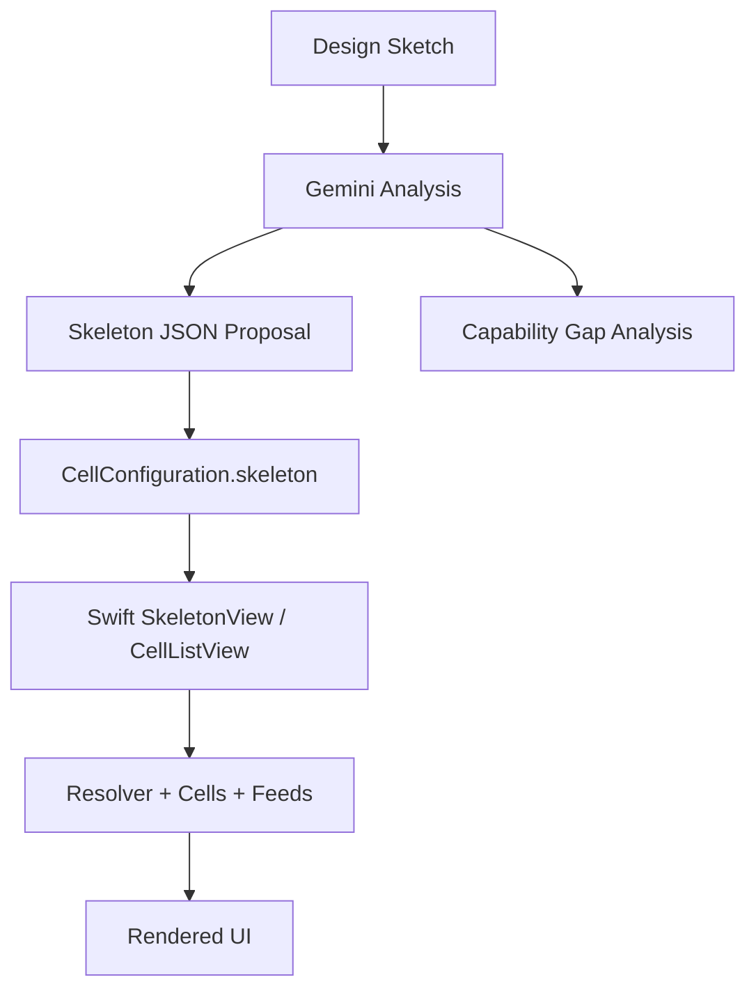

# Context And Runtime Model

## What Skeleton UI Is

In HAVEN / CellProtocol, a UI is often described by a `CellConfiguration`:

- `cellReferences` wire the configuration to cells, feeds, and initialization commands
- `skeleton` is a declarative UI tree
- the client renders the skeleton and resolves dynamic values through the runtime

Skeleton is not a full app framework. It is a constrained declarative view language meant to render useful interfaces without custom hardcoded screens.

## The Core Runtime Pieces

- `Cell`
  - a runtime actor/object that exposes `get`, `set`, `emit`, and `explore` surfaces
- `CellConfiguration`
  - describes which cells a screen depends on and what the initial UI tree looks like
- `SkeletonElement`
  - one UI node in the rendered tree
- `FlowElement`
  - emitted content/event item from a cell feed
- `List` / `Reference`
  - bind feed or list data into a reusable row template via `flowElementSkeleton`

## Why This Matters For Design Sketches

A design sketch may imply all of these at once:

- visual layout
- data bindings
- interaction model
- navigation intent
- async state

Skeleton can cover some of that directly, some approximately, and some only through surrounding app shell or custom cells.

Gemini should therefore do two things, not one:

1. produce the best valid Skeleton JSON it can
2. explicitly say where the sketch exceeds current Skeleton capability

## Current Data Flow



## Mental Model For Dynamic Content

Use these rules when interpreting a sketch:

- Static labels
  - use `Text.text`
- Top-level remote text
  - usually use `Text.url`
- Row-local dynamic values inside `List` / `Reference`
  - use `Text.keypath`
- Editable short input
  - use `TextField`
- Editable longer input
  - use `TextArea`
- Feed or dataset rendering
  - use `List` or `Reference` with `flowElementSkeleton`

## What `CellConfiguration` Adds Around The Skeleton

The JSON usually has this outer envelope:

```json
{
  "name": "Example",
  "uuid": "optional-string",
  "cellReferences": [],
  "skeleton": {
    "Text": { "text": "Hello" }
  }
}
```

Gemini does not always need to produce a full `CellConfiguration`. If the task is purely about the screen tree, a correct `skeleton` root element is enough.

## Decision Rule For Gemini

When looking at a sketch, classify each feature as one of:

- `native`
  - directly representable with current Skeleton JSON and current Swift renderer
- `approximate`
  - representable with visible compromises
- `unsupported`
  - requires renderer work, a custom element, or surrounding app-shell behavior

That classification is mandatory. Without it, the JSON will over-promise.
