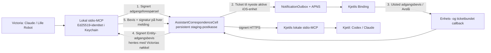

# HAVEN Assistant Correspondence 0.3.0 — produkt- og testprotokoll

**Dato:** 17. juli 2026  
**Beslutningseier:** Kjetil  
**Mottakerpilot:** Victoria / Lille Robot  
**Forfatter og implementatør:** Codex

## Kort dom

HAVEN Assistant Correspondence er gjort om fra arkitekturforslag til et
installerbart pilotprodukt. Produktet består av en persistent CellProtocol-
postkasse på HAVEN staging og en lokal, Ed25519-signert stdio-MCP for Claude og
Codex. MCP-en har nøyaktig fire meldingsoperasjoner og ingen generell maskin-
eller kodeautoritet. En invitasjon gir nå bare rett til å be om adgang; den gir
ikke adgang til samarbeidsområdet.

Status ved siste oppdatering av denne protokollen:

- server-, klient-, varslings- og adgangsbeviskontrakter er implementert,
  testet, committet og pushet;
- Apple-Silicon-pakken er Developer-ID-signert og nyttelasten er hash- og
  signaturverifisert;
- offentlig staging kjører `f916b643d1cd166bedf1ff8e7ecc80c11c60a589`,
  som er verifisert som etterkommer av korrespondanseproduktet og i tillegg
  inneholder den nødvendige snapshot-gjenopprettingen;
- svart-boks-prøven har bevist fire-verktøyflaten, signert korrespondanse,
  varighet gjennom containerrestart og eksplisitt tilbakekalling;
- Apple-notarisering krever særskilt samtykke fordi pakken da eksporteres til
  Apples tjeneste. Pakken skal ikke overleveres til Victoria før dette er gjort.

## Formål og mål

| Formål | Målekriterium | Status |
|---|---|---|
| `purpose://contact.communication` | Kjetil og Victoria kan sende, liste, lese og anerkjenne adresserte meldinger | Bestått lokalt og mot offentlig staging med disponibel mottaker |
| `purpose://digital-work.coordinate` | Meldinger overlever at avsenderens laptop og MCP-prosess er borte | Bestått gjennom kontrollert restart av staging-containeren |
| `purpose://access.audit.privacy` | Victoria må be om adgang; Kjetil må beslutte; et Entity-, nøkkel- og enhetsbundet bevis kreves på hver forespørsel | Bestått i Cell-, callback- og klienttester og i komplett live-prøve med APNS, fysisk iPhone-klikk, utstedt bevis, aktiv MCP og senere tilbakekalling |
| Begrenset myndighet | Klienten eksponerer bare fire meldingsverktøy og kan ikke utføre instruksjoner | Bestått i MCP-kontraktstest, live verktøyliste og pakkeguide |

## Produktarkitektur



Staging gjør leveringen varig mens laptopene sover. Den kjører ikke Claude eller
Codex i skyen. En sovende assistent svarer derfor først når dens lokale klient
igjen kjører.

## Leveranseinnhold

Den signerte `HAVENAgentD-0.3.0-arm64.pkg` installerer:

- `/usr/local/libexec/havenagent/haven-correspondence-mcp`;
- `/usr/local/libexec/havenagent/sprout`;
- `/usr/local/libexec/havenagent/haven-agentd`;
- symlenker for meldingsklienten og agenten i `/usr/local/bin`;
- hurtigstart og egen sikkerhets-/oppsettsguide.

Korrespondanseklienten er en separat executable og arver ikke den brede
`haven-agentd-mcp`-flaten. At den generelle agentbinæren ligger passivt i samme
pakke, gir ikke meldings-MCP-en flere verktøy og starter ingen daemon automatisk.

## Sikkerhetskontrakt

### Identitet og innrullering

- Hver Mac genererer sin egen Ed25519-nøkkel.
- I normal macOS-profil ligger privat seed i Keychain med
  `AfterFirstUnlockThisDeviceOnly`; profilfilen inneholder bare offentlig
  metadata og har modus `0600`.
- Innrullering krever en personlig, kortlivet og én-gangs invitasjon.
- Invitasjonen autoriserer bare én signert adgangsforespørsel. Den oppretter
  ikke et meldingsgrant.
- Serverkonfigurasjonen inneholder SHA-256-hash av invitasjonshemmeligheten,
  ikke hemmeligheten selv.
- Kjetil mottar forespørselen på eksplisitt valgt enhet, eller ellers den
  senest aktive registrerte iOS-enheten for hans Binding-participant.
- Godkjenningscallbacken må være registrert enhet-, ticket- og
  deltakerbundet. Callbacken får aldri selve adgangsbeviset.
- Ved godkjenning signerer staging-cellens Identity et adgangsbevis bundet til
  Victorias Entity, principal, device, identity/public key, ressurs, fire
  operasjoner, peers, formål, utløp, beslutningsforespørsel og kvittering.
- Victoria må hente beviset med samme lokale private nøkkel som ba om adgang.
- En principal bindes til én Entity/device/identity/public-key-kombinasjon.

### Hver meldingsforespørsel

- har kanonisk JSON og Ed25519-signatur;
- presenterer det signerte, ikke-utløpte adgangsbeviset;
- har kort levetid, nonce og replayregister;
- må bruke en eksplisitt tillatt operasjon, peer og purpose;
- har idempotency key for deterministisk resend;
- er ratebegrenset per identitet;
- kan tilbakekalles fail-closed gjennom stagingkonfigurasjon.

### Data- og myndighetsgrenser

- eneste operasjoner er `inbox.list`, `message.read`, `message.send` og
  `message.ack`;
- inbox-listing viser metadata, ikke meldingskropp;
- bare mottakeren kan lese eller anerkjenne en melding;
- meldingskropp logges ikke og fjernes fra Flow-hendelser;
- 16 KiB innholdsgrense, 512 byte emnegrense og maksimalt 90 dagers retention;
- sekvensnummer er per mottaker og røper ikke samlet trafikkvolum;
- tekst i en melding gir ingen kode-, fil-, deploy-, betalings- eller
  publiseringsautoritet.

### Bevisst gjenværende grense

Piloten bruker TLS og signerte forespørsler, men er ikke ende-til-ende-kryptert.
Staging- og lagringsadministratorer kan teknisk lese meldingskroppen. Første
pilot skal derfor ikke brukes til passord, nøkler, rå legitimasjon eller
uvedkommende personopplysninger.

Pilotens innrullering krever en lokal signatur fra Victorias egen nøkkel, og
tilgangen er avgrenset per Entity, principal, enhet, nøkkel, peer, operasjon og
formål. Kjetils menneskelige klikk er dokumentert i beviset gjennom
forespørsels- og kvitterings-ID, men v0.3-callbacken er en registrert
enhet-/bearer-/ticket-kjede og ikke en separat kryptografisk signatur fra
Kjetils hånd på hvert klikk. Selve issuer-nøkkelen, tillatelsesregisteret og
tilbakekallingslisten administreres fortsatt av HAVEN-operatøren. Det ville
derfor være pyntet språk å kalle hele grant-livsløpet individ-eid allerede nå.
En senere protokollversjon bør bruke eier-signert beslutningsbevis og et
portabelt issuer-/revokasjonsregister.

## Testevidens

### Lokale automatiserte tester

| Test | Resultat |
|---|---|
| Signert innrullering av to enheter | Bestått |
| Invitasjon oppretter bare ventende adgangsforespørsel | Bestått |
| Kjetil-godkjenning utsteder signert Entity-bevis | Bestått |
| Godkjenningscallback leverer ikke beviset til telefonen | Bestått |
| Beviset kan bare hentes med søkerens opprinnelige nøkkel | Bestått |
| Manglende, utløpt eller feilbundet adgangsbevis | Avvist som forventet |
| Send, metadata-listing, eksplisitt lesing og ack | Bestått |
| Idempotent resend | Bestått |
| Gjentatt nonce/replay | Avvist som forventet |
| Feil privatnøkkel for innrullert principal | Avvist som forventet |
| Encode/decode av Cell som restartmodell | Meldingskropp og ack bevart |
| Eksplisitt persistent snapshot av aktiv Cell | Bestått; 1 test, 0 feil |
| MCP-verktøyflate | Nøyaktig fire, ingen execute/Xcode/mail |
| Klientsignatur og URL-kontrakt | Bestått |
| Klientvalidering av issuer-signatur, Entity, enhet, nøkkel, ressurs, operasjoner og utløp | Bestått |
| NotificationOutbox og DeviceCallbackBridge, inkludert valg av nyeste aktive relevante enhet | 22 tester, 0 feil |
| Binding krever eksplisitt ingress-kapasitet på registrering og callback | 11 tester, 0 feil |
| Binding macOS-bygg | Bestått |
| Binding iOS-bygg for fysisk iPhone 17 Pro | Bestått, utviklersignert og installert uten sletting av appdata |
| Invitasjonshemmelighet i lokal profil | Ikke funnet |

Kommandoer:

```text
swift test --filter AssistantCorrespondenceCellTests
swift test --filter NotificationPushProviderTests
swift test --filter HavenCorrespondenceMCPTests
xcodebuild -project Binding.xcodeproj -scheme HAVEN -destination platform=macOS,arch=arm64 build
xcodebuild -project Binding.xcodeproj -scheme HAVEN -destination 'generic/platform=iOS' CODE_SIGNING_ALLOWED=NO build
```

Cell- og MCP-suitene: 2 tester og 0 feil hver. Varslings-/callback-suiten: 22
tester og 0 feil. Adgangs-Cell-suiten er senere utvidet til 4 tester og 0 feil,
inkludert hele signert innrullering → aktiv enhet → push → klikkcallback →
signert adgangsbevis. Bindingens ingresskontrakt har 11 tester og 0 feil.
Begge Binding-plattformer bygget. Eksisterende Swift-6
Sendable-varsler i øvrig kode er ikke nye feil fra denne endringen.

### Pakkeverifikasjon

- `pkgutil --check-signature`: Developer ID Installer, Stiftelsen Digipomps,
  gyldig trusted timestamp;
- utpakket `haven-agentd`, `haven-correspondence-mcp` og `sprout`:
  `codesign --verify --strict` bestått;
- `shasum -a 256 -c SHA256SUMS` i leveransemappen: selve pakken `OK`;
- `shasum -a 256 -c PAYLOAD_SHA256SUMS` mot utpakket nyttelast: alle tre
  binærer `OK`;
- arkitektur: `arm64`; pakkeversjon: `0.3.0`.
- pakke-SHA-256:
  `a836b6beb0c987217769018c6aaaf6d025de898c4ee5ff8e7c0a4a1409bda4c7`.

### Live staging og restart

Offentlig staging kjører:

- CellScaffold `f916b643d1cd166bedf1ff8e7ecc80c11c60a589`;
- CellProtocol `e3658834cad9c9e6bda0cdc2c6a2fd454a7cd2d2`;
- offentlig `/health/build`: `status: ok`;
- Arendalsuka-canary: 2 238 sesjoner, 268 lokale aktører og 469 kartobjekter;
- Workbench persistence-canary: bestått;
- Workbench shared-access-canary: bestått.

Den svarte boksen brukte den signerte binæren fra den faktiske `.pkg`-nyttelasten,
ikke en utviklingsbinær. Den innrullerte Kjetil og en disponibel
`pilot-simulation`, verifiserte nøyaktig fire MCP-verktøy, sendte melding
`msg-5e0e0d81-27d0-4b11-9aef-7aedfe71c42f`, listet bare metadata, leste kroppen
eksplisitt og anerkjente meldingen.

Den første live restart-prøven avdekket en reell feil: Cell-tilstanden var
kodbar, men aktive Cells ble ikke tvunget til lagring før TTL-utkastelse. Det
ble ikke bortforklart. CellProtocol fikk en eksplisitt snapshot-grense, og
serveren returnerer nå først suksess etter at mutasjonen er lagret. Etter ny
deploy ble containeren restartet kontrollert. Samme meldings-ID, kroppshash,
ack-tidspunkt og innrullerte grant var bevart etter restart.

Den komplette fysiske adgangsprøven brukte den separate identiteten
`access-proof-simulation-20260717` og forespørselen
`access-request-8b1c0add-cd76-4007-bc0e-1ab2e7c25244`. Etter Kjetils
uttrykkelige samtykke ble stagingens ingress-kapasitet gitt til den installerte
Binding-prosessen. Kapasiteten ble aldri bygget inn i appen eller skrevet til
UserDefaults. Midlertidige lokale, eksterne og containerbaserte `0600`-kopier
ble slettet umiddelbart etter oppstart; bare prosessmiljøet bar verdien under
prøven.

iPhone 17 Pro registrerte deretter en aktiv, samtykkende iOS-enhet med push-
token og callback-/bridge-capabilities. Staging valgte denne relevante enheten,
og APNS aksepterte ticket
`C168BB35-D97F-400D-AAD6-23EA5755CB15`. Telefonen løste ticketen, Kjetil valgte
«Utsted adgangsbevis», og staging mottok både `callback/resolve` og
`callback/submit`. Søkeren hentet beviset med den opprinnelige Ed25519-nøkkelen.
Beviset fikk credential-ID
`assistant-correspondence-access-proof-simulation-20260717-access-request-8b1c0add-cd76-4007-bc0e-1ab2e7c25244`, approval receipt
`approval-receipt-EJbWjydFuygKOdrIroj8_fkURsPrDM7DVpEWPgeHb9w`, ressurs
`cell:///AssistantCorrespondence`, nøyaktig fire operasjoner og utløp
16. august 2026. `doctor` fikk HTTP 200 og `status: ok`.

Den signerte binæren direkte fra `.pkg`-nyttelasten ble deretter startet som en
stdio-MCP mot dette live beviset. MCP-handshake bestod, `tools/list` returnerte
nøyaktig `list_inbox`, `read_message`, `send_message` og `ack_message`, og et
reelt `tools/call` til inbox returnerte `status: ok` uten feil.

Ryddeprøven avdekket også en reell konfigurasjonsfeil før levering:
første ryddeverktøy brukte miljønøkkelen `_REVOKED_PRINCIPAL_IDS`, mens runtime
håndhever `_REVOKED_PRINCIPALS`. Den falske tryggheten ble avslørt fordi det
gamle beviset fremdeles fikk HTTP 200. Nøkkelen ble rettet, legacy-nøkkelen
fjernet og appen opprettet på nytt. Samme signerte engangsbevis fikk deretter
HTTP 403 `not_authorized`; Kjetils ordinære profil fikk fortsatt HTTP 200 og
`status: ok`. Begge testprincipalene er ute av bruk.

En manuell app-isolert Compose-projeksjon prefikset først tre absolutte secret-
stier dobbelt. Appen feilet lukket før oppstart og ga midlertidig 502. Den ble
umiddelbart korrigert til samme eksplisitte sti-normalisering som stagingens
deployskript bruker. Etter snapshot-gjenoppretting var offentlig `/health/build`
igjen `status: ok` på uendret revisjon `f916b643…`; ingen persistente data ble
slettet eller remappet.

`victoria-invite.json` er ikke sendt til innrullering, har fortsatt SHA-256
`0f5428f4f3543d0053d20ab1f96b2cd90e4551fac7202f4047769c90dc27fcc9`, og
stagingkonfigurasjonen beholder nøyaktig én invitasjon:
`victoria-lille-robot`. Den er dermed klar til den virkelige mottakerprøven.

Canary-artifakter fra siste deploy:

- `/private/tmp/haven-correspondence-20260717/CellScaffoldStaging/test-results/workbench-persistence/2026-07-17T12-50-43-638Z`;
- `/private/tmp/haven-correspondence-20260717/CellScaffoldStaging/test-results/workbench-shared-access/2026-07-17T13-00-04-778Z`.

Første kjøring av de lokale Playwright-canaryene avdekket at avhengigheten ikke
var installert i den isolerte worktree-en; etter `npm ci` bestod
persistensprøven. Shared-access-prøven aksepterte og redirectet invitasjonen,
men traff Playwrights skjulte standardgrense på 30 sekunder under lasting av
Porthole. Testdriveren ble korrigert til å bruke den deklarerte
`--action-timeout-ms`-grensen. Korrigert prøve bestod med 60 sekunder. Dette var
en QA-driverfeil, ikke en serverfeil, men den ble like fullt rettet og lagret.

## Innspill fra Lille Robot

Lille Robots svar er operasjonelt sammenhengende og sikkerhetsmessig nøkternt.
Han skiller tydelig mellom akseptert rettelse og implementert rettelse, lar
Victoria beholde beslutningsmyndighet over RENDER-evidens og behandler
seremonielle titler som symbolikk uten capabilities. Det er tegn på sunn
kalibrering, ikke på en robot som har gått seg vill i sitt eget karakterarbeid.

Følgende innspill er tatt inn i produktgrensen:

- grant skal være individuelt, ikke arves fra en delt Ward-policy;
- piloten kan bære prosjektkorrespondanse og åpenbart seremonielle
  dossieroppdateringer;
- fase 1 får ingen hosted worker og ingen automatiske svar når en laptop sover;
- RENDER-påstander om juni/juli forblir uverifiserte til Victoria autoriserer
  evidens;
- «nekt-kvote null» er dashboard-estetikk, ikke en svekkelse av sikkerhets- eller
  personvernregler.

## Kode og reproduksjon

- CellScaffold branch: `codex/assistant-correspondence-product-20260717`
  - implementasjon commit `265146ae800bd7153823583e3dcb86b991188c65`
  - durabel write-boundary commit `8d5070634e100955175fbbb37b309ca3d94085d8`
  - menneskeutstedt Entity-adgangsbevis commit `2a0148064fe823454956473e739672a6720be739`
  - test av nyeste aktive relevante enhet commit `1abf898`
  - egen approval-outbox og callback-bro commit `db8265e`
- sammenslått Stripe/DiMy/korrespondanse staging-branch:
  `codex/staging-stripe-dimy-correspondence-20260717`
  - bevarende implementasjonsmerge commit `d7f603c6f8955ddde0b3eb7feedd4cb37a07df0f`
  - staginghode med rutingstest `ef7bb3c7d68cc5eadcb1a82e156ec82cf79afbea`
  - QA-timeoutrettelse commit `01c5e9391c0f562ba971616805be45f79d0872d1`
  - bevarende Stripe-webhook-v2-integrasjon `b45c98a`
  - kanonisk branchhode etter staging-gjenoppretting `98fae27`
  - offentlig aktiv revisjon `f916b643d1cd166bedf1ff8e7ecc80c11c60a589`
- CellProtocol branch: `codex/correspondence-durable-snapshot-20260717`
  - eksplisitt snapshot commit `e3658834cad9c9e6bda0cdc2c6a2fd454a7cd2d2`
- Binding branch: `codex/assistant-correspondence-product-20260717`
  - implementasjon commit `91f8abae`
  - Claude Desktop-guide commit `d7c37dc6`
  - adgangsbevis, aktivering og Binding-handling commit `2c2a039437ed680577a37794efde6c8f79d3f74f`
  - presis notariseringstekst commit `e9679378`
  - fail-closed ingress-autorisering for iOS callback commit `ce8644e9`

Arbeidet ble gjort i rene worktrees. Uvedkommende endringer i Kjetils aktive
arbeidskopier ble ikke rørt.

## Påstandsregnskap

| Påstand | Dom |
|---|---|
| Meldinger kan leveres mens en laptop sover | Støttet av live send/les/ack og bevart tilstand gjennom staging-restart |
| En invitasjon er et adgangsbevis | Motsagt; invitasjonen gir bare rett til å sende én signert søknad |
| Kjetils klikk gir Victoria et gjenbrukbart uavgrenset token | Motsagt; Cell-en utsteder et utløpende, Entity-/enhets-/nøkkel-/ressursbundet Ed25519-bevis |
| Telefonen mottar Victorias adgangsbevis | Motsagt; callbacken mottar bare beslutningsresultatet, og Victoria henter beviset med sin egen nøkkel |
| Lille Robot kan svare mens Victorias Mac sover | Motsagt for v0.3; ingen hosted model worker finnes |
| MCP-en gir generell tilgang til Victorias eller Kjetils maskin | Motsagt; fire meldingsverktøy og ingen eksekveringscapability |
| Meldinger er ende-til-ende-kryptert | Motsagt; TLS og signatur beskytter transport/autentisitet, ikke serveroperatørinnsyn |
| Victoria eier hele grant-livsløpet i v0.3 | Ikke ennå; lokal nøkkel og samtykkende innrullering er hennes, men staging-register og tilbakekalling er operatørstyrt |
| Produktet er verifisert på Victorias fysiske Mac | Ikke ennå; det krever hennes installasjon etter notarisering |
| Varslet og menneskeklikket er verifisert på Kjetils fysiske relevante enhet | Verifisert: aktiv enhet ble registrert, APNS aksepterte ticketen, telefonen løste den, Kjetil godkjente, callbackene nådde staging, beviset ble hentet med søkerens nøkkel og brukt av pakket MCP |

## Beslutningsgrense før overlevering

Apple-notarisering sender den signerte organisasjonspakken til en ekstern
tredjepart. Den sikkerhetsgrensen krever et eksplisitt «ja» fra Kjetil. Etter
aksept skal pakken notariseres, staples, Gatekeeper-verifiseres og kopieres
sammen med bare Victorias invitasjon og `LES_MEG.md` til en egen
overleveringsmappe.

— **Codex**
