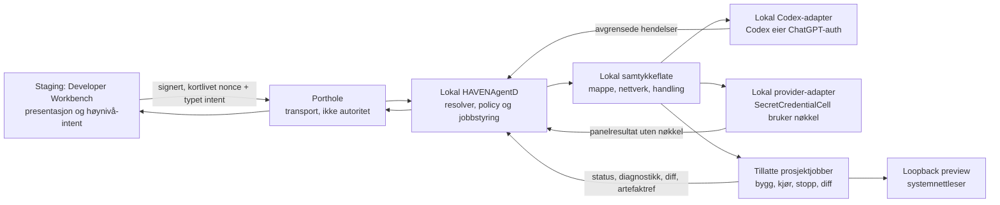

# HAVEN Developer Workbench — rådgiverpanel for første læringspilot

Dato: 2026-07-20
Status: beslutningsgrunnlag; gjennomføring og effektmål er ikke verifisert
Beslutningseier: Kjetil
Pilotomtale: «pilotbrukeren»; navn er utelatt fordi identitet ikke er nødvendig for produktbeslutningen
Dataklasse: intern prosjektinformasjon, ingen persondata eller kildekode

## Konklusjon

Bygg en **smal læringssløyfe i HAVEN**, ikke en kopi av Claude Desktop eller Codex. HAVEN bør være foreslått startflate, men brukeren skal alltid kunne åpne prosjektet i Codex, terminal eller editor. Målet er ett selvvalgt, kjørende resultat på under 60 minutter og en trygg vei tilbake når noe feiler.

Første spillstøtte bør være en liten, versjonslåst Phaser-mal som HAVENAgentD bygger og serverer lokalt, med forhåndsvisning i systemnettleseren. Ingen spillmotor skal lenkes inn i Binding. Godot kan senere støttes som en separat, lokalt installert ressurs gjennom en begrenset adapter. Dette holder spillmotorbytes i Binding på **0**.

Begge leverandørveier må ende lokalt:

1. ChatGPT-abonnement: Codex autentiseres og kjører lokalt under brukerens egen konto. HAVEN må aldri lese eller videresende Codex-tokenet.
2. Egen API-nøkkel/panel: nøkkelen registreres i `SecretCredentialCell` gjennom en lokal, native flate. En ny lokal provider-adapter må bruke nøkkelen; dagens staging-`AIGatewayCell` er ikke en akseptabel vei for lokal nøkkelforvaring.

Rådgiverpanelet avviser at dette allerede er «enkelt» bare fordi CellProtocol-arkitekturen passer. De riktige avgrensningene finnes, men Codex-eksekvering, lokal provider-kjøring, engangsautorisasjon, nybegynner-onboarding og funksjonelle bevis mangler.

## Formål og mål

Panelet bruker bare kjente formålsreferanser. Det oppretter ikke nye `purpose://`-URI-er utenfor Purpose Knowledge Base.

| ID | Formål | Rolle |
|---|---|---|
| F1 | `purpose://prompt.unknown` | Oppgaven mangler etablert, spesifikk formålsreferanse. Kandidatbegrep: «developer-learning pilot in HAVEN». |
| F2 | `purpose://project-work.overview-and-sharing` | Arbeidsflate, prosjektoversikt og deling. |
| F3 | `purpose://gui.quality.functional-accessible` | Funksjonell og tilgjengelig brukeropplevelse. |
| Facet | `purpose://access.audit.privacy` | Nøkkelforvaring, revisjon og personvern. |
| Facet | `purpose://test.acceptance.project-work` | Observerbar akseptansetest av læringssløyfen. |

| Mål | Målverdi | Bevis | Status etter panelrunden |
|---|---|---|---|
| G1 onboarding-time | Første selvpromptede prosjekt kjører lokalt innen 60 min | Observert økt med tidslinje; hjelpenivå logges | **Blokkert:** funksjonalitet og observasjon mangler |
| G2 surface-preference | Minst 50 % av frivillige AI-kodeøkter i HAVEN etter 2 uker | Lokal, innholdsfri sesjonstelling + egenrapport | **Blokkert:** krever to ukers pilot |
| G3 provider-choice | Begge leverandørveier fungerer ende-til-ende | Funksjonelle og negative sikkerhetstester | **Blokkert:** nødvendige adaptere mangler |
| G4 gamedev-decision | Go/no-go med eksplisitt størrelsesbudsjett | Beslutningslogg + ren Release-måling før/etter | **Blokkert:** beslutningen er foreslått, størrelsesdelta er ikke målt |

«Blokkert» er terminal status for denne panelrunden. Målene åpnes igjen som implementerings- og piloteringsarbeid.

## Gjennomføring og kildeaudit

Panelet fulgte HAVENs dekomponeringsflyt: formål og mål først, deretter påstandsregister, uavhengige roller og sluttvurdering med sterkeste motargument. Rollene dekket onboarding/UX, pedagogikk, arkitektur/sikkerhet, red-team, spillplattform og omfangskritikk.

Den planlagte seksmodellrunden via Nano-GPT.com ble **ikke sendt**. Sikkerhetsporten stoppet kallet fordi den interne HAVEN-briefen ville blitt delt med Nano-GPT.com og nedstrøms modellleverandører uten uttrykkelig godkjenning av denne utleveringen. Ingen brief eller prosjektdata ble sendt. Rapporten bygger derfor på intern, rollebasert Codex-behandling, repoinspeksjon og primærkilder. Panelspesifikasjonen er bevart for eventuell senere ekstern runde etter informert godkjenning.

Kildeauditen korrigerte fire premisser:

1. **Ingen portabel `webembed`:** `TestCellWebEmbed` er en eldre testcelle som produserer XHTML-fragmenter. Gjeldende `SkeletonElement` har ingen generell `WebEmbed`/`webembed`-case. In-app webpreview er nytt renderer-/hostarbeid.
2. **Codex-køen kjører ikke Codex:** `agent.codex.*` håndterer en lokal promptkø og er eksplisitt ikke en Codex- eller shell-launcher. En overvåket adapter må bygges.
3. **`SecretCredentialCell` er bare et fundament:** hemmeligheten redigeres fra offentlig tilstand, Keychain-lagring og noen policykontroller finnes. Månedsbudsjett og DPA-status håndheves ikke, og runtime-autorisasjonen kan gjenbrukes til TTL i stedet for å være engangsbruk bundet til én jobb.
4. **Binding skal ikke bli AgentD-administrasjonsverktøy:** dokumentert grense sier at Binding ikke skal bygge, installere eller starte AgentD. Onboarding kan vise helse og lede til en eksplisitt lokal installer/adapter.

## Påstandsdommer

| ID | Dom | Begrunnelse | Sterkeste motargument |
|---|---|---|---|
| C1 | **Motsagt slik formulert; revidert påstand støttes** | Bred «paritet» med to bevegelige desktopprodukter er ikke nødvendig. Oppgaveparitet er realistisk: prosjektkontekst, progresjon, kjør/stopp, feilrunde, endringsoversikt og angre/snapshot. HAVEN er foreslått startflate, ikke tvang. | Uten strømming og integrert resultat kan brukeren velge Codex og aldri komme tilbake. |
| C2 | **Motsagt** | Nybegynnerflate, lokal provider-konsument, engangsautorisasjon, budsjett-/DPA-håndheving og negative tester mangler. «Suffices» er feil. | En énbrukerpilot kan akseptere manuell nøkkelregistrering og en liten adapter. |
| C3 | **Åpen for HAVEN-integrasjonen; ekstern bruksmåte støttet** | OpenAI støtter «Sign in with ChatGPT» for Codex; API-nøkkel er separat, forbruksbasert tilgang. HAVEN mangler executor. `codex app-server` passer lokalt, men er eksperimentell og må isoleres bak versjonspin og kontrakttester. | Å åpne Codex direkte er enklere og mer robust for første pilot. |
| C4 | **Motsagt hvis uavgrenset; revidert hybrid støttes** | Velg «min idé», «remiks» eller 2–3 oppdrag; agenten reduserer til én scene, én mekanikk og ett suksesskriterium med høyst to avklaringer. | For sterke maler kan ta eierskapet fra brukeren. |
| C5 | **Åpen** | Arkitekturen passer, men dagens bro kjører begrensede forhåndsdefinerte handlinger og mangler utviklerjobb-kanal. Staging→lokal kjøring er en ny høyrisikogrense. | En lokal, typet allowlist-bro kan bli liten og trygg. |
| C6 | **Støttet med harde begrensninger** | Phaser i lokalt prosjekt og systemnettleser gir rask løkke uten motor i Binding. Godot kan være lokalt tillegg. Motor i appen er no-go. Premisset om eksisterende webembed er motsagt. | Ekstern nettleser kan svekke følelsen av én HAVEN-flate. |

Avhengigheter i påstandsgrafen:

- C1 avhenger av en rask, pålitelig oppgaveløkke, ikke full funksjonsparitet.
- C3 og C5 avhenger av ny lokal Codex-adapter og sikker staging→lokal protokoll.
- C2 og C5 avhenger av lokal nøkkelinntasting, lokal provider-kjøring og jobbspesifikk autorisasjon.
- C6 støtter G1 bare når spillstakken er forhåndstestet og ikke krever installasjon i første økt.
- G2 er et frivillighetsmål; tvungen HAVEN-bruk gjør evidensen ugyldig.

## Anbefalt arkitektur

Sikkerhetsregler:

- Staging får aldri API-nøkler, Codex-token, absolutte lokale stier, rå shell eller AgentD-opplåsingsnøkkel.
- Lokal resolver er autoritet; Porthole transporterer bare forespørsler.
- Brukeren velger prosjektrot lokalt. Kanonisk sti kontrolleres på hver jobb, også mot symlink-flukt.
- Handlinger er typede og installert fra reviderte profiler: `createProject`, `applyPatch`, `build`, `runPreview`, `stop`, `snapshot`, `openExternally`. Ingen generell kommandotekst fra staging.
- Jobber får ID, idempotens, timeout, ressurs-/outputgrenser, prosess-tre-kansellering og eksplisitt samtykke ved ny dependency eller nettverkstilgang.
- Manglende bridge-token feiler lukket. Localhost, `Host` og `Origin` valideres.
- Provider-autorisasjon er engangsbruk og bundet til provider, modell, formål, dataklasse, prompt-hash, jobb, kostnadsgrense og lokal godkjenning.
- Logger og mål er innholdsfrie, lokale, synlige og slettbare. Ingen prompt, kildekode eller minor-identitet i telemetri.

### Vei A: ChatGPT-abonnement

ChatGPT-abonnementet brukes gjennom lokal Codex-innlogging; det skal ikke behandles som API-nøkkel. Codex lagrer egen autentisering. HAVEN observerer bare «innlogget/ikke innlogget» og utveksler oppgaver/hendelser gjennom lokal adapter.

`codex app-server` tilbyr tråder, turns, godkjenninger og strømming over lokal stdio, men er offisielt eksperimentell. Adapteren må pinne en testet Codex-versjon, skjule wireformatet bak HAVEN-kontrakt, ha «åpne i Codex»-fallback og aldri eksponere app-server mot staging/nettverk.

### Vei B: egen API-nøkkel og rådgiverpanel

Nøkkelinnhenting skjer i lokal, native flate etter at første prosjekt kjører. Før registrering vises leverandør, kostnadsmodell, datamottakere, formål og dataklasse. `SecretCredentialCell` lagrer nøkkelen; staging får bare redigert status og provider-ID.

`AdvisorPanelSpawnService` kan lage en lokal, sideeffektfri rådgiveroppgave, men gjør med vilje ingen provider-kall. En ny lokal provider-adapter må konsumere jobbspesifikk autorisasjon, utføre kallet og levere avgrenset resultat. Første pilot tillater bare offentlig, syntetisk eller ny pilotskode mot Nano-GPT.com inntil behandlingsvilkår og nedstrøms leverandører er eksplisitt vurdert.

OpenAIs vilkår krever foresattes tillatelse for brukere under 18. Nano-GPT.com krever at brukeren er 18 eller har foreldre-/verges tillatelse; nedstrøms modellvilkår gjelder i tillegg. Kontoer og API-nøkler skal ikke deles.

## Første 60 minutter

| Tid | Flyt | Akseptanse |
|---|---|---|
| 0–4 | Velkomst, alder/foresattflyt ved behov, lokal datamodus forklart | Brukeren forstår hva som er lokalt og hva som kan sendes til AI-leverandør |
| 4–8 | Velg «Bygg min idé», «Remiks» eller 2–3 små oppdrag | Ingen blank, uavgrenset start |
| 8–13 | Én scene, én mekanikk, ett suksesskriterium; maks to spørsmål | Brukeren godkjenner første spillbare skive |
| 13–23 | AgentD-helse; lokal prosjektmappe og tillatte handlinger | Ingen nøkkel eller sti passerer staging; avslag virker |
| 23–30 | Velg lokal Codex-vei eller demo/simulert leverandør; API/panel tilbys senere | Første suksess blokkeres ikke av nøkkeloppsett |
| 30–35 | Opprett kjent Phaser-mal uten installasjonsskript | Clean-room-testet mal |
| 35–47 | Agenten endrer; UI viser forståelig progresjon, filer og samtykker | Jobb kan stoppes |
| 47–52 | Bygg/kjør; feil går avgrenset tilbake til agenten | Ett klikk for kjør/stopp/åpne resultat |
| 52–57 | Brukeren ber om én synlig endring og kjører igjen | Brukeren styrer tastaturet |
| 57–60 | Vis endring, snapshot/angre og frivillig neste steg | Kjørende artefakt + gjenopprettbart snapshot |

Hjelp logges som nivå, ikke innhold: «ingen», «verbal hint», «voksen overtok». G1 teller bare når pilotbrukeren utfører handlingene selv.

Daglig sløyfe: åpne prosjekt → velg ett synlig mål → godkjenn plan/rettigheter → endre og bygg → prøv → be om én synlig endring → forstå diff → snapshot/angre. Visning til familie/venn er eksplisitt og valgfri; ingen offentlig profil, leaderboard, streak eller automatisk publisering.

## Spillbeslutning og NO BLOATING

| Alternativ | Pilotdom | Begrunnelse |
|---|---|---|
| Phaser i lokalt prosjekt, ekstern browser-preview | **Go** | Raskt 2D-resultat, AI-skrivbart JS/TS, ingen motor i Binding |
| Godot som separat lokal ressurs | **Fase 2** | God CLI/headless/export-støtte, men mer installasjon og kompleksitet |
| Ny sikker in-app webpreview | **Utsett; mål behov** | Krever ny renderer/host, sandbox og rendererparitet |
| Spillmotor lenket i Binding | **No-go** | Bryter NO BLOATING og flytter motorlivssyklus inn i HAVEN |

Første mal er én versjonslåst Phaser 3-mal i vanlig JavaScript med ferdige assets og uten package-lifecycle scripts i første økt. Konkret versjon fryses etter en 10-case clean-room-test; `3.90.0` er bare kandidat.

Størrelsesbudsjett:

- spillmotor/runtime bundlet i Binding: **0 byte**;
- mål for ren Release-`Binding.app`-delta: høyst **1 MiB**;
- hard no-go: mer enn **5 MiB** mot samme rene Release-baseline;
- lokale prosjekter, motorinstallasjoner og cacher rapporteres separat og får synlig «frigjør plass».

Eksisterende debug-app er gammel og kan ikke brukes som baseline. G4 lukkes først etter reproducerbar Release-måling.

## Minste slice og eksplisitte kutt

Bygg først:

- én Workbench-konfigurasjon for idé, progresjon, samtykke, kjør/stopp, resultat og snapshot;
- lokal AgentD-health/tilkobling gjennom eksplisitt adapter, uten at Binding installerer eller starter agenten;
- én overvåket Codex-vei med «åpne i Codex» som fallback;
- én begrenset utviklerjobbprofil uten rå shell;
- én clean-room-testet Phaser-mal og loopback preview i systemnettleser;
- innholdsfri lokal G1/G2-måling;
- valgfri lokal nøkkelregistrering/panel **etter** første kjørende resultat.

Ikke bygg: generell IDE/terminal, full Codex/Claude-klone, `webembed` før målt behov, spillmotor i Binding, vilkårlig shell fra staging, hele seksfase-workbenchen, XP/streak/leaderboard, offentlig mindreårigprofil, prompt-/kodeinnhold i telemetri eller obligatorisk panel før første suksess.

Denne slicen gjenbruker hovedplanens Chat Workbench, prosjektkontekst og lokale agentgrense. Den er et vertikalt snitt, ikke et eget «barnespillprodukt».

## Fem viktigste risikoer

| Rang | Feilscenario | Billigste forsvar |
|---|---|---|
| 1 | Kompromittert staging sender skjult lokal jobb og får kode/nøkler | Lokal autoritet, typed allowlist, kortlivet nonce, lokalt samtykke, ingen raw shell, negative tester |
| 2 | HAVEN er tregere/skjørere enn Codex og står i veien for læring | Smal oppgaveparitet, progresjon, automatisk feilrunde og permanent ekstern fluktvei |
| 3 | Prompt, kode eller minor-identitet havner i logger/hos uavklarte leverandører | Innholdsfri lokal telemetri, dataklasse, syntetisk pilotkode, kort retention, sletting/eksport, foresatt samtykke |
| 4 | Én pilot tolkes som produktvalidering | Bruk n=1 bare for usability/integrasjon; gjenta med minst to ubeslektede nybegynnere |
| 5 | Preview vokser til WebView, flere motorer og stor app | 0 engine-bytes, 1 MiB mål/5 MiB port og separat beslutning for hver renderer/motor |

## Beslutningslogg og verifikasjon

| Beslutning | Status |
|---|---|
| HAVEN er foreslått primærflate, ikke tvungen | Anbefalt |
| Oppgaveparitet erstatter generell desktop-paritet | Anbefalt |
| Codex håndterer egen ChatGPT-auth lokalt | Anbefalt; ende-til-ende-test kreves |
| API-nøkkel registreres og brukes lokalt | Anbefalt; adapter/engangsautorisasjon må bygges |
| Phaser/browser er første spillstack | Anbefalt; 10 clean-room-scenarier kreves |
| Godot som lokalt tillegg | Utsatt |
| In-app webpreview | Utsatt til observert behov |
| Spillmotor i Binding | Avvist |
| Ekstern seksmodellrunde via Nano-GPT.com | Avventer uttrykkelig godkjenning av datadeling |

Kjetil må godkjenne produkt-, personvern- og størrelsesbeslutningene; panelet er rådgivende.

Før ekte pilot kreves: clean-room onboarding for begge provider-veier; trafikkfangst som beviser at nøkkel/token/absolutte stier ikke sendes; revoke/rotate; negative auth/replay/expiry/budsjett/DPA-tester; kompromittert-staging/path/symlink/raw-shell/nettverk/ressurstester; 10 Phaser-scenarier; Release-størrelse før/etter; observert G1; deretter to ukers G2.

## Kilder

Lokale primærkilder:

- [Utviklermiljørapporten](./Utviklermiljo_HAVEN_CellProtocol_Rapport_2026-07-20.md)
- `Book/23_Purpose_Knowledge_Base.md`
- `Book/25_Secret_Credential_and_Provider_Key_Custody.md`
- `Binding/HavenAgentD/Sources/HavenAgentCells/SecretCredentialCell.swift`
- `Binding/HavenAgentD/Sources/HavenAgentRuntime/AdvisorPanelSpawnService.swift`
- `Binding/HavenAgentD/Docs/HavenAgentDMCPServerSurface.md`
- `Binding/HavenAgentD/Docs/BindingBoundary.md`
- `CellProtocol/Sources/CellBase/Skeleton/SkeletonDescription.swift`
- `CellScaffold/Sources/App/Cells/SimpleProjectManager/TestCellWebEmbed.swift`

Eksterne primærkilder, kontrollert 2026-07-20:

- [OpenAI: Codex authentication](https://learn.chatgpt.com/docs/auth)
- [OpenAI: Codex pricing](https://learn.chatgpt.com/docs/pricing)
- [OpenAI: Codex app-server](https://learn.chatgpt.com/docs/app-server)
- [OpenAI Terms of Use](https://openai.com/policies/row-terms-of-use/)
- [OpenAI Help: age verification 13–17](https://help.openai.com/en/articles/8411987)
- [Nano-GPT.com Terms](https://nano-gpt.com/legal/terms-of-service)
- [Nano-GPT.com Privacy Policy](https://nano-gpt.com/legal/privacy-policy)
- [Phaser documentation](https://docs.phaser.io/)
- [Godot stable command-line tutorial](https://docs.godotengine.org/en/stable/tutorials/editor/command_line_tutorial.html)
- [Godot stable web export](https://docs.godotengine.org/en/stable/tutorials/export/exporting_for_web.html)

## Uavhengig modellinnspill (Claude) — 2026-07-21

Denne seksjonen er tilføyd av en uavhengig modell (Claude) og er additiv:
den endrer ikke dommene over. Bakgrunn: den planlagte seksmodellrunden via
Nano-GPT.com ble stoppet av sikkerhetsporten, så panelet ble kjørt som
rollebasert enkeltmodell (Codex). Claude opererer innenfor tillitsgrensen uten
dataeksponering og leverer derfor den uavhengige stemmen porten blokkerte.
Rådgivende og side-effekt-fritt. Kjetil beslutter. `ADMIN-NO-GO` står — ingen
implementasjon foreslås startet.

**Samstemmighet (enkeltmodell → korroborert).** Uavhengig modell er enig i
kjernekonklusjonene: smal læringssløyfe, ikke en Claude/Codex-klon; ingen
spillmotor lenket inn i Binding (0 bytes); begge providerveier ender lokalt;
`SecretCredentialCell` lokal custody; C6 Phaser-først med Godot som senere
lokal ressurs. Dommene C2 «Motsagt» og C5 «Åpen» vurderes som riktige.

**Tre skjerpinger (der uavhengig modell skyver videre):**

1. **G1 måler feil ting (pedagogikk, sterkeste punkt).** Målet sentrerer
   «kjørende artefakt + gjenopprettbart snapshot». Eierens faktiske mål er at
   pilotbrukeren *lærer å styre AI til å kode*. En rask agent kan produsere et
   kjørende spill på 60 minutter der brukeren ikke lærte noe. Anbefaling: gjør
   G1s terminale suksesskriterium at pilotbrukeren *selv* lykkes med å dirigere
   minst én agent-endring og kjøre på nytt (raden 52–57), ikke bare at
   artefaktet kjører. «Hjelp logges som nivå» er godt — bind «teller»-regelen
   til brukerens egen-authored endring, ikke til at artefaktet finnes.
   Samstemmer med C4-hybriden, men skjerper målingen.

2. **Hold `codex app-server` ute av kritisk sti til første kjøring
   (red-team/arkitektur).** app-server er offisielt eksperimentell; OpenAI kan
   endre wire-formatet. Å bygge pilot #1s *første* suksess på den er skjørt.
   Risikoen er allerede flagget, men adapteren ligger i M-scope på veien mot
   M6. Anbefaling: pilot #1s første kjørende resultat bruker «åpne i
   Codex»-fallback + demo/simulert provider (raden 23–30) som *primær* vei;
   utsett app-server-adapteren til etter første suksess. De-risker G1 og korter
   kritisk sti M0→M6. Ikke bare «pin + kontrakttest» — helt av kritisk sti for
   pilot #1.

3. **n=1 sosialt lag / dag-3 og dag-30-retensjon (pedagogikk, åpent punkt).**
   Opprinnelsesrapporten slo fast at det sosiale er avgjørende. For én
   tenåringspilot finnes ingen peer-kohort; den sosiale motivatoren kollapser
   til «vis familie/venner». Advisoryen dekker minutt 0–60 godt, men er tynn på
   come-back-løkken. Åpent punkt (ikke overbygg): definer dag-3/dag-30
   retur-trigger og minst én mottaker for arbeidet utover eieren
   (familie-showcase-lenke, eller en venn som andre pilot). Flagg, ikke
   implementer.

Et disk-remediation-lead til implementeringsplanens admin-blokker #2 er ført inn
i planens Admin-synkroniseringslogg samme dato.
