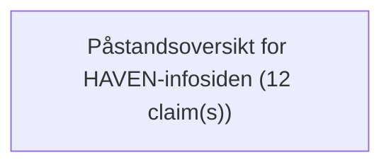

# Text Reliability Analysis Report

- Schema: `haven.text_reliability.analysis.v1`
- Analysis ID: `analysis-ff234b004c13dad6`
- Generated at: `2026-08-01T09:52:00Z`
- Source mode: `verifying`

## Inputs
- `text-file:Claim_Ledger_2026-08-01.md:72b211b19b2c5362`: HAVEN infoside påstandsoversikt 1. august 2026 (338 words)

## Markdown Structure
- Sections: `1`
- Tables: `1`

## Claims
- `claim-0001` `cluster-0001` `factual` `assertive` `needs_external_source_audit`: "| HAVEN begynner med mennesket | Normativt prinsipp | [Purpose Knowledge Base](https://github.com/Digipomps/CellProtocolDocuments/blob/main/Book/23_Purpose_Knowledge_Base.md) | Et designvalg, ikke en målt effekt eller teknisk nødvendighet. |"
- `claim-0002` `cluster-0001` `normative` `assertive` `needs_external_source_audit`: "| Ingen global personscore, global person-ID eller skjult atferdsprofil | Arkitektur- og policyregel | [Purpose Knowledge Base](https://github.com/Digipomps/CellProtocolDocuments/blob/main/Book/23_Purpose_Knowledge_Base.md) og [Identity Model](https://github.com/Digipomps/CellProtocolDocuments/blob/main/Book/03_Identity_Model.md) | Apper og utrullinger må revideres; full konformitetstest finnes ikke. |"
- `claim-0003` `cluster-0001` `project_capability` `assertive` `needs_external_source_audit`: "| En ikke-eier avvises uten Contract | Implementert og testet komponentegenskap | [Festet `GeneralCellInterfaceTests`-commit](https://github.com/Digipomps/CellProtocol/blob/79740304167aa4f4daadd148c5a369e919d25a6a/Tests/CellBaseTests/GeneralCellInterfaceTests.swift#L145-L218) | Beviser ikke at alle apper bruker grensen korrekt. |"
- `claim-0004` `cluster-0001` `project_capability` `moderated` `needs_external_source_audit`: "| En riktig signert Contract kan gi avgrenset lesetilgang | Implementert og testet komponentegenskap | [Festet `GeneralCellInterfaceTests`-commit](https://github.com/Digipomps/CellProtocol/blob/79740304167aa4f4daadd148c5a369e919d25a6a/Tests/CellBaseTests/GeneralCellInterfaceTests.swift#L145-L218) | Signatur til nøkkel er ikke automatisk identitet til person. |"
- `claim-0005` `cluster-0001` `project_capability` `moderated` `needs_external_source_audit`: "| En forespørsel kan ikke utvide malen på egen hånd | Implementert og testet komponentegenskap | [Festet `GeneralCellInterfaceTests`-commit](https://github.com/Digipomps/CellProtocol/blob/79740304167aa4f4daadd148c5a369e919d25a6a/Tests/CellBaseTests/GeneralCellInterfaceTests.swift#L145-L218) | Bare testet i den konkrete komponentbanen. |"
- `claim-0006` `cluster-0001` `project_capability` `assertive` `needs_external_source_audit`: "| Lagring krever egen identitetsbundet `s`-Grant | Implementert og testet komponentegenskap | [Festet lagringstest](https://github.com/Digipomps/CellProtocol/blob/79740304167aa4f4daadd148c5a369e919d25a6a/Tests/CellBaseTests/GeneralCellInterfaceTests.swift#L575-L657) | Beviser ikke komplett datalivssyklus, eksport eller sletting. |"
- `claim-0007` `cluster-0001` `factual` `moderated` `needs_external_source_audit`: "| HAVEN kan være nyttig rundt AI-agenter | Bruksretning | CellProtocol-byggesteiner; [MCP Authorization](https://modelcontextprotocol.io/specification/2025-11-25/basic/authorization) og [AuthZEN](https://openid.net/openid-foundation-advances-authorization-for-the-agent-era-with-new-authzen-working-group-drafts/) som integrasjonskontekst | Ingen offentlig bevist flerledds- eller ende-til-ende-agentflyt. |"
- `claim-0008` `cluster-0001` `project_capability` `moderated` `source_missing`: "| Konferansereisen viser et mulig mønster for avgrenset datadeling | Tankeeksempel / intern prototype | Interne komponenter og testscenarier; ikke offentlig kildebevis | Integrert identitetsflyt er ikke klar for offentlig pilot. |"
- `claim-0009` `cluster-0001` `factual` `moderated` `needs_external_source_audit`: "| Teknisk etterprøvbarhet kan støtte tillit | Begrenset designpåstand | [Komponenttest](https://github.com/Digipomps/CellProtocol/blob/79740304167aa4f4daadd148c5a369e919d25a6a/Tests/CellBaseTests/GeneralCellInterfaceTests.swift#L145-L218) og [W3C Verifiable Credentials](https://www.w3.org/TR/vc-data-model/) som kontekst | Omdømme er kontekstuelt; bevis er ikke sannhet eller menneskeverdi. |"
- `claim-0010` `cluster-0001` `factual` `moderated` `needs_external_source_audit`: "| HAVEN kan støtte bedre demokratiske prosesser | Forskningshypotese | [OECDs problemforståelse](https://www.oecd.org/en/publications/oecd-survey-on-drivers-of-trust-in-public-institutions-2024-results_9a20554b-en.html) og HAVENs formålsmodell | Ingen dokumentert kausal effekt eller ekstern pilot. |"
- `claim-0011` `cluster-0001` `factual` `moderated` `source_missing`: "| Sporbare bidrag kan muliggjøre jevnere verdifordeling | Spesifisert forskningsretning | Internt ContributionProof/ValuePoolPolicy-arbeid; ikke offentlig effektbevis | Ingen ferdig økonomi; regulatorisk klassifisering og effekt er uavklart. |"
- `claim-0012` `cluster-0001` `factual` `assertive` `needs_external_source_audit`: "| Stiftelsen Digipomps er registrert og politisk uavhengig i formålet | Organisasjonsfaktum | [Brønnøysundregistrene, org.nr. 922 135 134](https://virksomhet.brreg.no/nb/oppslag/enheter/922135134) | Stiftelsesform gjør ikke arbeidet automatisk nøytralt. |"

## Claim Clusters
| Cluster | Title | Claims | Source audit statuses | Representative claims |
| --- | --- | ---: | --- | --- |
| `cluster-0001` | Påstandsoversikt for HAVEN-infosiden | 12 | needs_external_source_audit:10, source_missing:2 | claim-0001 / claim-0002 / claim-0003 |

## Claim Source Matrix
| Claim | Cluster | Section | Type | Audit status | Evidence grade | Sources | Quote |
| --- | --- | --- | --- | --- | --- | --- | --- |
| `claim-0001` | `cluster-0001` | Påstandsoversikt for HAVEN-infosiden | factual | `needs_external_source_audit` | source_named_unverified | https://github.com/Digipomps/CellProtocolDocuments/blob/main/Book/23_Purpose_Knowledge_... | \| HAVEN begynner med mennesket \| Normativt prinsipp \| [Purpose Knowledge Base](https://github.com/Digipomps/CellProto... |
| `claim-0002` | `cluster-0001` | Påstandsoversikt for HAVEN-infosiden | normative | `needs_external_source_audit` | source_named_unverified | https://github.com/Digipomps/CellProtocolDocuments/blob/main/Book/23_Purpose_Knowledge_... | \| Ingen global personscore, global person-ID eller skjult atferdsprofil \| Arkitektur- og policyregel \| [Purpose Knowl... |
| `claim-0003` | `cluster-0001` | Påstandsoversikt for HAVEN-infosiden | project_capability | `needs_external_source_audit` | source_named_unverified | https://github.com/Digipomps/CellProtocol/blob/79740304167aa4f4daadd148c5a369e919d25a6a... | \| En ikke-eier avvises uten Contract \| Implementert og testet komponentegenskap \| [Festet `GeneralCellInterfaceTests`... |
| `claim-0004` | `cluster-0001` | Påstandsoversikt for HAVEN-infosiden | project_capability | `needs_external_source_audit` | source_named_unverified | https://github.com/Digipomps/CellProtocol/blob/79740304167aa4f4daadd148c5a369e919d25a6a... | \| En riktig signert Contract kan gi avgrenset lesetilgang \| Implementert og testet komponentegenskap \| [Festet `Gener... |
| `claim-0005` | `cluster-0001` | Påstandsoversikt for HAVEN-infosiden | project_capability | `needs_external_source_audit` | source_named_unverified | https://github.com/Digipomps/CellProtocol/blob/79740304167aa4f4daadd148c5a369e919d25a6a... | \| En forespørsel kan ikke utvide malen på egen hånd \| Implementert og testet komponentegenskap \| [Festet `GeneralCell... |
| `claim-0006` | `cluster-0001` | Påstandsoversikt for HAVEN-infosiden | project_capability | `needs_external_source_audit` | source_named_unverified | https://github.com/Digipomps/CellProtocol/blob/79740304167aa4f4daadd148c5a369e919d25a6a... | \| Lagring krever egen identitetsbundet `s`-Grant \| Implementert og testet komponentegenskap \| [Festet lagringstest](h... |
| `claim-0007` | `cluster-0001` | Påstandsoversikt for HAVEN-infosiden | factual | `needs_external_source_audit` | source_named_unverified | https://modelcontextprotocol.io/specification/2025-11-25/basic/authorization, https://o... | \| HAVEN kan være nyttig rundt AI-agenter \| Bruksretning \| CellProtocol-byggesteiner; [MCP Authorization](https://mode... |
| `claim-0008` | `cluster-0001` | Påstandsoversikt for HAVEN-infosiden | project_capability | `source_missing` | no_source_anchor |  | \| Konferansereisen viser et mulig mønster for avgrenset datadeling \| Tankeeksempel / intern prototype \| Interne kompo... |
| `claim-0009` | `cluster-0001` | Påstandsoversikt for HAVEN-infosiden | factual | `needs_external_source_audit` | source_named_unverified | https://github.com/Digipomps/CellProtocol/blob/79740304167aa4f4daadd148c5a369e919d25a6a... | \| Teknisk etterprøvbarhet kan støtte tillit \| Begrenset designpåstand \| [Komponenttest](https://github.com/Digipomps/... |
| `claim-0010` | `cluster-0001` | Påstandsoversikt for HAVEN-infosiden | factual | `needs_external_source_audit` | source_named_unverified | https://www.oecd.org/en/publications/oecd-survey-on-drivers-of-trust-in-public-institut... | \| HAVEN kan støtte bedre demokratiske prosesser \| Forskningshypotese \| [OECDs problemforståelse](https://www.oecd.org... |
| `claim-0011` | `cluster-0001` | Påstandsoversikt for HAVEN-infosiden | factual | `source_missing` | no_source_anchor |  | \| Sporbare bidrag kan muliggjøre jevnere verdifordeling \| Spesifisert forskningsretning \| Internt ContributionProof/V... |
| `claim-0012` | `cluster-0001` | Påstandsoversikt for HAVEN-infosiden | factual | `needs_external_source_audit` | source_named_unverified | https://virksomhet.brreg.no/nb/oppslag/enheter/922135134 | \| Stiftelsen Digipomps er registrert og politisk uavhengig i formålet \| Organisasjonsfaktum \| [Brønnøysundregistrene,... |

## Source Checks
- `claim-0001`: `not_checkable` / `needs_external_source_audit` - local_v1_does_not_fetch_or_verify_sources
- `claim-0002`: `not_checkable` / `needs_external_source_audit` - local_v1_does_not_fetch_or_verify_sources
- `claim-0003`: `not_checkable` / `needs_external_source_audit` - local_v1_does_not_fetch_or_verify_sources
- `claim-0004`: `not_checkable` / `needs_external_source_audit` - local_v1_does_not_fetch_or_verify_sources
- `claim-0005`: `not_checkable` / `needs_external_source_audit` - local_v1_does_not_fetch_or_verify_sources
- `claim-0006`: `not_checkable` / `needs_external_source_audit` - local_v1_does_not_fetch_or_verify_sources
- `claim-0007`: `not_checkable` / `needs_external_source_audit` - local_v1_does_not_fetch_or_verify_sources
- `claim-0008`: `source_missing` / `source_missing` - no_source_reference_found_near_claim
- `claim-0009`: `not_checkable` / `needs_external_source_audit` - local_v1_does_not_fetch_or_verify_sources
- `claim-0010`: `not_checkable` / `needs_external_source_audit` - local_v1_does_not_fetch_or_verify_sources
- `claim-0011`: `source_missing` / `source_missing` - no_source_reference_found_near_claim
- `claim-0012`: `not_checkable` / `needs_external_source_audit` - local_v1_does_not_fetch_or_verify_sources

## Argument Graph
- Nodes: `1`
- Edges: `0`

## Quantitative Models
- No quantitative model inputs found.

## Rhetoric
- No heuristic rhetoric findings.

## Reliability Dimensions
- `source_grounding`: `weak` - 2 claim(s) lack nearby source references.
- `logical_coherence`: `mixed` - Heuristic argument links found.
- `transparency`: `mixed` - The local tool exposes quote spans and source-status limitations.
- `rhetorical_pressure`: `low` - 0 rhetoric finding(s) may substitute for evidence.
- `uncertainty_handling`: `weak` - Unverified or missing source support remains.
- `fact_checkability`: `mixed` - Claims are sentence anchored; external verification is a separate step.

## Boundaries
- The local v1 tool does not verify external sources.
- Deep argument reconstruction requires model or human review.
- Quantitative productivity models are sizing models unless a source-auditor validates inputs and an empirical model validates attribution.
