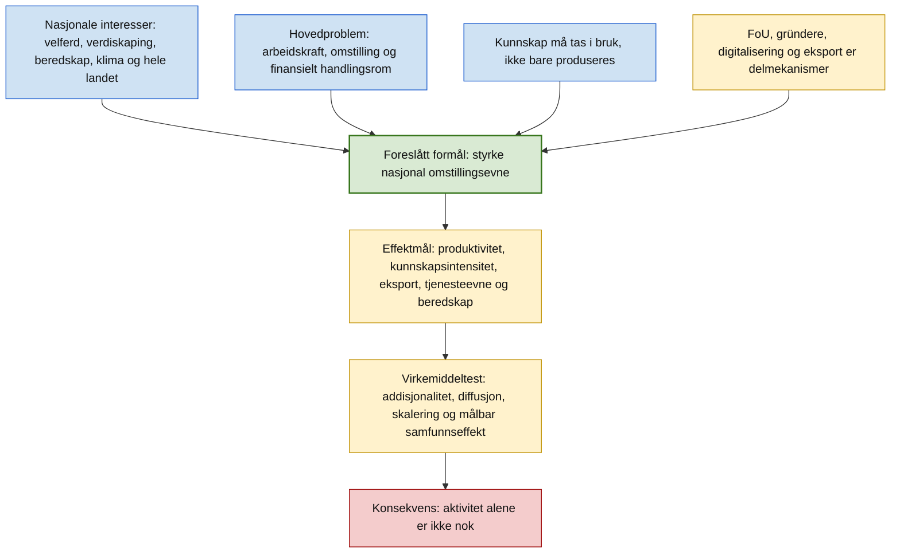

# Et målbart formål for norsk innovasjonspolitikk

Dato: 23. juni 2026  
Status: faglig policynotat

## Sammendrag

Norsk innovasjonspolitikk trenger et tydeligere overordnet formål enn "mer innovasjon". Innovasjon er ikke et mål i seg selv. Det er en samfunnsmekanisme: evnen til å utvikle, ta i bruk og skalere kunnskap, teknologi og nye løsninger slik at landet kan løse oppgaver bedre enn før.

Det foreslåtte formålet er:

> **Formålet med norsk innovasjonspolitikk er å styrke Norges nasjonale omstillingsevne: evnen til å utvikle, ta i bruk og skalere kunnskap, teknologi og nye løsninger som varig øker produktivitet, lønnsom eksport, beredskap og offentlig tjenesteevne, slik at velferdsstaten, strategisk handlefrihet og gode arbeidsplasser i hele landet kan opprettholdes innenfor klima- og naturgrenser.**

Dette formålet samler de viktigste nasjonale interessene i én styrbar logikk. [Perspektivmeldingen](https://www.regjeringen.no/no/dokumenter/meld.-st.-31-20232024/id3049290/?ch=1) peker på arbeidskraft, omstilling og fordeling som hovedutfordringer, og på behovet for å løse oppgavene smartere for å verne og videreutvikle velferdsmodellen. [Langtidsplanen for forskning og høyere utdanning](https://www.regjeringen.no/no/dokumenter/meld.-st.-5-20222023/id2931400/?ch=1) peker på konkurransekraft, innovasjonsevne, bærekraft, beredskap og kunnskap som må tas i bruk. [FoU-strategien](https://www.regjeringen.no/no/dokumenter/strategi-for-a-oke-naringslivets-investering-i-fou/id3036876/?ch=1) setter et konkret mål om at næringslivets FoU skal utgjøre 2 prosent av BNP innen 2030. [Eksportreformen](https://www.regjeringen.no/no/dokumenter/hele-norge-eksporterer-2.0/id3029861/?ch=1) setter mål om 50 prosent økning i verdiskapende eksport utenom olje og gass innen 2030. [Digitaliseringsstrategien](https://www.regjeringen.no/no/dokumenter/fremtidens-digitale-norge/id3054645/?ch=1) understreker at digitalisering er et verktøy, ikke et mål. Kildene peker dermed i samme retning, men uten å samle retningen i én målbar formålssetning.

Et godt formål må kunne brukes på alle nivåer: nasjonal strategi, sektormål, virkemiddelapparat, regionale prioriteringer, porteføljestyring og evaluering av enkeltordninger. Hovedpoenget er enkelt: et virkemiddel bør regnes som innovasjonspolitikk bare dersom det kan forklare hvilken nasjonal omstillingsevne det styrker, hvordan effekten skal oppstå, og hvordan effekten kan måles.

## Hvorfor formålet må flyttes fra aktivitet til effekt

Norsk politikk har allerede mange relevante delmål. Problemet er at de ligger på ulike nivåer. FoU-andel er et innsatsmål. Digitalisering er et virkemiddel. Oppstartsbedrifter og eksport er utfall. Produktivitet, velferdsstatens bærekraft, strategisk handlefrihet og grønn omstilling er samfunnseffekter. Når disse nivåene blandes, blir innovasjonspolitikken lett en samling aktiviteter i stedet for en styringsmodell.

[Perspektivmeldingen](https://www.regjeringen.no/no/dokumenter/meld.-st.-31-20232024/id3049290/?ch=1) beskriver et langsiktig press på offentlige finanser og arbeidskraft. Meldingen legger vekt på stabil tilgang på gode offentlige tjenester, at velferdsordningene må være tilpasset offentlig sektors inntektsgrunnlag, og at private produksjonsmetoder og teknologi kan overføres til offentlig sektor for å gi økt produktivitet. Den strategiske koblingen til innovasjonspolitikk er derfor ikke at "mer teknologi" er bra, men at teknologi og nye arbeidsmåter må gi mer verdiskaping og bedre tjenester per ressursenhet.

[Langtidsplanen](https://www.regjeringen.no/no/dokumenter/meld.-st.-5-20222023/id2931400/?ch=1) gir den kunnskapspolitiske siden av samme problem. Kunnskap må ikke bare utvikles; den må gjøres tilgjengelig og tas i bruk i næringsliv, offentlig sektor og sivilsamfunn. Planen peker også på at samfunnets evne til å absorbere kunnskap ikke har holdt tritt med veksten i forskningsproduksjon. Det gjør absorpsjon, diffusjon og skalering til like sentrale begreper som forskning og oppfinnelse.

[FoU-strategien](https://www.regjeringen.no/no/dokumenter/strategi-for-a-oke-naringslivets-investering-i-fou/id3036876/?ch=1) for næringslivet gir et sterkt delmål, men viser også hvorfor delmålet ikke er nok alene. Mer FoU kan gi ny teknologi og nye løsninger, og styrke økonomiens evne til å ta i bruk teknologi. Samtidig er et FoU-mål først og fremst et mål for innsats og kapasitet. Det må kobles til produktivitet, kommersialisering, eksport, lønnsevne og offentlig verdiskaping for å bli et samfunnsmål.

## Foreslått målarkitektur

Formålet bør styres gjennom fem effektmål og et mindre sett med delindikatorer. Effektmålene må stå over sektorer og ordninger. Delindikatorene kan tilpasses hvert nivå i virkemiddelapparatet.

| Nivå | Mål | Operasjonell test |
| --- | --- | --- |
| Formål | Nasjonal omstillingsevne | Bidrar politikken til at Norge kan fornye næringsliv og offentlig sektor raskere, tryggere og mer produktivt? |
| Effektmål 1 | Høyere produktivitet i Fastlands-Norge | Øker verdiskaping per timeverk eller tjenesteeffekt per ressursenhet i relevante sektorer? |
| Effektmål 2 | Mer kunnskapsintensivt næringsliv | Øker næringslivets FoU, absorpsjonsevne og kommersialisering, ikke bare antall prosjekter? |
| Effektmål 3 | Lønnsom eksport utenom petroleum | Øker real verdiskapende eksport fra skalerbare varer og tjenester utenom olje og gass? |
| Effektmål 4 | Offentlig tjenesteevne og arbeidskraftfrigjøring | Gir innovasjon bedre tjenester, lavere ressursvekst eller frigjort kompetanse til prioriterte oppgaver? |
| Effektmål 5 | Beredskap, strategisk handlefrihet og grønn omstilling | Styrker innovasjonen kritiske kapabiliteter, forsyningssikkerhet, klimaomstilling og naturhensyn? |

Disse målene bør ikke forstås som fem parallelle siloer. De bør forstås som en samlet test: en ordning som gir mer FoU, men ikke styrker absorpsjon, kommersialisering eller produktivitet, har svak måloppnåelse. En digital satsing som ikke kan vise bedre tjenester, lavere ressursbruk eller høyere verdiskaping, er ikke et sterkt innovasjonstiltak. En eksportsatsing som bare følger valutakurs eller priser, bør ikke telle som full innovasjonseffekt.

## Argumentkart

## Målbare styringsindikatorer

Indikatorene bør skille mellom innsats, kapasitet, utfall og effekt. Ellers blir målstyringen for enkel.

| Dimensjon | Hovedindikator | Baseline eller kildeanker | Anbefalt styringsbruk |
| --- | --- | --- | --- |
| Næringslivets FoU | Næringslivets FoU som andel av BNP | Offisielt mål: 2 prosent av BNP innen 2030. SSB oppgir 46,6 mrd. kroner i egenutført FoU i næringslivet i 2024 for foretak med minst 10 sysselsatte. [FoU-strategien](https://www.regjeringen.no/no/dokumenter/strategi-for-a-oke-naringslivets-investering-i-fou/id3036876/?ch=1), [SSB](https://www.ssb.no/teknologi-og-innovasjon/forskning-og-innovasjon-i-naeringslivet/statistikk/forskning-og-utvikling-i-naeringslivet) | Brukes som kapasitetsmål, ikke som endelig effektmål. |
| Kunnskap i bruk | Andel bedrifter som tar i bruk avansert teknologi og forskningsbasert kunnskap | Langtidsplanen peker på et absorpsjonsgap: kunnskap må tas i bruk. EIS viser høy digital modenhet, men svakere resultater på intellectual assets og salg fra nye produkter. [Langtidsplanen](https://www.regjeringen.no/no/dokumenter/meld.-st.-5-20222023/id2931400/?ch=1), [European Innovation Scoreboard 2025](https://ec.europa.eu/assets/rtd/eis/2025/ec_rtd_eis-country-profile-no.pdf) | Brukes til å måle om FoU og digitalisering gir diffusjon. |
| Kommersialisering | Salg fra nye produkter og tjenester, patenter, design og varemerker | EIS 2025 viser Norge som "Strong Innovator", men med lave relative utslag på intellectual assets og salg fra nye produkter. [European Innovation Scoreboard 2025](https://ec.europa.eu/assets/rtd/eis/2025/ec_rtd_eis-country-profile-no.pdf) | Brukes som test på om kunnskap blir økonomisk og samfunnsmessig anvendt. |
| Eksport | Real verdiskapende eksport utenom olje og gass | Offisielt mål: 50 prosent økning innen 2030. [Hele Norge eksporterer](https://www.regjeringen.no/no/dokumenter/hele-norge-eksporterer-2.0/id3029861/?ch=1) | Bør valuta-, pris- og petroleumskorrigeres så langt det lar seg gjøre. |
| Produktivitet | Bruttoprodukt per timeverk i markedsrettet fastlandsøkonomi og tjenesteeffekt per ressursenhet i offentlig sektor | Perspektivmeldingen peker på behovet for smartere ressursbruk; Nasjonalbudsjettet 2026 anslår vekst i BNP Fastlands-Norge til 2,1 prosent i 2026. [Perspektivmeldingen](https://www.regjeringen.no/no/dokumenter/meld.-st.-31-20232024/id3049290/?ch=1), [Nasjonalbudsjettet 2026](https://www.regjeringen.no/no/aktuelt/nokkeltall-i-nasjonalbudsjettet-2026/id3124365/) | Brukes som overordnet effektmål, med sektorspesifikke mål under. |
| Offentlig tjenesteevne | Kvalitet, ventetid, brukerutfall, tidsbruk og ressursbruk per tjeneste | Perspektivmeldingen knytter bedre ressursbruk til velferdsmodellens bærekraft. [Perspektivmeldingen](https://www.regjeringen.no/no/dokumenter/meld.-st.-31-20232024/id3049290/?ch=1) | Brukes til å skille reell innovasjon fra systemanskaffelser. |
| Strategisk handlefrihet | Teknologisk kapasitet, kritiske verdikjeder, forsyningssikkerhet og beredskapsrelevant kompetanse | Langtidsplanen og FoU-strategien kobler forskning, teknologi, sikkerhet og beredskap. [Langtidsplanen](https://www.regjeringen.no/no/dokumenter/meld.-st.-5-20222023/id2931400/?ch=1), [FoU-strategien](https://www.regjeringen.no/no/dokumenter/strategi-for-a-oke-naringslivets-investering-i-fou/id3036876/?ch=1) | Brukes som nasjonal-interessefilter for prioriteringer. |

## Produktivitetsmodell: størrelsesorden, ikke prognose

Innovasjonspolitikk bør ikke måles som en fast andel av verdiskapingen. Innovasjon virker på tvers av sektorer og gjennom tid: bedre prosesser, ny teknologi, nye forretningsmodeller, kunnskapsopptak, bedre offentlige tjenester og nye eksportposisjoner. En bedre makrotest er hvor mye varig produktivitetsbidrag politikken realistisk kan bidra til.

[Nasjonalbudsjettet 2026](https://www.regjeringen.no/no/aktuelt/nokkeltall-i-nasjonalbudsjettet-2026/id3124365/) oppgir at strukturelt oljekorrigert budsjettunderskudd er 579,4 mrd. kroner i 2026, tilsvarende 13,1 prosent av trend-BNP for Fastlands-Norge. Det gir en omtrentlig trend-BNP for Fastlands-Norge på 4 423 mrd. kroner. [Perspektivmeldingen](https://www.regjeringen.no/no/dokumenter/meld.-st.-31-20232024/id3049290/?ch=1) gir grunnlaget for å behandle langsiktig inndekningsbehov som andel av Fastlands-BNP; en ren skalering av 6,2 prosent på 2026-nivå tilsvarer om lag 274 mrd. kroner. Dette er ikke en prognose for 2060, men en størrelsesorden som viser hvorfor små varige forskjeller i produktivitetsvekst er makropolitisk viktige.

| Ekstra årlig produktivitetsvekst | Omtrentlig nivåeffekt etter 10 år på 4 423 mrd. kroner | Vurdering |
| ---: | ---: | --- |
| 0,3 prosentpoeng | ca. 135 mrd. kroner | Makrorelevant, men ikke tilstrekkelig alene. |
| 0,5 prosentpoeng | ca. 226 mrd. kroner | Nær størrelsesorden av et stort finansieringsbidrag. |
| 1,0 prosentpoeng | ca. 463 mrd. kroner | Svært kraftig; bør behandles som øvre illustrasjon, ikke planforutsetning. |

En ansvarlig politisk målformulering er derfor ikke at innovasjonspolitikken alene skal "løse" finansieringsgapet. Det målbare kravet bør være at innovasjonspolitikken over tid kan dokumentere et varig bidrag til produktivitetsvekst, real eksportvekst, høyere kommersialisering og bedre offentlig ressursbruk. Et samlet bidrag på 0,3-0,5 prosentpoeng høyere årlig produktivitetsvekst i relevante deler av fastlandsøkonomien er et ambisiøst, men styrbart referansepunkt for videre modellering.

## Virkemiddeltest

Alle virkemidler bør vurderes mot fire spørsmål før de får plass i en samlet innovasjonspolitikk.

| Test | Spørsmål | Konsekvens for virkemidler |
| --- | --- | --- |
| Nasjonal interesse | Hvilken nasjonal interesse styrkes: velferd, verdiskaping, beredskap, klima/natur, tillit eller hele landet? | Tiltak uten tydelig kobling bør finansieres som noe annet enn innovasjonspolitikk. |
| Addisjonalitet | Skjer det noe som ikke ville skjedd uten offentlig innsats? | Støtte bør ikke erstatte privat finansiering eller belønne aktivitet som uansett ville kommet. |
| Diffusjon og skalering | Kan løsningen tas i bruk av flere enn prosjektmottakeren? | Pilotpolitikk uten spredningsmekanisme bør nedprioriteres. |
| Målbar effekt | Hvilket utfall eller hvilken effekt skal kunne måles etter 3, 5 og 10 år? | Evaluering må vektlegge produktivitet, kommersialisering, eksport, tjenesteevne og beredskap. |

Dette gir en tydeligere arbeidsdeling i virkemiddelapparatet.

| Virkemiddelområde | Primær rolle | Bør måles på |
| --- | --- | --- |
| Forsknings- og innovasjonsmidler | Bygge kunnskap, risikoavlaste tidlig fase og styrke absorpsjon | Privat FoU-utløsing, kunnskapsbruk, kommersialisering, samfunnsoppdrag og produktivitetsbidrag. |
| Gründer- og skaleringsvirkemidler | Få flere nye bedrifter med vekstkraft til å lykkes | Overlevelse, skalering, lønnsevne, eksport, kapitaltilgang og samfunnsproblem løst. |
| Eksportvirkemidler | Gjøre skalerbare løsninger konkurransedyktige internasjonalt | Real eksportvekst, nye markeder, verdikjedeplassering og ikke-petroleumsavhengighet. |
| Digitaliserings- og KI-tiltak | Øke kvalitet, tempo og produktivitet i privat og offentlig sektor | Tidsbesparelse, prosessforbedring, tjenestekvalitet, sikkerhet og faktisk bruk. |
| Regionale innovasjonsvirkemidler | Bygge produktive miljøer og industrielle kapabiliteter i hele landet | Produktive arbeidsplasser, kompetansebaser, klyngeeffekter og kobling til nasjonale verdikjeder. |
| Offentlige anskaffelser | Skape krevende hjemmemarked og trekke løsninger inn i drift | Skalert innføring, bedre tjenester, reduserte livsløpskostnader og leverandørutvikling. |

## Hvorfor alternative formål er svakere

**"Mer FoU" er for smalt.** [FoU-strategiens](https://www.regjeringen.no/no/dokumenter/strategi-for-a-oke-naringslivets-investering-i-fou/id3036876/?ch=1) 2-prosentmål er et viktig styringsmål. Men det er ikke nok å øke ressursbruken hvis kunnskapen ikke blir tatt i bruk, skalert og omsatt i produktivitet eller samfunnseffekt.

**"Flere gründere" er for smalt.** [Gründermeldingen](https://www.regjeringen.no/no/dokumenter/meld.-st.-6-20242025/id3068703/?ch=1) viser at nye bedrifter er viktige for omstilling, vekstbedrifter og nye løsninger. Likevel skjer mye av Norges produktivitets- og klimarelevante innovasjon også i etablerte bedrifter, offentlig sektor, industri- og energisystemer og leverandørkjeder.

**"Grønn og digital omstilling" er for bredt alene.** [Digitaliseringsstrategien](https://www.regjeringen.no/no/dokumenter/fremtidens-digitale-norge/id3054645/?ch=1) gjør digitalisering til et verktøy for større samfunnsmål. Grønn og digital omstilling må derfor kobles til produktivitet, eksport, tjenesteevne og beredskap. Ellers blir de retning uten effektkrav.

**"Eksportvekst" er nødvendig, men ikke dekkende.** [Hele Norge eksporterer](https://www.regjeringen.no/no/dokumenter/hele-norge-eksporterer-2.0/id3029861/?ch=1) gir eksport utenom olje og gass en tydelig rolle som mål for verdiskaping og omstilling. Men det fanger ikke offentlig sektor, hjemmemarkedets produktivitet, beredskap eller kunnskapsopptak bredt nok.

**"Arbeidsplasser i hele landet" er et legitimt hensyn, men må presiseres.** Innovasjonspolitikken bør ikke bare måle geografisk fordeling av midler. Den bør måle produktive, bærekraftige arbeidsplasser som styrker regionale kapabiliteter og nasjonale verdikjeder.

## Claim-til-kilde-tabell

| Bærende påstand | Kildestatus | Presisjon | Begrensning |
| --- | --- | --- | --- |
| Norge mangler én samlet og operasjonell formålssetning for innovasjonspolitikken i de sentrale kildene. | Delvis støttet: [Perspektivmeldingen](https://www.regjeringen.no/no/dokumenter/meld.-st.-31-20232024/id3049290/?ch=1), [Langtidsplanen](https://www.regjeringen.no/no/dokumenter/meld.-st.-5-20222023/id2931400/?ch=1), [FoU-strategien](https://www.regjeringen.no/no/dokumenter/strategi-for-a-oke-naringslivets-investering-i-fou/id3036876/?ch=1) og [Hele Norge eksporterer](https://www.regjeringen.no/no/dokumenter/hele-norge-eksporterer-2.0/id3029861/?ch=1) viser mange delmål, men ikke én samlet formulering. | Analytisk vurdering basert på kildegjennomgang. | Et annet dokument, tildelingsbrev eller NOU kan ha en mer eksplisitt formulering. |
| Nasjonal omstillingsevne er en bedre samlende formulering enn "mer innovasjon". | Støttet som syntese av [Perspektivmeldingen](https://www.regjeringen.no/no/dokumenter/meld.-st.-31-20232024/id3049290/?ch=1), [Langtidsplanen](https://www.regjeringen.no/no/dokumenter/meld.-st.-5-20222023/id2931400/?ch=1), [FoU-strategien](https://www.regjeringen.no/no/dokumenter/strategi-for-a-oke-naringslivets-investering-i-fou/id3036876/?ch=1) og [Digitaliseringsstrategien](https://www.regjeringen.no/no/dokumenter/fremtidens-digitale-norge/id3054645/?ch=1). | Normativ og analytisk formulering, ikke offisielt sitat. | Må vedtas politisk før det er et faktisk formål. |
| FoU-målet er et innsats- og kapasitetsmål, ikke et samfunnseffektmål. | Støttet av [FoU-strategiens](https://www.regjeringen.no/no/dokumenter/strategi-for-a-oke-naringslivets-investering-i-fou/id3036876/?ch=1) 2-prosentmål og [Langtidsplanens](https://www.regjeringen.no/no/dokumenter/meld.-st.-5-20222023/id2931400/?ch=1) vekt på bruk av kunnskap. | Høy. | Krever supplerende indikatorer for effekt. |
| Digitalisering bør behandles som virkemiddel, ikke sluttmål. | Direkte støttet av [digitaliseringsstrategiens](https://www.regjeringen.no/no/dokumenter/fremtidens-digitale-norge/id3054645/?ch=1) forord. | Høy. | Digital modenhet kan likevel være et viktig delmål. |
| Eksport utenom olje og gass er et sentralt omstillingsmål. | Direkte støttet av [Hele Norge eksporterer](https://www.regjeringen.no/no/dokumenter/hele-norge-eksporterer-2.0/id3029861/?ch=1). | Høy. | Må renses for valuta, priser og nominelle effekter. |
| Norge har sterke innovasjonsforutsetninger, men svakere kommersialiseringsutslag på enkelte indikatorer. | Støttet av [European Innovation Scoreboard 2025](https://ec.europa.eu/assets/rtd/eis/2025/ec_rtd_eis-country-profile-no.pdf). | Høy som komparativ diagnose. | EU-indekser er ikke alene tilstrekkelige som nasjonal styringsmodell. |
| Produktivitetsbidrag på 0,3-0,5 prosentpoeng er et rimelig referansepunkt for videre modellering. | Delvis støttet: makrotallene er forankret i [Nasjonalbudsjettet 2026](https://www.regjeringen.no/no/aktuelt/nokkeltall-i-nasjonalbudsjettet-2026/id3124365/) og [Perspektivmeldingen](https://www.regjeringen.no/no/dokumenter/meld.-st.-31-20232024/id3049290/?ch=1), mens intervallet er et analytisk forslag. | Middels. | Må kvalitetssikres med SSB/FIN/OECD-modeller og sektorfordeling. |
| Offentlig sektor-innovasjon må inngå i formålet. | Støttet av [Perspektivmeldingens](https://www.regjeringen.no/no/dokumenter/meld.-st.-31-20232024/id3049290/?ch=1) vekt på smartere ressursbruk og offentlig tjenesteevne. | Høy. | Må operasjonaliseres uten å redusere kvalitet til kostnadsmål. |

## Anbefalt formålsparagraf og styringsregel

En kort formålsparagraf kan formuleres slik:

> **Norsk innovasjonspolitikk skal styrke nasjonal omstillingsevne ved å øke Norges evne til å utvikle, ta i bruk og skalere kunnskap, teknologi og nye løsninger som gir varig høyere produktivitet, lønnsom verdiskaping, offentlig tjenesteevne, beredskap og grønn omstilling.**

Den bør følges av en styringsregel:

> **Offentlige innovasjonsvirkemidler skal begrunnes med hvilken nasjonal interesse de styrker, hvilken addisjonalitet de gir, hvordan løsninger spres eller skaleres, og hvilken effekt som skal kunne dokumenteres etter 3, 5 og 10 år.**

Formålet gjør ikke politikken snevrere. Det gjør den mer ansvarlig. Det åpner for forskning, gründere, industri, offentlig sektor, digitalisering, kunstig intelligens, eksport, regional utvikling og samfunnsoppdrag, men krever at hvert nivå viser sin plass i en felles effektkjede.

## Konklusjon

Norsk innovasjonspolitikk bør samle seg om nasjonal omstillingsevne som overordnet formål. Det er bredt nok til å romme forskning, teknologi, næringsutvikling, offentlig sektor, eksport, beredskap og grønn omstilling. Samtidig er det presist nok til å måles.

Det avgjørende skiftet er å gå fra aktivitet til effekt. Mer FoU, flere oppstartsbedrifter, flere piloter, mer digitalisering og flere virkemidler er ikke nok dersom de ikke gir høyere produktivitet, bedre tjenester, mer lønnsom eksport, sterkere beredskap og raskere grønn omstilling. En innovasjonspolitikk som kan måles på disse effektene, kan også prioriteres, evalueres og forbedres.

## Kilder

- [Meld. St. 5 (2022-2023), Langtidsplan for forskning og høyere utdanning 2023-2032](https://www.regjeringen.no/no/dokumenter/meld.-st.-5-20222023/id2931400/?ch=1)
- [Meld. St. 31 (2023-2024), Perspektivmeldingen 2024](https://www.regjeringen.no/no/dokumenter/meld.-st.-31-20232024/id3049290/?ch=1)
- [Strategi for å øke næringslivets investeringer i forskning og utvikling](https://www.regjeringen.no/no/dokumenter/strategi-for-a-oke-naringslivets-investering-i-fou/id3036876/?ch=1)
- [Meld. St. 6 (2024-2025), Gründere og oppstartsbedrifter](https://www.regjeringen.no/no/dokumenter/meld.-st.-6-20242025/id3068703/?ch=1)
- [Hele Norge eksporterer 2022-2024](https://www.regjeringen.no/no/dokumenter/hele-norge-eksporterer-2.0/id3029861/?ch=1)
- [Fremtidens digitale Norge, nasjonal digitaliseringsstrategi 2024-2030](https://www.regjeringen.no/no/dokumenter/fremtidens-digitale-norge/id3054645/?ch=1)
- [Veikart for det teknologibaserte næringslivet](https://www.regjeringen.no/no/dokumenter/veikart-for-det-teknologibaserte-naringslivet/id3116996/?ch=1)
- [Nøkkeltall i Nasjonalbudsjettet 2026](https://www.regjeringen.no/no/aktuelt/nokkeltall-i-nasjonalbudsjettet-2026/id3124365/)
- [SSB: Forskning og utvikling i næringslivet](https://www.ssb.no/teknologi-og-innovasjon/forskning-og-innovasjon-i-naeringslivet/statistikk/forskning-og-utvikling-i-naeringslivet)
- [European Innovation Scoreboard 2025: Norway profile](https://ec.europa.eu/assets/rtd/eis/2025/ec_rtd_eis-country-profile-no.pdf)
