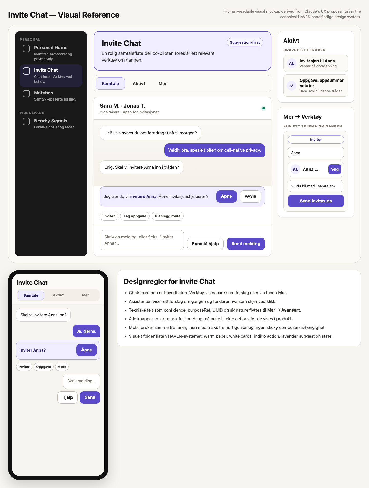
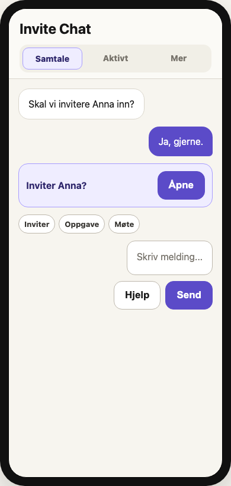

# Personal Co-Pilot Invite Chat Visual Design Guide

Date: 2026-05-06

Status: visual design guide and acceptance reference for `Invite Chat`.

## Source Status

Claude's latest `Invite Chat` response is a strong UX/information architecture
proposal, but it is not a graphic design proposal. It specifies tabs,
section hierarchy, copy rules, supported skeleton primitives, and implementation
constraints. It does not specify exact colors, borders, radius, typography, or
layout rhythm.

This guide therefore separates source truth from visual interpretation:

- Claude textual source: the `Invite Chat` UX proposal supplied by Kjetil.
- Visual source: canonical HAVEN visual tokens and prior Claude screenshots in
  `Artifacts/Claude_Visual_Design_References_2026-05-06/`.
- Generated visual reference: HTML/CSS mockup and PNGs in
  `Artifacts/Personal_CoPilot_Invite_Chat_Visual_2026-05-06/`.

## Human Visual Reference

Desktop and mobile reference:

Mobile-focused crop:

Source HTML/CSS:

- `../Artifacts/Personal_CoPilot_Invite_Chat_Visual_2026-05-06/invite-chat-visual-reference.html`

## Visual Thesis

`Invite Chat` should feel like a calm personal workspace where the conversation
is primary and tools appear only when useful. It should not look like a
developer console or a wall of forms.

The visual language is:

- warm paper canvas
- dark sidebar on Binding/full Co-Pilot shell
- white cards with warm borders
- indigo primary actions
- lavender suggestion states
- large readable chat text
- clear three-tab model: `Samtale`, `Aktivt`, `Mer`
- no technical identifiers in the primary view

## Layout

### Desktop

Use a three-zone Binding/Porthole layout when width allows:

| Zone | Visual treatment | Purpose |
|---|---|---|
| Left sidebar | Near-black rail, white labels, indigo selected item | Personal Co-Pilot navigation |
| Main content | Warm paper, lavender hero, tabs, chat card | Primary conversation and composer |
| Right context | White cards, warm borders | Active work and current helper preview |

The main `Invite Chat` surface still uses top-level `Tabs`:

- `Samtale` is default and visually dominant.
- `Aktivt` lists created/delegated work.
- `Mer` contains tools, provider, moderation, privacy, and advanced details.

### Mobile

Mobile keeps the same three tabs, but removes side panels:

- header title
- segmented tabs
- short message list
- one assistant suggestion row
- maximum three quick chips
- composer plus two actions

No sticky composer is required for V1. The composer can be the last section in
the `Samtale` tab.

## Concrete Tokens

Use the canonical values from
`HAVEN_Conference_CoPilot_Visual_Design_System_2026-05-06.md`.

Minimum required values for this surface:

| Token | Value | Use |
|---|---:|---|
| `--haven-paper` | `#f7f5ef` | page canvas |
| `--haven-surface` | `#ffffff` | chat card, context cards |
| `--haven-border` | `#d9d5cb` | card borders |
| `--haven-ink` | `#171717` | primary text |
| `--haven-muted` | `#77736b` | captions |
| `--haven-indigo` | `#5b4bc8` | primary action, outgoing message |
| `--haven-indigo-soft` | `#efedff` | suggestion strip, selected tab |
| `--haven-indigo-border` | `#a79cff` | selected/suggestion border |

## Typography

| Element | Target |
|---|---|
| Surface title | 32px / 38px, 700 |
| Tab label | 17px / 22px, 750 |
| Chat thread title | 22px / 28px, 700 |
| Chat message | 17px / 24px, 400 |
| Assistant strip | 16px / 22px, 400 with bold intent phrase |
| Button | 17px / 22px, 800 |
| Caption/status | 14px / 19px, 600 |

## Component Rules

### Tabs

- Container fill: warm raised paper.
- Border: 1px warm border.
- Radius: 16px.
- Selected: lavender fill plus indigo border.
- Labels: `Samtale`, `Aktivt`, `Mer`.

### Chat Card

- Fill: white.
- Border: warm 1px.
- Radius: 18px.
- Header has thread name and status, not raw IDs.
- Message area can use a subtle warm gradient or plain paper fill.

### Messages

- Incoming: white bubble, warm border, black text.
- Outgoing: indigo bubble, white text.
- Radius: 18px, with one tighter corner on sender side if supported.
- Message text should be body size, never tiny caption text.

### Assistant Strip

- Always one compact row.
- Fill: lavender.
- Border: indigo soft.
- Text explains the next action in human language.
- Buttons: `Åpne` primary and `Avvis` secondary.
- Never show `confidence`, `purposeRef`, `UUID`, or provider internals here.

### Quick Chips

- Maximum three or four visible chips.
- Rounded pills with warm border.
- Labels are verbs/nouns users recognize: `Inviter`, `Oppgave`, `Møte`.
- Overflow goes to `Mer -> Verktøy`.

### Composer

- Text area uses white fill, warm border, 14px radius.
- Placeholder gives examples: `Skriv en melding, eller f.eks. "inviter Anna"...`.
- Buttons: `Foreslå hjelp` secondary, `Send melding` primary.
- No sticky behavior required for portable V1.

### Active Work

- White card with list rows.
- Each row gets an icon/avatar, strong title, muted status.
- Created work appears here after explicit user action.
- Workbench forms do not appear here; forms live in `Mer -> Verktøy`.

### Tools

- Show only one helper form at a time.
- Use a picker in `Mer -> Verktøy` to select helper type.
- The selected helper gets normal form fields and one primary action.
- Agent execution requires review; no direct execution from chat tab.

## Copy Rules

Primary UI must not show:

- `confidence`
- `purposeRef`
- `UUID`
- `signatureBase64`
- raw `executionScope`
- raw provider availability strings

Replacement examples:

| Raw/technical | Product copy |
|---|---|
| `latestSuggestion.kind: invite` | `Jeg tror du vil invitere Anna.` |
| `confidence: 0.78` | hidden |
| `executionScope: local` | `Kjøres lokalt` only in provider/details context |
| `assistantProviders[].availability: ready` | `Klar` or hidden |
| `signatureBase64` | `Signatur (avansert)` under advanced toggle |

## Skeleton Mapping

Supported with today's portable primitives:

- `Tabs` for `Samtale`, `Aktivt`, `Mer`.
- `Section` for chat, suggestions, shortcuts, composer, privacy, advanced.
- `List` for messages, active modules, invitations, candidates.
- `HStack` for assistant strip buttons and chips.
- `TextArea` for composer and helper drafts.
- `TextField` for helper fields.
- `Picker` for active helper in `Mer`.
- `Toggle` for advanced details and thread-scoped learning when state exists.
- `Button` for every explicit action.

Renderer/cell work still required before claiming complete:

- state-driven `activeTab` navigation after accepting a suggestion, unless
  inline helper fallback is used
- thread-scoped learning toggle state/action
- exact helper form visibility if the renderer cannot conditionally show by
  picker value
- native bottom sheet or sticky composer, if desired later

## Acceptance Checklist

`Invite Chat` matches this guide when:

- `Samtale` is the default and visually dominant tab.
- The first view does not show all helpers at once.
- The assistant strip shows at most one actionable suggestion.
- Technical fields are hidden behind `Mer -> Avansert`.
- `Aktivt` contains created/delegated items, not creation forms.
- `Mer -> Verktøy` contains exactly one selected helper form.
- The surface uses paper, white cards, indigo actions, and lavender suggestion
  states.
- Mobile shows the same mental model without horizontal scroll.
- Every visible button has a real action contract or is disabled with a reason.

## Current Implementation Status

This guide is a target. It does not mean staging already matches.

Known status from the current design audit:

- Conference Porthole screenshots are archived and currently show a darker,
  denser dashboard language than the target visual system.
- Personal Co-Pilot needs a full Porthole/Binding screenshot capture pass before
  parity can be honestly marked as implemented.
- Claude's Invite Chat response should be treated as UX structure. The visual
  mockup in this artifact is the current human-visible design interpretation.
