# Argument- og beleggsanalyse av innovasjonspolitikk-rapporten

Dato: 2026-06-22  
Analysert tekst: `Deliverables/Norwegian_Innovation_Policy_Purpose_Goals_2026-06-21.md`  
Verktøy brukt: `Tools/TextReliability/text_reliability.py` etter kontrakten i `Book/27_Text_Reliability_Analysis.md`  
Råresultater:

- `Tools/TextReliability/results/norwegian_innovation_policy_purpose_2026-06-21.analysis.json`
- `Tools/TextReliability/results/norwegian_innovation_policy_purpose_2026-06-21.report.md`

## Metoden jeg faktisk brukte

Jeg behandlet teksten som et policyargument som må vurderes på tre nivåer:

1. **Tekstinternt:** Hva påstår teksten, og hvordan er argumentet bygd opp?
2. **Beleggsnivå:** Hvilke påstander er direkte støttet, indirekte støttet, konstruerte eller svake?
3. **Meta-nivå:** Er analysen god nok for formålet, og hva bør forbedres i neste runde?

Den lokale v1-verktøyet er deterministisk og konservativt. Det henter ikke webkilder, og markerer derfor kildebelegg som `not_checkable` når det bare ser lenker i teksten. Det er riktig oppførsel for v1, men betyr at den dype kvalitetsvurderingen må gjøres av en egen vurderingsfase.

Maskinell uttelling:

| Funn | Antall / vurdering | Tolkning |
| --- | ---: | --- |
| Ekstraherte claim-ankere | 234 | Overekstraherer, fordi overskrifter og tabellrader også fanges som claims. Nyttig som audit-ledger, ikke som ferdig argumentkart. |
| Retoriske funn | 21 | Nesten alt er kontrastmarkører som "men"; ingen funn ble flagget som beleggserstatning. |
| Inferred links | 3 | Heuristiske og for grove; må erstattes av menneskelig/LLM-basert argumentrekonstruksjon. |
| Kildegrunnlag | `unassessable` | Verktøyet verifiserte ikke kilder. |
| Logisk koherens | `mixed` | Maskinen fant struktur, men ikke en dypt rekonstruert argumentkjede. |
| Retorisk press | `low` | Teksten er mer forsiktig enn overtalende. |
| Usikkerhetshåndtering | `weak` i råverktøyet | Ikke fordi teksten nødvendigvis er svak, men fordi kildeverifisering ikke ble kjørt i dette verktøylaget. |

## Argumentstruktur

```mermaid
flowchart TD
    Q["Spørsmål: Finnes et eksplisitt, felles og testbart formål for norsk innovasjonspolitikk?"]

    T1["Hovedkonklusjon T1: NEI"]
    P1["Premiss P1: Kildene uttrykker ikke ett samlet formål"]
    P2["Premiss P2: Målene ligger på ulike nivåer: innsats, virkemiddel, utfall og effekt"]
    P3["Premiss P3: Ingen kilde sier eksplisitt at innovasjonspolitikken skal lukke produktivitets- og finansieringsgapet"]
    P4["Premiss P4: Virkemiddelapparatet behandles fragmentert"]

    C1["Motvekt C1: Det finnes likevel en konsistent retning"]
    E1["Belegg: Perspektivmeldingen peker på velferdsmodell, arbeidskraft og omstilling"]
    E2["Belegg: Langtidsplanen peker på konkurransekraft, innovasjonsevne og kunnskap i bruk"]
    E3["Belegg: FoU-strategien har 2 prosent-målet for næringslivets FoU"]
    E4["Belegg: Eksportsatsingen har 50 prosent-målet utenom olje og gass"]
    E5["Belegg: Digitaliseringsstrategien sier at digitalisering er virkemiddel, ikke endemål"]

    T2["Syntese T2: Produktivitet og bærekraftig velferd som beste konstruerte formål"]
    W1["Inferred warrant: Hvis dokumentene peker i samme retning, kan man konstruere en felles effektlogikk"]
    W2["Inferred warrant: Effektmål bør prioriteres over aktivitetsmål"]

    T3["Policyimplikasjon T3: Mål virkemidler på effekt, ikke bare aktivitet"]
    M1["Mål: FoU og kunnskapsintensitet"]
    M2["Mål: Eksport utenom petroleum"]
    M3["Mål: Produktivitetsbidrag"]
    M4["Mål: Kommersialisering og teknologidiffusjon"]
    M5["Mål: Offentlig sektor-effektivitet"]

    S1["Stresstest: Alternative formål"]
    A1["Alternativ: Grønn omstilling"]
    A2["Alternativ: Mer FoU"]
    A3["Alternativ: Flere oppstartsbedrifter"]
    A4["Alternativ: Regional utvikling"]
    R1["Resultat: Alle forklarer noe, men ingen forklarer hele argumentet alene"]

    Q --> T1
    T1 --> P1
    T1 --> P2
    T1 --> P3
    T1 --> P4

    Q --> C1
    C1 --> E1
    C1 --> E2
    C1 --> E3
    C1 --> E4
    C1 --> E5

    C1 --> W1
    W1 --> T2
    W2 --> T2
    T2 --> T3
    T3 --> M1
    T3 --> M2
    T3 --> M3
    T3 --> M4
    T3 --> M5

    T2 --> S1
    S1 --> A1
    S1 --> A2
    S1 --> A3
    S1 --> A4
    A1 --> R1
    A2 --> R1
    A3 --> R1
    A4 --> R1

    classDef conclusion fill:#d9ead3,stroke:#38761d,stroke-width:2px,color:#111;
    classDef premise fill:#cfe2f3,stroke:#1155cc,color:#111;
    classDef evidence fill:#fff2cc,stroke:#bf9000,color:#111;
    classDef risk fill:#f4cccc,stroke:#990000,color:#111;
    classDef warrant fill:#eadcf8,stroke:#674ea7,color:#111;

    class T1,T2,T3 conclusion;
    class P1,P2,P3,P4 premise;
    class E1,E2,E3,E4,E5,M1,M2,M3,M4,M5 evidence;
    class A1,A2,A3,A4,R1 risk;
    class W1,W2 warrant;
```

## Kvalitet på hovedpåstandene

| Påstandsklynge | Kvalitet | Hvorfor | Svakhet / risiko |
| --- | --- | --- | --- |
| **T1: Det finnes ikke ett eksplisitt, felles og operasjonelt overordnet formål.** | Sterk, men krever negativt bevis | Teksten har kildeinventar, evidensuttak og en egen "Hvorfor NEI"-del. Den viser at dokumentene peker i ulike retninger og at ingen kilde bærer hele formålet alene. | Negativt bevis er alltid sårbart: en oversett strategi, tildelingsbrev eller NOU kan inneholde en mer eksplisitt formulering. |
| **C1: Det finnes en konsistent retning på tvers av kildene.** | Sterk | Rapporten bruker flere uavhengige policyspor: perspektiv, FoU, eksport, gründere, digitalisering, teknologi og EU-diagnostikk. | "Konsistent retning" er en analytisk vurdering, ikke en direkte policysetning. |
| **T2: Produktivitet og velferdsstatens bærekraft er beste syntese.** | Middels til sterk | Denne syntesen forklarer flest deler av materialet: FoU, eksport, digitalisering, offentlig sektor og makroproblem. Rapporten merker den tydelig som "MIN KONSTRUKSJON". | Begrunnelsen kunne hatt en mer eksplisitt beslutningsrubrikk. I tabellen får FoU-syntesen og produktivitetssyntesen lik sum, men produktivitetssyntesen velges ut fra bedre makrofit. |
| **FoU 2 prosent og eksport 50 prosent er offisielle mål.** | Sterk | Disse er konkrete og kildeknyttede delmål i rapporten. | Råverktøyet verifiserte ikke lenkene. I en ny produksjonsrunde bør kilde-auditor hente nøyaktig avsnitt og publiseringsdato. |
| **0,3-0,5 prosentpoeng produktivitetsbidrag er et ansvarlig makromål.** | Middels / svakere | God som størrelsesorden og styringsforslag, ikke som dokumentert norsk mål. Rapporten markerer dette som konstruksjon. | Trenger SSB-/OECD-/FIN-baseline, produktivitetsmodell og sensitivitet for arbeidsinnsats, kapital, næringsstruktur og offentlig sektor. |
| **Innovasjon bør ikke måles som en enkel andel av verdiskaping.** | Sterk | Teoretisk rimelig: innovasjon er mekanisme og diffusjon, ikke én sektor. Rapportens alternative styringslogikk er mer presis. | Kan styrkes med økonomisk litteratur eller OECD/Eurostat-definisjoner av innovasjonsmåling. |
| **Virkemidler bør måles på effektkjede, ikke aktivitet.** | Sterk som policylogikk | Følger godt av skillet mellom innsats, virkemiddel, utfall og effekt. | Bør konkretiseres med datakilder og ansvarlige institusjoner for hver indikator. |
| **Stresstesten svekker en enkel JA-fortelling.** | Sterk | Rapporten vurderer alternativer og motbelegg i egen seksjon. | Kunne vært skarpere dersom hvert alternativ fikk eksplisitt "best case" før det avvises. |

## Retorikk og fremstillingsform

Teksten har lavt retorisk press. De retoriske funnene fra verktøyet er i hovedsak kontraster:

- "men ikke strategi"
- "men bredt"
- "men ikke formulert direkte"
- "men blir for smalt"
- "men ikke samlet"

Dette fungerer stort sett som presiserende avgrensning, ikke som retorikk som erstatter belegg. Teksten bruker også gode epistemiske markører:

- "MIN KONSTRUKSJON"
- "ikke formulert som én setning"
- "må hentes fra SSB/nasjonalregnskap"
- "ikke alene nok"
- "ikke brukt som bærende bevis"

Det viktigste retoriske risikopunktet er at uttrykk som "beste syntese" og "minst vilkårlig" kan høres sterkere ut enn beslutningsgrunnlaget. De bør bindes til en eksplisitt rubric: forklaringskraft, testbarhet, policyrelevans og kildebredde.

## Kvalitetsdom

**For et utforskende policy-notat:** Analysen er god nok. Den er kildebevisst, markerer egne konstruksjoner, viser motargumenter og unngår å late som dokumentene sier mer enn de gjør.

**For en beslutningsrapport, offentlig notat eller akademisk bruk:** Ikke god nok ennå. Den trenger en separat kilde-auditorfase, mer presise sitatankere, en datamodell for makroberegningen og en eksplisitt scoringrubrikk for hvorfor ett kandidatformål vinner over et annet.

Samlet vurdering:

| Dimensjon | Vurdering | Kommentar |
| --- | --- | --- |
| Claim-transparens | God | Hovedpåstander og konstruksjoner er tydelige. |
| Kildebredde | God | Mange relevante primærkilder er brukt. |
| Kildeverifisering i denne runden | Begrenset | Verktøyet kjørte `text_only`; det gjorde ikke fersk kilde-audit. |
| Logisk struktur | God, men kan strammes | Argumentet er tydelig, men dypere premise/warrant-kart manglet i originalrapporten. |
| Kvantitativ presisjon | Middels | Makroregnestykket er nyttig størrelsesorden, men ikke modellert nok. |
| Motargumenter | God | Alternativer og svakheter er med. |
| Beslutningsnytte | Middels til god | Tydelig retning, men trenger indikatoroperasjonalisering for styring. |

## Forslag til bedre neste runde

### 1. Juster konteksten

Legg ved eller pek eksplisitt på:

- målgruppe: departement, virkemiddelapparat, investor, forskningsgruppe eller intern HAVEN-strategi;
- beslutning som skal tas: formulere policy, kritisere rapport, lage indikatorrammeverk eller forberede møte;
- ønsket bevisnivå: tekstintern analyse, kildeverifisert analyse eller full forskningsgjennomgang;
- toleranse for egne konstruksjoner: lav, middels eller høy.

Dette vil gjøre "god nok"-grensen mye tydeligere.

### 2. Kjør analysen i fem faser

| Fase | Rolle | Output |
| --- | --- | --- |
| 1. Deterministisk claim-ledger | Lokal regelmotor | Eksakte quote anchors, char spans, claim types, source refs. |
| 2. Argumentrekonstruksjon | Sterk språkmodell / resonnementmodell | Premiss, konklusjon, warrant, missing bridge, counterclaim. |
| 3. Kilde-audit | Web/RAG/source auditor | `supported`, `partly_supported`, `contradicted`, `not_found`, med kildeankere. |
| 4. Skeptiker og steelman | To adskilte model-pass | Beste motargument og beste rettferdige versjon av teksten. |
| 5. Final adjudicator | Frontier reasoning + menneskelig review ved høy risiko | Endelig dom med usikkerhet, forbedringsliste og beslutningsnotat. |

### 3. Modellvalg uten å låse oss til dagsaktuelle modellnavn

Modellanbefalinger endrer seg raskt, så konkrete navn bør friskes opp før produksjonsrouting. Rollen jeg ville brukt er:

- **Billig strukturmodell:** for første claim-klynging og normalisering etter JSON-schema.
- **Frontier reasoning-modell:** for argumentstruktur, warrant-identifikasjon og konfliktvurdering.
- **Kilde-auditor med web/RAG:** for direkte belegg, motbelegg, dato og domeneavgrensning.
- **Lokal/norsk-capable modell:** for privat tekst, første sortering og robusthet mot datalekkasje.
- **Skeptikerpass med annen modellfamilie:** for å redusere modellspesifikke blindsoner.

### 4. Forbedre selve verktøyet

Nyttige forbedringer i `Tools/TextReliability/text_reliability.py`:

- filtrer bort Markdown-overskrifter og tabellseparatorer som claims;
- parser Markdown-tabeller som strukturerte rader i stedet for enkeltsetninger;
- lag claim-klynger, ikke bare claim-liste;
- la output ha `argument_graph` med noder og kanter egnet for Mermaid/Graphviz;
- legg inn `source_audit_required=true` per claim med URL;
- legg til egen score for "claim is author's construction" versus "direct source claim";
- la verktøyet produsere en kompakt `adjudication_brief.md` i tillegg til rårapporten.

### 5. Forbedre originalanalysen

For akkurat denne teksten ville jeg forbedret rapporten slik:

1. Legg inn en eksplisitt rubric for kandidat-formål før skårtabellen.
2. Lag en "claim -> kilde -> status"-tabell for 10-15 bærende påstander.
3. Skill strengere mellom offisielle mål, analytiske mål og illustrative makromål.
4. Verifiser Innovasjon Norge indirekte via tildelingsbrev, årsrapport eller regjeringens budsjettproposisjon hvis nettsiden er blokkert.
5. Bygg et lite SSB/FIN/OECD-appendiks for produktivitet, Fastlands-BNP og eksport utenom petroleum.
6. Kjør et eksplisitt steelman-pass: "Hva er den beste grunnen til å svare JA?"
7. Kjør et eksplisitt refutasjonspass: "Hvilken kilde ville mest sannsynlig veltet NEI-konklusjonen?"

## Kort sluttvurdering

Argumentet i rapporten er redelig og ganske sterkt som analytisk syntese, men svakere som endelig bevis for nasjonal policyintensjon. Det beste ved teksten er at den ikke overselger: den svarer NEI, markerer egne konstruksjoner og viser hva som mangler. Det viktigste neste løftet er ikke mer prosa, men bedre kobling mellom hver bærende påstand, et presist kildeanker og en eksplisitt vurderingsrubrikk.
