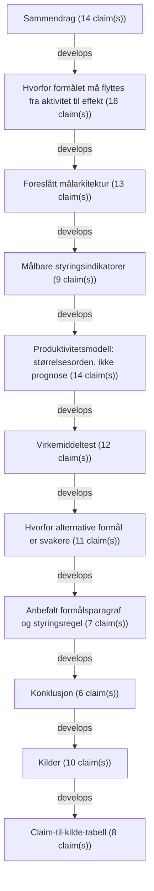

# Text Reliability Analysis Report

- Schema: `haven.text_reliability.analysis.v1`
- Analysis ID: `analysis-911006dbedadcf7f`
- Generated at: `2026-06-23T07:29:49Z`
- Source mode: `verifying`

## Inputs
- `text-file:Norwegian_Innovation_Policy_Measurable_Purpose_2026-06-23.md:f9929540d5f11e1c`: Et målbart formål for norsk innovasjonspolitikk (2561 words)

## Markdown Structure
- Sections: `13`
- Tables: `6`

## Claims
- `claim-0001` `cluster-0001` `factual` `assertive` `source_missing`: "Norsk innovasjonspolitikk trenger et tydeligere overordnet formål enn "mer innovasjon"."
- `claim-0002` `cluster-0001` `factual` `assertive` `source_missing`: "Innovasjon er ikke et mål i seg selv."
- `claim-0003` `cluster-0001` `factual` `moderated` `source_missing`: "Det er en samfunnsmekanisme: evnen til å utvikle, ta i bruk og skalere kunnskap, teknologi og nye løsninger slik at landet kan løse oppgaver bedre enn før."
- `claim-0004` `cluster-0001` `factual` `assertive` `source_missing`: "Det foreslåtte formålet er:"
- `claim-0005` `cluster-0001` `factual` `moderated` `source_missing`: "> **Formålet med norsk innovasjonspolitikk er å styrke Norges nasjonale omstillingsevne: evnen til å utvikle, ta i bruk og skalere kunnskap, teknologi og nye løsninger som varig øker produktivitet, lønnsom eksport, beredskap og offentlig tjenesteevne, slik at velferdsstaten, strategisk handlefrihet og gode arbeidsplasser i hele landet kan opprettholdes innenfor klima- og naturgrenser.**"
- `claim-0006` `cluster-0001` `factual` `assertive` `source_missing`: "Dette formålet samler de viktigste nasjonale interessene i én styrbar logikk."
- `claim-0007` `cluster-0001` `factual` `assertive` `needs_external_source_audit`: "[Perspektivmeldingen](https://www.regjeringen.no/no/dokumenter/meld.-st.-31-20232024/id3049290/?ch=1) peker på arbeidskraft, omstilling og fordeling som hovedutfordringer, og på behovet for å løse oppgavene smartere for å verne og videreutvikle velferdsmodellen."
- `claim-0008` `cluster-0001` `normative` `assertive` `needs_external_source_audit`: "[Langtidsplanen for forskning og høyere utdanning](https://www.regjeringen.no/no/dokumenter/meld.-st.-5-20222023/id2931400/?ch=1) peker på konkurransekraft, innovasjonsevne, bærekraft, beredskap og kunnskap som må tas i bruk."
- `claim-0009` `cluster-0001` `statistical` `assertive` `needs_external_source_audit`: "[FoU-strategien](https://www.regjeringen.no/no/dokumenter/strategi-for-a-oke-naringslivets-investering-i-fou/id3036876/?ch=1) setter et konkret mål om at næringslivets FoU skal utgjøre 2 prosent av BNP innen 2030."
- `claim-0010` `cluster-0001` `statistical` `assertive` `needs_external_source_audit`: "[Eksportreformen](https://www.regjeringen.no/no/dokumenter/hele-norge-eksporterer-2.0/id3029861/?ch=1) setter mål om 50 prosent økning i verdiskapende eksport utenom olje og gass innen 2030."
- `claim-0011` `cluster-0001` `factual` `assertive` `needs_external_source_audit`: "[Digitaliseringsstrategien](https://www.regjeringen.no/no/dokumenter/fremtidens-digitale-norge/id3054645/?ch=1) understreker at digitalisering er et verktøy, ikke et mål."
- `claim-0012` `cluster-0001` `factual` `assertive` `source_missing`: "Kildene peker dermed i samme retning, men uten å samle retningen i én målbar formålssetning."
- `claim-0013` `cluster-0001` `normative` `assertive` `source_missing`: "Et godt formål må kunne brukes på alle nivåer: nasjonal strategi, sektormål, virkemiddelapparat, regionale prioriteringer, porteføljestyring og evaluering av enkeltordninger."
- `claim-0014` `cluster-0001` `normative` `moderated` `source_missing`: "Hovedpoenget er enkelt: et virkemiddel bør regnes som innovasjonspolitikk bare dersom det kan forklare hvilken nasjonal omstillingsevne det styrker, hvordan effekten skal oppstå, og hvordan effekten kan måles."
- `claim-0015` `cluster-0002` `factual` `assertive` `source_missing`: "Norsk politikk har allerede mange relevante delmål."
- `claim-0016` `cluster-0002` `factual` `assertive` `source_missing`: "Problemet er at de ligger på ulike nivåer."
- `claim-0017` `cluster-0002` `factual` `assertive` `source_missing`: "FoU-andel er et innsatsmål."
- `claim-0018` `cluster-0002` `factual` `assertive` `source_missing`: "Digitalisering er et virkemiddel."
- `claim-0019` `cluster-0002` `factual` `assertive` `source_missing`: "Oppstartsbedrifter og eksport er utfall."
- `claim-0020` `cluster-0002` `factual` `assertive` `source_missing`: "Produktivitet, velferdsstatens bærekraft, strategisk handlefrihet og grønn omstilling er samfunnseffekter."
- `claim-0021` `cluster-0002` `factual` `assertive` `source_missing`: "Når disse nivåene blandes, blir innovasjonspolitikken lett en samling aktiviteter i stedet for en styringsmodell."
- `claim-0022` `cluster-0002` `factual` `assertive` `needs_external_source_audit`: "[Perspektivmeldingen](https://www.regjeringen.no/no/dokumenter/meld.-st.-31-20232024/id3049290/?ch=1) beskriver et langsiktig press på offentlige finanser og arbeidskraft."
- `claim-0023` `cluster-0002` `normative` `moderated` `source_missing`: "Meldingen legger vekt på stabil tilgang på gode offentlige tjenester, at velferdsordningene må være tilpasset offentlig sektors inntektsgrunnlag, og at private produksjonsmetoder og teknologi kan overføres til offentlig sektor for å gi økt produktivitet."
- `claim-0024` `cluster-0002` `causal` `assertive` `source_missing`: "Den strategiske koblingen til innovasjonspolitikk er derfor ikke at "mer teknologi" er bra, men at teknologi og nye arbeidsmåter må gi mer verdiskaping og bedre tjenester per ressursenhet."
- `claim-0025` `cluster-0002` `factual` `assertive` `needs_external_source_audit`: "[Langtidsplanen](https://www.regjeringen.no/no/dokumenter/meld.-st.-5-20222023/id2931400/?ch=1) gir den kunnskapspolitiske siden av samme problem."
- `claim-0026` `cluster-0002` `normative` `assertive` `source_missing`: "Kunnskap må ikke bare utvikles; den må gjøres tilgjengelig og tas i bruk i næringsliv, offentlig sektor og sivilsamfunn."
- `claim-0027` `cluster-0002` `factual` `assertive` `source_missing`: "Planen peker også på at samfunnets evne til å absorbere kunnskap ikke har holdt tritt med veksten i forskningsproduksjon."
- `claim-0028` `cluster-0002` `factual` `assertive` `source_missing`: "Det gjør absorpsjon, diffusjon og skalering til like sentrale begreper som forskning og oppfinnelse."
- `claim-0029` `cluster-0002` `factual` `assertive` `needs_external_source_audit`: "[FoU-strategien](https://www.regjeringen.no/no/dokumenter/strategi-for-a-oke-naringslivets-investering-i-fou/id3036876/?ch=1) for næringslivet gir et sterkt delmål, men viser også hvorfor delmålet ikke er nok alene."
- `claim-0030` `cluster-0002` `factual` `moderated` `source_missing`: "Mer FoU kan gi ny teknologi og nye løsninger, og styrke økonomiens evne til å ta i bruk teknologi."
- `claim-0031` `cluster-0002` `factual` `assertive` `source_missing`: "Samtidig er et FoU-mål først og fremst et mål for innsats og kapasitet."
- `claim-0032` `cluster-0002` `normative` `assertive` `source_missing`: "Det må kobles til produktivitet, kommersialisering, eksport, lønnsevne og offentlig verdiskaping for å bli et samfunnsmål."
- `claim-0033` `cluster-0003` `normative` `assertive` `source_missing`: "Formålet bør styres gjennom fem effektmål og et mindre sett med delindikatorer."
- `claim-0034` `cluster-0003` `normative` `assertive` `source_missing`: "Effektmålene må stå over sektorer og ordninger."
- `claim-0035` `cluster-0003` `factual` `moderated` `source_missing`: "Delindikatorene kan tilpasses hvert nivå i virkemiddelapparatet."
- `claim-0036` `cluster-0003` `normative` `assertive` `source_missing`: "Disse målene bør ikke forstås som fem parallelle siloer."
- `claim-0037` `cluster-0003` `normative` `assertive` `source_missing`: "De bør forstås som en samlet test: en ordning som gir mer FoU, men ikke styrker absorpsjon, kommersialisering eller produktivitet, har svak måloppnåelse."
- `claim-0038` `cluster-0003` `factual` `moderated` `source_missing`: "En digital satsing som ikke kan vise bedre tjenester, lavere ressursbruk eller høyere verdiskaping, er ikke et sterkt innovasjonstiltak."
- `claim-0039` `cluster-0003` `normative` `assertive` `source_missing`: "En eksportsatsing som bare følger valutakurs eller priser, bør ikke telle som full innovasjonseffekt."
- `claim-0040` `cluster-0004` `normative` `assertive` `source_missing`: "Indikatorene bør skille mellom innsats, kapasitet, utfall og effekt."
- `claim-0041` `cluster-0004` `factual` `assertive` `source_missing`: "Ellers blir målstyringen for enkel."
- `claim-0042` `cluster-0005` `normative` `assertive` `source_missing`: "Innovasjonspolitikk bør ikke måles som en fast andel av verdiskapingen."
- `claim-0043` `cluster-0005` `factual` `assertive` `source_missing`: "Innovasjon virker på tvers av sektorer og gjennom tid: bedre prosesser, ny teknologi, nye forretningsmodeller, kunnskapsopptak, bedre offentlige tjenester og nye eksportposisjoner."
- `claim-0044` `cluster-0005` `factual` `moderated` `source_missing`: "En bedre makrotest er hvor mye varig produktivitetsbidrag politikken realistisk kan bidra til."
- `claim-0045` `cluster-0005` `statistical` `assertive` `needs_external_source_audit`: "[Nasjonalbudsjettet 2026](https://www.regjeringen.no/no/aktuelt/nokkeltall-i-nasjonalbudsjettet-2026/id3124365/) oppgir at strukturelt oljekorrigert budsjettunderskudd er 579,4 mrd."
- `claim-0046` `cluster-0005` `statistical` `assertive` `source_missing`: "kroner i 2026, tilsvarende 13,1 prosent av trend-BNP for Fastlands-Norge."
- `claim-0047` `cluster-0005` `statistical` `assertive` `source_missing`: "Det gir en omtrentlig trend-BNP for Fastlands-Norge på 4 423 mrd."
- `claim-0048` `cluster-0005` `statistical` `assertive` `needs_external_source_audit`: "[Perspektivmeldingen](https://www.regjeringen.no/no/dokumenter/meld.-st.-31-20232024/id3049290/?ch=1) gir grunnlaget for å behandle langsiktig inndekningsbehov som andel av Fastlands-BNP; en ren skalering av 6,2 prosent på 2026-nivå tilsvarer om lag 274 mrd."
- `claim-0049` `cluster-0005` `factual` `assertive` `source_missing`: "Dette er ikke en prognose for 2060, men en størrelsesorden som viser hvorfor små varige forskjeller i produktivitetsvekst er makropolitisk viktige."
- `claim-0050` `cluster-0005` `causal` `assertive` `source_missing`: "En ansvarlig politisk målformulering er derfor ikke at innovasjonspolitikken alene skal "løse" finansieringsgapet."
- `claim-0051` `cluster-0005` `normative` `moderated` `source_missing`: "Det målbare kravet bør være at innovasjonspolitikken over tid kan dokumentere et varig bidrag til produktivitetsvekst, real eksportvekst, høyere kommersialisering og bedre offentlig ressursbruk."
- `claim-0052` `cluster-0005` `factual` `assertive` `source_missing`: "Et samlet bidrag på 0,3-0,5 prosentpoeng høyere årlig produktivitetsvekst i relevante deler av fastlandsøkonomien er et ambisiøst, men styrbart referansepunkt for videre modellering."
- `claim-0053` `cluster-0006` `normative` `assertive` `source_missing`: "Alle virkemidler bør vurderes mot fire spørsmål før de får plass i en samlet innovasjonspolitikk."
- `claim-0054` `cluster-0006` `factual` `assertive` `source_missing`: "Dette gir en tydeligere arbeidsdeling i virkemiddelapparatet."
- `claim-0055` `cluster-0007` `factual` `assertive` `needs_external_source_audit`: "**"Mer FoU" er for smalt.** [FoU-strategiens](https://www.regjeringen.no/no/dokumenter/strategi-for-a-oke-naringslivets-investering-i-fou/id3036876/?ch=1) 2-prosentmål er et viktig styringsmål."
- `claim-0056` `cluster-0007` `factual` `assertive` `source_missing`: "Men det er ikke nok å øke ressursbruken hvis kunnskapen ikke blir tatt i bruk, skalert og omsatt i produktivitet eller samfunnseffekt."
- `claim-0057` `cluster-0007` `factual` `assertive` `needs_external_source_audit`: "**"Flere gründere" er for smalt.** [Gründermeldingen](https://www.regjeringen.no/no/dokumenter/meld.-st.-6-20242025/id3068703/?ch=1) viser at nye bedrifter er viktige for omstilling, vekstbedrifter og nye løsninger."
- `claim-0058` `cluster-0007` `factual` `assertive` `source_missing`: "Likevel skjer mye av Norges produktivitets- og klimarelevante innovasjon også i etablerte bedrifter, offentlig sektor, industri- og energisystemer og leverandørkjeder."
- `claim-0059` `cluster-0007` `factual` `assertive` `needs_external_source_audit`: "**"Grønn og digital omstilling" er for bredt alene.** [Digitaliseringsstrategien](https://www.regjeringen.no/no/dokumenter/fremtidens-digitale-norge/id3054645/?ch=1) gjør digitalisering til et verktøy for større samfunnsmål."
- `claim-0060` `cluster-0007` `causal` `assertive` `source_missing`: "Grønn og digital omstilling må derfor kobles til produktivitet, eksport, tjenesteevne og beredskap."
- `claim-0061` `cluster-0007` `factual` `assertive` `source_missing`: "Ellers blir de retning uten effektkrav."
- `claim-0062` `cluster-0007` `normative` `assertive` `needs_external_source_audit`: "**"Eksportvekst" er nødvendig, men ikke dekkende.** [Hele Norge eksporterer](https://www.regjeringen.no/no/dokumenter/hele-norge-eksporterer-2.0/id3029861/?ch=1) gir eksport utenom olje og gass en tydelig rolle som mål for verdiskaping og omstilling."
- `claim-0063` `cluster-0007` `factual` `assertive` `source_missing`: "Men det fanger ikke offentlig sektor, hjemmemarkedets produktivitet, beredskap eller kunnskapsopptak bredt nok."
- `claim-0064` `cluster-0007` `normative` `assertive` `source_missing`: "**"Arbeidsplasser i hele landet" er et legitimt hensyn, men må presiseres.** Innovasjonspolitikken bør ikke bare måle geografisk fordeling av midler."
- `claim-0065` `cluster-0007` `normative` `assertive` `source_missing`: "Den bør måle produktive, bærekraftige arbeidsplasser som styrker regionale kapabiliteter og nasjonale verdikjeder."
- `claim-0066` `cluster-0008` `factual` `moderated` `source_missing`: "En kort formålsparagraf kan formuleres slik:"
- `claim-0067` `cluster-0008` `normative` `assertive` `source_missing`: "> **Norsk innovasjonspolitikk skal styrke nasjonal omstillingsevne ved å øke Norges evne til å utvikle, ta i bruk og skalere kunnskap, teknologi og nye løsninger som gir varig høyere produktivitet, lønnsom verdiskaping, offentlig tjenesteevne, beredskap og grønn omstilling.**"
- `claim-0068` `cluster-0008` `normative` `assertive` `source_missing`: "Den bør følges av en styringsregel:"
- `claim-0069` `cluster-0008` `normative` `assertive` `source_missing`: "> **Offentlige innovasjonsvirkemidler skal begrunnes med hvilken nasjonal interesse de styrker, hvilken addisjonalitet de gir, hvordan løsninger spres eller skaleres, og hvilken effekt som skal kunne dokumenteres etter 3, 5 og 10 år.**"
- `claim-0070` `cluster-0008` `factual` `assertive` `source_missing`: "Formålet gjør ikke politikken snevrere."
- `claim-0071` `cluster-0008` `factual` `assertive` `source_missing`: "Det gjør den mer ansvarlig."
- `claim-0072` `cluster-0008` `factual` `assertive` `source_missing`: "Det åpner for forskning, gründere, industri, offentlig sektor, digitalisering, kunstig intelligens, eksport, regional utvikling og samfunnsoppdrag, men krever at hvert nivå viser sin plass i en felles effektkjede."
- `claim-0073` `cluster-0009` `normative` `assertive` `source_missing`: "Norsk innovasjonspolitikk bør samle seg om nasjonal omstillingsevne som overordnet formål."
- `claim-0074` `cluster-0009` `factual` `assertive` `source_missing`: "Det er bredt nok til å romme forskning, teknologi, næringsutvikling, offentlig sektor, eksport, beredskap og grønn omstilling."
- `claim-0075` `cluster-0009` `factual` `assertive` `source_missing`: "Samtidig er det presist nok til å måles."
- `claim-0076` `cluster-0009` `factual` `assertive` `source_missing`: "Det avgjørende skiftet er å gå fra aktivitet til effekt."
- `claim-0077` `cluster-0009` `factual` `assertive` `source_missing`: "Mer FoU, flere oppstartsbedrifter, flere piloter, mer digitalisering og flere virkemidler er ikke nok dersom de ikke gir høyere produktivitet, bedre tjenester, mer lønnsom eksport, sterkere beredskap og raskere grønn omstilling."
- `claim-0078` `cluster-0009` `factual` `moderated` `source_missing`: "En innovasjonspolitikk som kan måles på disse effektene, kan også prioriteres, evalueres og forbedres."
- `claim-0079` `cluster-0010` `factual` `assertive` `needs_external_source_audit`: "5 (2022-2023), Langtidsplan for forskning og høyere utdanning 2023-2032](https://www.regjeringen.no/no/dokumenter/meld.-st.-5-20222023/id2931400/?ch=1)"
- `claim-0080` `cluster-0010` `factual` `assertive` `needs_external_source_audit`: "31 (2023-2024), Perspektivmeldingen 2024](https://www.regjeringen.no/no/dokumenter/meld.-st.-31-20232024/id3049290/?ch=1)"
- `claim-0081` `cluster-0010` `factual` `assertive` `needs_external_source_audit`: "- [Strategi for å øke næringslivets investeringer i forskning og utvikling](https://www.regjeringen.no/no/dokumenter/strategi-for-a-oke-naringslivets-investering-i-fou/id3036876/?ch=1)"
- `claim-0082` `cluster-0010` `factual` `assertive` `needs_external_source_audit`: "6 (2024-2025), Gründere og oppstartsbedrifter](https://www.regjeringen.no/no/dokumenter/meld.-st.-6-20242025/id3068703/?ch=1)"
- `claim-0083` `cluster-0010` `factual` `assertive` `needs_external_source_audit`: "- [Hele Norge eksporterer 2022-2024](https://www.regjeringen.no/no/dokumenter/hele-norge-eksporterer-2.0/id3029861/?ch=1)"
- `claim-0084` `cluster-0010` `factual` `assertive` `needs_external_source_audit`: "- [Fremtidens digitale Norge, nasjonal digitaliseringsstrategi 2024-2030](https://www.regjeringen.no/no/dokumenter/fremtidens-digitale-norge/id3054645/?ch=1)"
- `claim-0085` `cluster-0010` `factual` `assertive` `needs_external_source_audit`: "- [Veikart for det teknologibaserte næringslivet](https://www.regjeringen.no/no/dokumenter/veikart-for-det-teknologibaserte-naringslivet/id3116996/?ch=1)"
- `claim-0086` `cluster-0010` `factual` `assertive` `needs_external_source_audit`: "- [Nøkkeltall i Nasjonalbudsjettet 2026](https://www.regjeringen.no/no/aktuelt/nokkeltall-i-nasjonalbudsjettet-2026/id3124365/)"
- `claim-0087` `cluster-0010` `factual` `assertive` `needs_external_source_audit`: "- [SSB: Forskning og utvikling i næringslivet](https://www.ssb.no/teknologi-og-innovasjon/forskning-og-innovasjon-i-naeringslivet/statistikk/forskning-og-utvikling-i-naeringslivet)"
- `claim-0088` `cluster-0010` `factual` `assertive` `needs_external_source_audit`: "- [European Innovation Scoreboard 2025: Norway profile](https://ec.europa.eu/assets/rtd/eis/2025/ec_rtd_eis-country-profile-no.pdf)"
- `claim-0089` `cluster-0003` `factual` `moderated` `source_missing`: "| Formål | Nasjonal omstillingsevne | Bidrar politikken til at Norge kan fornye næringsliv og offentlig sektor raskere, tryggere og mer produktivt? |"
- `claim-0090` `cluster-0003` `factual` `assertive` `source_missing`: "| Effektmål 1 | Høyere produktivitet i Fastlands-Norge | Øker verdiskaping per timeverk eller tjenesteeffekt per ressursenhet i relevante sektorer? |"
- `claim-0091` `cluster-0003` `factual` `assertive` `source_missing`: "| Effektmål 2 | Mer kunnskapsintensivt næringsliv | Øker næringslivets FoU, absorpsjonsevne og kommersialisering, ikke bare antall prosjekter? |"
- `claim-0092` `cluster-0003` `factual` `assertive` `source_missing`: "| Effektmål 3 | Lønnsom eksport utenom petroleum | Øker real verdiskapende eksport fra skalerbare varer og tjenester utenom olje og gass? |"
- `claim-0093` `cluster-0003` `factual` `assertive` `source_missing`: "| Effektmål 4 | Offentlig tjenesteevne og arbeidskraftfrigjøring | Gir innovasjon bedre tjenester, lavere ressursvekst eller frigjort kompetanse til prioriterte oppgaver? |"
- `claim-0094` `cluster-0003` `factual` `assertive` `source_missing`: "| Effektmål 5 | Beredskap, strategisk handlefrihet og grønn omstilling | Styrker innovasjonen kritiske kapabiliteter, forsyningssikkerhet, klimaomstilling og naturhensyn? |"
- `claim-0095` `cluster-0004` `statistical` `assertive` `needs_external_source_audit`: "| Næringslivets FoU | Næringslivets FoU som andel av BNP | Offisielt mål: 2 prosent av BNP innen 2030. SSB oppgir 46,6 mrd. kroner i egenutført FoU i næringslivet i 2024 for foretak med minst 10 sysselsatte. [FoU-strategien](https://www.regjeringen.no/no/dokumenter/strategi-for-a-oke-naringslivets-investering-i-fou/id3036876/?ch=1), [SSB](https://www.ssb.no/teknologi-og-innovasjon/forskning-og-innovasjon-i-naeringslivet/statistikk/forskning-og-utvikling-i-naeringslivet) | Brukes som kapasitetsmål, ikke som endelig effektmål. |"
- `claim-0096` `cluster-0004` `normative` `assertive` `needs_external_source_audit`: "| Kunnskap i bruk | Andel bedrifter som tar i bruk avansert teknologi og forskningsbasert kunnskap | Langtidsplanen peker på et absorpsjonsgap: kunnskap må tas i bruk. EIS viser høy digital modenhet, men svakere resultater på intellectual assets og salg fra nye produkter. [Langtidsplanen](https://www.regjeringen.no/no/dokumenter/meld.-st.-5-20222023/id2931400/?ch=1), [European Innovation Scoreboard 2025](https://ec.europa.eu/assets/rtd/eis/2025/ec_rtd_eis-country-profile-no.pdf) | Brukes til å måle om FoU og digitalisering gir diffusjon. |"
- `claim-0097` `cluster-0004` `factual` `assertive` `needs_external_source_audit`: "| Kommersialisering | Salg fra nye produkter og tjenester, patenter, design og varemerker | EIS 2025 viser Norge som "Strong Innovator", men med lave relative utslag på intellectual assets og salg fra nye produkter. [European Innovation Scoreboard 2025](https://ec.europa.eu/assets/rtd/eis/2025/ec_rtd_eis-country-profile-no.pdf) | Brukes som test på om kunnskap blir økonomisk og samfunnsmessig anvendt. |"
- `claim-0098` `cluster-0004` `statistical` `assertive` `needs_external_source_audit`: "| Eksport | Real verdiskapende eksport utenom olje og gass | Offisielt mål: 50 prosent økning innen 2030. [Hele Norge eksporterer](https://www.regjeringen.no/no/dokumenter/hele-norge-eksporterer-2.0/id3029861/?ch=1) | Bør valuta-, pris- og petroleumskorrigeres så langt det lar seg gjøre. |"
- `claim-0099` `cluster-0004` `statistical` `assertive` `needs_external_source_audit`: "| Produktivitet | Bruttoprodukt per timeverk i markedsrettet fastlandsøkonomi og tjenesteeffekt per ressursenhet i offentlig sektor | Perspektivmeldingen peker på behovet for smartere ressursbruk; Nasjonalbudsjettet 2026 anslår vekst i BNP Fastlands-Norge til 2,1 prosent i 2026. [Perspektivmeldingen](https://www.regjeringen.no/no/dokumenter/meld.-st.-31-20232024/id3049290/?ch=1), [Nasjonalbudsjettet 2026](https://www.regjeringen.no/no/aktuelt/nokkeltall-i-nasjonalbudsjettet-2026/id3124365/) | Brukes som overordnet effektmål, med sektorspesifikke mål under. |"
- `claim-0100` `cluster-0004` `factual` `assertive` `needs_external_source_audit`: "| Offentlig tjenesteevne | Kvalitet, ventetid, brukerutfall, tidsbruk og ressursbruk per tjeneste | Perspektivmeldingen knytter bedre ressursbruk til velferdsmodellens bærekraft. [Perspektivmeldingen](https://www.regjeringen.no/no/dokumenter/meld.-st.-31-20232024/id3049290/?ch=1) | Brukes til å skille reell innovasjon fra systemanskaffelser. |"
- `claim-0101` `cluster-0004` `factual` `assertive` `needs_external_source_audit`: "| Strategisk handlefrihet | Teknologisk kapasitet, kritiske verdikjeder, forsyningssikkerhet og beredskapsrelevant kompetanse | Langtidsplanen og FoU-strategien kobler forskning, teknologi, sikkerhet og beredskap. [Langtidsplanen](https://www.regjeringen.no/no/dokumenter/meld.-st.-5-20222023/id2931400/?ch=1), [FoU-strategien](https://www.regjeringen.no/no/dokumenter/strategi-for-a-oke-naringslivets-investering-i-fou/id3036876/?ch=1) | Brukes som nasjonal-interessefilter for prioriteringer. |"
- `claim-0102` `cluster-0005` `statistical` `assertive` `source_missing`: "| 0,3 prosentpoeng | ca. 135 mrd. kroner | Makrorelevant, men ikke tilstrekkelig alene. |"
- `claim-0103` `cluster-0005` `statistical` `assertive` `source_missing`: "| 0,5 prosentpoeng | ca. 226 mrd. kroner | Nær størrelsesorden av et stort finansieringsbidrag. |"
- `claim-0104` `cluster-0005` `statistical` `assertive` `source_missing`: "| 1,0 prosentpoeng | ca. 463 mrd. kroner | Svært kraftig; bør behandles som øvre illustrasjon, ikke planforutsetning. |"
- `claim-0105` `cluster-0006` `normative` `assertive` `source_missing`: "| Nasjonal interesse | Hvilken nasjonal interesse styrkes: velferd, verdiskaping, beredskap, klima/natur, tillit eller hele landet? | Tiltak uten tydelig kobling bør finansieres som noe annet enn innovasjonspolitikk. |"
- `claim-0106` `cluster-0006` `normative` `assertive` `source_missing`: "| Addisjonalitet | Skjer det noe som ikke ville skjedd uten offentlig innsats? | Støtte bør ikke erstatte privat finansiering eller belønne aktivitet som uansett ville kommet. |"
- `claim-0107` `cluster-0006` `normative` `moderated` `source_missing`: "| Diffusjon og skalering | Kan løsningen tas i bruk av flere enn prosjektmottakeren? | Pilotpolitikk uten spredningsmekanisme bør nedprioriteres. |"
- `claim-0108` `cluster-0006` `normative` `assertive` `source_missing`: "| Målbar effekt | Hvilket utfall eller hvilken effekt skal kunne måles etter 3, 5 og 10 år? | Evaluering må vektlegge produktivitet, kommersialisering, eksport, tjenesteevne og beredskap. |"
- `claim-0109` `cluster-0006` `factual` `assertive` `source_missing`: "| Forsknings- og innovasjonsmidler | Bygge kunnskap, risikoavlaste tidlig fase og styrke absorpsjon | Privat FoU-utløsing, kunnskapsbruk, kommersialisering, samfunnsoppdrag og produktivitetsbidrag. |"
- `claim-0110` `cluster-0006` `factual` `assertive` `source_missing`: "| Gründer- og skaleringsvirkemidler | Få flere nye bedrifter med vekstkraft til å lykkes | Overlevelse, skalering, lønnsevne, eksport, kapitaltilgang og samfunnsproblem løst. |"
- `claim-0111` `cluster-0006` `factual` `assertive` `source_missing`: "| Eksportvirkemidler | Gjøre skalerbare løsninger konkurransedyktige internasjonalt | Real eksportvekst, nye markeder, verdikjedeplassering og ikke-petroleumsavhengighet. |"
- `claim-0112` `cluster-0006` `factual` `assertive` `source_missing`: "| Digitaliserings- og KI-tiltak | Øke kvalitet, tempo og produktivitet i privat og offentlig sektor | Tidsbesparelse, prosessforbedring, tjenestekvalitet, sikkerhet og faktisk bruk. |"
- `claim-0113` `cluster-0006` `factual` `assertive` `source_missing`: "| Regionale innovasjonsvirkemidler | Bygge produktive miljøer og industrielle kapabiliteter i hele landet | Produktive arbeidsplasser, kompetansebaser, klyngeeffekter og kobling til nasjonale verdikjeder. |"
- `claim-0114` `cluster-0006` `factual` `assertive` `source_missing`: "| Offentlige anskaffelser | Skape krevende hjemmemarked og trekke løsninger inn i drift | Skalert innføring, bedre tjenester, reduserte livsløpskostnader og leverandørutvikling. |"
- `claim-0115` `cluster-0011` `factual` `moderated` `needs_external_source_audit`: "| Norge mangler én samlet og operasjonell formålssetning for innovasjonspolitikken i de sentrale kildene. | Delvis støttet: [Perspektivmeldingen](https://www.regjeringen.no/no/dokumenter/meld.-st.-31-20232024/id3049290/?ch=1), [Langtidsplanen](https://www.regjeringen.no/no/dokumenter/meld.-st.-5-20222023/id2931400/?ch=1), [FoU-strategien](https://www.regjeringen.no/no/dokumenter/strategi-for-a-oke-naringslivets-investering-i-fou/id3036876/?ch=1) og [Hele Norge eksporterer](https://www.regjeringen.no/no/dokumenter/hele-norge-eksporterer-2.0/id3029861/?ch=1) viser mange delmål, men ikke én samlet formulering. | Analytisk vurdering basert på kildegjennomgang. | Et annet dokument, tildelingsbrev eller NOU kan ha en mer eksplisitt formulering. |"
- `claim-0116` `cluster-0011` `normative` `assertive` `needs_external_source_audit`: "| Nasjonal omstillingsevne er en bedre samlende formulering enn "mer innovasjon". | Støttet som syntese av [Perspektivmeldingen](https://www.regjeringen.no/no/dokumenter/meld.-st.-31-20232024/id3049290/?ch=1), [Langtidsplanen](https://www.regjeringen.no/no/dokumenter/meld.-st.-5-20222023/id2931400/?ch=1), [FoU-strategien](https://www.regjeringen.no/no/dokumenter/strategi-for-a-oke-naringslivets-investering-i-fou/id3036876/?ch=1) og [Digitaliseringsstrategien](https://www.regjeringen.no/no/dokumenter/fremtidens-digitale-norge/id3054645/?ch=1). | Normativ og analytisk formulering, ikke offisielt sitat. | Må vedtas politisk før det er et faktisk formål. |"
- `claim-0117` `cluster-0011` `factual` `assertive` `needs_external_source_audit`: "| FoU-målet er et innsats- og kapasitetsmål, ikke et samfunnseffektmål. | Støttet av [FoU-strategiens](https://www.regjeringen.no/no/dokumenter/strategi-for-a-oke-naringslivets-investering-i-fou/id3036876/?ch=1) 2-prosentmål og [Langtidsplanens](https://www.regjeringen.no/no/dokumenter/meld.-st.-5-20222023/id2931400/?ch=1) vekt på bruk av kunnskap. | Høy. | Krever supplerende indikatorer for effekt. |"
- `claim-0118` `cluster-0011` `normative` `moderated` `needs_external_source_audit`: "| Digitalisering bør behandles som virkemiddel, ikke sluttmål. | Direkte støttet av [digitaliseringsstrategiens](https://www.regjeringen.no/no/dokumenter/fremtidens-digitale-norge/id3054645/?ch=1) forord. | Høy. | Digital modenhet kan likevel være et viktig delmål. |"
- `claim-0119` `cluster-0011` `normative` `assertive` `needs_external_source_audit`: "| Eksport utenom olje og gass er et sentralt omstillingsmål. | Direkte støttet av [Hele Norge eksporterer](https://www.regjeringen.no/no/dokumenter/hele-norge-eksporterer-2.0/id3029861/?ch=1). | Høy. | Må renses for valuta, priser og nominelle effekter. |"
- `claim-0120` `cluster-0011` `factual` `assertive` `needs_external_source_audit`: "| Norge har sterke innovasjonsforutsetninger, men svakere kommersialiseringsutslag på enkelte indikatorer. | Støttet av [European Innovation Scoreboard 2025](https://ec.europa.eu/assets/rtd/eis/2025/ec_rtd_eis-country-profile-no.pdf). | Høy som komparativ diagnose. | EU-indekser er ikke alene tilstrekkelige som nasjonal styringsmodell. |"
- `claim-0121` `cluster-0011` `normative` `assertive` `needs_external_source_audit`: "| Produktivitetsbidrag på 0,3-0,5 prosentpoeng er et rimelig referansepunkt for videre modellering. | Delvis støttet: makrotallene er forankret i [Nasjonalbudsjettet 2026](https://www.regjeringen.no/no/aktuelt/nokkeltall-i-nasjonalbudsjettet-2026/id3124365/) og [Perspektivmeldingen](https://www.regjeringen.no/no/dokumenter/meld.-st.-31-20232024/id3049290/?ch=1), mens intervallet er et analytisk forslag. | Middels. | Må kvalitetssikres med SSB/FIN/OECD-modeller og sektorfordeling. |"
- `claim-0122` `cluster-0011` `normative` `assertive` `needs_external_source_audit`: "| Offentlig sektor-innovasjon må inngå i formålet. | Støttet av [Perspektivmeldingens](https://www.regjeringen.no/no/dokumenter/meld.-st.-31-20232024/id3049290/?ch=1) vekt på smartere ressursbruk og offentlig tjenesteevne. | Høy. | Må operasjonaliseres uten å redusere kvalitet til kostnadsmål. |"

## Claim Clusters
| Cluster | Title | Claims | Source audit statuses | Representative claims |
| --- | --- | ---: | --- | --- |
| `cluster-0001` | Sammendrag | 14 | source_missing:9, needs_external_source_audit:5 | claim-0001 / claim-0002 / claim-0003 |
| `cluster-0002` | Hvorfor formålet må flyttes fra aktivitet til effekt | 18 | source_missing:15, needs_external_source_audit:3 | claim-0015 / claim-0016 / claim-0017 |
| `cluster-0003` | Foreslått målarkitektur | 13 | source_missing:13 | claim-0033 / claim-0034 / claim-0035 |
| `cluster-0004` | Målbare styringsindikatorer | 9 | source_missing:2, needs_external_source_audit:7 | claim-0040 / claim-0041 / claim-0095 |
| `cluster-0005` | Produktivitetsmodell: størrelsesorden, ikke prognose | 14 | source_missing:12, needs_external_source_audit:2 | claim-0042 / claim-0043 / claim-0044 |
| `cluster-0006` | Virkemiddeltest | 12 | source_missing:12 | claim-0053 / claim-0054 / claim-0105 |
| `cluster-0007` | Hvorfor alternative formål er svakere | 11 | needs_external_source_audit:4, source_missing:7 | claim-0055 / claim-0056 / claim-0057 |
| `cluster-0008` | Anbefalt formålsparagraf og styringsregel | 7 | source_missing:7 | claim-0066 / claim-0067 / claim-0068 |
| `cluster-0009` | Konklusjon | 6 | source_missing:6 | claim-0073 / claim-0074 / claim-0075 |
| `cluster-0010` | Kilder | 10 | needs_external_source_audit:10 | claim-0079 / claim-0080 / claim-0081 |
| `cluster-0011` | Claim-til-kilde-tabell | 8 | needs_external_source_audit:8 | claim-0115 / claim-0116 / claim-0117 |

## Claim Source Matrix
| Claim | Cluster | Section | Type | Audit status | Evidence grade | Sources | Quote |
| --- | --- | --- | --- | --- | --- | --- | --- |
| `claim-0001` | `cluster-0001` | Sammendrag | factual | `source_missing` | no_source_anchor |  | Norsk innovasjonspolitikk trenger et tydeligere overordnet formål enn "mer innovasjon". |
| `claim-0002` | `cluster-0001` | Sammendrag | factual | `source_missing` | no_source_anchor |  | Innovasjon er ikke et mål i seg selv. |
| `claim-0003` | `cluster-0001` | Sammendrag | factual | `source_missing` | no_source_anchor |  | Det er en samfunnsmekanisme: evnen til å utvikle, ta i bruk og skalere kunnskap, teknologi og nye løsninger slik at l... |
| `claim-0004` | `cluster-0001` | Sammendrag | factual | `source_missing` | no_source_anchor |  | Det foreslåtte formålet er: |
| `claim-0005` | `cluster-0001` | Sammendrag | factual | `source_missing` | no_source_anchor |  | > **Formålet med norsk innovasjonspolitikk er å styrke Norges nasjonale omstillingsevne: evnen til å utvikle, ta i br... |
| `claim-0006` | `cluster-0001` | Sammendrag | factual | `source_missing` | no_source_anchor |  | Dette formålet samler de viktigste nasjonale interessene i én styrbar logikk. |
| `claim-0007` | `cluster-0001` | Sammendrag | factual | `needs_external_source_audit` | source_named_unverified | https://www.regjeringen.no/no/dokumenter/meld.-st.-31-20232024/id3049290/?ch=1 | [Perspektivmeldingen](https://www.regjeringen.no/no/dokumenter/meld.-st.-31-20232024/id3049290/?ch=1) peker på arbeid... |
| `claim-0008` | `cluster-0001` | Sammendrag | normative | `needs_external_source_audit` | source_named_unverified | https://www.regjeringen.no/no/dokumenter/meld.-st.-5-20222023/id2931400/?ch=1 | [Langtidsplanen for forskning og høyere utdanning](https://www.regjeringen.no/no/dokumenter/meld.-st.-5-20222023/id29... |
| `claim-0009` | `cluster-0001` | Sammendrag | statistical | `needs_external_source_audit` | source_named_unverified | https://www.regjeringen.no/no/dokumenter/strategi-for-a-oke-naringslivets-investering-i... | [FoU-strategien](https://www.regjeringen.no/no/dokumenter/strategi-for-a-oke-naringslivets-investering-i-fou/id303687... |
| `claim-0010` | `cluster-0001` | Sammendrag | statistical | `needs_external_source_audit` | source_named_unverified | https://www.regjeringen.no/no/dokumenter/hele-norge-eksporterer-2.0/id3029861/?ch=1 | [Eksportreformen](https://www.regjeringen.no/no/dokumenter/hele-norge-eksporterer-2.0/id3029861/?ch=1) setter mål om ... |
| `claim-0011` | `cluster-0001` | Sammendrag | factual | `needs_external_source_audit` | source_named_unverified | https://www.regjeringen.no/no/dokumenter/fremtidens-digitale-norge/id3054645/?ch=1 | [Digitaliseringsstrategien](https://www.regjeringen.no/no/dokumenter/fremtidens-digitale-norge/id3054645/?ch=1) under... |
| `claim-0012` | `cluster-0001` | Sammendrag | factual | `source_missing` | no_source_anchor |  | Kildene peker dermed i samme retning, men uten å samle retningen i én målbar formålssetning. |
| `claim-0013` | `cluster-0001` | Sammendrag | normative | `source_missing` | no_source_anchor |  | Et godt formål må kunne brukes på alle nivåer: nasjonal strategi, sektormål, virkemiddelapparat, regionale prioriteri... |
| `claim-0014` | `cluster-0001` | Sammendrag | normative | `source_missing` | no_source_anchor |  | Hovedpoenget er enkelt: et virkemiddel bør regnes som innovasjonspolitikk bare dersom det kan forklare hvilken nasjon... |
| `claim-0015` | `cluster-0002` | Hvorfor formålet må flyttes fra aktivitet til effekt | factual | `source_missing` | no_source_anchor |  | Norsk politikk har allerede mange relevante delmål. |
| `claim-0016` | `cluster-0002` | Hvorfor formålet må flyttes fra aktivitet til effekt | factual | `source_missing` | no_source_anchor |  | Problemet er at de ligger på ulike nivåer. |
| `claim-0017` | `cluster-0002` | Hvorfor formålet må flyttes fra aktivitet til effekt | factual | `source_missing` | no_source_anchor |  | FoU-andel er et innsatsmål. |
| `claim-0018` | `cluster-0002` | Hvorfor formålet må flyttes fra aktivitet til effekt | factual | `source_missing` | no_source_anchor |  | Digitalisering er et virkemiddel. |
| `claim-0019` | `cluster-0002` | Hvorfor formålet må flyttes fra aktivitet til effekt | factual | `source_missing` | no_source_anchor |  | Oppstartsbedrifter og eksport er utfall. |
| `claim-0020` | `cluster-0002` | Hvorfor formålet må flyttes fra aktivitet til effekt | factual | `source_missing` | no_source_anchor |  | Produktivitet, velferdsstatens bærekraft, strategisk handlefrihet og grønn omstilling er samfunnseffekter. |
| `claim-0021` | `cluster-0002` | Hvorfor formålet må flyttes fra aktivitet til effekt | factual | `source_missing` | no_source_anchor |  | Når disse nivåene blandes, blir innovasjonspolitikken lett en samling aktiviteter i stedet for en styringsmodell. |
| `claim-0022` | `cluster-0002` | Hvorfor formålet må flyttes fra aktivitet til effekt | factual | `needs_external_source_audit` | source_named_unverified | https://www.regjeringen.no/no/dokumenter/meld.-st.-31-20232024/id3049290/?ch=1 | [Perspektivmeldingen](https://www.regjeringen.no/no/dokumenter/meld.-st.-31-20232024/id3049290/?ch=1) beskriver et la... |
| `claim-0023` | `cluster-0002` | Hvorfor formålet må flyttes fra aktivitet til effekt | normative | `source_missing` | no_source_anchor |  | Meldingen legger vekt på stabil tilgang på gode offentlige tjenester, at velferdsordningene må være tilpasset offentl... |
| `claim-0024` | `cluster-0002` | Hvorfor formålet må flyttes fra aktivitet til effekt | causal | `source_missing` | no_source_anchor |  | Den strategiske koblingen til innovasjonspolitikk er derfor ikke at "mer teknologi" er bra, men at teknologi og nye a... |
| `claim-0025` | `cluster-0002` | Hvorfor formålet må flyttes fra aktivitet til effekt | factual | `needs_external_source_audit` | source_named_unverified | https://www.regjeringen.no/no/dokumenter/meld.-st.-5-20222023/id2931400/?ch=1 | [Langtidsplanen](https://www.regjeringen.no/no/dokumenter/meld.-st.-5-20222023/id2931400/?ch=1) gir den kunnskapspoli... |
| `claim-0026` | `cluster-0002` | Hvorfor formålet må flyttes fra aktivitet til effekt | normative | `source_missing` | no_source_anchor |  | Kunnskap må ikke bare utvikles; den må gjøres tilgjengelig og tas i bruk i næringsliv, offentlig sektor og sivilsamfunn. |
| `claim-0027` | `cluster-0002` | Hvorfor formålet må flyttes fra aktivitet til effekt | factual | `source_missing` | no_source_anchor |  | Planen peker også på at samfunnets evne til å absorbere kunnskap ikke har holdt tritt med veksten i forskningsproduks... |
| `claim-0028` | `cluster-0002` | Hvorfor formålet må flyttes fra aktivitet til effekt | factual | `source_missing` | no_source_anchor |  | Det gjør absorpsjon, diffusjon og skalering til like sentrale begreper som forskning og oppfinnelse. |
| `claim-0029` | `cluster-0002` | Hvorfor formålet må flyttes fra aktivitet til effekt | factual | `needs_external_source_audit` | source_named_unverified | https://www.regjeringen.no/no/dokumenter/strategi-for-a-oke-naringslivets-investering-i... | [FoU-strategien](https://www.regjeringen.no/no/dokumenter/strategi-for-a-oke-naringslivets-investering-i-fou/id303687... |
| `claim-0030` | `cluster-0002` | Hvorfor formålet må flyttes fra aktivitet til effekt | factual | `source_missing` | no_source_anchor |  | Mer FoU kan gi ny teknologi og nye løsninger, og styrke økonomiens evne til å ta i bruk teknologi. |
| `claim-0031` | `cluster-0002` | Hvorfor formålet må flyttes fra aktivitet til effekt | factual | `source_missing` | no_source_anchor |  | Samtidig er et FoU-mål først og fremst et mål for innsats og kapasitet. |
| `claim-0032` | `cluster-0002` | Hvorfor formålet må flyttes fra aktivitet til effekt | normative | `source_missing` | no_source_anchor |  | Det må kobles til produktivitet, kommersialisering, eksport, lønnsevne og offentlig verdiskaping for å bli et samfunn... |
| `claim-0033` | `cluster-0003` | Foreslått målarkitektur | normative | `source_missing` | no_source_anchor |  | Formålet bør styres gjennom fem effektmål og et mindre sett med delindikatorer. |
| `claim-0034` | `cluster-0003` | Foreslått målarkitektur | normative | `source_missing` | no_source_anchor |  | Effektmålene må stå over sektorer og ordninger. |
| `claim-0035` | `cluster-0003` | Foreslått målarkitektur | factual | `source_missing` | no_source_anchor |  | Delindikatorene kan tilpasses hvert nivå i virkemiddelapparatet. |
| `claim-0036` | `cluster-0003` | Foreslått målarkitektur | normative | `source_missing` | no_source_anchor |  | Disse målene bør ikke forstås som fem parallelle siloer. |
| `claim-0037` | `cluster-0003` | Foreslått målarkitektur | normative | `source_missing` | no_source_anchor |  | De bør forstås som en samlet test: en ordning som gir mer FoU, men ikke styrker absorpsjon, kommersialisering eller p... |
| `claim-0038` | `cluster-0003` | Foreslått målarkitektur | factual | `source_missing` | no_source_anchor |  | En digital satsing som ikke kan vise bedre tjenester, lavere ressursbruk eller høyere verdiskaping, er ikke et sterkt... |
| `claim-0039` | `cluster-0003` | Foreslått målarkitektur | normative | `source_missing` | no_source_anchor |  | En eksportsatsing som bare følger valutakurs eller priser, bør ikke telle som full innovasjonseffekt. |
| `claim-0040` | `cluster-0004` | Målbare styringsindikatorer | normative | `source_missing` | no_source_anchor |  | Indikatorene bør skille mellom innsats, kapasitet, utfall og effekt. |
| `claim-0041` | `cluster-0004` | Målbare styringsindikatorer | factual | `source_missing` | no_source_anchor |  | Ellers blir målstyringen for enkel. |
| `claim-0042` | `cluster-0005` | Produktivitetsmodell: størrelsesorden, ikke prognose | normative | `source_missing` | no_source_anchor |  | Innovasjonspolitikk bør ikke måles som en fast andel av verdiskapingen. |
| `claim-0043` | `cluster-0005` | Produktivitetsmodell: størrelsesorden, ikke prognose | factual | `source_missing` | no_source_anchor |  | Innovasjon virker på tvers av sektorer og gjennom tid: bedre prosesser, ny teknologi, nye forretningsmodeller, kunnsk... |
| `claim-0044` | `cluster-0005` | Produktivitetsmodell: størrelsesorden, ikke prognose | factual | `source_missing` | no_source_anchor |  | En bedre makrotest er hvor mye varig produktivitetsbidrag politikken realistisk kan bidra til. |
| `claim-0045` | `cluster-0005` | Produktivitetsmodell: størrelsesorden, ikke prognose | statistical | `needs_external_source_audit` | source_named_unverified | https://www.regjeringen.no/no/aktuelt/nokkeltall-i-nasjonalbudsjettet-2026/id3124365/ | [Nasjonalbudsjettet 2026](https://www.regjeringen.no/no/aktuelt/nokkeltall-i-nasjonalbudsjettet-2026/id3124365/) oppg... |
| `claim-0046` | `cluster-0005` | Produktivitetsmodell: størrelsesorden, ikke prognose | statistical | `source_missing` | no_source_anchor |  | kroner i 2026, tilsvarende 13,1 prosent av trend-BNP for Fastlands-Norge. |
| `claim-0047` | `cluster-0005` | Produktivitetsmodell: størrelsesorden, ikke prognose | statistical | `source_missing` | no_source_anchor |  | Det gir en omtrentlig trend-BNP for Fastlands-Norge på 4 423 mrd. |
| `claim-0048` | `cluster-0005` | Produktivitetsmodell: størrelsesorden, ikke prognose | statistical | `needs_external_source_audit` | source_named_unverified | https://www.regjeringen.no/no/dokumenter/meld.-st.-31-20232024/id3049290/?ch=1 | [Perspektivmeldingen](https://www.regjeringen.no/no/dokumenter/meld.-st.-31-20232024/id3049290/?ch=1) gir grunnlaget ... |
| `claim-0049` | `cluster-0005` | Produktivitetsmodell: størrelsesorden, ikke prognose | factual | `source_missing` | no_source_anchor |  | Dette er ikke en prognose for 2060, men en størrelsesorden som viser hvorfor små varige forskjeller i produktivitetsv... |
| `claim-0050` | `cluster-0005` | Produktivitetsmodell: størrelsesorden, ikke prognose | causal | `source_missing` | no_source_anchor |  | En ansvarlig politisk målformulering er derfor ikke at innovasjonspolitikken alene skal "løse" finansieringsgapet. |
| `claim-0051` | `cluster-0005` | Produktivitetsmodell: størrelsesorden, ikke prognose | normative | `source_missing` | no_source_anchor |  | Det målbare kravet bør være at innovasjonspolitikken over tid kan dokumentere et varig bidrag til produktivitetsvekst... |
| `claim-0052` | `cluster-0005` | Produktivitetsmodell: størrelsesorden, ikke prognose | factual | `source_missing` | no_source_anchor |  | Et samlet bidrag på 0,3-0,5 prosentpoeng høyere årlig produktivitetsvekst i relevante deler av fastlandsøkonomien er ... |
| `claim-0053` | `cluster-0006` | Virkemiddeltest | normative | `source_missing` | no_source_anchor |  | Alle virkemidler bør vurderes mot fire spørsmål før de får plass i en samlet innovasjonspolitikk. |
| `claim-0054` | `cluster-0006` | Virkemiddeltest | factual | `source_missing` | no_source_anchor |  | Dette gir en tydeligere arbeidsdeling i virkemiddelapparatet. |
| `claim-0055` | `cluster-0007` | Hvorfor alternative formål er svakere | factual | `needs_external_source_audit` | source_named_unverified | https://www.regjeringen.no/no/dokumenter/strategi-for-a-oke-naringslivets-investering-i... | **"Mer FoU" er for smalt.** [FoU-strategiens](https://www.regjeringen.no/no/dokumenter/strategi-for-a-oke-naringslive... |
| `claim-0056` | `cluster-0007` | Hvorfor alternative formål er svakere | factual | `source_missing` | no_source_anchor |  | Men det er ikke nok å øke ressursbruken hvis kunnskapen ikke blir tatt i bruk, skalert og omsatt i produktivitet elle... |
| `claim-0057` | `cluster-0007` | Hvorfor alternative formål er svakere | factual | `needs_external_source_audit` | source_named_unverified | https://www.regjeringen.no/no/dokumenter/meld.-st.-6-20242025/id3068703/?ch=1 | **"Flere gründere" er for smalt.** [Gründermeldingen](https://www.regjeringen.no/no/dokumenter/meld.-st.-6-20242025/i... |
| `claim-0058` | `cluster-0007` | Hvorfor alternative formål er svakere | factual | `source_missing` | no_source_anchor |  | Likevel skjer mye av Norges produktivitets- og klimarelevante innovasjon også i etablerte bedrifter, offentlig sektor... |
| `claim-0059` | `cluster-0007` | Hvorfor alternative formål er svakere | factual | `needs_external_source_audit` | source_named_unverified | https://www.regjeringen.no/no/dokumenter/fremtidens-digitale-norge/id3054645/?ch=1 | **"Grønn og digital omstilling" er for bredt alene.** [Digitaliseringsstrategien](https://www.regjeringen.no/no/dokum... |
| `claim-0060` | `cluster-0007` | Hvorfor alternative formål er svakere | causal | `source_missing` | no_source_anchor |  | Grønn og digital omstilling må derfor kobles til produktivitet, eksport, tjenesteevne og beredskap. |
| `claim-0061` | `cluster-0007` | Hvorfor alternative formål er svakere | factual | `source_missing` | no_source_anchor |  | Ellers blir de retning uten effektkrav. |
| `claim-0062` | `cluster-0007` | Hvorfor alternative formål er svakere | normative | `needs_external_source_audit` | source_named_unverified | https://www.regjeringen.no/no/dokumenter/hele-norge-eksporterer-2.0/id3029861/?ch=1 | **"Eksportvekst" er nødvendig, men ikke dekkende.** [Hele Norge eksporterer](https://www.regjeringen.no/no/dokumenter... |
| `claim-0063` | `cluster-0007` | Hvorfor alternative formål er svakere | factual | `source_missing` | no_source_anchor |  | Men det fanger ikke offentlig sektor, hjemmemarkedets produktivitet, beredskap eller kunnskapsopptak bredt nok. |
| `claim-0064` | `cluster-0007` | Hvorfor alternative formål er svakere | normative | `source_missing` | no_source_anchor |  | **"Arbeidsplasser i hele landet" er et legitimt hensyn, men må presiseres.** Innovasjonspolitikken bør ikke bare måle... |
| `claim-0065` | `cluster-0007` | Hvorfor alternative formål er svakere | normative | `source_missing` | no_source_anchor |  | Den bør måle produktive, bærekraftige arbeidsplasser som styrker regionale kapabiliteter og nasjonale verdikjeder. |
| `claim-0066` | `cluster-0008` | Anbefalt formålsparagraf og styringsregel | factual | `source_missing` | no_source_anchor |  | En kort formålsparagraf kan formuleres slik: |
| `claim-0067` | `cluster-0008` | Anbefalt formålsparagraf og styringsregel | normative | `source_missing` | no_source_anchor |  | > **Norsk innovasjonspolitikk skal styrke nasjonal omstillingsevne ved å øke Norges evne til å utvikle, ta i bruk og ... |
| `claim-0068` | `cluster-0008` | Anbefalt formålsparagraf og styringsregel | normative | `source_missing` | no_source_anchor |  | Den bør følges av en styringsregel: |
| `claim-0069` | `cluster-0008` | Anbefalt formålsparagraf og styringsregel | normative | `source_missing` | no_source_anchor |  | > **Offentlige innovasjonsvirkemidler skal begrunnes med hvilken nasjonal interesse de styrker, hvilken addisjonalite... |
| `claim-0070` | `cluster-0008` | Anbefalt formålsparagraf og styringsregel | factual | `source_missing` | no_source_anchor |  | Formålet gjør ikke politikken snevrere. |
| `claim-0071` | `cluster-0008` | Anbefalt formålsparagraf og styringsregel | factual | `source_missing` | no_source_anchor |  | Det gjør den mer ansvarlig. |
| `claim-0072` | `cluster-0008` | Anbefalt formålsparagraf og styringsregel | factual | `source_missing` | no_source_anchor |  | Det åpner for forskning, gründere, industri, offentlig sektor, digitalisering, kunstig intelligens, eksport, regional... |
| `claim-0073` | `cluster-0009` | Konklusjon | normative | `source_missing` | no_source_anchor |  | Norsk innovasjonspolitikk bør samle seg om nasjonal omstillingsevne som overordnet formål. |
| `claim-0074` | `cluster-0009` | Konklusjon | factual | `source_missing` | no_source_anchor |  | Det er bredt nok til å romme forskning, teknologi, næringsutvikling, offentlig sektor, eksport, beredskap og grønn om... |
| `claim-0075` | `cluster-0009` | Konklusjon | factual | `source_missing` | no_source_anchor |  | Samtidig er det presist nok til å måles. |
| `claim-0076` | `cluster-0009` | Konklusjon | factual | `source_missing` | no_source_anchor |  | Det avgjørende skiftet er å gå fra aktivitet til effekt. |
| `claim-0077` | `cluster-0009` | Konklusjon | factual | `source_missing` | no_source_anchor |  | Mer FoU, flere oppstartsbedrifter, flere piloter, mer digitalisering og flere virkemidler er ikke nok dersom de ikke ... |
| `claim-0078` | `cluster-0009` | Konklusjon | factual | `source_missing` | no_source_anchor |  | En innovasjonspolitikk som kan måles på disse effektene, kan også prioriteres, evalueres og forbedres. |
| `claim-0079` | `cluster-0010` | Kilder | factual | `needs_external_source_audit` | source_named_unverified | https://www.regjeringen.no/no/dokumenter/meld.-st.-5-20222023/id2931400/?ch=1 | 5 (2022-2023), Langtidsplan for forskning og høyere utdanning 2023-2032](https://www.regjeringen.no/no/dokumenter/mel... |
| `claim-0080` | `cluster-0010` | Kilder | factual | `needs_external_source_audit` | source_named_unverified | https://www.regjeringen.no/no/dokumenter/meld.-st.-31-20232024/id3049290/?ch=1 | 31 (2023-2024), Perspektivmeldingen 2024](https://www.regjeringen.no/no/dokumenter/meld.-st.-31-20232024/id3049290/?c... |
| `claim-0081` | `cluster-0010` | Kilder | factual | `needs_external_source_audit` | source_named_unverified | https://www.regjeringen.no/no/dokumenter/strategi-for-a-oke-naringslivets-investering-i... | - [Strategi for å øke næringslivets investeringer i forskning og utvikling](https://www.regjeringen.no/no/dokumenter/... |
| `claim-0082` | `cluster-0010` | Kilder | factual | `needs_external_source_audit` | source_named_unverified | https://www.regjeringen.no/no/dokumenter/meld.-st.-6-20242025/id3068703/?ch=1 | 6 (2024-2025), Gründere og oppstartsbedrifter](https://www.regjeringen.no/no/dokumenter/meld.-st.-6-20242025/id306870... |
| `claim-0083` | `cluster-0010` | Kilder | factual | `needs_external_source_audit` | source_named_unverified | https://www.regjeringen.no/no/dokumenter/hele-norge-eksporterer-2.0/id3029861/?ch=1 | - [Hele Norge eksporterer 2022-2024](https://www.regjeringen.no/no/dokumenter/hele-norge-eksporterer-2.0/id3029861/?c... |
| `claim-0084` | `cluster-0010` | Kilder | factual | `needs_external_source_audit` | source_named_unverified | https://www.regjeringen.no/no/dokumenter/fremtidens-digitale-norge/id3054645/?ch=1 | - [Fremtidens digitale Norge, nasjonal digitaliseringsstrategi 2024-2030](https://www.regjeringen.no/no/dokumenter/fr... |
| `claim-0085` | `cluster-0010` | Kilder | factual | `needs_external_source_audit` | source_named_unverified | https://www.regjeringen.no/no/dokumenter/veikart-for-det-teknologibaserte-naringslivet/... | - [Veikart for det teknologibaserte næringslivet](https://www.regjeringen.no/no/dokumenter/veikart-for-det-teknologib... |
| `claim-0086` | `cluster-0010` | Kilder | factual | `needs_external_source_audit` | source_named_unverified | https://www.regjeringen.no/no/aktuelt/nokkeltall-i-nasjonalbudsjettet-2026/id3124365/ | - [Nøkkeltall i Nasjonalbudsjettet 2026](https://www.regjeringen.no/no/aktuelt/nokkeltall-i-nasjonalbudsjettet-2026/i... |
| `claim-0087` | `cluster-0010` | Kilder | factual | `needs_external_source_audit` | source_named_unverified | https://www.ssb.no/teknologi-og-innovasjon/forskning-og-innovasjon-i-naeringslivet/stat... | - [SSB: Forskning og utvikling i næringslivet](https://www.ssb.no/teknologi-og-innovasjon/forskning-og-innovasjon-i-n... |
| `claim-0088` | `cluster-0010` | Kilder | factual | `needs_external_source_audit` | source_named_unverified | https://ec.europa.eu/assets/rtd/eis/2025/ec_rtd_eis-country-profile-no.pdf | - [European Innovation Scoreboard 2025: Norway profile](https://ec.europa.eu/assets/rtd/eis/2025/ec_rtd_eis-country-p... |
| `claim-0089` | `cluster-0003` | Foreslått målarkitektur | factual | `source_missing` | no_source_anchor |  | \| Formål \| Nasjonal omstillingsevne \| Bidrar politikken til at Norge kan fornye næringsliv og offentlig sektor rasker... |
| `claim-0090` | `cluster-0003` | Foreslått målarkitektur | factual | `source_missing` | no_source_anchor |  | \| Effektmål 1 \| Høyere produktivitet i Fastlands-Norge \| Øker verdiskaping per timeverk eller tjenesteeffekt per ress... |
| `claim-0091` | `cluster-0003` | Foreslått målarkitektur | factual | `source_missing` | no_source_anchor |  | \| Effektmål 2 \| Mer kunnskapsintensivt næringsliv \| Øker næringslivets FoU, absorpsjonsevne og kommersialisering, ikk... |
| `claim-0092` | `cluster-0003` | Foreslått målarkitektur | factual | `source_missing` | no_source_anchor |  | \| Effektmål 3 \| Lønnsom eksport utenom petroleum \| Øker real verdiskapende eksport fra skalerbare varer og tjenester ... |
| `claim-0093` | `cluster-0003` | Foreslått målarkitektur | factual | `source_missing` | no_source_anchor |  | \| Effektmål 4 \| Offentlig tjenesteevne og arbeidskraftfrigjøring \| Gir innovasjon bedre tjenester, lavere ressursveks... |
| `claim-0094` | `cluster-0003` | Foreslått målarkitektur | factual | `source_missing` | no_source_anchor |  | \| Effektmål 5 \| Beredskap, strategisk handlefrihet og grønn omstilling \| Styrker innovasjonen kritiske kapabiliteter,... |
| `claim-0095` | `cluster-0004` | Målbare styringsindikatorer | statistical | `needs_external_source_audit` | source_named_unverified | https://www.regjeringen.no/no/dokumenter/strategi-for-a-oke-naringslivets-investering-i... | \| Næringslivets FoU \| Næringslivets FoU som andel av BNP \| Offisielt mål: 2 prosent av BNP innen 2030. SSB oppgir 46,... |
| `claim-0096` | `cluster-0004` | Målbare styringsindikatorer | normative | `needs_external_source_audit` | source_named_unverified | https://www.regjeringen.no/no/dokumenter/meld.-st.-5-20222023/id2931400/?ch=1, https://... | \| Kunnskap i bruk \| Andel bedrifter som tar i bruk avansert teknologi og forskningsbasert kunnskap \| Langtidsplanen p... |
| `claim-0097` | `cluster-0004` | Målbare styringsindikatorer | factual | `needs_external_source_audit` | source_named_unverified | https://ec.europa.eu/assets/rtd/eis/2025/ec_rtd_eis-country-profile-no.pdf | \| Kommersialisering \| Salg fra nye produkter og tjenester, patenter, design og varemerker \| EIS 2025 viser Norge som ... |
| `claim-0098` | `cluster-0004` | Målbare styringsindikatorer | statistical | `needs_external_source_audit` | source_named_unverified | https://www.regjeringen.no/no/dokumenter/hele-norge-eksporterer-2.0/id3029861/?ch=1 | \| Eksport \| Real verdiskapende eksport utenom olje og gass \| Offisielt mål: 50 prosent økning innen 2030. [Hele Norge... |
| `claim-0099` | `cluster-0004` | Målbare styringsindikatorer | statistical | `needs_external_source_audit` | source_named_unverified | https://www.regjeringen.no/no/dokumenter/meld.-st.-31-20232024/id3049290/?ch=1, https:/... | \| Produktivitet \| Bruttoprodukt per timeverk i markedsrettet fastlandsøkonomi og tjenesteeffekt per ressursenhet i of... |
| `claim-0100` | `cluster-0004` | Målbare styringsindikatorer | factual | `needs_external_source_audit` | source_named_unverified | https://www.regjeringen.no/no/dokumenter/meld.-st.-31-20232024/id3049290/?ch=1 | \| Offentlig tjenesteevne \| Kvalitet, ventetid, brukerutfall, tidsbruk og ressursbruk per tjeneste \| Perspektivmelding... |
| `claim-0101` | `cluster-0004` | Målbare styringsindikatorer | factual | `needs_external_source_audit` | source_named_unverified | https://www.regjeringen.no/no/dokumenter/meld.-st.-5-20222023/id2931400/?ch=1, https://... | \| Strategisk handlefrihet \| Teknologisk kapasitet, kritiske verdikjeder, forsyningssikkerhet og beredskapsrelevant ko... |
| `claim-0102` | `cluster-0005` | Produktivitetsmodell: størrelsesorden, ikke prognose | statistical | `source_missing` | no_source_anchor |  | \| 0,3 prosentpoeng \| ca. 135 mrd. kroner \| Makrorelevant, men ikke tilstrekkelig alene. \| |
| `claim-0103` | `cluster-0005` | Produktivitetsmodell: størrelsesorden, ikke prognose | statistical | `source_missing` | no_source_anchor |  | \| 0,5 prosentpoeng \| ca. 226 mrd. kroner \| Nær størrelsesorden av et stort finansieringsbidrag. \| |
| `claim-0104` | `cluster-0005` | Produktivitetsmodell: størrelsesorden, ikke prognose | statistical | `source_missing` | no_source_anchor |  | \| 1,0 prosentpoeng \| ca. 463 mrd. kroner \| Svært kraftig; bør behandles som øvre illustrasjon, ikke planforutsetning. \| |
| `claim-0105` | `cluster-0006` | Virkemiddeltest | normative | `source_missing` | no_source_anchor |  | \| Nasjonal interesse \| Hvilken nasjonal interesse styrkes: velferd, verdiskaping, beredskap, klima/natur, tillit elle... |
| `claim-0106` | `cluster-0006` | Virkemiddeltest | normative | `source_missing` | no_source_anchor |  | \| Addisjonalitet \| Skjer det noe som ikke ville skjedd uten offentlig innsats? \| Støtte bør ikke erstatte privat fina... |
| `claim-0107` | `cluster-0006` | Virkemiddeltest | normative | `source_missing` | no_source_anchor |  | \| Diffusjon og skalering \| Kan løsningen tas i bruk av flere enn prosjektmottakeren? \| Pilotpolitikk uten spredningsm... |
| `claim-0108` | `cluster-0006` | Virkemiddeltest | normative | `source_missing` | no_source_anchor |  | \| Målbar effekt \| Hvilket utfall eller hvilken effekt skal kunne måles etter 3, 5 og 10 år? \| Evaluering må vektlegge... |
| `claim-0109` | `cluster-0006` | Virkemiddeltest | factual | `source_missing` | no_source_anchor |  | \| Forsknings- og innovasjonsmidler \| Bygge kunnskap, risikoavlaste tidlig fase og styrke absorpsjon \| Privat FoU-utlø... |
| `claim-0110` | `cluster-0006` | Virkemiddeltest | factual | `source_missing` | no_source_anchor |  | \| Gründer- og skaleringsvirkemidler \| Få flere nye bedrifter med vekstkraft til å lykkes \| Overlevelse, skalering, lø... |
| `claim-0111` | `cluster-0006` | Virkemiddeltest | factual | `source_missing` | no_source_anchor |  | \| Eksportvirkemidler \| Gjøre skalerbare løsninger konkurransedyktige internasjonalt \| Real eksportvekst, nye markeder... |
| `claim-0112` | `cluster-0006` | Virkemiddeltest | factual | `source_missing` | no_source_anchor |  | \| Digitaliserings- og KI-tiltak \| Øke kvalitet, tempo og produktivitet i privat og offentlig sektor \| Tidsbesparelse,... |
| `claim-0113` | `cluster-0006` | Virkemiddeltest | factual | `source_missing` | no_source_anchor |  | \| Regionale innovasjonsvirkemidler \| Bygge produktive miljøer og industrielle kapabiliteter i hele landet \| Produktiv... |
| `claim-0114` | `cluster-0006` | Virkemiddeltest | factual | `source_missing` | no_source_anchor |  | \| Offentlige anskaffelser \| Skape krevende hjemmemarked og trekke løsninger inn i drift \| Skalert innføring, bedre tj... |
| `claim-0115` | `cluster-0011` | Claim-til-kilde-tabell | factual | `needs_external_source_audit` | source_named_unverified | https://www.regjeringen.no/no/dokumenter/meld.-st.-31-20232024/id3049290/?ch=1, https:/... | \| Norge mangler én samlet og operasjonell formålssetning for innovasjonspolitikken i de sentrale kildene. \| Delvis st... |
| `claim-0116` | `cluster-0011` | Claim-til-kilde-tabell | normative | `needs_external_source_audit` | source_named_unverified | https://www.regjeringen.no/no/dokumenter/meld.-st.-31-20232024/id3049290/?ch=1, https:/... | \| Nasjonal omstillingsevne er en bedre samlende formulering enn "mer innovasjon". \| Støttet som syntese av [Perspekti... |
| `claim-0117` | `cluster-0011` | Claim-til-kilde-tabell | factual | `needs_external_source_audit` | source_named_unverified | https://www.regjeringen.no/no/dokumenter/strategi-for-a-oke-naringslivets-investering-i... | \| FoU-målet er et innsats- og kapasitetsmål, ikke et samfunnseffektmål. \| Støttet av [FoU-strategiens](https://www.re... |
| `claim-0118` | `cluster-0011` | Claim-til-kilde-tabell | normative | `needs_external_source_audit` | source_named_unverified | https://www.regjeringen.no/no/dokumenter/fremtidens-digitale-norge/id3054645/?ch=1 | \| Digitalisering bør behandles som virkemiddel, ikke sluttmål. \| Direkte støttet av [digitaliseringsstrategiens](http... |
| `claim-0119` | `cluster-0011` | Claim-til-kilde-tabell | normative | `needs_external_source_audit` | source_named_unverified | https://www.regjeringen.no/no/dokumenter/hele-norge-eksporterer-2.0/id3029861/?ch=1 | \| Eksport utenom olje og gass er et sentralt omstillingsmål. \| Direkte støttet av [Hele Norge eksporterer](https://ww... |
| `claim-0120` | `cluster-0011` | Claim-til-kilde-tabell | factual | `needs_external_source_audit` | source_named_unverified | https://ec.europa.eu/assets/rtd/eis/2025/ec_rtd_eis-country-profile-no.pdf | \| Norge har sterke innovasjonsforutsetninger, men svakere kommersialiseringsutslag på enkelte indikatorer. \| Støttet ... |
| `claim-0121` | `cluster-0011` | Claim-til-kilde-tabell | normative | `needs_external_source_audit` | source_named_unverified | https://www.regjeringen.no/no/aktuelt/nokkeltall-i-nasjonalbudsjettet-2026/id3124365/, ... | \| Produktivitetsbidrag på 0,3-0,5 prosentpoeng er et rimelig referansepunkt for videre modellering. \| Delvis støttet:... |
| `claim-0122` | `cluster-0011` | Claim-til-kilde-tabell | normative | `needs_external_source_audit` | source_named_unverified | https://www.regjeringen.no/no/dokumenter/meld.-st.-31-20232024/id3049290/?ch=1 | \| Offentlig sektor-innovasjon må inngå i formålet. \| Støttet av [Perspektivmeldingens](https://www.regjeringen.no/no/... |

## Source Checks
- `claim-0001`: `source_missing` / `source_missing` - no_source_reference_found_near_claim
- `claim-0002`: `source_missing` / `source_missing` - no_source_reference_found_near_claim
- `claim-0003`: `source_missing` / `source_missing` - no_source_reference_found_near_claim
- `claim-0004`: `source_missing` / `source_missing` - no_source_reference_found_near_claim
- `claim-0005`: `source_missing` / `source_missing` - no_source_reference_found_near_claim
- `claim-0006`: `source_missing` / `source_missing` - no_source_reference_found_near_claim
- `claim-0007`: `not_checkable` / `needs_external_source_audit` - local_v1_does_not_fetch_or_verify_sources
- `claim-0008`: `not_checkable` / `needs_external_source_audit` - local_v1_does_not_fetch_or_verify_sources
- `claim-0009`: `not_checkable` / `needs_external_source_audit` - local_v1_does_not_fetch_or_verify_sources
- `claim-0010`: `not_checkable` / `needs_external_source_audit` - local_v1_does_not_fetch_or_verify_sources
- `claim-0011`: `not_checkable` / `needs_external_source_audit` - local_v1_does_not_fetch_or_verify_sources
- `claim-0012`: `source_missing` / `source_missing` - no_source_reference_found_near_claim
- `claim-0013`: `source_missing` / `source_missing` - no_source_reference_found_near_claim
- `claim-0014`: `source_missing` / `source_missing` - no_source_reference_found_near_claim
- `claim-0015`: `source_missing` / `source_missing` - no_source_reference_found_near_claim
- `claim-0016`: `source_missing` / `source_missing` - no_source_reference_found_near_claim
- `claim-0017`: `source_missing` / `source_missing` - no_source_reference_found_near_claim
- `claim-0018`: `source_missing` / `source_missing` - no_source_reference_found_near_claim
- `claim-0019`: `source_missing` / `source_missing` - no_source_reference_found_near_claim
- `claim-0020`: `source_missing` / `source_missing` - no_source_reference_found_near_claim
- `claim-0021`: `source_missing` / `source_missing` - no_source_reference_found_near_claim
- `claim-0022`: `not_checkable` / `needs_external_source_audit` - local_v1_does_not_fetch_or_verify_sources
- `claim-0023`: `source_missing` / `source_missing` - no_source_reference_found_near_claim
- `claim-0024`: `source_missing` / `source_missing` - no_source_reference_found_near_claim
- `claim-0025`: `not_checkable` / `needs_external_source_audit` - local_v1_does_not_fetch_or_verify_sources
- `claim-0026`: `source_missing` / `source_missing` - no_source_reference_found_near_claim
- `claim-0027`: `source_missing` / `source_missing` - no_source_reference_found_near_claim
- `claim-0028`: `source_missing` / `source_missing` - no_source_reference_found_near_claim
- `claim-0029`: `not_checkable` / `needs_external_source_audit` - local_v1_does_not_fetch_or_verify_sources
- `claim-0030`: `source_missing` / `source_missing` - no_source_reference_found_near_claim
- `claim-0031`: `source_missing` / `source_missing` - no_source_reference_found_near_claim
- `claim-0032`: `source_missing` / `source_missing` - no_source_reference_found_near_claim
- `claim-0033`: `source_missing` / `source_missing` - no_source_reference_found_near_claim
- `claim-0034`: `source_missing` / `source_missing` - no_source_reference_found_near_claim
- `claim-0035`: `source_missing` / `source_missing` - no_source_reference_found_near_claim
- `claim-0036`: `source_missing` / `source_missing` - no_source_reference_found_near_claim
- `claim-0037`: `source_missing` / `source_missing` - no_source_reference_found_near_claim
- `claim-0038`: `source_missing` / `source_missing` - no_source_reference_found_near_claim
- `claim-0039`: `source_missing` / `source_missing` - no_source_reference_found_near_claim
- `claim-0040`: `source_missing` / `source_missing` - no_source_reference_found_near_claim
- `claim-0041`: `source_missing` / `source_missing` - no_source_reference_found_near_claim
- `claim-0042`: `source_missing` / `source_missing` - no_source_reference_found_near_claim
- `claim-0043`: `source_missing` / `source_missing` - no_source_reference_found_near_claim
- `claim-0044`: `source_missing` / `source_missing` - no_source_reference_found_near_claim
- `claim-0045`: `not_checkable` / `needs_external_source_audit` - local_v1_does_not_fetch_or_verify_sources
- `claim-0046`: `source_missing` / `source_missing` - no_source_reference_found_near_claim
- `claim-0047`: `source_missing` / `source_missing` - no_source_reference_found_near_claim
- `claim-0048`: `not_checkable` / `needs_external_source_audit` - local_v1_does_not_fetch_or_verify_sources
- `claim-0049`: `source_missing` / `source_missing` - no_source_reference_found_near_claim
- `claim-0050`: `source_missing` / `source_missing` - no_source_reference_found_near_claim
- `claim-0051`: `source_missing` / `source_missing` - no_source_reference_found_near_claim
- `claim-0052`: `source_missing` / `source_missing` - no_source_reference_found_near_claim
- `claim-0053`: `source_missing` / `source_missing` - no_source_reference_found_near_claim
- `claim-0054`: `source_missing` / `source_missing` - no_source_reference_found_near_claim
- `claim-0055`: `not_checkable` / `needs_external_source_audit` - local_v1_does_not_fetch_or_verify_sources
- `claim-0056`: `source_missing` / `source_missing` - no_source_reference_found_near_claim
- `claim-0057`: `not_checkable` / `needs_external_source_audit` - local_v1_does_not_fetch_or_verify_sources
- `claim-0058`: `source_missing` / `source_missing` - no_source_reference_found_near_claim
- `claim-0059`: `not_checkable` / `needs_external_source_audit` - local_v1_does_not_fetch_or_verify_sources
- `claim-0060`: `source_missing` / `source_missing` - no_source_reference_found_near_claim
- `claim-0061`: `source_missing` / `source_missing` - no_source_reference_found_near_claim
- `claim-0062`: `not_checkable` / `needs_external_source_audit` - local_v1_does_not_fetch_or_verify_sources
- `claim-0063`: `source_missing` / `source_missing` - no_source_reference_found_near_claim
- `claim-0064`: `source_missing` / `source_missing` - no_source_reference_found_near_claim
- `claim-0065`: `source_missing` / `source_missing` - no_source_reference_found_near_claim
- `claim-0066`: `source_missing` / `source_missing` - no_source_reference_found_near_claim
- `claim-0067`: `source_missing` / `source_missing` - no_source_reference_found_near_claim
- `claim-0068`: `source_missing` / `source_missing` - no_source_reference_found_near_claim
- `claim-0069`: `source_missing` / `source_missing` - no_source_reference_found_near_claim
- `claim-0070`: `source_missing` / `source_missing` - no_source_reference_found_near_claim
- `claim-0071`: `source_missing` / `source_missing` - no_source_reference_found_near_claim
- `claim-0072`: `source_missing` / `source_missing` - no_source_reference_found_near_claim
- `claim-0073`: `source_missing` / `source_missing` - no_source_reference_found_near_claim
- `claim-0074`: `source_missing` / `source_missing` - no_source_reference_found_near_claim
- `claim-0075`: `source_missing` / `source_missing` - no_source_reference_found_near_claim
- `claim-0076`: `source_missing` / `source_missing` - no_source_reference_found_near_claim
- `claim-0077`: `source_missing` / `source_missing` - no_source_reference_found_near_claim
- `claim-0078`: `source_missing` / `source_missing` - no_source_reference_found_near_claim
- `claim-0079`: `not_checkable` / `needs_external_source_audit` - local_v1_does_not_fetch_or_verify_sources
- `claim-0080`: `not_checkable` / `needs_external_source_audit` - local_v1_does_not_fetch_or_verify_sources
- `claim-0081`: `not_checkable` / `needs_external_source_audit` - local_v1_does_not_fetch_or_verify_sources
- `claim-0082`: `not_checkable` / `needs_external_source_audit` - local_v1_does_not_fetch_or_verify_sources
- `claim-0083`: `not_checkable` / `needs_external_source_audit` - local_v1_does_not_fetch_or_verify_sources
- `claim-0084`: `not_checkable` / `needs_external_source_audit` - local_v1_does_not_fetch_or_verify_sources
- `claim-0085`: `not_checkable` / `needs_external_source_audit` - local_v1_does_not_fetch_or_verify_sources
- `claim-0086`: `not_checkable` / `needs_external_source_audit` - local_v1_does_not_fetch_or_verify_sources
- `claim-0087`: `not_checkable` / `needs_external_source_audit` - local_v1_does_not_fetch_or_verify_sources
- `claim-0088`: `not_checkable` / `needs_external_source_audit` - local_v1_does_not_fetch_or_verify_sources
- `claim-0089`: `source_missing` / `source_missing` - no_source_reference_found_near_claim
- `claim-0090`: `source_missing` / `source_missing` - no_source_reference_found_near_claim
- `claim-0091`: `source_missing` / `source_missing` - no_source_reference_found_near_claim
- `claim-0092`: `source_missing` / `source_missing` - no_source_reference_found_near_claim
- `claim-0093`: `source_missing` / `source_missing` - no_source_reference_found_near_claim
- `claim-0094`: `source_missing` / `source_missing` - no_source_reference_found_near_claim
- `claim-0095`: `not_checkable` / `needs_external_source_audit` - local_v1_does_not_fetch_or_verify_sources
- `claim-0096`: `not_checkable` / `needs_external_source_audit` - local_v1_does_not_fetch_or_verify_sources
- `claim-0097`: `not_checkable` / `needs_external_source_audit` - local_v1_does_not_fetch_or_verify_sources
- `claim-0098`: `not_checkable` / `needs_external_source_audit` - local_v1_does_not_fetch_or_verify_sources
- `claim-0099`: `not_checkable` / `needs_external_source_audit` - local_v1_does_not_fetch_or_verify_sources
- `claim-0100`: `not_checkable` / `needs_external_source_audit` - local_v1_does_not_fetch_or_verify_sources
- `claim-0101`: `not_checkable` / `needs_external_source_audit` - local_v1_does_not_fetch_or_verify_sources
- `claim-0102`: `source_missing` / `source_missing` - no_source_reference_found_near_claim
- `claim-0103`: `source_missing` / `source_missing` - no_source_reference_found_near_claim
- `claim-0104`: `source_missing` / `source_missing` - no_source_reference_found_near_claim
- `claim-0105`: `source_missing` / `source_missing` - no_source_reference_found_near_claim
- `claim-0106`: `source_missing` / `source_missing` - no_source_reference_found_near_claim
- `claim-0107`: `source_missing` / `source_missing` - no_source_reference_found_near_claim
- `claim-0108`: `source_missing` / `source_missing` - no_source_reference_found_near_claim
- `claim-0109`: `source_missing` / `source_missing` - no_source_reference_found_near_claim
- `claim-0110`: `source_missing` / `source_missing` - no_source_reference_found_near_claim
- `claim-0111`: `source_missing` / `source_missing` - no_source_reference_found_near_claim
- `claim-0112`: `source_missing` / `source_missing` - no_source_reference_found_near_claim
- `claim-0113`: `source_missing` / `source_missing` - no_source_reference_found_near_claim
- `claim-0114`: `source_missing` / `source_missing` - no_source_reference_found_near_claim
- `claim-0115`: `not_checkable` / `needs_external_source_audit` - local_v1_does_not_fetch_or_verify_sources
- `claim-0116`: `not_checkable` / `needs_external_source_audit` - local_v1_does_not_fetch_or_verify_sources
- `claim-0117`: `not_checkable` / `needs_external_source_audit` - local_v1_does_not_fetch_or_verify_sources
- `claim-0118`: `not_checkable` / `needs_external_source_audit` - local_v1_does_not_fetch_or_verify_sources
- `claim-0119`: `not_checkable` / `needs_external_source_audit` - local_v1_does_not_fetch_or_verify_sources
- `claim-0120`: `not_checkable` / `needs_external_source_audit` - local_v1_does_not_fetch_or_verify_sources
- `claim-0121`: `not_checkable` / `needs_external_source_audit` - local_v1_does_not_fetch_or_verify_sources
- `claim-0122`: `not_checkable` / `needs_external_source_audit` - local_v1_does_not_fetch_or_verify_sources

## Argument Graph
- Nodes: `11`
- Edges: `10`

## Quantitative Models
### productivity-compound-level-effect

- Kind: `productivity_compound_level_effect`
- Base GDP (bn): `4423.0`
- Years: `10`
- Base growth pct: `0.0`
- Fiscal gap equivalent (bn): `274.226`

| Delta pp | Additional level bn | Baseline level bn | Improved level bn |
| ---: | ---: | ---: | ---: |
| 0.3 | 134.496 | 4423.0 | 4557.496 |
| 0.5 | 226.193 | 4423.0 | 4649.193 |
| 1.0 | 462.744 | 4423.0 | 4885.744 |

## Rhetoric
- `contrast`: "Kildene peker dermed i samme retning, men uten å samle retningen i én målbar formålssetning."
- `contrast`: "Den strategiske koblingen til innovasjonspolitikk er derfor ikke at "mer teknologi" er bra, men at teknologi og nye arbeidsmåter må gi mer verdiskaping og bedre tjenester per ressursenhet."
- `contrast`: "[FoU-strategien](https://www.regjeringen.no/no/dokumenter/strategi-for-a-oke-naringslivets-investering-i-fou/id3036876/?ch=1) for næringslivet gir et sterkt delmål, men viser også hvorfor delmålet ikke er nok alene."
- `contrast`: "De bør forstås som en samlet test: en ordning som gir mer FoU, men ikke styrker absorpsjon, kommersialisering eller produktivitet, har svak måloppnåelse."
- `contrast`: "EIS viser høy digital modenhet, men svakere resultater på intellectual assets og salg fra nye produkter."
- `contrast`: "| Kommersialisering | Salg fra nye produkter og tjenester, patenter, design og varemerker | EIS 2025 viser Norge som "Strong Innovator", men med lave relative utslag på intellectual assets og salg fra nye produkter."
- `contrast`: "Dette er ikke en prognose for 2060, men en størrelsesorden som viser hvorfor små varige forskjeller i produktivitetsvekst er makropolitisk viktige."
- `contrast`: "kroner | Makrorelevant, men ikke tilstrekkelig alene."
- `contrast`: "Et samlet bidrag på 0,3-0,5 prosentpoeng høyere årlig produktivitetsvekst i relevante deler av fastlandsøkonomien er et ambisiøst, men styrbart referansepunkt for videre modellering."
- `contrast`: "Men det er ikke nok å øke ressursbruken hvis kunnskapen ikke blir tatt i bruk, skalert og omsatt i produktivitet eller samfunnseffekt."
- `contrast`: "**"Eksportvekst" er nødvendig, men ikke dekkende.** [Hele Norge eksporterer](https://www.regjeringen.no/no/dokumenter/hele-norge-eksporterer-2.0/id3029861/?ch=1) gir eksport utenom olje og gass en tydelig rolle som mål for verdiskaping og omstilling."
- `contrast`: "Men det fanger ikke offentlig sektor, hjemmemarkedets produktivitet, beredskap eller kunnskapsopptak bredt nok."
- `contrast`: "**"Arbeidsplasser i hele landet" er et legitimt hensyn, men må presiseres.** Innovasjonspolitikken bør ikke bare måle geografisk fordeling av midler."
- `contrast`: "| Delvis støttet: [Perspektivmeldingen](https://www.regjeringen.no/no/dokumenter/meld.-st.-31-20232024/id3049290/?ch=1), [Langtidsplanen](https://www.regjeringen.no/no/dokumenter/meld.-st.-5-20222023/id2931400/?ch=1), [FoU-strategien](https://www.regjeringen.no/no/dokumenter/strategi-for-a-oke-naringslivets-investering-i-fou/id3036876/?ch=1) og [Hele Norge eksporterer](https://www.regjeringen.no/no/dokumenter/hele-norge-eksporterer-2.0/id3029861/?ch=1) viser mange delmål, men ikke én samlet formulering."
- `contrast`: "| Norge har sterke innovasjonsforutsetninger, men svakere kommersialiseringsutslag på enkelte indikatorer."
- `contrast`: "Det åpner for forskning, gründere, industri, offentlig sektor, digitalisering, kunstig intelligens, eksport, regional utvikling og samfunnsoppdrag, men krever at hvert nivå viser sin plass i en felles effektkjede."

## Reliability Dimensions
- `source_grounding`: `weak` - 83 claim(s) lack nearby source references.
- `logical_coherence`: `mixed` - Heuristic argument links found.
- `transparency`: `mixed` - The local tool exposes quote spans and source-status limitations.
- `rhetorical_pressure`: `low` - 0 rhetoric finding(s) may substitute for evidence.
- `uncertainty_handling`: `weak` - Unverified or missing source support remains.
- `fact_checkability`: `mixed` - Claims are sentence anchored; external verification is a separate step.

## Boundaries
- The local v1 tool does not verify external sources.
- Deep argument reconstruction requires model or human review.
- Quantitative productivity models are sizing models unless a source-auditor validates inputs and an empirical model validates attribution.
