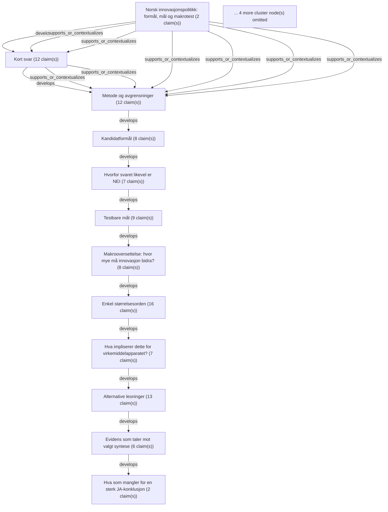

# Text Reliability Analysis Report

- Schema: `haven.text_reliability.analysis.v1`
- Analysis ID: `analysis-8c8e5e7995aa717e`
- Generated at: `2026-06-23T07:06:38Z`
- Source mode: `verifying`

## Inputs
- `text-file:Norwegian_Innovation_Policy_Purpose_Goals_2026-06-21.md:16cbe6f38136e807`: Norsk innovasjonspolitikk: formål, mål og makrotest (3055 words)

## Markdown Structure
- Sections: `17`
- Tables: `6`

## Claims
- `claim-0001` `cluster-0001` `factual` `assertive` `source_missing`: "Status: Kildebasert analyse, ikke en offisiell strategi"
- `claim-0002` `cluster-0001` `factual` `assertive` `source_missing`: "Arbeidsform: Offisielle kilder først, lokal arbeidsmappe som kontroll, nettbasert kildeinnhenting der dokumentene ikke lå lokalt."
- `claim-0003` `cluster-0002` `factual` `moderated` `source_missing`: "**Binært svar: NEI.** Det finnes ikke et eksplisitt, felles og operasjonelt overordnet formål for norsk innovasjonspolitikk i kildene som kan løftes ut uten at analytikeren legger til en syntetiserende ramme."
- `claim-0004` `cluster-0002` `factual` `assertive` `source_missing`: "Det finnes likevel en konsistent retning på tvers av dokumentene."
- `claim-0005` `cluster-0002` `factual` `assertive` `source_missing`: "Den minst vilkårlige syntesen er:"
- `claim-0006` `cluster-0002` `normative` `moderated` `source_missing`: "> **MIN KONSTRUKSJON:** Norsk innovasjonspolitikk bør gjøre Norge i stand til å fornye næringsliv og offentlig sektor slik at Fastlands-Norge kan øke produktivitet, kunnskapsintensitet, grønn og digital konkurransekraft og eksport utenom olje og gass nok til å finansiere velferdsstaten og gode arbeidsplasser i hele landet når petroleumens relative betydning faller, befolkningen eldes og teknologi-, klima- og sikkerhetsomstillingen skjerper konkurransen."
- `claim-0007` `cluster-0002` `factual` `assertive` `source_missing`: "Dette er ikke formulert som én setning av regjeringen."
- `claim-0008` `cluster-0002` `factual` `assertive` `source_missing`: "Det er en syntese av:"
- `claim-0009` `cluster-0002` `factual` `assertive` `source_missing`: "- Perspektivmeldingens nasjonale problem: arbeidskraft, omstilling, fordeling og velferdsstatens bærekraft."
- `claim-0010` `cluster-0002` `factual` `assertive` `source_missing`: "- Langtidsplanens mål om konkurransekraft, innovasjonsevne, bærekraft og kunnskap som tas i bruk."
- `claim-0011` `cluster-0002` `statistical` `assertive` `source_missing`: "- FoU-strategiens mål om at næringslivets FoU skal til 2 prosent av BNP innen 2030."
- `claim-0012` `cluster-0002` `statistical` `assertive` `source_missing`: "- Eksportsatsingens mål om 50 prosent økning i verdiskapende eksport utenom olje og gass innen 2030."
- `claim-0013` `cluster-0002` `factual` `assertive` `source_missing`: "- Gründerpolitikkens mål om flere vekstbedrifter, arbeidsplasser og problemløsning."
- `claim-0014` `cluster-0002` `factual` `assertive` `source_missing`: "- Digitaliseringspolitikkens tydelige avgrensning: digitalisering er et virkemiddel, ikke et mål i seg selv."
- `claim-0015` `cluster-0003` `factual` `assertive` `source_missing`: "Jeg behandlet oppgaven som policyanalyse, ikke som et generelt sammendrag."
- `claim-0016` `cluster-0003` `factual` `assertive` `source_missing`: "Jeg søkte først i den lokale arbeidsmappen."
- `claim-0017` `cluster-0003` `factual` `assertive` `source_missing`: "Den inneholdt ingen relevante offisielle PDF-, Word-, Excel- eller PowerPoint-dokumenter om norsk innovasjonspolitikk."
- `claim-0018` `cluster-0003` `causal` `moderated` `source_missing`: "Lokale HAVEN-notater kan gi kontekst om brukerens arbeid, men de er ikke primærkilder for nasjonal politikk og er derfor ikke brukt som bærende bevis."
- `claim-0019` `cluster-0003` `factual` `assertive` `source_missing`: "Jeg fant ingen tilgjengelig InnoRAG- eller rådgiverpanel-MCP i denne økten."
- `claim-0020` `cluster-0003` `causal` `assertive` `source_missing`: "Jeg brukte derfor tilgjengelige verktøy: repo-søk, nett-søk, offisielle regjeringskilder, institusjonelle kilder og EU-diagnostikk som ekstern sammenligning."
- `claim-0021` `cluster-0003` `factual` `assertive` `source_missing`: "To kilder ble ikke brukt som bærende bevis:"
- `claim-0022` `cluster-0003` `factual` `assertive` `source_missing`: "- **Innovasjon Norge direkte nettside:** Forsøk på direkte tilgang traff en Cloudflare-side."
- `claim-0023` `cluster-0003` `factual` `assertive` `source_missing`: "Innovasjon Norge inngår likevel indirekte i regjeringsdokumentene om virkemiddelapparatet."
- `claim-0024` `cluster-0003` `factual` `assertive` `source_missing`: "- **"Developing a thriving innovation and venture capital ecosystem in Oslo":** Eksakt tittel ble ikke funnet i lokal arbeidsmappe eller ved nettsøk i denne økten."
- `claim-0025` `cluster-0003` `factual` `assertive` `source_missing`: "Korte sitater er bevisst korte."
- `claim-0026` `cluster-0003` `factual` `assertive` `source_missing`: "Hovedinnholdet er parafrasert for å unngå å gjøre rapporten til et sitatkompendium."
- `claim-0027` `cluster-0004` `factual` `assertive` `source_missing`: "Skala: 0 = svært svakt, 5 = sterkt."
- `claim-0028` `cluster-0004` `factual` `assertive` `source_missing`: "Skårene er analytiske, ikke offisielle."
- `claim-0029` `cluster-0004` `factual` `assertive` `source_missing`: "**Valgt syntese:** Produktivitet og velferdsstatens bærekraft gjennom kunnskapsintensiv grønn/digital omstilling, med eksport, skalering, FoU og offentlig sektor-effektivitet som målbare delmekanismer."
- `claim-0030` `cluster-0005` `factual` `assertive` `source_missing`: "Det ville vært for positivt å svare JA uten forbehold."
- `claim-0031` `cluster-0005` `factual` `assertive` `source_missing`: "Kildene har en tydelig retning, men de mangler en samlet formålslogikk som binder virkemidler, delmål og makroeffekter sammen."
- `claim-0032` `cluster-0005` `factual` `assertive` `source_missing`: "**Målene ligger på ulike nivåer.** FoU-andel er innsats."
- `claim-0033` `cluster-0005` `factual` `assertive` `source_missing`: "Produktivitet og velferdsfinansiering er effekt."
- `claim-0034` `cluster-0005` `factual` `assertive` `source_cue_without_anchor`: "**Ingen kilde sier eksplisitt at innovasjonspolitikkens hovedformål er å lukke produktivitets- og finansieringsgapet i fastlandsøkonomien.** Det er en nærliggende syntese, men fortsatt en syntese."
- `claim-0035` `cluster-0005` `factual` `assertive` `source_missing`: "**Virkemiddelapparatet beskrives fragmentert.** Forskning, gründere, eksport, digitalisering, industri og regional utvikling behandles ofte i separate dokumenter."
- `claim-0036` `cluster-0005` `factual` `moderated` `source_missing`: "**Flere indikatorer kan bli selvrefererende.** Mer FoU, flere programmer eller høy digitaliseringsgrad er ikke nok hvis de ikke gir produktivitet, høyere lønnsom eksport, bedre offentlige tjenester eller grønn omstilling."
- `claim-0037` `cluster-0006` `factual` `assertive` `source_missing`: "Disse målene er formulert for å gjøre formålet styrbart."
- `claim-0038` `cluster-0006` `factual` `assertive` `source_missing`: "Noen er offisielle mål; andre er min konstruksjon for å gjøre politikken etterprøvbar."
- `claim-0039` `cluster-0007` `normative` `assertive` `source_missing`: "Spørsmålet "hvor stor andel av verdiskapingen skal komme fra innovasjon?" bør ikke behandles som en enkel sektorandel."
- `claim-0040` `cluster-0007` `factual` `assertive` `source_missing`: "Innovasjon er ikke én næring."
- `claim-0041` `cluster-0007` `factual` `assertive` `source_missing`: "Den virker gjennom produktivitet, nye produkter, bedre prosesser, teknologiopptak, eksport, kapitalavkastning og offentlig sektor-effektivitet."
- `claim-0042` `cluster-0007` `factual` `assertive` `source_missing`: "En bedre styringslogikk er:"
- `claim-0043` `cluster-0007` `normative` `assertive` `source_missing`: "Hvor mange prosentpoeng ekstra årlig produktivitetsvekst må politikken bidra til?"
- `claim-0044` `cluster-0007` `factual` `moderated` `source_missing`: "Hvor stor del av inndekningsbehovet kan realistisk komme fra høyere produktivitet og smartere offentlig ressursbruk?"
- `claim-0045` `cluster-0007` `factual` `assertive` `source_missing`: "Hvor mye av eksportveksten utenom olje og gass er real vekst i konkurransedyktige varer og tjenester, ikke bare valuta/pris?"
- `claim-0046` `cluster-0007` `factual` `assertive` `source_missing`: "Hvor mye av økt FoU blir omsatt i salgsvekst, lønnsomhet, lønnsevne og skattebase?"
- `claim-0047` `cluster-0008` `statistical` `assertive` `source_missing`: "Nasjonalbudsjettet 2026 oppgir strukturelt oljekorrigert underskudd til 579,4 mrd."
- `claim-0048` `cluster-0008` `statistical` `assertive` `source_missing`: "kroner, tilsvarende 13,1 prosent av trend-BNP for Fastlands-Norge."
- `claim-0049` `cluster-0008` `factual` `assertive` `source_missing`: "Det gir en omtrentlig trend-BNP for Fastlands-Norge på:"
- `claim-0050` `cluster-0008` `factual` `assertive` `source_missing`: "Hvis innovasjon og teknologiopptak bidrar til høyere varig produktivitetsvekst, blir størrelsesordenen slik:"
- `claim-0051` `cluster-0008` `statistical` `moderated` `source_missing`: "Perspektivmeldingen anslår at offentlige utgifter på sikt kan vokse om lag 7 mrd."
- `claim-0052` `cluster-0008` `statistical` `moderated` `source_missing`: "kroner mer per år enn inntektene, og at inndekningsbehovet kan bli 6,2 prosent av Fastlands-BNP i 2060."
- `claim-0053` `cluster-0008` `statistical` `assertive` `source_missing`: "Overført til dagens fastlandsøkonomi tilsvarer 6,2 prosent omtrent 274 mrd."
- `claim-0054` `cluster-0008` `predictive` `assertive` `source_missing`: "Dette er bare en skalaoversettelse; i 2060 vil økonomien være større."
- `claim-0055` `cluster-0008` `normative` `assertive` `source_missing`: "**Konklusjon:** Et ansvarlig makromål er ikke at "innovasjon skal stå for X prosent av verdiskapingen", men at innovasjonspolitikken skal kunne dokumentere et varig bidrag til:"
- `claim-0056` `cluster-0008` `factual` `assertive` `source_missing`: "- 0,3-0,5 prosentpoeng høyere produktivitetsvekst i relevante deler av fastlandsøkonomien."
- `claim-0057` `cluster-0008` `factual` `assertive` `source_missing`: "- Reell eksportvekst utenom petroleum."
- `claim-0058` `cluster-0008` `factual` `assertive` `source_missing`: "- Mer kommersialisering fra FoU."
- `claim-0059` `cluster-0008` `factual` `assertive` `source_missing`: "- Målbar offentlig sektor-effektivitet uten kvalitetsfall."
- `claim-0060` `cluster-0009` `normative` `assertive` `source_missing`: "Hvis formålet er produktivitet og velferdsstatens bærekraft, bør virkemidler vurderes etter effektkjede, ikke bare aktivitet."
- `claim-0061` `cluster-0010` `factual` `assertive` `source_missing`: "**Alternativ 1: Formålet er grønn omstilling.**"
- `claim-0062` `cluster-0010` `factual` `assertive` `source_missing`: "Dette har sterk støtte i Langtidsplanen, FoU-strategien, digitaliseringsstrategien og teknologiveikartet."
- `claim-0063` `cluster-0010` `factual` `assertive` `source_missing`: "Svakheten er at grønn omstilling alene ikke forklarer FoU-målet, eksportmålet, offentlig sektor-effektivitet og velferdsstatens finansieringsproblem."
- `claim-0064` `cluster-0010` `factual` `assertive` `source_missing`: "**Alternativ 2: Formålet er mer FoU.**"
- `claim-0065` `cluster-0010` `factual` `assertive` `source_missing`: "Dette er lettest å måle og har et eksplisitt 2-prosentmål."
- `claim-0066` `cluster-0010` `factual` `assertive` `source_missing`: "Svakheten er at FoU er et virkemiddel og en kapasitet, ikke en samfunnseffekt."
- `claim-0067` `cluster-0010` `factual` `assertive` `source_missing`: "EIS peker nettopp på at Norge har utfordringer i å omsette kunnskap til intellectual assets, salgsutslag og high-tech eksport."
- `claim-0068` `cluster-0010` `factual` `assertive` `source_missing`: "**Alternativ 3: Formålet er flere oppstartsbedrifter og mer venturekapital.**"
- `claim-0069` `cluster-0010` `factual` `assertive` `source_missing`: "Dette passer Gründer-meldingen, men blir for smalt."
- `claim-0070` `cluster-0010` `factual` `assertive` `source_missing`: "Det dekker ikke etablerte bedrifters teknologiopptak, offentlig sektor eller hele verdiskapingsbasen."
- `claim-0071` `cluster-0010` `factual` `assertive` `source_missing`: "**Alternativ 4: Formålet er regional utvikling og arbeidsplasser i hele landet.**"
- `claim-0072` `cluster-0010` `factual` `assertive` `source_missing`: "Dette er politisk viktig og ligger i Siva og flere regjeringsdokumenter, men det er ikke presist nok som innovasjonspolitikkens hovedformål."
- `claim-0073` `cluster-0010` `normative` `assertive` `source_missing`: "Det må underordnes produktive, bærekraftige arbeidsplasser, ikke bare geografisk fordeling."
- `claim-0074` `cluster-0011` `normative` `assertive` `source_missing`: "- Regjeringen sier ikke eksplisitt at innovasjonspolitikken skal levere et bestemt produktivitetsbidrag."
- `claim-0075` `cluster-0011` `factual` `assertive` `source_missing`: "- Norge scorer høyt på flere digitale og samarbeidsorienterte indikatorer, men lavere på business R&D, intellectual assets og medium/high-tech eksport."
- `claim-0076` `cluster-0011` `factual` `assertive` `source_missing`: "Det svekker en enkel "vi er allerede innovative"-fortelling."
- `claim-0077` `cluster-0011` `factual` `moderated` `source_missing`: "- Eksportmålet kan oppnås nominelt gjennom svak krone eller prisutslag uten at produktiviteten egentlig forbedres."
- `claim-0078` `cluster-0011` `factual` `moderated` `source_missing`: "- FoU-målet kan nås gjennom økte utgifter uten tilsvarende verdiskaping hvis kommersialisering og absorpsjonsevne ikke styrkes."
- `claim-0079` `cluster-0011` `factual` `assertive` `source_missing`: "- Offentlig sektor-innovasjon er makroøkonomisk viktig, men svakt integrert i innovasjonspolitikkens målstruktur."
- `claim-0080` `cluster-0012` `factual` `assertive` `source_missing`: "For å kunne svare JA uten store forbehold måtte Norge hatt en samlet innovasjonspolitisk effektkjede omtrent slik:"
- `claim-0081` `cluster-0012` `factual` `assertive` `source_missing`: "Dagens kilder har mange av delene, men ikke samlet på denne måten."
- `claim-0082` `cluster-0013` `factual` `assertive` `source_missing`: "**NEI:** Dagens norske innovasjonspolitiske dokumenter uttrykker ikke ett sammenhengende, eksplisitt og testbart overordnet formål."
- `claim-0083` `cluster-0013` `factual` `moderated` `source_missing`: "**MEN:** En robust og kildebasert syntese er mulig."
- `claim-0084` `cluster-0013` `normative` `moderated` `source_missing`: "Den bør handle om at innovasjon skal øke fastlandsøkonomiens produktivitet, kunnskapsintensitet, eksportevne og offentlige tjenesteeffektivitet slik at velferdsstaten og gode arbeidsplasser kan opprettholdes gjennom klima-, teknologi-, sikkerhets- og petroleumsomstillingen."
- `claim-0085` `cluster-0013` `normative` `assertive` `source_missing`: "Den viktigste policyimplikasjonen er at Norge bør slutte å behandle FoU-prosent, digitaliseringsgrad, oppstartstall og virkemiddelaktivitet som tilstrekkelige mål."
- `claim-0086` `cluster-0013` `normative` `assertive` `source_missing`: "De bør knyttes til en felles effektlogikk:"
- `claim-0087` `cluster-0014` `factual` `assertive` `needs_external_source_audit`: "- Regjeringen: [Langtidsplan for forskning og høyere utdanning 2023-2032](https://www.regjeringen.no/no/dokumenter/meld.-st.-5-20222023/id2931400/?ch=1)"
- `claim-0088` `cluster-0014` `factual` `assertive` `needs_external_source_audit`: "- Regjeringen: [Perspektivmeldingen 2024](https://www.regjeringen.no/no/dokumenter/meld.-st.-31-20232024/id3049290/?ch=1)"
- `claim-0089` `cluster-0014` `factual` `assertive` `needs_external_source_audit`: "- Regjeringen: [Strategi for å øke næringslivets investeringer i forskning og utvikling](https://www.regjeringen.no/no/dokumenter/strategi-for-a-oke-naringslivets-investering-i-fou/id3036876/?ch=1)"
- `claim-0090` `cluster-0014` `factual` `assertive` `needs_external_source_audit`: "- Regjeringen: [Gründere og oppstartsbedrifter](https://www.regjeringen.no/no/dokumenter/meld.-st.-6-20242025/id3068703/?ch=1)"
- `claim-0091` `cluster-0014` `factual` `assertive` `needs_external_source_audit`: "- Regjeringen: [Hele Norge eksporterer 2.0](https://www.regjeringen.no/no/dokumenter/hele-norge-eksporterer-2.0/id3029861/?ch=1)"
- `claim-0092` `cluster-0014` `factual` `assertive` `needs_external_source_audit`: "- Regjeringen: [Fremtidens digitale Norge](https://www.regjeringen.no/no/dokumenter/fremtidens-digitale-norge/id3054645/?ch=1)"
- `claim-0093` `cluster-0014` `factual` `assertive` `needs_external_source_audit`: "- Regjeringen: [Veikart for det teknologibaserte næringslivet](https://www.regjeringen.no/no/dokumenter/veikart-for-det-teknologibaserte-naringslivet/id3116996/?ch=1)"
- `claim-0094` `cluster-0014` `factual` `assertive` `needs_external_source_audit`: "- Regjeringen: [Statsbudsjettet 2026](https://www.regjeringen.no/no/statsbudsjett/2026/id3118616/)"
- `claim-0095` `cluster-0014` `factual` `assertive` `needs_external_source_audit`: "- Regjeringen: [Nøkkeltall i Nasjonalbudsjettet 2026](https://www.regjeringen.no/no/aktuelt/nokkeltall-i-nasjonalbudsjettet-2026/id3124365/)"
- `claim-0096` `cluster-0014` `factual` `assertive` `needs_external_source_audit`: "- Europakommisjonen: [European Innovation Scoreboard 2025, Norway profile](https://ec.europa.eu/assets/rtd/eis/2025/ec_rtd_eis-country-profile-no.pdf)"
- `claim-0097` `cluster-0014` `factual` `assertive` `needs_external_source_audit`: "- Europakommisjonen: [Draghi report on EU competitiveness](https://commission.europa.eu/topics/competitiveness/draghi-report_en)"
- `claim-0098` `cluster-0015` `factual` `assertive` `needs_external_source_audit`: "| [Meld. St. 5 (2022-2023), Langtidsplan for forskning og høyere utdanning 2023-2032](https://www.regjeringen.no/no/dokumenter/meld.-st.-5-20222023/id2931400/?ch=1) | Regjeringsmelding | Primærkilde | Setter mål for forskning, høyere utdanning, konkurransekraft, innovasjon og bærekraft | Kjernebevis for retning og FoU/innovasjon |"
- `claim-0099` `cluster-0015` `factual` `assertive` `needs_external_source_audit`: "| [Meld. St. 31 (2023-2024), Perspektivmeldingen 2024](https://www.regjeringen.no/no/dokumenter/meld.-st.-31-20232024/id3049290/?ch=1) | Regjeringsmelding | Primærkilde | Definerer makroproblemet: arbeidskraft, omstilling, inndekningsbehov, velferdsmodell | Kjernebevis for overordnet samfunnsformål |"
- `claim-0100` `cluster-0015` `statistical` `assertive` `needs_external_source_audit`: "| [Strategi for å øke næringslivets investeringer i forskning og utvikling](https://www.regjeringen.no/no/dokumenter/strategi-for-a-oke-naringslivets-investering-i-fou/id3036876/?ch=1) | Regjeringsstrategi | Primærkilde | Har konkret mål om næringslivets FoU til 2 prosent av BNP innen 2030 | Kjernebevis for målbar innsats og kunnskapsintensitet |"
- `claim-0101` `cluster-0015` `factual` `assertive` `needs_external_source_audit`: "| [Meld. St. 6 (2024-2025), Gründere og oppstartsbedrifter](https://www.regjeringen.no/no/dokumenter/meld.-st.-6-20242025/id3068703/?ch=1) | Regjeringsmelding | Primærkilde | Knytter entreprenørskap til omstilling, arbeidsplasser, velferd og konkurransekraft | Bevis for nyetablering og vekstbedrifter som virkemiddel |"
- `claim-0102` `cluster-0015` `statistical` `assertive` `needs_external_source_audit`: "| [Hele Norge eksporterer 2.0](https://www.regjeringen.no/no/dokumenter/hele-norge-eksporterer-2.0/id3029861/?ch=1) | Eksportreform/strategi | Primærkilde | Har konkret mål om 50 prosent økning i eksport utenom olje og gass innen 2030 | Bevis for målbart verdiskapings- og eksportmål |"
- `claim-0103` `cluster-0015` `factual` `assertive` `needs_external_source_audit`: "| [Fremtidens digitale Norge, nasjonal digitaliseringsstrategi 2024-2030](https://www.regjeringen.no/no/dokumenter/fremtidens-digitale-norge/id3054645/?ch=1) | Regjeringsstrategi | Primærkilde | Slår fast at digitalisering er et virkemiddel, og kobler teknologi til omstilling | Bevis for digitalisering som virkemiddel, ikke endemål |"
- `claim-0104` `cluster-0015` `factual` `assertive` `needs_external_source_audit`: "| [Veikart for det teknologibaserte næringslivet](https://www.regjeringen.no/no/dokumenter/veikart-for-det-teknologibaserte-naringslivet/id3116996/?ch=1) | Regjeringsveikart | Primærkilde | Operasjonaliserer digital innovasjon, teknologibedrifter, KI og vekst | Bevis for teknologibasert næringsliv som delagenda |"
- `claim-0105` `cluster-0015` `factual` `assertive` `needs_external_source_audit`: "| [Statsbudsjettet 2026](https://www.regjeringen.no/no/statsbudsjett/2026/id3118616/) og [Nøkkeltall i Nasjonalbudsjettet 2026](https://www.regjeringen.no/no/aktuelt/nokkeltall-i-nasjonalbudsjettet-2026/id3124365/) | Budsjett og makrogrunnlag | Primærkilde | Gir tall for fastlandsøkonomi og handlingsrom | Brukt i makrooversettelsen |"
- `claim-0106` `cluster-0015` `factual` `assertive` `needs_external_source_audit`: "| [Forskningsrådet](https://www.forskningsradet.no/) | Institusjonell primærkilde | Primærkilde, men ikke strategi | Viser institusjonell rolle for FoU og innovasjon | Brukt som virkemiddel- og institusjonsbevis |"
- `claim-0107` `cluster-0015` `factual` `assertive` `needs_external_source_audit`: "| [Siva](https://siva.no/) | Institusjonell primærkilde | Primærkilde, men ikke strategi | Knytter industriell verdiskaping til hele landet | Brukt som virkemiddel- og regionalt bevis |"
- `claim-0108` `cluster-0015` `factual` `assertive` `needs_external_source_audit`: "| [European Innovation Scoreboard 2025, Norway profile](https://ec.europa.eu/assets/rtd/eis/2025/ec_rtd_eis-country-profile-no.pdf) | EU-diagnostikk | Sekundær/komparativ | Gir ekstern diagnose av norsk innovasjonsevne, styrker og svakheter | Brukt til stresstest og målindikatorer |"
- `claim-0109` `cluster-0015` `factual` `assertive` `needs_external_source_audit`: "| [Draghi-rapportens EU-side](https://commission.europa.eu/topics/competitiveness/draghi-report_en) | EU-komparativ politikk | Sekundær/komparativ | Setter europeisk konkurransekraft, produktivitet og innovasjon i kontekst | Brukt som kontrast, ikke som norsk policybevis |"
- `claim-0110` `cluster-0016` `factual` `assertive` `source_missing`: "| Langtidsplanen | Målet inkluderer "styrket konkurransekraft og innovasjonsevne". | Innovasjon er koblet til konkurransekraft, ikke bare forskning. | Høy | Fortsatt bredt og ikke et samlet formål. |"
- `claim-0111` `cluster-0016` `normative` `assertive` `source_missing`: "| Langtidsplanen | Kunnskap må "tas i bruk". | Overgangen fra forskning til anvendelse er sentral. | Høy | Bruksområdet er bredt: næringsliv, offentlig sektor og sivilsamfunn. |"
- `claim-0112` `cluster-0016` `factual` `assertive` `source_missing`: "| Langtidsplanen | Regjeringen peker på næringslivets FoU til "to prosent av BNP". | Konkret inputmål for innovasjonspolitikken. | Høy | FoU-andel er et innsatsmål, ikke samfunnseffekt. |"
- `claim-0113` `cluster-0016` `normative` `assertive` `source_missing`: "| Perspektivmeldingen | Formålet er å "videreutvikle velferdsmodellen". | Innovasjon bør vurderes mot velferdsstatens bærekraft. | Høy | Meldingen er ikke en innovasjonsstrategi. |"
- `claim-0114` `cluster-0016` `normative` `assertive` `source_missing`: "| Perspektivmeldingen | Regjeringen vil "løse oppgavene smartere". | Offentlig sektor-innovasjon og produktivitet er nødvendig. | Høy | Mangler spesifikk innovasjonsmåling. |"
- `claim-0115` `cluster-0016` `statistical` `assertive` `source_missing`: "| Perspektivmeldingen | Inndekningsbehovet anslås til 6,2 prosent av Fastlands-BNP i 2060. | Skalaen på verdiskapings- og effektivitetsproblemet er stor. | Høy | Innovasjon er bare én av flere mulige løsninger. |"
- `claim-0116` `cluster-0016` `statistical` `assertive` `source_missing`: "| FoU-strategien | Næringslivets FoU skal mot 2 prosent av BNP innen 2030. | Det finnes et eksplisitt, målbart delmål. | Høy | Måler innsats, ikke verdiskaping direkte. |"
- `claim-0117` `cluster-0016` `factual` `moderated` `source_missing`: "| FoU-strategien | Målet kan forstås som mer "kunnskapsintensiv retning". | FoU-målet er strukturelt, ikke bare budsjettmessig. | Høy | Krever sektorsammensetning og absorpsjonsevne. |"
- `claim-0118` `cluster-0016` `factual` `assertive` `source_missing`: "| Gründer-meldingen | Ambisjon om å være blant verdens beste land å starte og drive virksomhet. | Gründerskap er et virkemiddel for vekstbedrifter og arbeidsplasser. | Middels/høy | Ambisjonen er bred og vanskelig å måle uten indikatorvalg. |"
- `claim-0119` `cluster-0016` `normative` `assertive` `source_missing`: "| Gründer-meldingen | Nye bedrifter skal bidra til arbeidsplasser, samfunnsproblemer og konkurransekraft. | Knytter entreprenørskap til samfunnseffekt. | Høy | Ikke alene et nasjonalt innovasjonsformål. |"
- `claim-0120` `cluster-0016` `statistical` `assertive` `source_missing`: "| Hele Norge eksporterer | Eksport utenom olje og gass skal øke 50 prosent innen 2030. | Konkret verdiskapings- og omstillingsmål. | Høy | Bør renses for valuta, priser og petroleumslignende effekter. |"
- `claim-0121` `cluster-0016` `normative` `assertive` `source_missing`: "| Digitaliseringsstrategien | Digitalisering er "ikke et mål i seg selv". | Teknologi og digitalisering må underordnes samfunns- og verdiskapingsmål. | Høy | Strategien er bredere enn innovasjonspolitikk. |"
- `claim-0122` `cluster-0016` `normative` `assertive` `source_cue_without_anchor`: "| Teknologiveikartet | Norge skal være best i Norden på digital innovasjon. | Teknologibasert næringsliv har eksplisitte delmål. | Middels/høy | Nyere og delsektoriell kilde, ikke helhetlig politikk. |"
- `claim-0123` `cluster-0016` `factual` `assertive` `source_missing`: "| Forskningsrådet | Rådet investerer i forskning og innovasjon for bærekraftig framtid. | Institusjonell kobling mellom kunnskap, omstilling og samfunnsutfordringer. | Middels | Nettsideformulering, ikke politisk hovedmål. |"
- `claim-0124` `cluster-0016` `normative` `assertive` `source_missing`: "| Siva | Siva skal bidra til arbeidsplasser, verdiskaping og levedyktige lokalsamfunn. | Regional og industriell dimensjon i virkemiddelapparatet. | Middels | Institusjonell rolle, ikke helhetlig nasjonal prioritering. |"
- `claim-0125` `cluster-0016` `factual` `assertive` `source_missing`: "| European Innovation Scoreboard | Norge er "Strong Innovator", men har svake sider i business R&D og intellectual assets. | Ekstern test av om ambisjonene treffer reelle svakheter. | Høy som diagnose | EU-indeks er ikke norsk policyformål. |"
- `claim-0126` `cluster-0004` `factual` `assertive` `source_missing`: "| Øke FoU og kunnskapsintensitet i næringslivet | 5 | 4 | 4 | 3 | 5 | 21 | Sterkt delmål, men primært innsatsmål. Risiko: man når FoU-andel uten nok verdiskaping. |"
- `claim-0127` `cluster-0004` `factual` `assertive` `source_missing`: "| Øke produktivitet og velferdsstatens bærekraft gjennom omstilling | 4 | 4 | 4 | 5 | 4 | 21 | Beste syntese. Treffer makroproblemet, men er ikke formulert direkte som innovasjonspolitikkens formål. |"
- `claim-0128` `cluster-0004` `factual` `moderated` `source_missing`: "| Grønn og digital omstilling | 5 | 4 | 3 | 4 | 3 | 19 | Sterkt i dokumentene, men bredt. Kan bli virkemiddelretorikk uten produktivitets- og verdiskapingsmål. |"
- `claim-0129` `cluster-0004` `factual` `assertive` `source_missing`: "| Flere vekstbedrifter, skalering og eksport utenom petroleum | 4 | 3 | 4 | 4 | 4 | 19 | Konkret og målbart, men dekker ikke offentlig sektor og eksisterende næringsliv godt nok. |"
- `claim-0130` `cluster-0004` `factual` `assertive` `source_missing`: "| Arbeidsplasser og utvikling i hele landet | 3 | 3 | 2 | 3 | 2 | 13 | Politisk viktig, men for lite presist som hovedformål for innovasjonspolitikk. |"
- `claim-0131` `cluster-0006` `statistical` `assertive` `source_missing`: "| 1 | Næringslivets kunnskapsintensitet | Innsats og kapasitet | Næringslivets FoU-investeringer skal øke til 2 prosent av BNP. | Næringslivets FoU/BNP, total FoU/BNP, FoU-personell, privat/offentlig fordeling. | FoU-strategien oppgir total FoU rundt 2 prosent av BNP og næringslivets FoU under målet. | 2030 | Offisielt mål |"
- `claim-0132` `cluster-0006` `statistical` `assertive` `source_missing`: "| 2 | Eksport utenom olje og gass | Utfall | Verdiskapende eksport utenom olje og gass skal øke 50 prosent. | Eksportverdi uten olje/gass, helst real- og valuta-korrigert; eksport fra nye grønne/digitale verdikjeder. | Hele Norge eksporterer oppgir 50-prosentmålet og sterk vekst de siste årene, delvis hjulpet av kronekurs. | 2030 | Offisielt mål, men trenger bedre rensing |"
- `claim-0133` `cluster-0006` `normative` `assertive` `source_missing`: "| 3 | Produktivitetsbidrag i Fastlands-Norge | Effekt | Innovasjonspolitikken bør bidra til 0,3-0,5 prosentpoeng høyere årlig produktivitetsvekst enn referansebane. | Bruttoprodukt per timeverk i Fastlands-Norge, markedsrettet fastlandsøkonomi, offentlig sektor-produktivitet. | Perspektivmeldingen og Nasjonalbudsjettet gir makroproblemet; eksakt baseline må hentes fra SSB/nasjonalregnskap. | 2035/2040 | MIN KONSTRUKSJON |"
- `claim-0134` `cluster-0006` `normative` `assertive` `source_missing`: "| 4 | Kommersialisering og innovasjonsutbytte | Utfall | Norge bør minst opp på EU-gjennomsnittet i salgs- og markedsutslag fra nye produkter og tjenester. | EIS: sales of new-to-market/new-to-firm innovations; produktinnovasjon; patenter, varemerker og design. | EIS 2025 viser svakheter i intellectual assets og sales impacts. | 2032 | MIN KONSTRUKSJON |"
- `claim-0135` `cluster-0006` `normative` `assertive` `source_missing`: "| 5 | Teknologidiffusjon i eksisterende virksomheter | Kapasitet og utfall | Flere etablerte bedrifter, særlig SMB-er, skal ta i bruk avansert digital teknologi og omsette den i produktivitet. | KI-, sky-, data- og prosessadopsjon; SMB-er med produkt/prosessinnovasjon; produktivitetsutslag. | Digitaliseringsstrategien og EIS viser høy digital modenhet, men blandede innovasjonsutslag. | 2030 | MIN KONSTRUKSJON |"
- `claim-0136` `cluster-0006` `statistical` `assertive` `source_missing`: "| 6 | Offentlig sektor-innovasjon | Effekt | Offentlig sektor skal levere like gode eller bedre tjenester med lavere ressursvekst enn referansebanen. | Ressursbruk per tjenesteutfall, ventetid/kvalitet, digital selvbetjening, arbeidskraft frigjort til prioriterte tjenester. | Perspektivmeldingen viser økende utgifter og inndekningsbehov; 0,25 prosent årlig effektivisering brukes som illustrativ følsomhet. | 2035/2060 | MIN KONSTRUKSJON |"
- `claim-0137` `cluster-0006` `normative` `assertive` `source_missing`: "| 7 | Grønn verdiskaping og ressursproduktivitet | Effekt | Innovasjon skal øke verdiskaping i klima-, miljø- og energiløsninger samtidig som utslipps- og ressursintensitet faller. | CO2-produktivitet, ressursproduktivitet, grønne eksportinntekter, FoU i klima/miljø/energi. | Langtidsplanen, FoU-strategien og EIS peker på klima, energi og ressursproduktivitet. | 2030/2035 | MIN KONSTRUKSJON |"
- `claim-0138` `cluster-0008` `statistical` `assertive` `source_missing`: "| 0,3 prosentpoeng | ca. 130 mrd. kroner | Stor nok til å være makrorelevant, men ikke alene nok til å løse 2060-gapet. |"
- `claim-0139` `cluster-0008` `statistical` `assertive` `source_missing`: "| 0,5 prosentpoeng | ca. 225 mrd. kroner | Nærmer seg dagens størrelsesorden på et stort finansieringsbidrag. |"
- `claim-0140` `cluster-0008` `statistical` `assertive` `source_missing`: "| 1,0 prosentpoeng | ca. 465 mrd. kroner | Svært kraftig og neppe realistisk som innovasjonspolitikk alene. |"
- `claim-0141` `cluster-0009` `factual` `assertive` `source_missing`: "| FoU-støtte | Privat FoU-utløsing, absorpsjonsevne, kommersialisering, eksport og produktivitet | Bevilgninger, prosjekttall, FoU-prosent alene |"
- `claim-0142` `cluster-0009` `factual` `assertive` `source_missing`: "| Gründere og oppstart | Overlevelse, skalering, lønnsevne, eksport, produktivitetsbidrag | Antall etableringer alene |"
- `claim-0143` `cluster-0009` `factual` `assertive` `source_missing`: "| Digitalisering og KI | Prosessforbedring, tidsbesparelse, tjenestekvalitet, nye produkter | Antall piloter, datasett, KI-prosjekter |"
- `claim-0144` `cluster-0009` `factual` `assertive` `source_missing`: "| Eksport | Real verdiskaping, markedstilgang, nye verdikjeder, ikke-petroleumsavhengighet | Nominell eksportverdi alene |"
- `claim-0145` `cluster-0009` `factual` `assertive` `source_missing`: "| Regional innovasjon | Produktive arbeidsplasser, industriell kapasitet, kobling til nasjonale verdikjeder | Geografisk spredning av midler alene |"
- `claim-0146` `cluster-0009` `factual` `assertive` `source_missing`: "| Offentlig innovasjon | Bedre tjenester per ressursenhet, frigjort arbeidskraft, kvalitetsindikatorer | Digital selvbetjening eller systemanskaffelser alene |"

## Claim Clusters
| Cluster | Title | Claims | Source audit statuses | Representative claims |
| --- | --- | ---: | --- | --- |
| `cluster-0001` | Norsk innovasjonspolitikk: formål, mål og makrotest | 2 | source_missing:2 | claim-0001 / claim-0002 |
| `cluster-0002` | Kort svar | 12 | source_missing:12 | claim-0003 / claim-0004 / claim-0005 |
| `cluster-0003` | Metode og avgrensninger | 12 | source_missing:12 | claim-0015 / claim-0016 / claim-0017 |
| `cluster-0004` | Kandidatformål | 8 | source_missing:8 | claim-0027 / claim-0028 / claim-0029 |
| `cluster-0005` | Hvorfor svaret likevel er NEI | 7 | source_missing:6, source_cue_without_anchor:1 | claim-0030 / claim-0031 / claim-0032 |
| `cluster-0006` | Testbare mål | 9 | source_missing:9 | claim-0037 / claim-0038 / claim-0131 |
| `cluster-0007` | Makrooversettelse: hvor mye må innovasjon bidra? | 8 | source_missing:8 | claim-0039 / claim-0040 / claim-0041 |
| `cluster-0008` | Enkel størrelsesorden | 16 | source_missing:16 | claim-0047 / claim-0048 / claim-0049 |
| `cluster-0009` | Hva impliserer dette for virkemiddelapparatet? | 7 | source_missing:7 | claim-0060 / claim-0141 / claim-0142 |
| `cluster-0010` | Alternative lesninger | 13 | source_missing:13 | claim-0061 / claim-0062 / claim-0063 |
| `cluster-0011` | Evidens som taler mot valgt syntese | 6 | source_missing:6 | claim-0074 / claim-0075 / claim-0076 |
| `cluster-0012` | Hva som mangler for en sterk JA-konklusjon | 2 | source_missing:2 | claim-0080 / claim-0081 |
| `cluster-0013` | Endelig vurdering | 5 | source_missing:5 | claim-0082 / claim-0083 / claim-0084 |
| `cluster-0014` | Primærlenker | 11 | needs_external_source_audit:11 | claim-0087 / claim-0088 / claim-0089 |
| `cluster-0015` | Kildeinventar | 12 | needs_external_source_audit:12 | claim-0098 / claim-0099 / claim-0100 |
| `cluster-0016` | Evidensuttak | 16 | source_missing:15, source_cue_without_anchor:1 | claim-0110 / claim-0111 / claim-0112 |

## Claim Source Matrix
| Claim | Cluster | Section | Type | Audit status | Evidence grade | Sources | Quote |
| --- | --- | --- | --- | --- | --- | --- | --- |
| `claim-0001` | `cluster-0001` | Norsk innovasjonspolitikk: formål, mål og makrotest | factual | `source_missing` | no_source_anchor |  | Status: Kildebasert analyse, ikke en offisiell strategi |
| `claim-0002` | `cluster-0001` | Norsk innovasjonspolitikk: formål, mål og makrotest | factual | `source_missing` | no_source_anchor |  | Arbeidsform: Offisielle kilder først, lokal arbeidsmappe som kontroll, nettbasert kildeinnhenting der dokumentene ikk... |
| `claim-0003` | `cluster-0002` | Kort svar | factual | `source_missing` | no_source_anchor |  | **Binært svar: NEI.** Det finnes ikke et eksplisitt, felles og operasjonelt overordnet formål for norsk innovasjonspo... |
| `claim-0004` | `cluster-0002` | Kort svar | factual | `source_missing` | no_source_anchor |  | Det finnes likevel en konsistent retning på tvers av dokumentene. |
| `claim-0005` | `cluster-0002` | Kort svar | factual | `source_missing` | no_source_anchor |  | Den minst vilkårlige syntesen er: |
| `claim-0006` | `cluster-0002` | Kort svar | normative | `source_missing` | no_source_anchor |  | > **MIN KONSTRUKSJON:** Norsk innovasjonspolitikk bør gjøre Norge i stand til å fornye næringsliv og offentlig sektor... |
| `claim-0007` | `cluster-0002` | Kort svar | factual | `source_missing` | no_source_anchor |  | Dette er ikke formulert som én setning av regjeringen. |
| `claim-0008` | `cluster-0002` | Kort svar | factual | `source_missing` | no_source_anchor |  | Det er en syntese av: |
| `claim-0009` | `cluster-0002` | Kort svar | factual | `source_missing` | no_source_anchor |  | - Perspektivmeldingens nasjonale problem: arbeidskraft, omstilling, fordeling og velferdsstatens bærekraft. |
| `claim-0010` | `cluster-0002` | Kort svar | factual | `source_missing` | no_source_anchor |  | - Langtidsplanens mål om konkurransekraft, innovasjonsevne, bærekraft og kunnskap som tas i bruk. |
| `claim-0011` | `cluster-0002` | Kort svar | statistical | `source_missing` | no_source_anchor |  | - FoU-strategiens mål om at næringslivets FoU skal til 2 prosent av BNP innen 2030. |
| `claim-0012` | `cluster-0002` | Kort svar | statistical | `source_missing` | no_source_anchor |  | - Eksportsatsingens mål om 50 prosent økning i verdiskapende eksport utenom olje og gass innen 2030. |
| `claim-0013` | `cluster-0002` | Kort svar | factual | `source_missing` | no_source_anchor |  | - Gründerpolitikkens mål om flere vekstbedrifter, arbeidsplasser og problemløsning. |
| `claim-0014` | `cluster-0002` | Kort svar | factual | `source_missing` | no_source_anchor |  | - Digitaliseringspolitikkens tydelige avgrensning: digitalisering er et virkemiddel, ikke et mål i seg selv. |
| `claim-0015` | `cluster-0003` | Metode og avgrensninger | factual | `source_missing` | no_source_anchor |  | Jeg behandlet oppgaven som policyanalyse, ikke som et generelt sammendrag. |
| `claim-0016` | `cluster-0003` | Metode og avgrensninger | factual | `source_missing` | no_source_anchor |  | Jeg søkte først i den lokale arbeidsmappen. |
| `claim-0017` | `cluster-0003` | Metode og avgrensninger | factual | `source_missing` | no_source_anchor |  | Den inneholdt ingen relevante offisielle PDF-, Word-, Excel- eller PowerPoint-dokumenter om norsk innovasjonspolitikk. |
| `claim-0018` | `cluster-0003` | Metode og avgrensninger | causal | `source_missing` | no_source_anchor |  | Lokale HAVEN-notater kan gi kontekst om brukerens arbeid, men de er ikke primærkilder for nasjonal politikk og er der... |
| `claim-0019` | `cluster-0003` | Metode og avgrensninger | factual | `source_missing` | no_source_anchor |  | Jeg fant ingen tilgjengelig InnoRAG- eller rådgiverpanel-MCP i denne økten. |
| `claim-0020` | `cluster-0003` | Metode og avgrensninger | causal | `source_missing` | no_source_anchor |  | Jeg brukte derfor tilgjengelige verktøy: repo-søk, nett-søk, offisielle regjeringskilder, institusjonelle kilder og E... |
| `claim-0021` | `cluster-0003` | Metode og avgrensninger | factual | `source_missing` | no_source_anchor |  | To kilder ble ikke brukt som bærende bevis: |
| `claim-0022` | `cluster-0003` | Metode og avgrensninger | factual | `source_missing` | no_source_anchor |  | - **Innovasjon Norge direkte nettside:** Forsøk på direkte tilgang traff en Cloudflare-side. |
| `claim-0023` | `cluster-0003` | Metode og avgrensninger | factual | `source_missing` | no_source_anchor |  | Innovasjon Norge inngår likevel indirekte i regjeringsdokumentene om virkemiddelapparatet. |
| `claim-0024` | `cluster-0003` | Metode og avgrensninger | factual | `source_missing` | no_source_anchor |  | - **"Developing a thriving innovation and venture capital ecosystem in Oslo":** Eksakt tittel ble ikke funnet i lokal... |
| `claim-0025` | `cluster-0003` | Metode og avgrensninger | factual | `source_missing` | no_source_anchor |  | Korte sitater er bevisst korte. |
| `claim-0026` | `cluster-0003` | Metode og avgrensninger | factual | `source_missing` | no_source_anchor |  | Hovedinnholdet er parafrasert for å unngå å gjøre rapporten til et sitatkompendium. |
| `claim-0027` | `cluster-0004` | Kandidatformål | factual | `source_missing` | no_source_anchor |  | Skala: 0 = svært svakt, 5 = sterkt. |
| `claim-0028` | `cluster-0004` | Kandidatformål | factual | `source_missing` | no_source_anchor |  | Skårene er analytiske, ikke offisielle. |
| `claim-0029` | `cluster-0004` | Kandidatformål | factual | `source_missing` | no_source_anchor |  | **Valgt syntese:** Produktivitet og velferdsstatens bærekraft gjennom kunnskapsintensiv grønn/digital omstilling, med... |
| `claim-0030` | `cluster-0005` | Hvorfor svaret likevel er NEI | factual | `source_missing` | no_source_anchor |  | Det ville vært for positivt å svare JA uten forbehold. |
| `claim-0031` | `cluster-0005` | Hvorfor svaret likevel er NEI | factual | `source_missing` | no_source_anchor |  | Kildene har en tydelig retning, men de mangler en samlet formålslogikk som binder virkemidler, delmål og makroeffekte... |
| `claim-0032` | `cluster-0005` | Hvorfor svaret likevel er NEI | factual | `source_missing` | no_source_anchor |  | **Målene ligger på ulike nivåer.** FoU-andel er innsats. |
| `claim-0033` | `cluster-0005` | Hvorfor svaret likevel er NEI | factual | `source_missing` | no_source_anchor |  | Produktivitet og velferdsfinansiering er effekt. |
| `claim-0034` | `cluster-0005` | Hvorfor svaret likevel er NEI | factual | `source_cue_without_anchor` | source_named_but_not_anchorable | kilde | **Ingen kilde sier eksplisitt at innovasjonspolitikkens hovedformål er å lukke produktivitets- og finansieringsgapet ... |
| `claim-0035` | `cluster-0005` | Hvorfor svaret likevel er NEI | factual | `source_missing` | no_source_anchor |  | **Virkemiddelapparatet beskrives fragmentert.** Forskning, gründere, eksport, digitalisering, industri og regional ut... |
| `claim-0036` | `cluster-0005` | Hvorfor svaret likevel er NEI | factual | `source_missing` | no_source_anchor |  | **Flere indikatorer kan bli selvrefererende.** Mer FoU, flere programmer eller høy digitaliseringsgrad er ikke nok hv... |
| `claim-0037` | `cluster-0006` | Testbare mål | factual | `source_missing` | no_source_anchor |  | Disse målene er formulert for å gjøre formålet styrbart. |
| `claim-0038` | `cluster-0006` | Testbare mål | factual | `source_missing` | no_source_anchor |  | Noen er offisielle mål; andre er min konstruksjon for å gjøre politikken etterprøvbar. |
| `claim-0039` | `cluster-0007` | Makrooversettelse: hvor mye må innovasjon bidra? | normative | `source_missing` | no_source_anchor |  | Spørsmålet "hvor stor andel av verdiskapingen skal komme fra innovasjon?" bør ikke behandles som en enkel sektorandel. |
| `claim-0040` | `cluster-0007` | Makrooversettelse: hvor mye må innovasjon bidra? | factual | `source_missing` | no_source_anchor |  | Innovasjon er ikke én næring. |
| `claim-0041` | `cluster-0007` | Makrooversettelse: hvor mye må innovasjon bidra? | factual | `source_missing` | no_source_anchor |  | Den virker gjennom produktivitet, nye produkter, bedre prosesser, teknologiopptak, eksport, kapitalavkastning og offe... |
| `claim-0042` | `cluster-0007` | Makrooversettelse: hvor mye må innovasjon bidra? | factual | `source_missing` | no_source_anchor |  | En bedre styringslogikk er: |
| `claim-0043` | `cluster-0007` | Makrooversettelse: hvor mye må innovasjon bidra? | normative | `source_missing` | no_source_anchor |  | Hvor mange prosentpoeng ekstra årlig produktivitetsvekst må politikken bidra til? |
| `claim-0044` | `cluster-0007` | Makrooversettelse: hvor mye må innovasjon bidra? | factual | `source_missing` | no_source_anchor |  | Hvor stor del av inndekningsbehovet kan realistisk komme fra høyere produktivitet og smartere offentlig ressursbruk? |
| `claim-0045` | `cluster-0007` | Makrooversettelse: hvor mye må innovasjon bidra? | factual | `source_missing` | no_source_anchor |  | Hvor mye av eksportveksten utenom olje og gass er real vekst i konkurransedyktige varer og tjenester, ikke bare valut... |
| `claim-0046` | `cluster-0007` | Makrooversettelse: hvor mye må innovasjon bidra? | factual | `source_missing` | no_source_anchor |  | Hvor mye av økt FoU blir omsatt i salgsvekst, lønnsomhet, lønnsevne og skattebase? |
| `claim-0047` | `cluster-0008` | Enkel størrelsesorden | statistical | `source_missing` | no_source_anchor |  | Nasjonalbudsjettet 2026 oppgir strukturelt oljekorrigert underskudd til 579,4 mrd. |
| `claim-0048` | `cluster-0008` | Enkel størrelsesorden | statistical | `source_missing` | no_source_anchor |  | kroner, tilsvarende 13,1 prosent av trend-BNP for Fastlands-Norge. |
| `claim-0049` | `cluster-0008` | Enkel størrelsesorden | factual | `source_missing` | no_source_anchor |  | Det gir en omtrentlig trend-BNP for Fastlands-Norge på: |
| `claim-0050` | `cluster-0008` | Enkel størrelsesorden | factual | `source_missing` | no_source_anchor |  | Hvis innovasjon og teknologiopptak bidrar til høyere varig produktivitetsvekst, blir størrelsesordenen slik: |
| `claim-0051` | `cluster-0008` | Enkel størrelsesorden | statistical | `source_missing` | no_source_anchor |  | Perspektivmeldingen anslår at offentlige utgifter på sikt kan vokse om lag 7 mrd. |
| `claim-0052` | `cluster-0008` | Enkel størrelsesorden | statistical | `source_missing` | no_source_anchor |  | kroner mer per år enn inntektene, og at inndekningsbehovet kan bli 6,2 prosent av Fastlands-BNP i 2060. |
| `claim-0053` | `cluster-0008` | Enkel størrelsesorden | statistical | `source_missing` | no_source_anchor |  | Overført til dagens fastlandsøkonomi tilsvarer 6,2 prosent omtrent 274 mrd. |
| `claim-0054` | `cluster-0008` | Enkel størrelsesorden | predictive | `source_missing` | no_source_anchor |  | Dette er bare en skalaoversettelse; i 2060 vil økonomien være større. |
| `claim-0055` | `cluster-0008` | Enkel størrelsesorden | normative | `source_missing` | no_source_anchor |  | **Konklusjon:** Et ansvarlig makromål er ikke at "innovasjon skal stå for X prosent av verdiskapingen", men at innova... |
| `claim-0056` | `cluster-0008` | Enkel størrelsesorden | factual | `source_missing` | no_source_anchor |  | - 0,3-0,5 prosentpoeng høyere produktivitetsvekst i relevante deler av fastlandsøkonomien. |
| `claim-0057` | `cluster-0008` | Enkel størrelsesorden | factual | `source_missing` | no_source_anchor |  | - Reell eksportvekst utenom petroleum. |
| `claim-0058` | `cluster-0008` | Enkel størrelsesorden | factual | `source_missing` | no_source_anchor |  | - Mer kommersialisering fra FoU. |
| `claim-0059` | `cluster-0008` | Enkel størrelsesorden | factual | `source_missing` | no_source_anchor |  | - Målbar offentlig sektor-effektivitet uten kvalitetsfall. |
| `claim-0060` | `cluster-0009` | Hva impliserer dette for virkemiddelapparatet? | normative | `source_missing` | no_source_anchor |  | Hvis formålet er produktivitet og velferdsstatens bærekraft, bør virkemidler vurderes etter effektkjede, ikke bare ak... |
| `claim-0061` | `cluster-0010` | Alternative lesninger | factual | `source_missing` | no_source_anchor |  | **Alternativ 1: Formålet er grønn omstilling.** |
| `claim-0062` | `cluster-0010` | Alternative lesninger | factual | `source_missing` | no_source_anchor |  | Dette har sterk støtte i Langtidsplanen, FoU-strategien, digitaliseringsstrategien og teknologiveikartet. |
| `claim-0063` | `cluster-0010` | Alternative lesninger | factual | `source_missing` | no_source_anchor |  | Svakheten er at grønn omstilling alene ikke forklarer FoU-målet, eksportmålet, offentlig sektor-effektivitet og velfe... |
| `claim-0064` | `cluster-0010` | Alternative lesninger | factual | `source_missing` | no_source_anchor |  | **Alternativ 2: Formålet er mer FoU.** |
| `claim-0065` | `cluster-0010` | Alternative lesninger | factual | `source_missing` | no_source_anchor |  | Dette er lettest å måle og har et eksplisitt 2-prosentmål. |
| `claim-0066` | `cluster-0010` | Alternative lesninger | factual | `source_missing` | no_source_anchor |  | Svakheten er at FoU er et virkemiddel og en kapasitet, ikke en samfunnseffekt. |
| `claim-0067` | `cluster-0010` | Alternative lesninger | factual | `source_missing` | no_source_anchor |  | EIS peker nettopp på at Norge har utfordringer i å omsette kunnskap til intellectual assets, salgsutslag og high-tech... |
| `claim-0068` | `cluster-0010` | Alternative lesninger | factual | `source_missing` | no_source_anchor |  | **Alternativ 3: Formålet er flere oppstartsbedrifter og mer venturekapital.** |
| `claim-0069` | `cluster-0010` | Alternative lesninger | factual | `source_missing` | no_source_anchor |  | Dette passer Gründer-meldingen, men blir for smalt. |
| `claim-0070` | `cluster-0010` | Alternative lesninger | factual | `source_missing` | no_source_anchor |  | Det dekker ikke etablerte bedrifters teknologiopptak, offentlig sektor eller hele verdiskapingsbasen. |
| `claim-0071` | `cluster-0010` | Alternative lesninger | factual | `source_missing` | no_source_anchor |  | **Alternativ 4: Formålet er regional utvikling og arbeidsplasser i hele landet.** |
| `claim-0072` | `cluster-0010` | Alternative lesninger | factual | `source_missing` | no_source_anchor |  | Dette er politisk viktig og ligger i Siva og flere regjeringsdokumenter, men det er ikke presist nok som innovasjonsp... |
| `claim-0073` | `cluster-0010` | Alternative lesninger | normative | `source_missing` | no_source_anchor |  | Det må underordnes produktive, bærekraftige arbeidsplasser, ikke bare geografisk fordeling. |
| `claim-0074` | `cluster-0011` | Evidens som taler mot valgt syntese | normative | `source_missing` | no_source_anchor |  | - Regjeringen sier ikke eksplisitt at innovasjonspolitikken skal levere et bestemt produktivitetsbidrag. |
| `claim-0075` | `cluster-0011` | Evidens som taler mot valgt syntese | factual | `source_missing` | no_source_anchor |  | - Norge scorer høyt på flere digitale og samarbeidsorienterte indikatorer, men lavere på business R&D, intellectual a... |
| `claim-0076` | `cluster-0011` | Evidens som taler mot valgt syntese | factual | `source_missing` | no_source_anchor |  | Det svekker en enkel "vi er allerede innovative"-fortelling. |
| `claim-0077` | `cluster-0011` | Evidens som taler mot valgt syntese | factual | `source_missing` | no_source_anchor |  | - Eksportmålet kan oppnås nominelt gjennom svak krone eller prisutslag uten at produktiviteten egentlig forbedres. |
| `claim-0078` | `cluster-0011` | Evidens som taler mot valgt syntese | factual | `source_missing` | no_source_anchor |  | - FoU-målet kan nås gjennom økte utgifter uten tilsvarende verdiskaping hvis kommersialisering og absorpsjonsevne ikk... |
| `claim-0079` | `cluster-0011` | Evidens som taler mot valgt syntese | factual | `source_missing` | no_source_anchor |  | - Offentlig sektor-innovasjon er makroøkonomisk viktig, men svakt integrert i innovasjonspolitikkens målstruktur. |
| `claim-0080` | `cluster-0012` | Hva som mangler for en sterk JA-konklusjon | factual | `source_missing` | no_source_anchor |  | For å kunne svare JA uten store forbehold måtte Norge hatt en samlet innovasjonspolitisk effektkjede omtrent slik: |
| `claim-0081` | `cluster-0012` | Hva som mangler for en sterk JA-konklusjon | factual | `source_missing` | no_source_anchor |  | Dagens kilder har mange av delene, men ikke samlet på denne måten. |
| `claim-0082` | `cluster-0013` | Endelig vurdering | factual | `source_missing` | no_source_anchor |  | **NEI:** Dagens norske innovasjonspolitiske dokumenter uttrykker ikke ett sammenhengende, eksplisitt og testbart over... |
| `claim-0083` | `cluster-0013` | Endelig vurdering | factual | `source_missing` | no_source_anchor |  | **MEN:** En robust og kildebasert syntese er mulig. |
| `claim-0084` | `cluster-0013` | Endelig vurdering | normative | `source_missing` | no_source_anchor |  | Den bør handle om at innovasjon skal øke fastlandsøkonomiens produktivitet, kunnskapsintensitet, eksportevne og offen... |
| `claim-0085` | `cluster-0013` | Endelig vurdering | normative | `source_missing` | no_source_anchor |  | Den viktigste policyimplikasjonen er at Norge bør slutte å behandle FoU-prosent, digitaliseringsgrad, oppstartstall o... |
| `claim-0086` | `cluster-0013` | Endelig vurdering | normative | `source_missing` | no_source_anchor |  | De bør knyttes til en felles effektlogikk: |
| `claim-0087` | `cluster-0014` | Primærlenker | factual | `needs_external_source_audit` | source_named_unverified | https://www.regjeringen.no/no/dokumenter/meld.-st.-5-20222023/id2931400/?ch=1 | - Regjeringen: [Langtidsplan for forskning og høyere utdanning 2023-2032](https://www.regjeringen.no/no/dokumenter/me... |
| `claim-0088` | `cluster-0014` | Primærlenker | factual | `needs_external_source_audit` | source_named_unverified | https://www.regjeringen.no/no/dokumenter/meld.-st.-31-20232024/id3049290/?ch=1 | - Regjeringen: [Perspektivmeldingen 2024](https://www.regjeringen.no/no/dokumenter/meld.-st.-31-20232024/id3049290/?c... |
| `claim-0089` | `cluster-0014` | Primærlenker | factual | `needs_external_source_audit` | source_named_unverified | https://www.regjeringen.no/no/dokumenter/strategi-for-a-oke-naringslivets-investering-i... | - Regjeringen: [Strategi for å øke næringslivets investeringer i forskning og utvikling](https://www.regjeringen.no/n... |
| `claim-0090` | `cluster-0014` | Primærlenker | factual | `needs_external_source_audit` | source_named_unverified | https://www.regjeringen.no/no/dokumenter/meld.-st.-6-20242025/id3068703/?ch=1 | - Regjeringen: [Gründere og oppstartsbedrifter](https://www.regjeringen.no/no/dokumenter/meld.-st.-6-20242025/id30687... |
| `claim-0091` | `cluster-0014` | Primærlenker | factual | `needs_external_source_audit` | source_named_unverified | https://www.regjeringen.no/no/dokumenter/hele-norge-eksporterer-2.0/id3029861/?ch=1 | - Regjeringen: [Hele Norge eksporterer 2.0](https://www.regjeringen.no/no/dokumenter/hele-norge-eksporterer-2.0/id302... |
| `claim-0092` | `cluster-0014` | Primærlenker | factual | `needs_external_source_audit` | source_named_unverified | https://www.regjeringen.no/no/dokumenter/fremtidens-digitale-norge/id3054645/?ch=1 | - Regjeringen: [Fremtidens digitale Norge](https://www.regjeringen.no/no/dokumenter/fremtidens-digitale-norge/id30546... |
| `claim-0093` | `cluster-0014` | Primærlenker | factual | `needs_external_source_audit` | source_named_unverified | https://www.regjeringen.no/no/dokumenter/veikart-for-det-teknologibaserte-naringslivet/... | - Regjeringen: [Veikart for det teknologibaserte næringslivet](https://www.regjeringen.no/no/dokumenter/veikart-for-d... |
| `claim-0094` | `cluster-0014` | Primærlenker | factual | `needs_external_source_audit` | source_named_unverified | https://www.regjeringen.no/no/statsbudsjett/2026/id3118616/ | - Regjeringen: [Statsbudsjettet 2026](https://www.regjeringen.no/no/statsbudsjett/2026/id3118616/) |
| `claim-0095` | `cluster-0014` | Primærlenker | factual | `needs_external_source_audit` | source_named_unverified | https://www.regjeringen.no/no/aktuelt/nokkeltall-i-nasjonalbudsjettet-2026/id3124365/ | - Regjeringen: [Nøkkeltall i Nasjonalbudsjettet 2026](https://www.regjeringen.no/no/aktuelt/nokkeltall-i-nasjonalbuds... |
| `claim-0096` | `cluster-0014` | Primærlenker | factual | `needs_external_source_audit` | source_named_unverified | https://ec.europa.eu/assets/rtd/eis/2025/ec_rtd_eis-country-profile-no.pdf | - Europakommisjonen: [European Innovation Scoreboard 2025, Norway profile](https://ec.europa.eu/assets/rtd/eis/2025/e... |
| `claim-0097` | `cluster-0014` | Primærlenker | factual | `needs_external_source_audit` | source_named_unverified | https://commission.europa.eu/topics/competitiveness/draghi-report_en | - Europakommisjonen: [Draghi report on EU competitiveness](https://commission.europa.eu/topics/competitiveness/draghi... |
| `claim-0098` | `cluster-0015` | Kildeinventar | factual | `needs_external_source_audit` | source_named_unverified | https://www.regjeringen.no/no/dokumenter/meld.-st.-5-20222023/id2931400/?ch=1 | \| [Meld. St. 5 (2022-2023), Langtidsplan for forskning og høyere utdanning 2023-2032](https://www.regjeringen.no/no/d... |
| `claim-0099` | `cluster-0015` | Kildeinventar | factual | `needs_external_source_audit` | source_named_unverified | https://www.regjeringen.no/no/dokumenter/meld.-st.-31-20232024/id3049290/?ch=1 | \| [Meld. St. 31 (2023-2024), Perspektivmeldingen 2024](https://www.regjeringen.no/no/dokumenter/meld.-st.-31-20232024... |
| `claim-0100` | `cluster-0015` | Kildeinventar | statistical | `needs_external_source_audit` | source_named_unverified | https://www.regjeringen.no/no/dokumenter/strategi-for-a-oke-naringslivets-investering-i... | \| [Strategi for å øke næringslivets investeringer i forskning og utvikling](https://www.regjeringen.no/no/dokumenter/... |
| `claim-0101` | `cluster-0015` | Kildeinventar | factual | `needs_external_source_audit` | source_named_unverified | https://www.regjeringen.no/no/dokumenter/meld.-st.-6-20242025/id3068703/?ch=1 | \| [Meld. St. 6 (2024-2025), Gründere og oppstartsbedrifter](https://www.regjeringen.no/no/dokumenter/meld.-st.-6-2024... |
| `claim-0102` | `cluster-0015` | Kildeinventar | statistical | `needs_external_source_audit` | source_named_unverified | https://www.regjeringen.no/no/dokumenter/hele-norge-eksporterer-2.0/id3029861/?ch=1 | \| [Hele Norge eksporterer 2.0](https://www.regjeringen.no/no/dokumenter/hele-norge-eksporterer-2.0/id3029861/?ch=1) \|... |
| `claim-0103` | `cluster-0015` | Kildeinventar | factual | `needs_external_source_audit` | source_named_unverified | https://www.regjeringen.no/no/dokumenter/fremtidens-digitale-norge/id3054645/?ch=1 | \| [Fremtidens digitale Norge, nasjonal digitaliseringsstrategi 2024-2030](https://www.regjeringen.no/no/dokumenter/fr... |
| `claim-0104` | `cluster-0015` | Kildeinventar | factual | `needs_external_source_audit` | source_named_unverified | https://www.regjeringen.no/no/dokumenter/veikart-for-det-teknologibaserte-naringslivet/... | \| [Veikart for det teknologibaserte næringslivet](https://www.regjeringen.no/no/dokumenter/veikart-for-det-teknologib... |
| `claim-0105` | `cluster-0015` | Kildeinventar | factual | `needs_external_source_audit` | source_named_unverified | https://www.regjeringen.no/no/statsbudsjett/2026/id3118616/, https://www.regjeringen.no... | \| [Statsbudsjettet 2026](https://www.regjeringen.no/no/statsbudsjett/2026/id3118616/) og [Nøkkeltall i Nasjonalbudsje... |
| `claim-0106` | `cluster-0015` | Kildeinventar | factual | `needs_external_source_audit` | source_named_unverified | https://www.forskningsradet.no/ | \| [Forskningsrådet](https://www.forskningsradet.no/) \| Institusjonell primærkilde \| Primærkilde, men ikke strategi \| ... |
| `claim-0107` | `cluster-0015` | Kildeinventar | factual | `needs_external_source_audit` | source_named_unverified | https://siva.no/ | \| [Siva](https://siva.no/) \| Institusjonell primærkilde \| Primærkilde, men ikke strategi \| Knytter industriell verdis... |
| `claim-0108` | `cluster-0015` | Kildeinventar | factual | `needs_external_source_audit` | source_named_unverified | https://ec.europa.eu/assets/rtd/eis/2025/ec_rtd_eis-country-profile-no.pdf | \| [European Innovation Scoreboard 2025, Norway profile](https://ec.europa.eu/assets/rtd/eis/2025/ec_rtd_eis-country-p... |
| `claim-0109` | `cluster-0015` | Kildeinventar | factual | `needs_external_source_audit` | source_named_unverified | https://commission.europa.eu/topics/competitiveness/draghi-report_en | \| [Draghi-rapportens EU-side](https://commission.europa.eu/topics/competitiveness/draghi-report_en) \| EU-komparativ p... |
| `claim-0110` | `cluster-0016` | Evidensuttak | factual | `source_missing` | no_source_anchor |  | \| Langtidsplanen \| Målet inkluderer "styrket konkurransekraft og innovasjonsevne". \| Innovasjon er koblet til konkurr... |
| `claim-0111` | `cluster-0016` | Evidensuttak | normative | `source_missing` | no_source_anchor |  | \| Langtidsplanen \| Kunnskap må "tas i bruk". \| Overgangen fra forskning til anvendelse er sentral. \| Høy \| Bruksområd... |
| `claim-0112` | `cluster-0016` | Evidensuttak | factual | `source_missing` | no_source_anchor |  | \| Langtidsplanen \| Regjeringen peker på næringslivets FoU til "to prosent av BNP". \| Konkret inputmål for innovasjons... |
| `claim-0113` | `cluster-0016` | Evidensuttak | normative | `source_missing` | no_source_anchor |  | \| Perspektivmeldingen \| Formålet er å "videreutvikle velferdsmodellen". \| Innovasjon bør vurderes mot velferdsstatens... |
| `claim-0114` | `cluster-0016` | Evidensuttak | normative | `source_missing` | no_source_anchor |  | \| Perspektivmeldingen \| Regjeringen vil "løse oppgavene smartere". \| Offentlig sektor-innovasjon og produktivitet er ... |
| `claim-0115` | `cluster-0016` | Evidensuttak | statistical | `source_missing` | no_source_anchor |  | \| Perspektivmeldingen \| Inndekningsbehovet anslås til 6,2 prosent av Fastlands-BNP i 2060. \| Skalaen på verdiskapings... |
| `claim-0116` | `cluster-0016` | Evidensuttak | statistical | `source_missing` | no_source_anchor |  | \| FoU-strategien \| Næringslivets FoU skal mot 2 prosent av BNP innen 2030. \| Det finnes et eksplisitt, målbart delmål... |
| `claim-0117` | `cluster-0016` | Evidensuttak | factual | `source_missing` | no_source_anchor |  | \| FoU-strategien \| Målet kan forstås som mer "kunnskapsintensiv retning". \| FoU-målet er strukturelt, ikke bare budsj... |
| `claim-0118` | `cluster-0016` | Evidensuttak | factual | `source_missing` | no_source_anchor |  | \| Gründer-meldingen \| Ambisjon om å være blant verdens beste land å starte og drive virksomhet. \| Gründerskap er et v... |
| `claim-0119` | `cluster-0016` | Evidensuttak | normative | `source_missing` | no_source_anchor |  | \| Gründer-meldingen \| Nye bedrifter skal bidra til arbeidsplasser, samfunnsproblemer og konkurransekraft. \| Knytter e... |
| `claim-0120` | `cluster-0016` | Evidensuttak | statistical | `source_missing` | no_source_anchor |  | \| Hele Norge eksporterer \| Eksport utenom olje og gass skal øke 50 prosent innen 2030. \| Konkret verdiskapings- og om... |
| `claim-0121` | `cluster-0016` | Evidensuttak | normative | `source_missing` | no_source_anchor |  | \| Digitaliseringsstrategien \| Digitalisering er "ikke et mål i seg selv". \| Teknologi og digitalisering må underordne... |
| `claim-0122` | `cluster-0016` | Evidensuttak | normative | `source_cue_without_anchor` | source_named_but_not_anchorable | kilde | \| Teknologiveikartet \| Norge skal være best i Norden på digital innovasjon. \| Teknologibasert næringsliv har eksplisi... |
| `claim-0123` | `cluster-0016` | Evidensuttak | factual | `source_missing` | no_source_anchor |  | \| Forskningsrådet \| Rådet investerer i forskning og innovasjon for bærekraftig framtid. \| Institusjonell kobling mell... |
| `claim-0124` | `cluster-0016` | Evidensuttak | normative | `source_missing` | no_source_anchor |  | \| Siva \| Siva skal bidra til arbeidsplasser, verdiskaping og levedyktige lokalsamfunn. \| Regional og industriell dime... |
| `claim-0125` | `cluster-0016` | Evidensuttak | factual | `source_missing` | no_source_anchor |  | \| European Innovation Scoreboard \| Norge er "Strong Innovator", men har svake sider i business R&D og intellectual as... |
| `claim-0126` | `cluster-0004` | Kandidatformål | factual | `source_missing` | no_source_anchor |  | \| Øke FoU og kunnskapsintensitet i næringslivet \| 5 \| 4 \| 4 \| 3 \| 5 \| 21 \| Sterkt delmål, men primært innsatsmål. Ris... |
| `claim-0127` | `cluster-0004` | Kandidatformål | factual | `source_missing` | no_source_anchor |  | \| Øke produktivitet og velferdsstatens bærekraft gjennom omstilling \| 4 \| 4 \| 4 \| 5 \| 4 \| 21 \| Beste syntese. Treffer... |
| `claim-0128` | `cluster-0004` | Kandidatformål | factual | `source_missing` | no_source_anchor |  | \| Grønn og digital omstilling \| 5 \| 4 \| 3 \| 4 \| 3 \| 19 \| Sterkt i dokumentene, men bredt. Kan bli virkemiddelretorikk... |
| `claim-0129` | `cluster-0004` | Kandidatformål | factual | `source_missing` | no_source_anchor |  | \| Flere vekstbedrifter, skalering og eksport utenom petroleum \| 4 \| 3 \| 4 \| 4 \| 4 \| 19 \| Konkret og målbart, men dekk... |
| `claim-0130` | `cluster-0004` | Kandidatformål | factual | `source_missing` | no_source_anchor |  | \| Arbeidsplasser og utvikling i hele landet \| 3 \| 3 \| 2 \| 3 \| 2 \| 13 \| Politisk viktig, men for lite presist som hove... |
| `claim-0131` | `cluster-0006` | Testbare mål | statistical | `source_missing` | no_source_anchor |  | \| 1 \| Næringslivets kunnskapsintensitet \| Innsats og kapasitet \| Næringslivets FoU-investeringer skal øke til 2 prose... |
| `claim-0132` | `cluster-0006` | Testbare mål | statistical | `source_missing` | no_source_anchor |  | \| 2 \| Eksport utenom olje og gass \| Utfall \| Verdiskapende eksport utenom olje og gass skal øke 50 prosent. \| Eksport... |
| `claim-0133` | `cluster-0006` | Testbare mål | normative | `source_missing` | no_source_anchor |  | \| 3 \| Produktivitetsbidrag i Fastlands-Norge \| Effekt \| Innovasjonspolitikken bør bidra til 0,3-0,5 prosentpoeng høye... |
| `claim-0134` | `cluster-0006` | Testbare mål | normative | `source_missing` | no_source_anchor |  | \| 4 \| Kommersialisering og innovasjonsutbytte \| Utfall \| Norge bør minst opp på EU-gjennomsnittet i salgs- og markeds... |
| `claim-0135` | `cluster-0006` | Testbare mål | normative | `source_missing` | no_source_anchor |  | \| 5 \| Teknologidiffusjon i eksisterende virksomheter \| Kapasitet og utfall \| Flere etablerte bedrifter, særlig SMB-er... |
| `claim-0136` | `cluster-0006` | Testbare mål | statistical | `source_missing` | no_source_anchor |  | \| 6 \| Offentlig sektor-innovasjon \| Effekt \| Offentlig sektor skal levere like gode eller bedre tjenester med lavere ... |
| `claim-0137` | `cluster-0006` | Testbare mål | normative | `source_missing` | no_source_anchor |  | \| 7 \| Grønn verdiskaping og ressursproduktivitet \| Effekt \| Innovasjon skal øke verdiskaping i klima-, miljø- og ener... |
| `claim-0138` | `cluster-0008` | Enkel størrelsesorden | statistical | `source_missing` | no_source_anchor |  | \| 0,3 prosentpoeng \| ca. 130 mrd. kroner \| Stor nok til å være makrorelevant, men ikke alene nok til å løse 2060-gape... |
| `claim-0139` | `cluster-0008` | Enkel størrelsesorden | statistical | `source_missing` | no_source_anchor |  | \| 0,5 prosentpoeng \| ca. 225 mrd. kroner \| Nærmer seg dagens størrelsesorden på et stort finansieringsbidrag. \| |
| `claim-0140` | `cluster-0008` | Enkel størrelsesorden | statistical | `source_missing` | no_source_anchor |  | \| 1,0 prosentpoeng \| ca. 465 mrd. kroner \| Svært kraftig og neppe realistisk som innovasjonspolitikk alene. \| |
| `claim-0141` | `cluster-0009` | Hva impliserer dette for virkemiddelapparatet? | factual | `source_missing` | no_source_anchor |  | \| FoU-støtte \| Privat FoU-utløsing, absorpsjonsevne, kommersialisering, eksport og produktivitet \| Bevilgninger, pros... |
| `claim-0142` | `cluster-0009` | Hva impliserer dette for virkemiddelapparatet? | factual | `source_missing` | no_source_anchor |  | \| Gründere og oppstart \| Overlevelse, skalering, lønnsevne, eksport, produktivitetsbidrag \| Antall etableringer alene \| |
| `claim-0143` | `cluster-0009` | Hva impliserer dette for virkemiddelapparatet? | factual | `source_missing` | no_source_anchor |  | \| Digitalisering og KI \| Prosessforbedring, tidsbesparelse, tjenestekvalitet, nye produkter \| Antall piloter, dataset... |
| `claim-0144` | `cluster-0009` | Hva impliserer dette for virkemiddelapparatet? | factual | `source_missing` | no_source_anchor |  | \| Eksport \| Real verdiskaping, markedstilgang, nye verdikjeder, ikke-petroleumsavhengighet \| Nominell eksportverdi al... |
| `claim-0145` | `cluster-0009` | Hva impliserer dette for virkemiddelapparatet? | factual | `source_missing` | no_source_anchor |  | \| Regional innovasjon \| Produktive arbeidsplasser, industriell kapasitet, kobling til nasjonale verdikjeder \| Geograf... |
| `claim-0146` | `cluster-0009` | Hva impliserer dette for virkemiddelapparatet? | factual | `source_missing` | no_source_anchor |  | \| Offentlig innovasjon \| Bedre tjenester per ressursenhet, frigjort arbeidskraft, kvalitetsindikatorer \| Digital selv... |

## Source Checks
- `claim-0001`: `source_missing` / `source_missing` - no_source_reference_found_near_claim
- `claim-0002`: `source_missing` / `source_missing` - no_source_reference_found_near_claim
- `claim-0003`: `source_missing` / `source_missing` - no_source_reference_found_near_claim
- `claim-0004`: `source_missing` / `source_missing` - no_source_reference_found_near_claim
- `claim-0005`: `source_missing` / `source_missing` - no_source_reference_found_near_claim
- `claim-0006`: `source_missing` / `source_missing` - no_source_reference_found_near_claim
- `claim-0007`: `source_missing` / `source_missing` - no_source_reference_found_near_claim
- `claim-0008`: `source_missing` / `source_missing` - no_source_reference_found_near_claim
- `claim-0009`: `source_missing` / `source_missing` - no_source_reference_found_near_claim
- `claim-0010`: `source_missing` / `source_missing` - no_source_reference_found_near_claim
- `claim-0011`: `source_missing` / `source_missing` - no_source_reference_found_near_claim
- `claim-0012`: `source_missing` / `source_missing` - no_source_reference_found_near_claim
- `claim-0013`: `source_missing` / `source_missing` - no_source_reference_found_near_claim
- `claim-0014`: `source_missing` / `source_missing` - no_source_reference_found_near_claim
- `claim-0015`: `source_missing` / `source_missing` - no_source_reference_found_near_claim
- `claim-0016`: `source_missing` / `source_missing` - no_source_reference_found_near_claim
- `claim-0017`: `source_missing` / `source_missing` - no_source_reference_found_near_claim
- `claim-0018`: `source_missing` / `source_missing` - no_source_reference_found_near_claim
- `claim-0019`: `source_missing` / `source_missing` - no_source_reference_found_near_claim
- `claim-0020`: `source_missing` / `source_missing` - no_source_reference_found_near_claim
- `claim-0021`: `source_missing` / `source_missing` - no_source_reference_found_near_claim
- `claim-0022`: `source_missing` / `source_missing` - no_source_reference_found_near_claim
- `claim-0023`: `source_missing` / `source_missing` - no_source_reference_found_near_claim
- `claim-0024`: `source_missing` / `source_missing` - no_source_reference_found_near_claim
- `claim-0025`: `source_missing` / `source_missing` - no_source_reference_found_near_claim
- `claim-0026`: `source_missing` / `source_missing` - no_source_reference_found_near_claim
- `claim-0027`: `source_missing` / `source_missing` - no_source_reference_found_near_claim
- `claim-0028`: `source_missing` / `source_missing` - no_source_reference_found_near_claim
- `claim-0029`: `source_missing` / `source_missing` - no_source_reference_found_near_claim
- `claim-0030`: `source_missing` / `source_missing` - no_source_reference_found_near_claim
- `claim-0031`: `source_missing` / `source_missing` - no_source_reference_found_near_claim
- `claim-0032`: `source_missing` / `source_missing` - no_source_reference_found_near_claim
- `claim-0033`: `source_missing` / `source_missing` - no_source_reference_found_near_claim
- `claim-0034`: `source_missing` / `source_cue_without_anchor` - source_cue_found_without_url_or_retrievable_anchor
- `claim-0035`: `source_missing` / `source_missing` - no_source_reference_found_near_claim
- `claim-0036`: `source_missing` / `source_missing` - no_source_reference_found_near_claim
- `claim-0037`: `source_missing` / `source_missing` - no_source_reference_found_near_claim
- `claim-0038`: `source_missing` / `source_missing` - no_source_reference_found_near_claim
- `claim-0039`: `source_missing` / `source_missing` - no_source_reference_found_near_claim
- `claim-0040`: `source_missing` / `source_missing` - no_source_reference_found_near_claim
- `claim-0041`: `source_missing` / `source_missing` - no_source_reference_found_near_claim
- `claim-0042`: `source_missing` / `source_missing` - no_source_reference_found_near_claim
- `claim-0043`: `source_missing` / `source_missing` - no_source_reference_found_near_claim
- `claim-0044`: `source_missing` / `source_missing` - no_source_reference_found_near_claim
- `claim-0045`: `source_missing` / `source_missing` - no_source_reference_found_near_claim
- `claim-0046`: `source_missing` / `source_missing` - no_source_reference_found_near_claim
- `claim-0047`: `source_missing` / `source_missing` - no_source_reference_found_near_claim
- `claim-0048`: `source_missing` / `source_missing` - no_source_reference_found_near_claim
- `claim-0049`: `source_missing` / `source_missing` - no_source_reference_found_near_claim
- `claim-0050`: `source_missing` / `source_missing` - no_source_reference_found_near_claim
- `claim-0051`: `source_missing` / `source_missing` - no_source_reference_found_near_claim
- `claim-0052`: `source_missing` / `source_missing` - no_source_reference_found_near_claim
- `claim-0053`: `source_missing` / `source_missing` - no_source_reference_found_near_claim
- `claim-0054`: `source_missing` / `source_missing` - no_source_reference_found_near_claim
- `claim-0055`: `source_missing` / `source_missing` - no_source_reference_found_near_claim
- `claim-0056`: `source_missing` / `source_missing` - no_source_reference_found_near_claim
- `claim-0057`: `source_missing` / `source_missing` - no_source_reference_found_near_claim
- `claim-0058`: `source_missing` / `source_missing` - no_source_reference_found_near_claim
- `claim-0059`: `source_missing` / `source_missing` - no_source_reference_found_near_claim
- `claim-0060`: `source_missing` / `source_missing` - no_source_reference_found_near_claim
- `claim-0061`: `source_missing` / `source_missing` - no_source_reference_found_near_claim
- `claim-0062`: `source_missing` / `source_missing` - no_source_reference_found_near_claim
- `claim-0063`: `source_missing` / `source_missing` - no_source_reference_found_near_claim
- `claim-0064`: `source_missing` / `source_missing` - no_source_reference_found_near_claim
- `claim-0065`: `source_missing` / `source_missing` - no_source_reference_found_near_claim
- `claim-0066`: `source_missing` / `source_missing` - no_source_reference_found_near_claim
- `claim-0067`: `source_missing` / `source_missing` - no_source_reference_found_near_claim
- `claim-0068`: `source_missing` / `source_missing` - no_source_reference_found_near_claim
- `claim-0069`: `source_missing` / `source_missing` - no_source_reference_found_near_claim
- `claim-0070`: `source_missing` / `source_missing` - no_source_reference_found_near_claim
- `claim-0071`: `source_missing` / `source_missing` - no_source_reference_found_near_claim
- `claim-0072`: `source_missing` / `source_missing` - no_source_reference_found_near_claim
- `claim-0073`: `source_missing` / `source_missing` - no_source_reference_found_near_claim
- `claim-0074`: `source_missing` / `source_missing` - no_source_reference_found_near_claim
- `claim-0075`: `source_missing` / `source_missing` - no_source_reference_found_near_claim
- `claim-0076`: `source_missing` / `source_missing` - no_source_reference_found_near_claim
- `claim-0077`: `source_missing` / `source_missing` - no_source_reference_found_near_claim
- `claim-0078`: `source_missing` / `source_missing` - no_source_reference_found_near_claim
- `claim-0079`: `source_missing` / `source_missing` - no_source_reference_found_near_claim
- `claim-0080`: `source_missing` / `source_missing` - no_source_reference_found_near_claim
- `claim-0081`: `source_missing` / `source_missing` - no_source_reference_found_near_claim
- `claim-0082`: `source_missing` / `source_missing` - no_source_reference_found_near_claim
- `claim-0083`: `source_missing` / `source_missing` - no_source_reference_found_near_claim
- `claim-0084`: `source_missing` / `source_missing` - no_source_reference_found_near_claim
- `claim-0085`: `source_missing` / `source_missing` - no_source_reference_found_near_claim
- `claim-0086`: `source_missing` / `source_missing` - no_source_reference_found_near_claim
- `claim-0087`: `not_checkable` / `needs_external_source_audit` - local_v1_does_not_fetch_or_verify_sources
- `claim-0088`: `not_checkable` / `needs_external_source_audit` - local_v1_does_not_fetch_or_verify_sources
- `claim-0089`: `not_checkable` / `needs_external_source_audit` - local_v1_does_not_fetch_or_verify_sources
- `claim-0090`: `not_checkable` / `needs_external_source_audit` - local_v1_does_not_fetch_or_verify_sources
- `claim-0091`: `not_checkable` / `needs_external_source_audit` - local_v1_does_not_fetch_or_verify_sources
- `claim-0092`: `not_checkable` / `needs_external_source_audit` - local_v1_does_not_fetch_or_verify_sources
- `claim-0093`: `not_checkable` / `needs_external_source_audit` - local_v1_does_not_fetch_or_verify_sources
- `claim-0094`: `not_checkable` / `needs_external_source_audit` - local_v1_does_not_fetch_or_verify_sources
- `claim-0095`: `not_checkable` / `needs_external_source_audit` - local_v1_does_not_fetch_or_verify_sources
- `claim-0096`: `not_checkable` / `needs_external_source_audit` - local_v1_does_not_fetch_or_verify_sources
- `claim-0097`: `not_checkable` / `needs_external_source_audit` - local_v1_does_not_fetch_or_verify_sources
- `claim-0098`: `not_checkable` / `needs_external_source_audit` - local_v1_does_not_fetch_or_verify_sources
- `claim-0099`: `not_checkable` / `needs_external_source_audit` - local_v1_does_not_fetch_or_verify_sources
- `claim-0100`: `not_checkable` / `needs_external_source_audit` - local_v1_does_not_fetch_or_verify_sources
- `claim-0101`: `not_checkable` / `needs_external_source_audit` - local_v1_does_not_fetch_or_verify_sources
- `claim-0102`: `not_checkable` / `needs_external_source_audit` - local_v1_does_not_fetch_or_verify_sources
- `claim-0103`: `not_checkable` / `needs_external_source_audit` - local_v1_does_not_fetch_or_verify_sources
- `claim-0104`: `not_checkable` / `needs_external_source_audit` - local_v1_does_not_fetch_or_verify_sources
- `claim-0105`: `not_checkable` / `needs_external_source_audit` - local_v1_does_not_fetch_or_verify_sources
- `claim-0106`: `not_checkable` / `needs_external_source_audit` - local_v1_does_not_fetch_or_verify_sources
- `claim-0107`: `not_checkable` / `needs_external_source_audit` - local_v1_does_not_fetch_or_verify_sources
- `claim-0108`: `not_checkable` / `needs_external_source_audit` - local_v1_does_not_fetch_or_verify_sources
- `claim-0109`: `not_checkable` / `needs_external_source_audit` - local_v1_does_not_fetch_or_verify_sources
- `claim-0110`: `source_missing` / `source_missing` - no_source_reference_found_near_claim
- `claim-0111`: `source_missing` / `source_missing` - no_source_reference_found_near_claim
- `claim-0112`: `source_missing` / `source_missing` - no_source_reference_found_near_claim
- `claim-0113`: `source_missing` / `source_missing` - no_source_reference_found_near_claim
- `claim-0114`: `source_missing` / `source_missing` - no_source_reference_found_near_claim
- `claim-0115`: `source_missing` / `source_missing` - no_source_reference_found_near_claim
- `claim-0116`: `source_missing` / `source_missing` - no_source_reference_found_near_claim
- `claim-0117`: `source_missing` / `source_missing` - no_source_reference_found_near_claim
- `claim-0118`: `source_missing` / `source_missing` - no_source_reference_found_near_claim
- `claim-0119`: `source_missing` / `source_missing` - no_source_reference_found_near_claim
- `claim-0120`: `source_missing` / `source_missing` - no_source_reference_found_near_claim
- `claim-0121`: `source_missing` / `source_missing` - no_source_reference_found_near_claim
- `claim-0122`: `source_missing` / `source_cue_without_anchor` - source_cue_found_without_url_or_retrievable_anchor
- `claim-0123`: `source_missing` / `source_missing` - no_source_reference_found_near_claim
- `claim-0124`: `source_missing` / `source_missing` - no_source_reference_found_near_claim
- `claim-0125`: `source_missing` / `source_missing` - no_source_reference_found_near_claim
- `claim-0126`: `source_missing` / `source_missing` - no_source_reference_found_near_claim
- `claim-0127`: `source_missing` / `source_missing` - no_source_reference_found_near_claim
- `claim-0128`: `source_missing` / `source_missing` - no_source_reference_found_near_claim
- `claim-0129`: `source_missing` / `source_missing` - no_source_reference_found_near_claim
- `claim-0130`: `source_missing` / `source_missing` - no_source_reference_found_near_claim
- `claim-0131`: `source_missing` / `source_missing` - no_source_reference_found_near_claim
- `claim-0132`: `source_missing` / `source_missing` - no_source_reference_found_near_claim
- `claim-0133`: `source_missing` / `source_missing` - no_source_reference_found_near_claim
- `claim-0134`: `source_missing` / `source_missing` - no_source_reference_found_near_claim
- `claim-0135`: `source_missing` / `source_missing` - no_source_reference_found_near_claim
- `claim-0136`: `source_missing` / `source_missing` - no_source_reference_found_near_claim
- `claim-0137`: `source_missing` / `source_missing` - no_source_reference_found_near_claim
- `claim-0138`: `source_missing` / `source_missing` - no_source_reference_found_near_claim
- `claim-0139`: `source_missing` / `source_missing` - no_source_reference_found_near_claim
- `claim-0140`: `source_missing` / `source_missing` - no_source_reference_found_near_claim
- `claim-0141`: `source_missing` / `source_missing` - no_source_reference_found_near_claim
- `claim-0142`: `source_missing` / `source_missing` - no_source_reference_found_near_claim
- `claim-0143`: `source_missing` / `source_missing` - no_source_reference_found_near_claim
- `claim-0144`: `source_missing` / `source_missing` - no_source_reference_found_near_claim
- `claim-0145`: `source_missing` / `source_missing` - no_source_reference_found_near_claim
- `claim-0146`: `source_missing` / `source_missing` - no_source_reference_found_near_claim

## Argument Graph
- Nodes: `16`
- Edges: `23`

## Quantitative Models
### productivity-compound-level-effect

- Kind: `productivity_compound_level_effect`
- Base GDP (bn): `4423.0`
- Years: `10`
- Base growth pct: `0.0`
- Fiscal gap equivalent (bn): `274.226`

| Delta pp | Additional level bn | Baseline level bn | Improved level bn |
| ---: | ---: | ---: | ---: |
| 0.3 | 134.496 | 4423.0 | 4557.496 |
| 0.5 | 226.193 | 4423.0 | 4649.193 |
| 1.0 | 462.744 | 4423.0 | 4885.744 |

## Rhetoric
- `contrast`: "Lokale HAVEN-notater kan gi kontekst om brukerens arbeid, men de er ikke primærkilder for nasjonal politikk og er derfor ikke brukt som bærende bevis."
- `contrast`: "| [Forskningsrådet](https://www.forskningsradet.no/) | Institusjonell primærkilde | Primærkilde, men ikke strategi | Viser institusjonell rolle for FoU og innovasjon | Brukt som virkemiddel- og institusjonsbevis |"
- `contrast`: "| [Siva](https://siva.no/) | Institusjonell primærkilde | Primærkilde, men ikke strategi | Knytter industriell verdiskaping til hele landet | Brukt som virkemiddel- og regionalt bevis |"
- `contrast`: "| European Innovation Scoreboard | Norge er "Strong Innovator", men har svake sider i business R&D og intellectual assets."
- `contrast`: "| Øke FoU og kunnskapsintensitet i næringslivet | 5 | 4 | 4 | 3 | 5 | 21 | Sterkt delmål, men primært innsatsmål."
- `contrast`: "Treffer makroproblemet, men er ikke formulert direkte som innovasjonspolitikkens formål."
- `contrast`: "| Grønn og digital omstilling | 5 | 4 | 3 | 4 | 3 | 19 | Sterkt i dokumentene, men bredt."
- `contrast`: "| Flere vekstbedrifter, skalering og eksport utenom petroleum | 4 | 3 | 4 | 4 | 4 | 19 | Konkret og målbart, men dekker ikke offentlig sektor og eksisterende næringsliv godt nok."
- `contrast`: "| Arbeidsplasser og utvikling i hele landet | 3 | 3 | 2 | 3 | 2 | 13 | Politisk viktig, men for lite presist som hovedformål for innovasjonspolitikk."
- `contrast`: "Kildene har en tydelig retning, men de mangler en samlet formålslogikk som binder virkemidler, delmål og makroeffekter sammen."
- `contrast`: "**Ingen kilde sier eksplisitt at innovasjonspolitikkens hovedformål er å lukke produktivitets- og finansieringsgapet i fastlandsøkonomien.** Det er en nærliggende syntese, men fortsatt en syntese."
- `contrast`: "| 2030 | Offisielt mål, men trenger bedre rensing |"
- `contrast`: "| Digitaliseringsstrategien og EIS viser høy digital modenhet, men blandede innovasjonsutslag."
- `contrast`: "kroner | Stor nok til å være makrorelevant, men ikke alene nok til å løse 2060-gapet."
- `contrast`: "**Konklusjon:** Et ansvarlig makromål er ikke at "innovasjon skal stå for X prosent av verdiskapingen", men at innovasjonspolitikken skal kunne dokumentere et varig bidrag til:"
- `contrast`: "Dette passer Gründer-meldingen, men blir for smalt."
- `contrast`: "Dette er politisk viktig og ligger i Siva og flere regjeringsdokumenter, men det er ikke presist nok som innovasjonspolitikkens hovedformål."
- `contrast`: "- Norge scorer høyt på flere digitale og samarbeidsorienterte indikatorer, men lavere på business R&D, intellectual assets og medium/high-tech eksport."
- `contrast`: "- Offentlig sektor-innovasjon er makroøkonomisk viktig, men svakt integrert i innovasjonspolitikkens målstruktur."
- `contrast`: "Dagens kilder har mange av delene, men ikke samlet på denne måten."
- `contrast`: "**MEN:** En robust og kildebasert syntese er mulig."

## Reliability Dimensions
- `source_grounding`: `weak` - 123 claim(s) lack nearby source references.
- `logical_coherence`: `mixed` - Heuristic argument links found.
- `transparency`: `mixed` - The local tool exposes quote spans and source-status limitations.
- `rhetorical_pressure`: `low` - 0 rhetoric finding(s) may substitute for evidence.
- `uncertainty_handling`: `weak` - Unverified or missing source support remains.
- `fact_checkability`: `mixed` - Claims are sentence anchored; external verification is a separate step.

## Boundaries
- The local v1 tool does not verify external sources.
- Deep argument reconstruction requires model or human review.
- Quantitative productivity models are sizing models unless a source-auditor validates inputs and an empirical model validates attribution.
